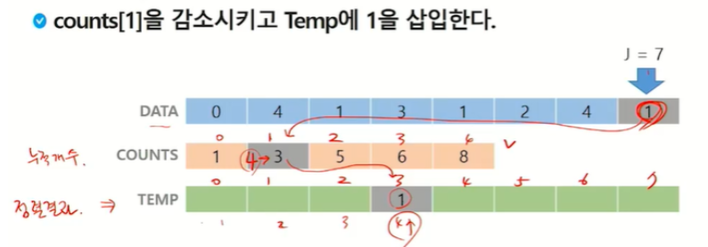

# 정렬


## 버블 정렬

 💡 인접한 두 개의 원소를 비교하여 자리를 계속 교환하는 방식


### 정렬 과정

- 첫 번째 원소부터 인접한 원소끼리 계속 자리를 교환하면서 맨 마지막 자리까지 이동한다.
- 한 단계가 끝나면 가장 큰 원소가 마지막 자리로 정렬된다. 2회전에는 맨 끝에 있는 원소는 정렬에서 제외되어, 1회전을 수행할 때마다 정렬에서 제외되는 데이터가 하나씩 늘어난다.

### 시간복잡도

O(n^2)

```
(n-1) + (n-2) + (n-3) + .... + 2 + 1 => n(n-1)/2
```

정렬 여부와 관계 없이 2개의 원소 비교하므로 최선/평균/최악의 경우 시간복잡도가 모두 동일.

### 장점

- 구현이 간단, 소스코드 직관적
- 정렬하고자 하는 배열 안에서 교환하는 방식이므로 다른 메모리 공간을 필요로 하지 않는다
- 안정 정렬(Stable Sort)

### 단점

- 시간복잡도가 $O(n^2)$으로 굉장히 비효율적
- 교환 연산(Swap)이 많이 일어나게 됨

### 코드

```python
N = int(input())
A = list(map(int, input().split()))

for i in range(N-1, 0, -1): #구간 끝
    for j in range(0, i): #비교할 원소 끝
        if A[j] > A[j+1]:
            A[j], A[j+1] = A[j+1], A[j]
```


## 카운팅 정렬

 💡 항목들의 순서를 결정하기 위해 집합에 각 항목이 몇 개씩 있는지 세는 작업을 하여, 선형 시간에 정렬하는 효율적인 알고리즘


 💡 **제한사항**

- 정수나 정수로 표현할 수 있는 자료에 대해서만 적용 가능
- 카운트들을 위한 충분한 공간을 할당하려면 집합 내의 가장 큰 정수를 알아야 한다. **COUNTS** = [ 0 ] * 원소의 범위(데이터 개수 아님)


### 정렬 과정

1. 정렬하고자 하는 값 중 **최대값(k)에 해당하는 값을 size 로 하는 임시 배열 COUNTS를** 만든다

2. COUNTS 배열을 누적값으로 변경한다. for i : 1→ (최대값)

3. 정렬된 결과를 저장할 배열 TEMP에 데이터의 맨 마지막 원소부터 차례로 기록한다.

   1. 데이터의 맨 마지막 원소가 1

   2. COUNTS[1]을 감소시키고 TEMP에 1을 삽입한다.

      

   3. TEMP 업데이트를 완료하고 정렬 작업을 종료한다.

### 시간 복잡도

O(n+k) : n은 리스트 길이, k는 정수의 최대값

2N + K ⇒ n+k

### 공간복잡도

공간 복잡도 : O(k) -> k만큼의 배열을 만들어야 함.

### 장점

- O(n)의 시간복잡도

### 단점

- 배열 사이즈 N만큼 돌 때 증가시켜주는 Counting배열의 크기가 큼 (메모리 낭비가 심함)

### 코드

```python
DATA = [0, 4, 1, 3, 1, 2, 4, 1]
N = len(DATA)
K = 4
 
COUNTS = [0] * (K + 1)
TEMP = [0] * N


for i in DATA:  # N개
    COUNTS[i] += 1  # 목표 counts = [1, 3, 1, 1, 2] (누적x)

# 누적 counts 배열 만들기 # K번
# 목표 counts = [1, 4, 5, 6, 8]
for i in range(1, K): 
    COUNTS[i] += COUNTS[i-1]

# 끝에서부터 데이터 입력하면서 오기 (앞부터 안 하는 건 정렬 상태 그대로 유지하기 위해)
for i in (N-1, -1, -1):  # N개
		TEMP[COUNTS[DATA[i]]-1] = DATA[i]
		COUNTS[DATA[i]] -= 1
		
print(COUNTS)
```


