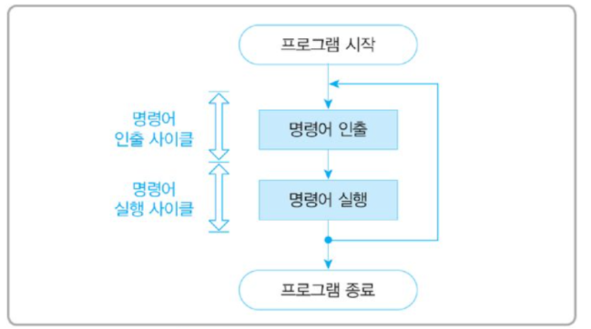
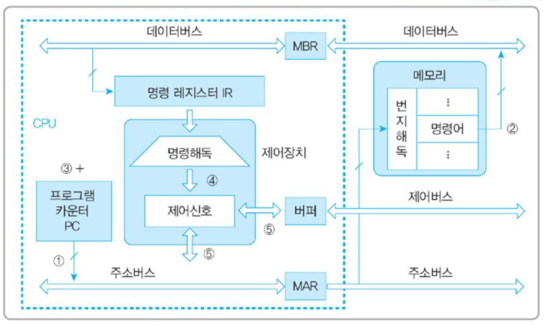

# **중앙처리장치(CPU) 작동 원리**

CPU는 컴퓨터에서 가장 핵심적인 역할을 수행하는 부분. '인간의 두뇌'에 해당

크게 연산장치, 제어장치, 레지스터 3가지로 구성됨

- **연산 장치(ALU: Arithmetic and Logic Unit)**

  산술연산과 논리연산 수행 (따라서 산술논리연산장치라고도 불림)

  연산에 필요한 데이터를 레지스터에서 가져오고, 연산 결과를 다시 레지스터로 보냄

- **제어장치(CU)**

  명령어를 순서대로 실행할 수 있도록 제어하는 장치

  주기억장치에서 프로그램 명령어를 꺼내 해독하고, 그 결과에 따라 명령어 실행에 필요한 제어 신호를 기억장치, 연산장치, 입출력장치로 보냄

  또한 이들 장치가 보낸 신호를 받아, 다음에 수행할 동작을 결정함

- **레지스터**

  고속 기억장치임

  명령어 주소, 코드, 연산에 필요한 데이터, 연산 결과 등을 임시로 저장

  용도에 따라 범용 레지스터와 특수목적 레지스터로 구분됨

  중앙처리장치 종류에 따라 사용할 수 있는 레지스터 개수와 크기가 다름

  - 범용 레지스터 : 연산에 필요한 데이터나 연산 결과를 임시로 저장
  - 특수목적 레지스터 : 특별한 용도로 사용하는 레지스터

### **특수 목적 레지스터**

- **PC(Program Counter) :** 다음에 인출할 명령어 주소를 저장
- I**R(Instruction Register, 명령어 레지스터)** : 현재 수행 중인 명령어를 저장(가장 최근에 인출된 명령어 저장)
- **MAR(Memory Adress Register) :** 메모리로부터 읽어오거나 메모리에 쓰기 위한 주소를 저장
- **MBR(Memory Buffer Register)** : 메모리로부터 읽어온 데이터 또는 메모리에 써야할 데이터 저장
- **AC(Accumulator)** : 연산 결과를 자신에게 다시 누적(accumulation) 시키는 장치(= 누산기)
- Flag Register : (= status register) : 연산 결과의 상태를 나타내는 플래그 비트들로 구성
- SP(Stack Pointer) : 현재 실행 중인 스레드의 스택 Top의 가상 주소를 저장
- Count Register : 반복 명령어 사용시 반복 카운터로 사용되는 값을 저장

### **CPU의 동작 과정 개요**

1. 주기억장치는 입력장치에서 입력받은 데이터 또는 보조기억장치에 저장된 프로그램 읽어옴
2. CPU는 프로그램을 실행하기 위해 주기억장치에 저장된 프로그램 명령어와 데이터를 읽어와 처리하고 결과를 다시 주기억장치에 저장
3. 주기억장치는 처리 결과를 보조기억장치에 저장하거나 출력장치로 보냄
4. 제어장치는 1~3 과정에서 명령어가 순서대로 실행되도록 각 장치를 제어

### 명령어 세트

CPU가 실행할 명령어의 집합

> 연산 코드(Operation Code) + 피연산자(Operand)로 이루어짐
>
> 연산 코드 : 실행할 연산
>
> 피연산자 : 필요한 데이터 or 저장 위치

연산 코드는 연산, 제어, 데이터 전달, 입출력 기능을 가짐

피연산자는 주소, 숫자/문자, 논리 데이터 등을 저장

## 명령어 사이클

 💡 = 인출 사이클 + 실행 사이클

CPU는 프로그램 실행하기 위해 주기억장치에서 명령어를 순차적으로 인출하여 해독하고 실행하는 과정을 반복함

CPU가 주기억장치에서 한번에 하나의 명령어를 인출하여 실행하는데 필요한 일련의 활동을 '명령어 사이클'이라고 말함

명령어 사이클은 **인출/실행/간접/인터럽트** 사이클로 나누어짐

주기억장치의 지정된 주소에서 하나의 명령어를 가져오고, 실행 사이클에서는 명령어를 실행함. 하나의 명령어 실행이 완료되면 그 다음 명령어에 대한 인출 사이클 시작

### 명령어 인출(instruction  fetch) 사이클

1. PC에 저장된 명령어 주소를 MAR로 전송
   - `T0 : MAR ← PC`
2. MAR 번지 메모리의 명령어를 MBR로 전송하고 PC를 증가시켜 다음번 명령어 주소를 준비
   - `T1 : MBR ← M[MAR], PC ← PC+1`(명령어 길이에 따라 가변적인 수치)
3. 메모리 버퍼 레지스터(MBR)에 저장된 내용을 명령어 레지스터(IR)에 전달
   - `T2 : IR ← MBR`

### 명령어 실행(instruction execution) 사이클

> **IR로 가져온 명령어**가 지시하는 내용에 따라 수행되는 마이크로 연산이 달라진다.

IR에 저장된 명령어를 해독하고 CPU 내외부에서 명령어의 실행에 필요한 제어신호들을 발생시킨다.

명렁어 인출, 해독, 실행의 모든 과정은 제어 장치가 통제한다.

### 

### 참고

[중앙처리장치(CPU) - 3 (CPU 명령어 사이클)](https://gamedevlog.tistory.com/71)

[CPU 명령 사이클](https://wogh8732.tistory.com/275)