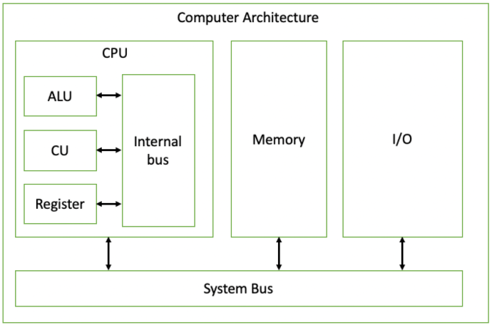

# **컴퓨터의 구성**

------

컴퓨터 시스템은 크게 하드웨어와 소프트웨어로 나누어진다.

### **하드웨어**

컴퓨터를 구성하는 기계적 장치

- 중앙처리장치(CPU)
- 기억장치 : RAM, HDD
- 입출력 장치 : 마우스, 프린터

### **소프트웨어**

하드웨어의 동작을 지시하고 제어하는 명령어 집합

- 시스템 소프트웨어 : 운영체제, 컴파일러
- 응용 소프트웨어 : 워드프로세서, 스프레드시트

## 하드웨어

------

### **중앙처리장치(CPU, Central Processing Unit)**

- 메모리에 저장된 명령어를 읽어들여 수행하는 주체
- 명령어 사이클(Fetch/Execution)을 반복해 프로그램을 실행

**(1) ALU(Arithmetic and Logic Unit)**

데이터 처리

산술/논리 연산을 수행하는 장치

**(2) 제어장치(CU, Control Unit)**

명령어 레지스터에 저장된 명령어를 해석

각 컴퓨터 구성요소를 제어할 제어신호를 생성

컴퓨터 구성요소는 제어장치의 관리를 받음

**(3) 레지스터(Register)**

명령어를 실행하기 위해 필요한 데이터와 상태, 명령어를 저장(**데이터 기억장소**)

**(4) 내부 버스(Internal Bus)**

CPU 내부의 구성요소 간 데이터 전달과 연결을 위한 경로

### **주기억장치(Main Memory)**

- 보조 저장장치와 구별되어 비교적 저장 용량이 적지만, 속도가 빨라 실행되는 프로그램이 적재되어 있는 기억장치
- CPU와 온라인으로 연결되어 CPU가 필요 시마다 데이터를 전달
- CPU는 Store와 Load의 방식으로 기억장치에 액세스

**(1) 적재(Load)**

기억장치에 저장된 데이터를 읽어 CPU의 레지스터로 적재

주소버스를 통해 CPU가 요구하는 데이터의 주소값과 제어 버스를 통해 **Read** 신호가 전달

**(2) 저장(Store)**

CPU의 레지스터에서 기억장치의 특정 주소에 데이터를 저장

주소 버스를 통해 특정 주소와 제어버스를 통해 **Write**신호가 전달

**(3) 워드(Word)**

CPU가 한 번에 접근하는 데이터를 의미

CPU가 지원하는 비트 수와 크기가 같음

32bit CPU에서는 32bit, 64bit CPU에서는 64bit

컴퓨터는 기본적으로 **읽고 처리한 뒤 저장**하는 과정으로 이루어짐

(READ → PROCESS → WRITE)

이 과정을 진행하면서 끊임없이 주기억장치(RAM)과 소통한다. 이때 운영체제가 64bit라면, CPU는 RAM으로부터 데이터를 한번에 64비트씩 읽어온다.

### **입출력장치(I/O Unit)**

- 사용자 또는 컴퓨터 외부에서 데이터를 입력받고 출력하기 위한 장치

### **시스템 버스(System bus)**

- 컴퓨터의 각 구성요소 간 데이터, 신호를 전달하기 위한 데이터 전달 경로
- 주소 버스, 데이터 버스, 제어 버스로 구성

**(1) 주소 버스**

기억 장치의 주소 또는 입출력 장치의 포트번호를 지정하고 전달

데이터를 정확히 실어나르기 위해서는 기억장치 '주소'를 정해주어야 함.

주소버스는 중앙처리장치가 주기억장치나 입출력장치로 기억장치 주소를 전달하는 통로이기 때문에 '**단방향**' 버스임

**(2) 데이터 버스**

중앙처리장치와 기타 장치 사이에서 데이터를 전달하는 통로

기억장치와 입출력장치의 명령어와 데이터를 중앙처리장치로 보내거나, 중앙처리장치의 연산 결과를 기억장치와 입출력장치로 보내는 '**양방향**' 버스임

**(3) 제어 신호**

주소 버스와 데이터 버스는 모든 장치에 공유되기 때문에 이를 제어할 수단이 필요함

제어 버스는 중앙처리장치가 기억장치나 입출력장치에 제어 신호를 전달하는 통로임

**제어 신호 종류** : 기억장치 읽기 및 쓰기, 버스 요청 및 승인, 인터럽트 요청 및 승인, 클락, 리셋 등

제어 버스는 읽기 동작과 쓰기 동작을 모두 수행하기 때문에 '**양방향**' 버스임