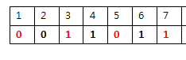

# 패리티 비트와 해밍코드

## 패리티 비트

> 정보 전달 과정에서 오류가 생겼는지 검사하기 위해 추가하는 비트 전송하고자 하는 데이터의 각 문자에 1비트를 더하여 전송한다.
>
> 수신자는 송신자로부터, 어떤 패리티 비트 규칙을 사용했는지 공유 받게 됩니다.
>
> 따라서, 수신자는 수신 받은 데이터가 공유 받은 패리티 비트 규칙을 만족하는지 확인함으로써, 오류를 검출하고 오류가 있다면, 송신 컴퓨터에게 데이터 재송신을 부탁하게 됩니다.

### 패리티 비트의 종류

패리티 비트는 '짝수 패리티' 와 '홀수 패리티' 가 존재합니다.

송신자는, 사용하는 패리티 종류에 따라 데이터에 다른 bit 를 추가하게 됩니다.

- **짝수 패리티(Even Parity)**

  데이터 비트와 패리티 비트를 포함한 전체 비트에서, 1 의 개수가 짝수가 되도록 패리티 비트를 정합니다.

- **홀수 패리티(Odd Parity)**

  데이터 비트와 패리티 비트를 포함한 전체 비트에서, 1 의 개수가 홀수가 되도록 패리티 비트를 정합니다.

수신자는 송신자로부터, 어떤 패리티 비트 규칙을 사용했는지 공유 받게 됩니다.

따라서, 수신자는 수신 받은 데이터가 공유 받은 패리티 비트 규칙을 만족하는지 확인함으로써, 오류를 검출하고

오류가 있다면, 송신 컴퓨터에게 데이터 재송신을 부탁하게 됩니다.

***짝수 패리티일 때 7비트 데이터가 1010001이라면?***

1이 총 3개이므로, 짝수로 맞춰주기 위해 **1**을 더해야 함

**답**: **1**1010001 (맨 앞이 패리티 비트)

## 해밍 코드

> 데이터 전송 시 1비트의 에러를 정정할 수 있는 **자기 오류정정 코드**를 말한다. 패리티 비트를 보고, 1비트에 대한 오류를 정정할 곳을 찾아 수정할 수 있다. (패리티 비트는 오류를 검출하기만 할 뿐 수정하지는 않기 때문에 해밍 코드를 활용)

### 해밍 코드의 특징

1. 2Bit 의 오류를 검출할 수 있고, 1Bit 의 오류를 교정할 수 있습니다.
2. 데이터 비트 외에 오류 검출 및 교정을 위한 잉여 비트가 많이 필요합니다.
3. 해밍 코드 중 1, 2, 4, 8, 16 , ... , **2^n 번째 비트**는, 오류 검출을 위한 패리티 비트입니다.
4. **패**리티 규칙(짝수 or 홀수) 이 정해졌다면, **n 번째 패리티 비트는 n 번째 비트에서 시작하여, n 비트 만큼을 포함하고, n 비트씩 건너뛴 비트들을 대상으로, 패리티 비트를 결정할 수 있습니다.**

### 해밍코드 만들기

ex) 1011 를 홀수패리티의 해밍코드 만들기

1. 해밍코드의 패리티비트는 2^0인 1번째 자리, 2^1승은 2번째 자리, 2^2인 4번째 자리, 2^3인 8번째 자리 순으로 들어갈 수 있다..
2. 그 외의 자리에 1011과 같은 코드를 넣을 수 있음.

1. 부여하기

1. 해밍코드 넣기 전 모습,

1. P1 (1,3,5,7)부분을 비교하여 홀수 패리티 만들기 --> 한칸묶고(첫해밍코드자리포함), 한칸띄우고, 한칸묶고, 한칸띄우고...

<과정>

<결과>

1. P2 (2,3,6,7) 비교 --> 맨처음 한칸 띄우고(첫해밍코드배제), 2칸 묶고(둘째해밍코드 포함), 2칸 띄우고, 2칸 묶고, 2칸 띄우고, 2칸 묶고,,,,,

<과정>

<결과>

1. P3 (4,5,6,7) ---> 맨처음 3칸띄우고(첫 둘째 해밍코드 배제), 4칸 묶고(셋째해밍코드 포함), 4칸띄우고, 4칸묶고,,,,,

<과정>

<결과>

완성된 1011의 홀수 패리티 해밍코드 ----> **1011011**

### 짝수 패리티 비트 해밍코드로 오류 수정하기

**ex) 0011011 짝수패리티 해밍코드, 오류수정된 정확한 코드?**

2의 n승 번째 자리인 1, 2, 4번째 자릿수가 패리티 비트라는 것으로부터 시작한다. 이 숫자로부터 시작하는 세 개의 패리티 비트가 짝수인지, 홀수인지 기준으로 판별한다.

1. P1(1,3,5,7) 번 코드 빼내고 비교하기

0101 ---> 짝수 ----> 맞음 ---> C1=0

1. P2(2,3,6,7)번 코드 빼내고 비교하기

0111 ---> 홀수 ---> 틀림 ---> C2 = **1 필요**(짝수로 맞추기 위해)

1. P3(4,5,6,7)번 코드 빼내고 비교하기

1011--->홀수 ---->틀림---->C3=**1 필요**

1. 틀린 자릿수찾기

= 10진수로 바꾸면 6이됨. 즉, 6번째 코드의 오류라는 뜻!

1. 틀린 6번째자리의 수를 바꾸기

별해

p1 1, 3, 5, 7  맞음 ---> 1,3,5,7 오류없다고 봄

p2 2, 3, 6, 7  틀림 ---> 2, 6 틀렸을 수 있음

p3 4, 5, 6, 7 틀림 ---> 4, 6 틀렷을 수 잇음

즉, 공통으로 6이 틀림

**[정답] 0011001**

[짝수 패리티 비트의 해밍 코드로 0011011을 받았을 때 오류가 수정된 정확한 코드는?](https://m.blog.naver.com/PostView.nhn?isHttpsRedirect=true&blogId=pyotography&logNo=221485742685)

[[Network\] 패리티 비트와 해밍 코드](https://wooono.tistory.com/400)