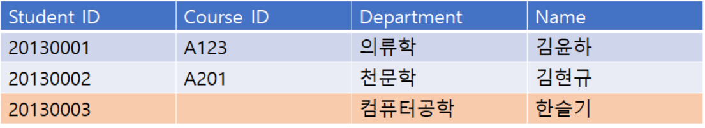
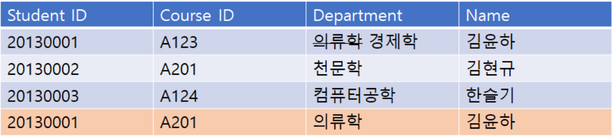
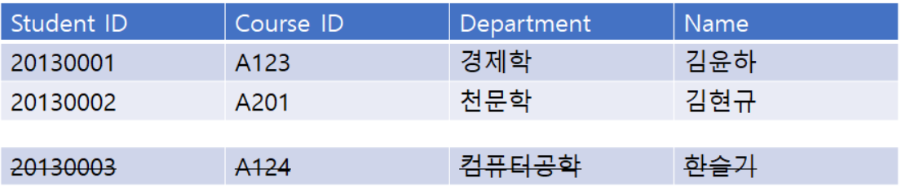

# Anomaly 

Anomaly(이상 현상)을 피하기 위해 정규화가 필요하다.

### 1. 삽입 이상 (Insertion Anomaly)

ex) 기본키가 {Student ID, Cource ID}인 경우

Cource를 수강하지 않은 학생은 Cource ID가 없는 현상이 발생하므로 Cource ID를 Null로 할 수밖에 없는데, **기본키는 Null이 될 수 없으므로,** Table에 추가될 수가 없음

굳이 삽입하기 위해서는 ‘미수강’과 같은 Cource ID를 만들어야 함.

> 불필요한 데이터를 추가해야지 삽입할 수 있는 상황 = Insertion Anomaly

### 2. 갱신 이상(Update Anomaly)

ex) 전공(Department)이 **의류학에서 경제학**으로 바뀌는 경우.

모든 Department를 **경제학**으로 바꾸어야 함. 그러나 일부를 깜빡하고 바꾸지 못하는 경우, 제대로 파악 못 함.

> 일부만 변경하여, 데이터가 불일치하는 모순의 문제

### 3. 삭제이상(Deletion Anomaly)

ex) 수강을 철회하는 경우, {Student ID, Cource ID, Department, Name}의 정보 중 Student ID, Department와 같은 학생에 대한 정보도 함께 삭제됨

> 튜플 삭제로 인해 꼭 필요한 데이터까지 함께 삭제되는 문제 = Deletion Anomaly