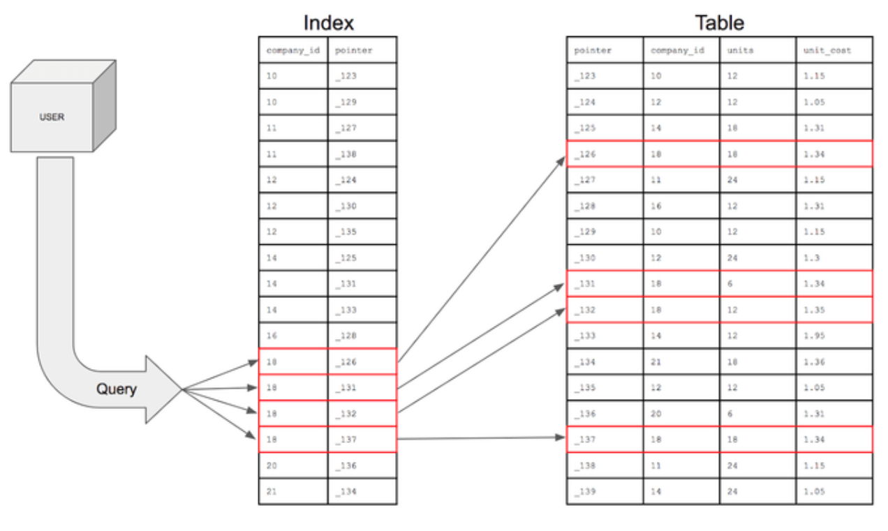
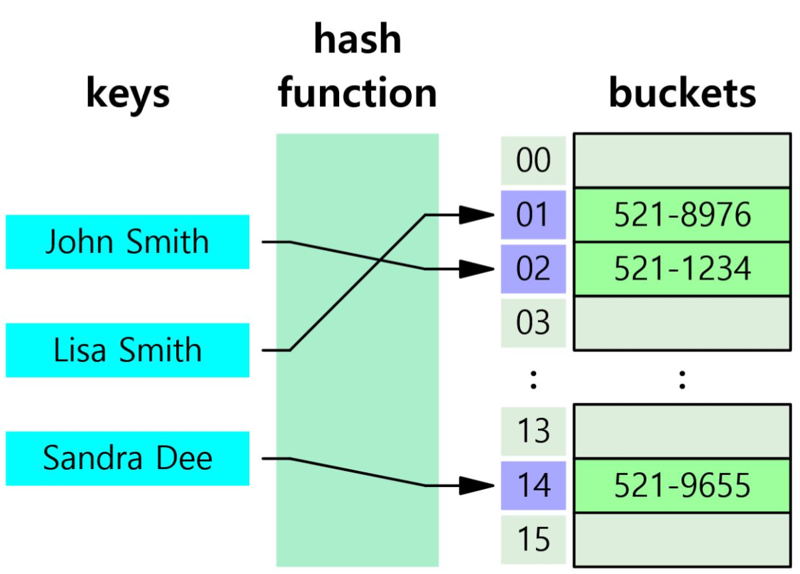
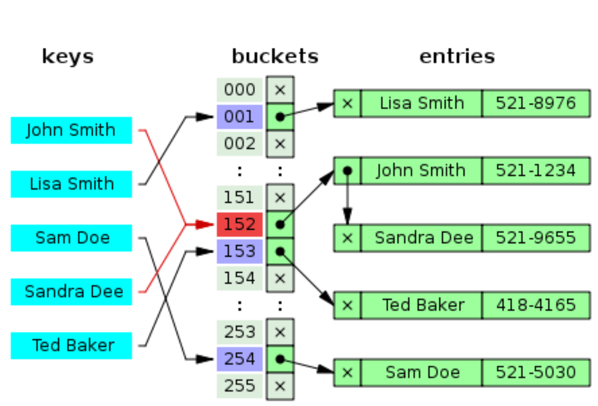
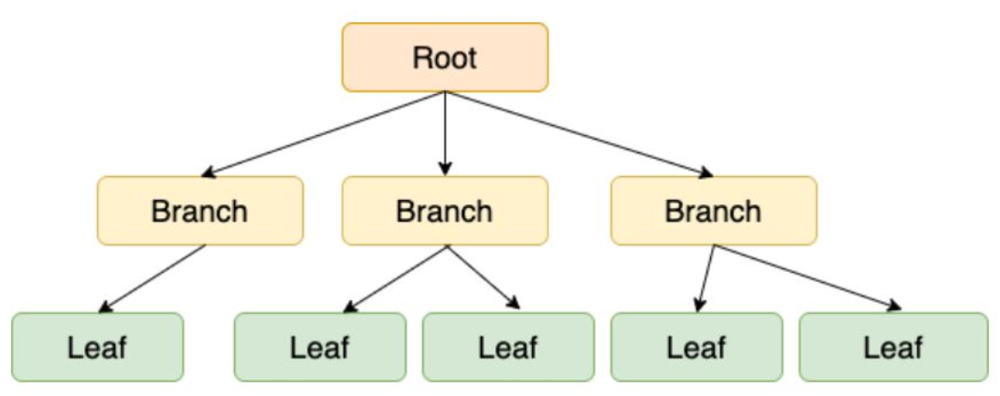
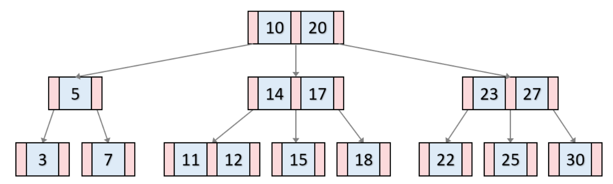
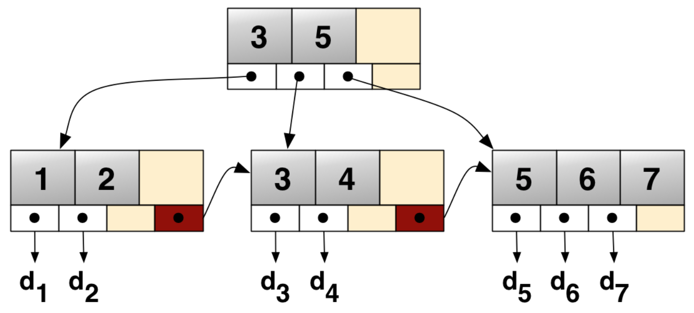

# 1. Index란?

> Index는 DB 분야에 있어서 테이블에 대한 동작의 속도를 높여주는 자료 구조를 일컫는다. Index는 테이블 내 1개의 컬럼, 혹은 여러 개의 컬럼을 이용하여 생성될 수 있다. 고속의 검색 동작뿐만 아니라 레코드 접그노가 관련 효율적인 순서 매김 동작에 대한 기초를 제공한다.

**DB의 특정 테이블에서 원하는 데이터들을 조회할 때, 조건절에 사용하는 컬럼의 Index가 없다면?**

└ 테이블 전체를 탐색(Full Scan)하게 됨.



- Index는 데이터의 주소값을 저장하는 별도의 특별한 자료 구조

- USER 테이블의 `COMPANY_ID` 컬럼에 대한 Index가 존재한다면, 예시 쿼리를 수행할 때 테이블 전체를 탐색하지 않고 해당 Index를 바탕으로 원하는 데이터의 위치를 빠르게 검색 할 수 있음.

- Index는 테이블에 있는 하나 이상의 컬럼으로 생성이 가능

  ```sql
  CREATE INDEX USER_COMPANY_INDEX ON USER(COMPANY_ID);
  #2개 이상의 컬럼을 사용해서 인덱스를 생성할 수도 있다.
  ```

# 2. Index 자료 구조

## 2.1. Hash Table



- **해시테이블은 Key와 Value를 갖는 자료구조**이다. 주로 효율적인 검색에 활용되는데, 위 그림을 보자. John Smith라는 사람의 전화번호를 찾는 과정을 가정했을 때, 해시함수(Hash Function)의 입력값은 "John Smith"이고 출력값은 "01"이다. 그리고 색인이 "01"인 bucket에서 "521-8976"을 찾는다.
- 그렇다면 해시함수에 대해서도 어느정도 설명이 되었을 것이다. **해시함수는 해시테이블의 키 값으로 레코드가 저장되어 있는 주소(혹은 색인)를 산출하는 함수**이다. 순차검색에 비해, 해시테이블을 이용한 검색은 속도 측면에서 획기적이라고 할 수 있다.
- 데이터를 Key로 간소화하여 저장한다는 아이디어는 좋지만, **다른 내용의 데이터가 같은 키**를 갖는다면? 이러한 상황을 **해시 충돌(Hash Collision)**이라고 한다



[해시 충돌과 이를 해결하는 체이닝을 나타낸 그림]

- 해시 테이블의 시간복잡도는 O(1)이며 매우 빠른 검색을 지원한다.
- **해시가 등호(=) 연산에만 특화**되었기 때문에 **부등호 연산(>, <)이 자주 사용되는 데이터베이스 검색을 위해서는 해시 테이블이 적합하지 않다**.
- 이러한 이유로 데이터베이스의 인덱스에서는 B+Tree가 일반적으로 사용된다.





- B-Tree란 자식 노드가 2개 이상인 트리를 의미
- 이진검색 트리처럼 **각 Key의 왼쪽 자식은 항상 Key보다 작은 값을, 오른쪽 자식은 큰 값을 가짐**
- B-Tree 기반의 DB Index는 특정 컬럼의 값(Key)에 해당하는 노드에 데이터의 위치(Value)를 저장
- 상세한 내부 동작 원리는 [자료구조 - 그림으로 알아보는 B-Tree](https://velog.io/@emplam27/자료구조-그림으로-알아보는-B-Tree)을 참조
- B-Tree의 Key-Value 값들은 항상 **Key를 기준으로 오름차순 정렬이므로 이로 인해 부등호 연산(>, <)에 대해 해시 테이블보다 효율적인 데이터 탐색이 가능**
- 또한 B-Tree는 균형 트리(Balanced Tree)로서, 최상위 루트 노드에서 리프 노드까지의 거리가 모두 동일하기 때문에 평균 시간 복잡도는 O(logN)
- 그러나 Index가 적용된 테이블에 데이터 갱신(INSERT, UPDATE, DELETE)이 반복되다보면, 트리의 균형이 깨지면서 성능이 악화됨
- 이러한 연유로 MySQL 엔진인 InnoDB는 B-Tree를 확장 및 개선한 B+Tree를 Index의 자료 구조로 사용

## 2.3. B+Tree



- B+Tree는 B-Tree를 확장 및 개선한 자료 구조로서, **말단의 리프 노드에만 데이터의 위치(Value)를 관리**
- 중간 브랜치 노드에 Value가 없어서 B-Tree보다 메모리를 덜 차지하는 만큼, 노드의 메모리에 더 많은 Key를 저장할 수 있음
- 아울러 하나의 노드에 더 많은 Key를 저장하는 만큼 트리의 높이가 더 낮아집니다.
- 말단의 리프 노드들끼리는 LinkedList 구조로 서로를 참조하고 있음. 때문에 부등호(>, <)를 이용한 순차 검색 연산을 하는 경우, 많은 노드를 방문해야 하는 B-Tree에 비해 B+Tree는 말단 리프 노드를 저장한 LinkedList를 한 번만 탐색하는 등 속도 이점이 있음.

# 3. 고려 사항

Index는 항상 최신 상태로 정렬되기 위해, 데이터 갱신(INSERT, UPDATE, DELETE) 작업에 대해 추가적인 연산이 발생

1. INSERT : 새로운 데이터에 대한 인덱스가 추가된다.
2. DELETE : 삭제하는 데이터의 인덱스를 제거한다.
3. UPDATE : 기존의 인덱스를 제거하고, 갱신된 데이터에 대해 인덱스를 추가한다.

> **조회에 주로 사용되는 컬럼에 Index를 생성하는 것이 유리**

## 3.1. Index 대상 컬럼 선정

일반적으로 Cardinality가 높은 컬럼을 우선적으로 인덱싱하는 것이 검색 성능에 유리

**Cardinality란 특정 데이터 집합의 유니크(Unique)한 값의 개수**.

- 남-여 등 2가지 값만 존재하는 성별 컬럼은 **중복도가 높으며 카디널리티가 낮습니다.**
- 개인마다 고유한 값이 존재하는 주민번호 컬럼은 **중복도가 낮으며 카디널리티가 높습니다.**

Cardinality 높은 컬럼의 경우, Index를 통해 데이터를 더 많이 필터링할 수 있음

## 3.2 인덱스를 사용하면 좋은 경우

- 규모가 작지 않은 테이블
- INSERT, UPDATE, DELETE가 자주 발생하지 않는 컬럼
- JOIN이나 WHERE 또는 ORDER BY에 자주 사용되는 컬럼
- 데이터의 중복도가 낮은 컬럼

인덱스를 사용하는 것 만큼이나 생성된 인덱스를 관리해주는 것도 중요하다. 그러므로 사용되지 않는 인덱스는 바로 제거를 해주어야 한다.

### 참고

https://preamtree.tistory.com/20

https://mangkyu.tistory.com/96