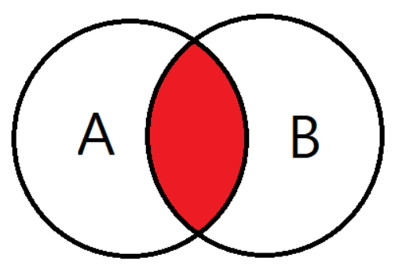
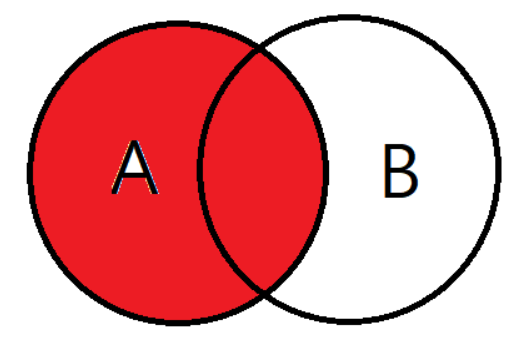
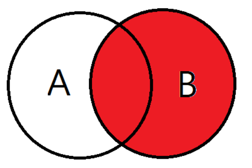
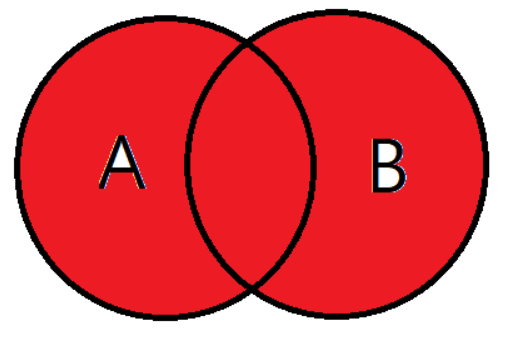
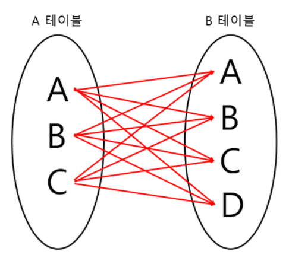
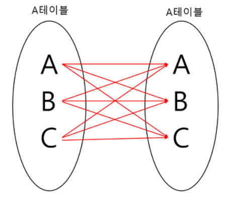

# Join


#### 조인이란?

> 두 개 이상의 테이블이나 데이터베이스를 연결하여 데이터를 검색하는 방법

테이블을 연결하려면, 적어도 하나의 칼럼을 서로 공유하고 있어야 하므로 이를 이용하여 데이터 검색에 활용한다.


### JOIN 종류


- INNER JOIN
- LEFT OUTER JOIN
- RIGHT OUTER JOIN
- FULL OUTER JOIN
- CROSS JOIN
- SELF JOIN


### INNER JOIN



교집합으로, 기준 테이블과 join 테이블의 중복된 값을 보여준다.

```sql
SELECT
A.NAME, B.AGE
FROM EX_TABLE A
INNER JOIN JOIN_TABLE B ON A.NO_EMP = B.NO_EMP
```


### LEFT OUTER JOIN



기준테이블값과 조인테이블과 중복된 값을 보여준다.

왼쪽테이블 기준으로 JOIN을 한다고 생각하면 편하다.

```sql
SELECT
A.NAME, B.AGE
FROM EX_TABLE A
LEFT OUTER JOIN JOIN_TABLE B ON A.NO_EMP = B.NO_EMP
```


### RIGHT OUTER JOIN



LEFT OUTER JOIN과는 반대로 오른쪽 테이블 기준으로 JOIN하는 것이다.

```sql
SELECT
A.NAME, B.AGE
FROM EX_TABLE A
RIGHT OUTER JOIN JOIN_TABLE B ON A.NO_EMP = B.NO_EMP
```


### FULL OUTER JOIN



합집합을 말한다. A와 B 테이블의 모든 데이터가 검색된다.

```sql
SELECT
A.NAME, B.AGE
FROM EX_TABLE A
FULL OUTER JOIN JOIN_TABLE B ON A.NO_EMP = B.NO_EMP
```


### CROSS JOIN



모든 경우의 수를 전부 표현해주는 방식이다.

A가 3개, B가 4개면 총 3*4 = 12개의 데이터가 검색된다.

```sql
SELECT
A.NAME, B.AGE
FROM EX_TABLE A
CROSS JOIN JOIN_TABLE B
```


### SELF JOIN



자기자신과 자기자신을 조인하는 것이다.

하나의 테이블을 여러번 복사해서 조인한다고 생각하면 편하다.

자신이 갖고 있는 칼럼을 다양하게 변형시켜 활용할 때 자주 사용한다.

```sql
SELECT
A.NAME, B.AGE
FROM EX_TABLE A, EX_TABLE B
```