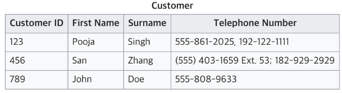
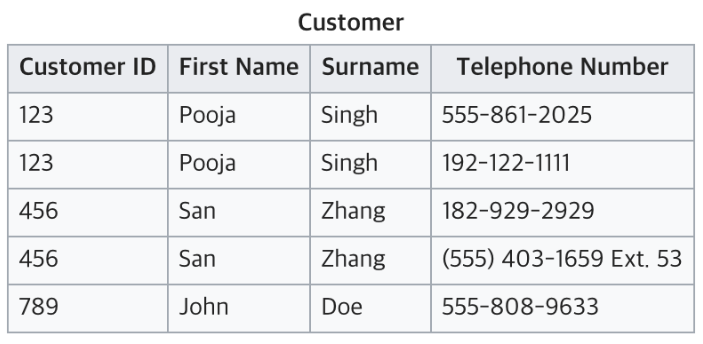
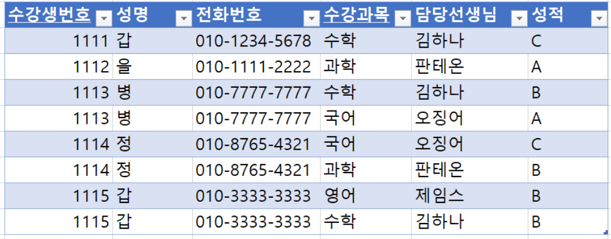
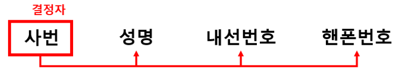
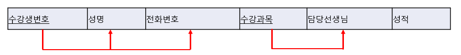
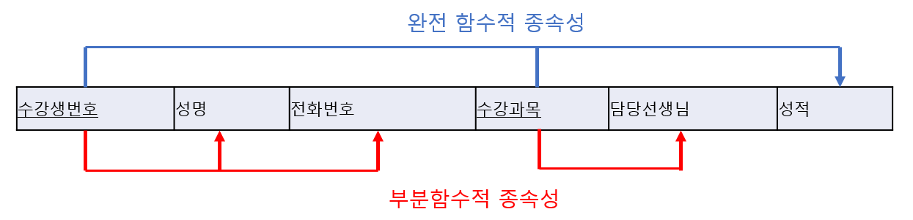
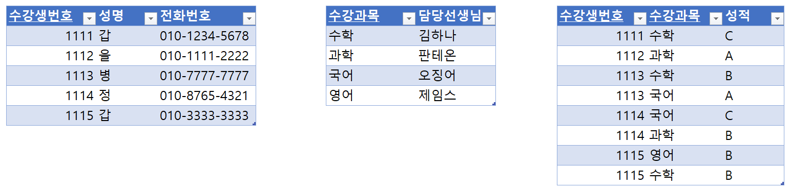
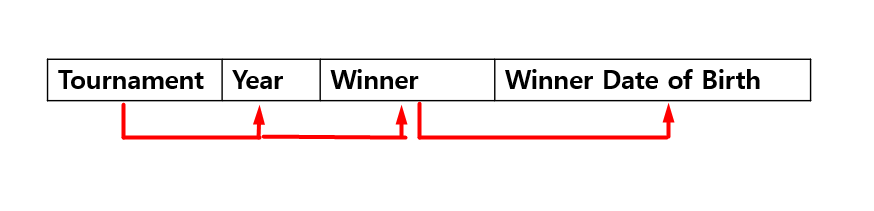
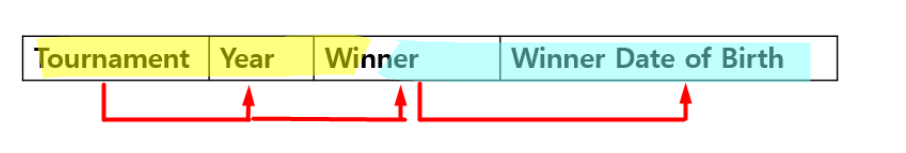

# 정규화(Normalization)

> 정규화를 함으로써 데이터의 중복을 줄이고 무결성을 향상시킬 수 있다

#### 목적

- 데이터의 중복을 업애고 불필요한 데이터 최소화
- 무결성을 지키고 이상현상 방지
- 논리적이고 직관적인 테이블 구성
- 데이터베이스 구조 확장에 용이

대체적으로 1~3단계 정규화 과정 거침

## 제 1정규화(1NF :1st Normal Form)

테이블 컬럼이 원자값(하나의 값)을 갖도록 컬럼을 분리시키는 것

##### 조건

- 어떤 릴레이션에 속한 모든 도메인이 원자값으로만 되어있어야 한다.
- 모든 속성에 반복되는 그룹이 나타나지 않는다.
- 기본키를 사용하여 관련 데이터의 각 집합을 고유하게 식별할 수 있어야 한다.

현재 테이블은 전화번호를 여러개 가지고 있어 원자값이 아님. 따라서 1NF에 맞추기 위해 아래와 같이 분리 가능.

## 제 2정규화(2NF)

테이블의 모든 컬럼이 **완전 함수적 종속**을 만족해야 한다.

즉, 테이블에서 기본키가 복합키(키1, 키2)로 묶여있을 때, 두 키 중 하나의 키만으로 다른 컬럼을 결정지을 수 있으면 안된다.

> 기본키의 부분집합 키가 결정자가 되어서는 안된다는 것

**결정자** : 어떤 컬럼 값(=애트리뷰터 값)은 다른 애트리뷰트 값을 고유하게 결정지을 수 있는데 이런 애트리뷰트를 결정자라고 함.  

**종속자** : 결정자에 의해 결정되어 지는 값. 종속자는 그 결정자의 종속관계에 있다고 함.

즉, **어떤 애트리뷰트 A가 다른 애트리뷰트 B의 결정자이면 B는 A에 함수적으로 종속한다.** 

결정자가 정해지면 종속관계에 있는 나머지가 정해지는거기 때문에 위 그림처럼 화살표로 관계를 표현할 수 있습니다. 예시 테이블의 종속관계는 아래와 같음.

하지만 성적은 `수강생번호`와 `수강과목`이 합쳐져야 결정될 수 있음.

**완전 함수적 종속성** : 복합애트리뷰트에 의해 종속되고 그 외 어떤 것에도 부분적으로 종속되지 않은 관계

**부분함수적 종속성**:  복합애트리뷰트가 아니라 빨간색 화살표처럼 이렇게 부분 부분 종속 관계가 있는 것

**제2정규화** : 위 테이블은 두 개 덩어리의 부분함수적 종속성을 가지고 있고, 이를 제거해주는 게 제 2정규화

#### 제 2정규화 시행한 이후의 예시테이블

쉽게 말하면 성명 전화번호는 수강생번호에 의해 결정되니 이 관련 테이블로 하나 빼고, (현재 상태에선, 성명, 전화번호등의 컬럼은 후보키 {수강생번호, 수강과목}의 일부인 수강생번호만 참조함.)

## 제 3정규화(3NF)

2NF가 진행된 테이블에서 이행적 종속을 없애기 위해 테이블을 분리하는 것이다.

> 이행적 종속 : A → B, B → C면 A → C가 성립된다

아래 두가지 조건을 만족시켜야 한다.

- 릴레이션이 2NF에 만족한다.
- 기본키가 아닌 속성들은 기본키에 의존한다.

현재 테이블에서는 `Tournament`와 `Year`이 기본키다.

`Winner`는 이 두 복합키를 통해 결정된다.

하지만 `Winner Date of Birth`는 기본키가 아닌 `Winner`에 의해 결정되고 있다.

따라서 이는 3NF를 위반하고 있으므로 아래와 같이 분리해야 한다.

