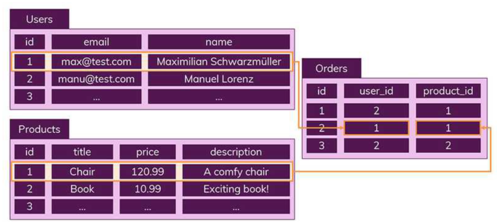
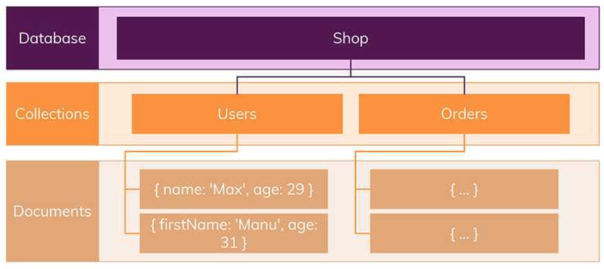
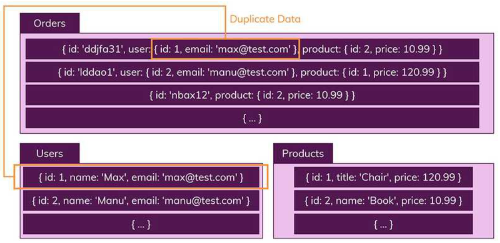

# SQL (관계형 DB)

SQL을 사용하면 RDBMS에서 데이터를 저장, 수정, 삭제 및 검색 가능

**핵심 특징**

- 데이터는 **정해진 데이터 스키마**에 따라 테이블에 저장됨
- 데이터는 관계를 통해 여러 테이블에 분산됨

데이터는 테이블에 레코드로 저장되는데 각 테이블마다 명확하게 정의된 구조가 있다. 해당 구조는 필드의 이름과 데이터 유형으로 정의된다. 따라서 **스키마를 준수하지 않은 레코드는 테이블에 추가할 수 없다**. 즉 스키마를 수정하지 않는 이상은 **정해진 구조에 맞는 레코드만 추가가 가능**하다.

또한 데이터의 중복을 피하기 위해 **관계**를 이용한다.

하나의 테이블에서 중복 없이 하나의 데이터만을 관리하기 때문에 다른 테이블에서 부정확한 데이터를 다룰 위험이 없어지는 장점이 있다.

# NoSQL (비관계형 DB)

> 스키마 없음, 관계 없음

NoSQL에서는 레코드를 **문서(document)**라고 부른다.

SQL은 정해진 스키마를 따르지 않으면 데이터 추가가 불가능한데 비해, NoSQL에서는 **다른 구조의 데이터를 같은 컬렉션에 추가가 가능**하다.

문서는 Json과 비슷한 형태를 가지고 있다. 관계형 데이터베이스처럼 여러 테이블에 나누어 담지 않고, 관련된 데이터를 동일한 컬렉션에 넣는다. 따라서 위 사진에 SQL에서 진행한 Orders, Users. Products 테이블로 나눈 것을 **NoSQL에서는 Orders에 한꺼번에 포함해서 저장**하게 된다.

따라서 여러 테이블에 조인할 필요 없이 이미 필요한 모든 것을 갖춘 문서를 작성하는 것이 NoSQL이다. (Join이라는 개념 존재 x)

> ***Join하고 싶을 때 NoSQL은 어떻게 할까?***

→ 컬렉션을 통헤 데이터를 복제하여 각 컬렉션 일부분에 속하는 데이터를 정확하게 산출하도록 함.

하지만 이런 경우 데이터가 중복되어 서로 영향을 줄 위험이 있다. 따라서 조인을 잘 사용하지 않고 자주 변경되지 않는 데이터일 때 NoSQL을 쓰면 상당히 효율적이다.

# 확장 개념

두 데이터베이스를 비교할 때 중요한 Scaling 개념도 존재한다. 데이터베이스 서버의 확장성은 **수직적 확장**과 **수평적 확장**으로 나누어진다.

- **수직적 확장** : 단순히 데이터베이스 서버의 성능 향상시키는 것 (ex. CPU 업그레이드)
- **수평적 확장** : 더 많은 서버가 추가되고 데이터베이스가 전체적으로 분산됨 (하나의 데이터베이스에서 작동하지만 여러 호스트에서 작동(

데이터베이스 저장 방식으로 인해 SQL은 일반적으로 수직적 확장만 지원함.

# 장단점

## SQL

### 장점

- 명확하게 정의된 스키마, 데이터 무결성 보장
- 관계는 각 데이터를 중복 없이 한 번만 저장

### 단점

- 덜 유연함. 데이터 스키마 사전에 계획하고 알려야 함.(나중에 수정 힘듦)
- 관계를 맺고 있어서 조인문이 많은 복잡한 쿼리가 만들어질 수 있음)
- 대체로 수직적 확장만 가능

## NoSQL

### 장점

- 스키마 없어서 유연함. 언제든지 저장된 데이터를 조정하고 새로운 필드 추가 가능
- 데이터는 애플리케이션이 필요로하는 형식으로 저장됨. → 데이터 읽어오는 속도가 빨라짐
- 수직 및 수평적 확장이 가능해서 애플리케이션이 발생시키는 모든 읽기/쓰기 요청 처리 가능

### 단점

- 유연성으로 인해 데이터 구조 결정을 미루게 될 수 있음
- 데이터 중복을 계속 업데이트 해야 함.
- 데이터가 여럭 컬렉션에 중복되어 있기 때문에 수정시 모든 컬렉션에서 수행해야 함 (SQL에서는 중복 데이터가 없으므로 한번만 수행이 가능)