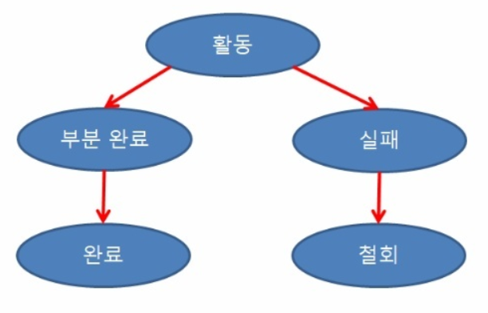

# Transaction

## **트랜잭션이란?**

> 데이터베이스의 <u>상태를 변화</u>시키기 위해 수행하는 **작업단위**

#### <u>상태 변화</u>? → **SQL 질의어를 통해 DB에 접근하는 것**

```
- SELECT
- INSERT
- DELETE
- UPDATE
```


#### **작업단위? → 많은 SQL 명령문들을 사람이 정하는 기준에 따라 정하는 것**

##### 예시) 사용자 A가 B에게 만원을 송금**

이때 DB 작업

1. 사용자 A의 계좌에서 만원을 **차감**한다 :

   UPDATE 문을 사용해 사용자 A의 잔고를 변경

2. 사용자 B의 계좌에 만원을 **추가**한다 :

   UPDATE 문을 사용해 사용자 B의 잔고를 변경

   

**현재 작업 단위** : **출금 UPDATE문 + 입금 UPDATE문** → **이를 통틀어 하나의 트랜잭션이라고 한다.**

- 위 두 쿼리문 모두 성공적으로 완료되어야만 "하나의 작업(트랜잭션)"이 완료되는 것이다. **`Commit`**
- 작업 단위에 속하는 쿼리 중 하나라도 실패하면 모든 쿼리문을 취소하고 이전 상태로 돌려놓아야한다. **`Rollback`**


**즉, 하나의 트랜잭션 설계를 잘 만드는 것이 데이터를 다룰 때 많은 이점을 가져다준다.**


## 트랜잭션 특징

- 원자성(Atomicity)

  트랜잭션이 DB에 모두 반영되거나, 혹은 전혀 반영되지 않아야 한다. (all or nothing)

- 일관성(Consistency)

  트랜잭션의 작업 처리 결과는 항상 일관성 있어야 한다.

  즉 정상적으로 수행된 트랜잭션은 정당한 데이터들만을 DB에 반영해야한다.

- 독립성(Isolation)

  둘 이상의 트랜잭션이 동시에 병행 실행되고 있을 때, 어떤 트랜잭션도 다른 트랜잭션 연산에 끼어들 수 없다.

- 지속성(Durability)

  트랜잭션이 성공적으로 완료되었으면 결과는 영구적으로 반영되어야 한다.


## Commit 과 Rollback

**Commit**

하나의 트랜잭션이 성공적으로 끝났고, DB가 일관성 있는 상태일 때 이를 관리자에게 알려주는 연산

**Rollback**

하나의 트랜젝션 처리가 비정상적으로 종료되어 DB의 일관성을 깨뜨렸을 때 이 트랜잭션의 일부가 정상 처리되었더라도 원자성 구현을 위해 모든 연산을 취소하는 것


## 트랜잭션의 상태



**활동(Active) :** 트랜잭션이 실행중인 상태

**실패(Failed) :** 트랜잭션 실행에 오류가 발생하여 중단된 상태

**철회(Aborted) :** 트랜잭션이 비정상적으로 종료되어 Rollback 연산을 수행한 상태

**부분 완료(Partially Committed) :** 트랜잭션의 마지막 연산까지 실행했지만, Commit 연산이 실행되기 직전의 상태

**완료(Committed) :** 트랜잭션이 성공적으로 종료되어 Commit 연산을 실행한 후의 상태


### 참고

https://coding-factory.tistory.com/226