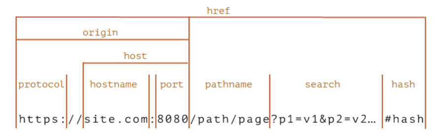
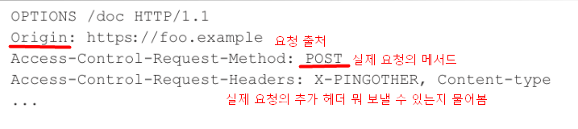
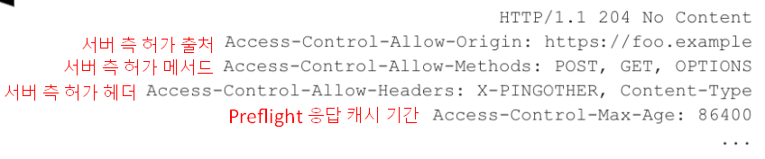

# CORS

## 1. CORS 에러

> ***SOP (Same Origin Policy)***
>
> 다른 출처의 리소스를 사용하는 것에 제한하는 보안 방식

> ***출처(Origin)***
>
> 
>
> `Protocol`, `Host`, `Port`를 통해 같은 출처인지 다른 출처인지 판단할 수 있음.
> 이 세가지가 모두 같아야 '같은 출처'
>
> 번외) 인터넷 익스플로러 같은 경우 port가 달라도 같은 출처라고 판단함.


### Q. http://localhost 와 동일 출처인 url은?

1. https://localhost
2. http://localhost:80
3. http://127.0.0.1
4. http://localhost/api/cors

**[A] 2, 4**

1. `https` 라 프로토콜이 다름
2. http 의 기본 port는 80 . 위 보기에서는 생략된 것
3. 127.0.0.1의 IP는 로컬호스트가 맞지만 브라우저는 String Value로 비교하기 때문에 localhost와 127.0.0.1 다르기 때문에 다른 출처로 판단
4. `/api/cors` 는 추가적으로 붙는 로케이션. `api`앞까지만 비교해서 동일 출처로 판단.


### Q. 왜 SOP를 사용해야 보안에 도움이 될까?

| 1. 페이스북 서비스에 로그인 후 사용 (페이스북에서 인증 토큰을 받아온다)<br />2. 흥미진진한 내용과 링크를 메일로 보냄<br />3. 링크를 클릭하니 http://hacker.ck 로 이동<br />4.  http://hacker.ck 에서 선량한 사용자의 토큰을 이용해 페이스북에 "나는 바보다" 포스트를 게시한다 |
| ------------------------------------------------------------ |

**요청**

Origin : http://hacker.ck

Origin : https://www.facebook.com/

-> Cross Origin이라고 판단을 하기 때문에 SOP에 위반. 이 요청을 받아들일 수 없다.


### Q. 다른 출처의 리소스가 필요하다면?

> **CORS란?**
>
> **교차 출처 리소스 공유**(Cross-Origin Resource Sharing, [CORS](https://developer.mozilla.org/ko/docs/Glossary/CORS))는 추가 [HTTP](https://developer.mozilla.org/ko/docs/Glossary/HTTP) 헤더를 사용하여, 한 [출처](https://developer.mozilla.org/ko/docs/Glossary/Origin)에서 실행 중인 웹 애플리케이션이 **다른 출처의 선택한 자원에 접근**할 수 있는 권한을 부여하도록 **브라우저**에 알려주는 체제입니다.


## 2. CORS 접근 제어 시나리오

### 2.1 Preflight

> 먼저 물어보는 것

1. OPTIONS 메서드를 통해 다른 도메인의 리소스에 요청이 가능한지 확인 작업
2. 요청이 가능하다면 실제 요청(Actual Request)를 보낸다.


**Preflight Request**



**Preflight Response**



- Preflight 응답 캐시 기간 : Preflight 이용하면 요청 2번 보내게 되므로, 캐시해두고 동일한 요청 보낼 때는 바로 요청 보낼 수 있도록 함.


### 2.2 Simple Request

> Preflight 없이 바로 요청 보냄

**조건**

- GET, POST, HEAD 메서드

- `Content-Type`

  헤더는 다음의 값들만 허용됩니다.

  - `application/x-www-form-urlencoded`
  - `multipart/form-data`
  - `text/plain`


### 2.3 왜 Preflight가 필요할까?

> 모르는 CORS 서버를 위해

CORS 에러는 Browser쪽에서 터지기 때문에(이미 Server에서 요청을 수행한 이후) 어떤 요청이 CORS 정책을 위반하는 요청인 경우, preflight 요청을 보내지 않으면 돌이킬 수 없거나, 불필요하게 리소스를 낭비하거나 할 수 있음. 

이를 방지하기 위해서 특정 조건인 경우 예비요청을 먼저 날려, 이게 유효한 요청인지 확인하는 것이다.


### 2.4. Credentialed Request

> 인증 관련 헤더를 포함할 때 사용하는 요청.

**클라이언트 측**

credentials : include

쿠키나 JWT와 같은 토큰을 클라이언트에서 자동으로 담아서 보내고 싶을 때 credentials를 include 하면 서버 측으로 전달 됨.

**서버 측**

Access-Control-Allow-Credentials : true

서버 측에서 true로 해줘야 클라이언트가 보내는 거 받을 수 있음.

Access-Control-Allow-Origin: * 는 안됨! 정확한 것만 받을 수 있음.


## 3. CORS 해결하기

### 3.1 프론트 프록시 서버 설정 (개발 환경) 

브라우저에서 CORS 에러 발생. 브라우저가 프론트 서버로 요청보내면 같은 서버로 보내짐.

Origin과 Target 같기 때문에 Same Origin 형식으로 보내짐.

프론트 서버에서는 살짝 바꿔서 `/api` 요청이 잇는 것은 target을 8080으로 보냄. 프론트 서버가 보내는 것이기 때문에 브라우저 입장에서는 Same Origin이므로 에러가 터지지 않음.


### 3.2 직접 헤더에 설정해주기 

```bash
# 헤더에 작성된 출처만 브라우저가 리소스를 접근할 수 있도록 허용함.
# * 이면 모든 곳에 공개되어 있음을 의미한다. 
Access-Control-Allow-Origin : https://naver.com

# 리소스 접근을 허용하는 HTTP 메서드를 지정해 주는 헤더
Access-Control-Request-Methods : GET, POST, PUT, DELETE

# 요청을 허용하는 해더.
Access-Control-Allow-Headers : Origin,Accept,X-Requested-With,Content-Type,Access-Control-Request-Method,Access-Control-Request-Headers,Authorization

# 클라이언트에서 preflight 의 요청 결과를 저장할 기간을 지정
# 60초 동안 preflight 요청을 캐시하는 설정으로, 첫 요청 이후 60초 동안은 OPTIONS 메소드를 사용하는 예비 요청을 보내지 않는다.
Access-Control-Max-Age : 60

# 클라이언트 요청이 쿠키를 통해서 자격 증명을 해야 하는 경우에 true. 
# 자바스크립트 요청에서 credentials가 include일 때 요청에 대한 응답을 할 수 있는지를 나타낸다.
Access-Control-Allow-Credentials : true

# 기본적으로 브라우저에게 노출이 되지 않지만, 브라우저 측에서 접근할 수 있게 허용해주는 헤더를 지정
```


### 3.3 스프링 부트를 이용하기 

`@CrossOrigin(origins = "http://localhost:8081")`

origin 설정 안 해주면 디폴트는 모든 값을 다 받아줌.

- **전역적으로 설정하는 방법** : configuration 만들어줌. 


### 출처

https://youtu.be/-2TgkKYmJt4