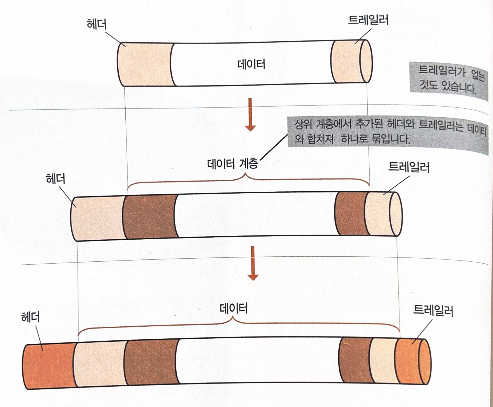

# TCP/IP 개요

**목표**

- 데이터가 어떻게 패킷으로 만들어져 상대에게 전달되는지 알기

> **패킷 ?**
>
> TCP/IP의 특징 중 하나가 '데이터를 일정한 크기로 분할해서 보낸다'는 것.
> 작게 나눠진 데이터 하나 하나를 패킷(packet)이라고 하고, 이 통신 방법을 '패킷 통신'이라고 함.

## 통신 프로토콜

- 네트워크 상의 컴퓨터끼리 데이터를 주고받으려면 그에 맞는 구조가 필요함.

- 송수신을 위한 공통된 구조를 만들면 기기 차이에 관계 없이 데이터를 주고 받을 수 있음

### 통신 프로토콜

**프로토콜** : 송수신측 컴퓨터가 미리 정해놓은 공통된 메뉴얼

**데이터 송수신 과정**

1. 시작
2. 데이터 송수신
3. 종료

## TCP/IP란?

### TCP/IP

> 전세계 공통 통신 프로토콜

데이터를 주고 받는 데 여러가지 작업이 필요하고 하나의 프로토콜로 모든 것을 처리하기 힘들기 때문에 TCP/IP는 여러 개의 프로토콜로 이루어져 있음

## 계층화

TCP/IP는 송수신에 필요한 작업을 몇 개의 단위로 나눠서 수행합니다.

### 단계로 나눠 처리하기

각 단계를 **계층(layer)**이라 하고, 층으로 나눈 것을 **계층화**라고 함

계층화하면 계층마다 작업을 독립시킨다는 장점이 있음

### TCP/IP는 5계층

| 송신측                                                       | 수신측                                                       |
| ------------------------------------------------------------ | ------------------------------------------------------------ |
| :arrow_down_small:수신측의 애플리케이션에서 처리할 수 있도록 만듦 | 애플리케이션에서 표시, 재생                                  |
| :arrow_down_small:네트워크 상에서의 공통된 형태로 만듦       | :arrow_up_small:데이터에 문제가 있으면 재전송 요청           |
| :arrow_down_small:수신처로 가능 경로를 정하고 보낼 수 있는 형태로 만듦 | :arrow_up_small:데이터의 수신인을 확인하고 자기 앞으로 온 것이 아니면 파기 |
| :arrow_down_small:비트열로 변환                              | :arrow_up_small:비트열을 데이터로 변환                       |
| 비트열을 전압의 변화나 빛의 점멸 신호로 변환하여 송신 :arrow_forward: | :arrow_up_small:전압의 변화나 빛의 점멸 신호를 비트열로 변환 |

## TCP/IP의 구조

### 각 층의 역할과 프로토콜

위로 갈수록 사용자와 가까운 작업을, 아래로 갈수록 기계와 가까운 작업 담당

일반적으로 TCP/IP라고 하면 이 5계층 전체 가리키지만 TCP와 IP 두 개의 프로토콜만 가리키는 경우도 있으므로 구별을 위해 **TCP/IP 프로토콜군**이라고도 함.

| 계층                                                         | 역할과 프로토콜                                              |
| ------------------------------------------------------------ | ------------------------------------------------------------ |
| **애플리케이션 계층** HTTP SMTP POP3 FTP TELNET NNTP RCP ... | 애플리케이션에 맞춰 통신을 수신할 수 있도록 함 애플리케이션마다 다양한 프로토콜이 있음 |
| **트랜스포트 계층** **TCP** UDP                         | 송신된 데이터를 수신측 애플리케이션에 확실히 전달하기 위해 작동 |
| **네트워크 계층** **IP**                                | 수신측 컴퓨터까지 데이터를 전달하기 위해 작동 전달된 데이터가 손상됐는지 또는 수신측이 잘 받았는지에는 관여 X |
| **데이터 링크 계층** ETHERNET FDDI ATM PPP PPPoE        | 네트워크에 직접 연결된 기기 간을 전송할 수 있도록 만듦 네트워크 계층과 물리 계층 간의 차이를 완전히 흡수하기 위한 다양한 프로토콜이 있음 |
| **물리 계층**                                                | 데이터를 신호로, 신호를 데이터로 변환 변환 방법은 통신 매체에 의존하기 때문에 특정 프로토콜이 정해져 있지 않음 |

### 프로토콜 조합하기

프로토콜 조합을 바꿈으로써 다양한 애플리케이션이나 기기를 처리할 수 있음

ex) 

- 전자 메일의 송신 : SMTP, TCP, IP 조합
- 전자 메일의 수신 : POP3, TCP, IP 조합

## 계층간 연락 방법

송신과 수신 측의 동일한 계층 간 연락 방법

### 필요한 정보 추가하기

송신측의 각 계층에서는 수신측의 동일한 계층에서 필요한 정보를 공통된 서식으로 데이터에 추가해 감. 

추가한 정보를 **헤더**(header), 뒤에 추가한 정보를 **트레일러**(trailer)라고 함

상위 계층에서 추가된 헤더와 트레일러는 데이터와 합쳐져서 하나로 묶임(**캡슐화**)

### 헤더와 계층화의 관계

송신측의 각 계층에서 추가된 헤더와 트레일러는 수신측의 동일한 계층에서만 사용됨

상위 계층에서 추가된 헤더는 캡슐화 되어 있으므로 다른 계층에서 볼 수 없음

이 때문에 서로 동일한 계층끼리만 연락을 취하고 있는 것처럼 보임

## 계층으로 보는 데이터 송수신

### 송신측 작업

| 송신측 작업       |                                                              |
| ----------------- | ------------------------------------------------------------ |
| 애플리케이션 계층 | 애플리케이션 간에 데이터를 주고받기 위해 필요한 정보 써넣기  |
| 트랜스포트 계층   | 데이터를 접속 환경에 맞춘 크기로 분할(분할된 하나 하나를 패킷이라고 함) 애플리케이션을 나타내는 번호와 데이터를 조합하기 위한 정보 써 넣음 |
| 네트워크 계층     | 송수신할 컴퓨터의 주소와 수신 불명인 경우 데이터를 파기하는 표시 등을 써 넣음 |
| 데이터 링크 계층  | 네트워크의 종류에 맞춘 형식으로 보낼 곳의 정보 등을 **비트열**로 써 넣음 |
| 물리 계층         | 비트열을 신호로 변환                                         |

### 수신측 작업

송신측과 반대 순서를 밟아 데이터를 조합

| 수신측 작업       |                                                              |
| ----------------- | ------------------------------------------------------------ |
| 애플리케이션 계층 | 지정된 애플리케이션에게 전달                                 |
| 트랜스포트 계층   | 헤더를 확인하고 데이터를 순서대로 나열해서 조합 데이터에 문제가 있으면 그에 따른 처리를 함 |
| 네트워크 계층     | 헤더에 적힌 목적지가 맞는지 확인하고 지정된 프로토콜에 전달  |
| 데이터 링크 계층  | 헤더에 적힌 정보를 확인하고 지정된 프로토콜에게 전달         |
| 물리 계층         | 신호를 비트열로 변환                                         |

## 패킷 여행

패킷이 네트워크 상에서 어떻게 흘러가는지

### 패킷 통신

TCP/IP에서는 패킷 교환이라는 방법으로 주고받기를 수행함. 이러한 통신 방법을 패킷 통신이라고 함.

- 송신측 : 데이터를 패킷으로 나누고 각 패킷에 목적지나 원래다로 되돌리기 위한 번호 등 정보를 추가
- LAN : 회선을 사용하여 데이터를 송신함

- 수신 불명인 경우 파기하고 송신측에 연락
- 수신측 : 자기 앞으로 온 화물만 받음. 헤더 정보를 기초로 해서 데이터 되돌림. 손상되어잇는 경우 해당 패킷만 다시 받음

