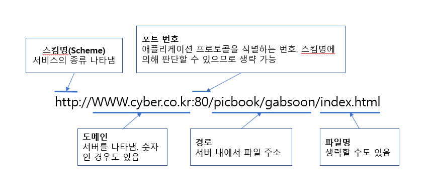

# 통신 서비스와 프로토콜

**목표**

- 웹 페이지가 표시되기까지 컴퓨터 간에 어떤 정보를 주고받는지 알기

**배경 지식**

- **서버** : 서비스를 제공하는 기능을 갖고 있는 프로그램
- **클라이언트** : 서비스를 받는 기능을 갖고 있는 프로그램
- **애플리케이션 프로토콜** : 서비스와 클라이언트간에 수행되는 서비스 고유의 주고받기 약속

## 서버와 클라이언트

TCP/IP를 사용한 많은 서비스는 '서버와 클라이언트의 주고받기'라는 형태로 이루어짐

1. 클라이언트는 받고 싶은 서비스 주문
2. 서비스를 담당하는 서버에게 클라이언트 요청을 전달
3. 클라이언트의 주문대로 서비스 제공

- 같은 서비스를 담당하는 프로그램끼리 주고 받음. 
- 한 대의 컴퓨터가 전자 메일 서비스와 www 서비스를 제공하는 등 두 가지 이상의 역할 하는 경우도 많음.

## 데이터가 어디 있지?

서버에게 데이터를 요청할 때 데이터가 있는 곳을 확실히 표시할 필요가 있음.

### URL ?

> Uniform Resource Locator
> 네트워크 상에 있는 특정 데이터 등을 표시할 때 사용되는 것

### gTLD(generic Top Level Domain)와 ccTLD

> 'com'이나 'org'등 나라에 관계없이 사용할 수 있는 조직 속성

**ccTLD** : 국내에서만 사용 가능한 조직 속성('co' 등)

## WWW

**하이퍼링크** : 페이지의 일부분에 다른 페이지의 위치 정보를 심어놓아 연결된 상태

**WWW** : 하이퍼텍스트로 전세계 인터넷에 정보를 공개, 공유하는 서비스

**HTTP(Hyper Text Transfer Protocol)** : WWW가 이용하는 주고받기. 하이퍼 텍스트를 전송하는 프로토콜

## 전자 메일

**메일러** : 전자메일 서비스의 클라이언트가 되는 것(ex. Outlook)

**SMTP(Simple Mail Transfer Protocol)** : 메일 전송 담당

**POP(Post Office Protocol)** : 클라이언트에게 메일 제공 담당하는 프로그램

## 파일 전송

### FTP(File Transfer Protocol)

> 파일 전송 프로토콜

**FTP 서비스**

- **FTP 서버** : 특정 전송 공간이 있음. 서버 내 전부가 전송 공간인 경우도 있음.

- **FTP 클라이언트** : 통신이 허용된 클라이언트는 데이터를 전송할 수 있음.

- 데이터가 평문으로 전송되므로 보안에 문제 있음. 현재는 데이터를 암호화해서 전송하는 **FTPS**(File Transfer Protocol over SSL/TLS)나 **SFTP**(SSH File Transfer Protocol)를 권장함.

## 원격 로그인

### Telnet 서비스

- 클라이언트는 telnet 명령이나 테라 텀이라는 애플리케이션
- 클라이언트 측 키보드를 사용해 입력한 명령이 서버로 보내져서 처리된 결과가 반환되어 옴. 
- 클라이언트와 서버 간의 주고받기는 TELNET이라는 프로토콜 기초로 수행됨.
- 암호화 기능이 없으므로 정보 도청 위험 있음

### SSH(Secure Shell)

> 다른 컴퓨터에 로그인할 때 통신을 암호화하는 프로토콜

- 명령을 암호화해서 보내므로 제 3자가 패킷을 훔쳐가도 통신 내용을 쉽게 해독할 수 없음

### 데스크톱 공유

> 네트워크 상의 다른 컴퓨터를 데스크톱 환경에 접속해 파일이나 애플리케이션을 조작하는 기술. 윈도우에서는 원격 데스크톱으로 지원됨.

- 통신 프로토콜은 **RDP**(Remote Desktop Protocol) 이용

## 파일 공유

- 클라이언트가 수행한 조작을 서버로 실시간으로 보냄으로써 이루어짐
- 주로 사용되는 프로토콜
  - Window : **SMB**(Server Message Block), **CIFS**(Common Internet File System)
  - Unix : **NFS**(Network File System)

## 기타 서비스

### IP 전화

**VolP**(Voice over IP) : 전화번호나 음성 데이터를 패킷화하여 전달하는 기술

**IP 전화** : 위 기술을 사용하여 인터넷이나 독자적인 네트워크에서 통신하는 전화 서비스

### 인스턴트 메신저 (IM)

> 미리 등록한 다른 클라이언트가 통신할 수 있는 상태인지 아닌지를 확인하여 그 상태를 표시하고 실시간으로 통신할 수 있는 서비스

프로토콜이 통일되어 있지 않기 때문에 다른 클라이언트끼리는 통신할 수 없음

