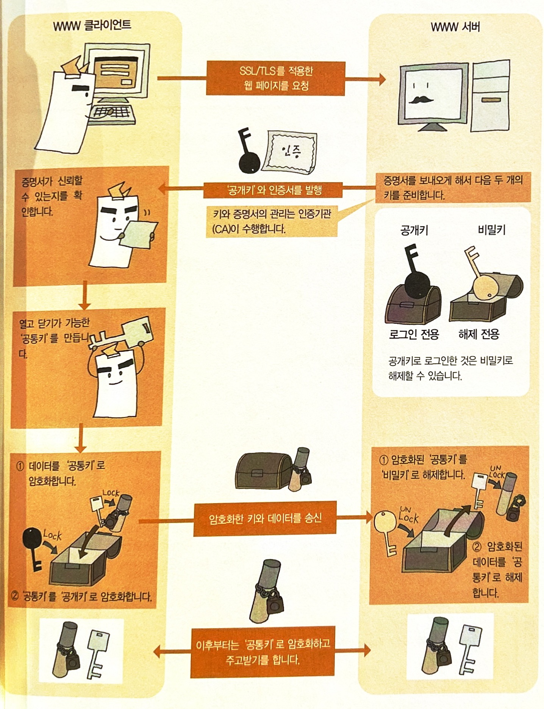

# 애플리케이션 계층

**목표**

- 애플리케이션 계층의 역할과 프로토콜에 대해 알아보기

## 애플리케이션 계층의 역할

- TCP/IP 5계층의 가장 위에 위치한 것이 애플리케이션 계층

- 통신 서비스를 실행하는 것이 애플리케이션 계층의 역할

- 송신측과 수신측이 아닌 클라이언트와 서버 개념을 가지고 있음

- **애플리케이션 프로토콜** : 애플리케이션 계층에서 서버와 클라이언트가 주고받기로 정한 프로토콜
  - 전자 메일이나 WWW등 서비스 수만큼 애플리케이션 프로토콜이 존재.

## 애플리케이션 헤더

> 애플리케이션 계층에서 추가되는 헤더

- 요청과 응답에 관한 정보가 있음
- 아래 계층인 트랜스포트 계층으로 가면 헤더와 데이터가 캡슐화되므로 데이터가 사용자가 해석할 수 있는 형태로 되어있는 것은 이 계층 뿐

- 헤더에 무엇을 쓸 지는 프로토콜에 따라 다름. 텍스트 기반과 바이너리 기반으로 쓸 수 있음
- 클라이언트가 서버에 서비스를 요청할 때 데이터를 주고받지 않는 경우는 헤더만 보낼 수 있음

## HTTP 프로토콜

> 하나의 요청에 하나의 응답을 반환하는 간단한 프로토콜
> 실제 페이지를 구성하는 파일 수만큼 이 작업을 반복

### 요청 패킷과 응답 패킷

HTTP 프로토콜에서는 요청과 응답이라는 두 종류의 패킷 하용하여 텍스트 형식으로 주고받기 수행

- 요청 패킷 : 클라이언트가 서버에 보내는 패킷

​	

- 응답 패킷 : 서버가 클라이언트에게 보내는 패킷

## 통신을 유지하는 구조

> HTTP프로토콜은 접속 상태를 유지한 채로 주고받기를 계속할 수 없음. 
> 원래 '요청한 데이터를 반환하는 것'이 목적
> 한 번의 요청과 응답으로 통신이 완결됨
> **상태 비보존형 프로토콜**(stateless protocol) : 한 번으로 끝나는프로토콜

### 쿠키

> HTTP 프로토콜의 주고받기에 관한 정보를 쿠키에 저장하고 다음 통신 때 그 정보를 서버에 제시하면 이어진 통신으로 취급할 수 있을 것. 이 때 주고받는 정보가 쿠키.

- http 프로토콜의 정규 장치는 아님. 

### CGI(Common Gateway Interface)

> 클라이언트로부터의 요청에 맞게 웹 페이지를 작성하는 장치

- 일반 페이지의 경우 서버가 응답 패킷을 준비함
- 서버로부터 요청을 받아 CGI 프로그램이 응답 패킷을 준비함. 쿠키를 사용하는 경우 헤더 부분에 쿠키와 '클라이언트에서 쿠키를 저장하기 위한 명령'을 써 넣음

- 다시 동일한 웹사이트를 요청할 때 

  - 클라이언트 : 요청 패킷의 요청 헤더에 이전에 서버로부터 부여된 쿠키 써넣음
  - CGI 프로그램 : 쿠키를 보고 사용자를 지정하여 처리한 웹 페이지를 작성.

  - 클라이언트 :  이전 통신을 근거로 웹 페이지가 표시됨

- 쿠키는 유효기간이 있으며, 기간이 지난 쿠키는 클라이언트에 의해 자동적으로 삭제됨.

## SSL/TLS

> ***SSL***(Secure Sockets Layer) 
> 인터넷 상에서 데이터 통신을 암호화하는 프로토콜
>
> **TLS**(Transport Layer Security)
> SSL을 바탕으로 표준화한 것

**브라우저로 표시한 웹페이지가 SSL/TLS로 보호되는지 확인**

- 브라우저에서 주소창 등에 자물쇠 마크

- http가 아닌 https 

### SSL/TLS 구조

1. 클라이언트가 웹페이지를 서버에 요청

2. 서버는 **공개키**와 인증서를 발행. **공개키**(로그인 전용)와 **비밀키**(해제 전용) 준비.

   공개키로 로그인한 것을 비밀키로 해제할 수 있음.

3. 클라이언트는 증명서가 신뢰할 수 있는지 확인. 열고 닫기가 가능한 **공통키** 만듦
4. 클라이언트는  데이터를 **공통키**로 암호화. **공통키**를 **공개키**로 암호화
5. 암호화한 키와 데이터를 서버에 송신
6. 서버는 암호화된 **공통키**를 **비밀키**로 해제. 암호화된 데이터를 **공통키**로 해제
7. 이후로는 **공통키**로 암호화하고 주고받기 계속

### 참고

https://velog.io/@dong5854/HTTPS%EC%99%80-SSL%EC%9D%B8%EC%A6%9D%EC%84%9C-%EB%8C%80%EC%B9%AD%ED%82%A4-%EA%B3%B5%EA%B0%9C%ED%82%A4%EB%B9%84%EB%8C%80%EC%B9%AD%ED%82%A4

