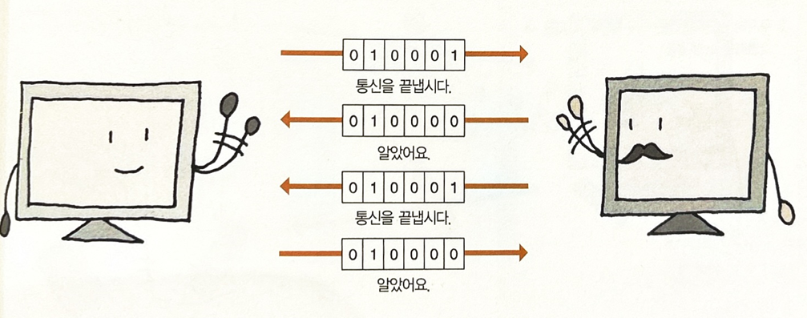

# 트랜스포트 계층

**목표**

- 트랜스포트의 두 가지 계층인 **TCP**, **UDP**에 대해 알아보기

**배경 지식**

- **포트** : 컴퓨터나 통신 장비에서 다른 장치와 물리적으로 접속되는 부분. TCP/IP에서는 클라이언트 프로그램이 네트워크 상의 특정 서버 프로그램을 지정하는 방법으로 사용됨.

- **포트 번호** : 포트에 할당된 고유의 숫자. 어떤 프로토콜에 전달할지 지정함. 포트가 여러 개 있는 이유는 프로토콜을 식별할 수 있다는 점 외에도 다른 통신 서비스를 동시에 사용할 수 있는 장점이 있기 때문.

 

## 1. 트랜스포트 계층의 역할

- **트랜스포트 계층의 위치** : 애플리케이션 계층과 네트워크 계층의 중개 역할

- **상대에게 전달** : 데이터가 항상 확실히 전달될 수 없으므로 문제가 발생한 경우 대처할 수 있어야 함.

- **신뢰성 vs 속도** : 

  - **TCP**(Transmission Control Protocol) : 신뢰성 중시

    송신하는 데이터를 확실히 상대에게 전달하고 싶을 때 사용 (www, 전자메일 등)

  - **UDP**(User Datagram Protocol) : 속도 중시

    송신하는 패킷이 작을 때나 데이터를 재전송할 필요가 없을 때 사용 (IP 전화, 스트리밍)

 

## 2. 포트

- **애플리케이션 계층의 출입구** : 포트**Port**

- **포트 번호** 
  - 0~65535번까지 있음. 0~1023번까지는 통신서비스마다 미리 예약되어있음.(well-known port number)
  - 그 외 포트번호는 사용자가 임의로 설정할 수 있음. 단, 통신하는 컴퓨터간에 어떤 포트번호를 사용할지에 대한 인식이 통일되어 있어야 함.

 

## 3. TCP 프로토콜

TCP는 데이터 전달의 **신뢰성**을 중시한 프로토콜

- **일대일 통신** : 데이터를 확실하게 전달하기 위해 수신측과 일대일로 통신함(**커넥터형 통신**). 다음과 같은 3단계로 이루어져있음.
  1. **통신 연결** : 데이터를 받을 수 있는 상태인지 확인 후 통신 개시. 
  2. 데이터를 정해진 크기로 분할, TCP 헤더 붙여 순서대로 송신. 
     트랜스포트 계층에서 취급하는 데이터의 단위 **세그먼트**
  3. 통신 종료

- **애플리케이션 계층에 전달** : 수신측에서 전해 받은 데이터를 원래의 형태로 다시 맞춘 후 애플리케이션 계층에 전달함
  1. TCP 헤더의 정보를 보고 데이터를 순서대로 맞춤.
  2. 애플리케이션 계층의 프로토콜에 전달. 어떤 프로토콜로 전달할지는 포트 번호 보고 판단

 

### 연락 방법

- **컨트롤 플래그** : 통신 상대에게 통신 상태를 전하는 수단으로 사용되는 것이 TCP 헤더에 있는 6비트의 컨트롤 플래그. 전하고 싶은 항목을 1, 그 외에는 0으로  만듦.

  

- **핸드셰이크** : 상대와 서로 확인해가면서 주고받는 것

- **3-way 핸드셰이크** : TCP에서 통신을 개시할 때 주고받는 방식

  

- **데이터 양의 확인** : 통신 전 양쪽이 다룰 수 있는 데이터 양을 확인. 수치가 작은 쪽으로 통일.

  

- **통신 해제** : TCP 헤더의 컨트롤 플래그 사용하여 연락 취함.

  

 

### 주고받기의 흐름

TCP 헤더에는 데이터 순서를 나타내는 번호(**시퀀스 번호**)가 적혀 있음. 이 번호를 사용하여 시그먼트가 없어질 때까지 다음과 같은 주고받기를 수행함.

- **하나씩 보내기** : 효율은 떨어지지만 확실함

- **모아서 보내기** : 효율적임. 윈도우 사이즈 이하라면 확인 응답을 기다리지 않고 모아서 보낼 수 있음. 윈도우 사이즈가 통신중에 변경되면 네트워크 비어있을 때는 크게 하거나 혼잡할 땐 작게 하는 등 상황에 맞는 조정 가능.

  

 

### 문제 발생시 처리 방법

:arrow_forward: 송수신 중 문제 발생시 시그먼트 재전송함

- **시그먼트의 지연 및 분실** : 송신 도중 세그먼트가 행방불명 되는 경우, 전달되지 않았으니 확인 응답을 보낼 수 없음. 확인 응답이 안 오면 송신 측에서 다시 보냄.
- **확인 응답의 지연 분실** : 확인 응답 자체가 행방불명 되는 경우 : 확인 응답이 안 오니까 다시 보냄. 세그먼트가 중복되므로 하나 남기고 파기.
- **데이터의 파손** : 송신 도중 데이터 깨지므로 수신측에서 그 데이터 파기 후 응답 보내지 않음.깨졌는지 아닌지는 헤더의 체크섬이라는 값을 사용하여 판단.
- **재전송 횟수 무제한? ** : 일정 횟수 이상 재전송해도 확인 응답 돌아오지 않는 경우 송신측에서 강제로 통신 해제. TCP 헤더의 컨트롤 플래그 `RST`를 1로 만듦.

 

### 수신 측의 처리

- **애플리케이션 계층에 전달** : 수신측에서는 TCP 헤더에 적힌 포트 번호를 보고 지정된 애플리케이션 프로토콜에 데이터를 전달함. 데이터가 하나의 세그먼트로 묶여있을 때는 헤더 제거하고 전달하기만 하면 되지만, 두 개 이상으로 분할되어있는 경우는 세그먼트 조립후 전달. 

 

## UDP 프로토콜

- 속도를 중시한 프로토콜

- 의논하지 않고 데이터 보내는  **비커넥션형 통신**

- **멀티 캐스트** : 복수의 특정인에게 데이터 보내는 것
- **브로드캐스트** : 불특정 다수에게 보내는 것

- 데이터가 깨지지 않았는지 확인하고 깨졌다면 파기한다. UDP 헤더를 제거하고 지정된 애플리케이션 프로토콜에 전달한다.
- 데이터의 확실성보다도 실시간성이 중요시되는 통신이나 데이터가 작은 네트워크 관리의 통신 등에서 사용됨.

 

## netstat 명령

통신에 관한 정보를 표시하는 명령. Powelshell에서 `netstat` 입력 후 엔터 치면 현재 설정도니 통신 정보 표시됨. 

