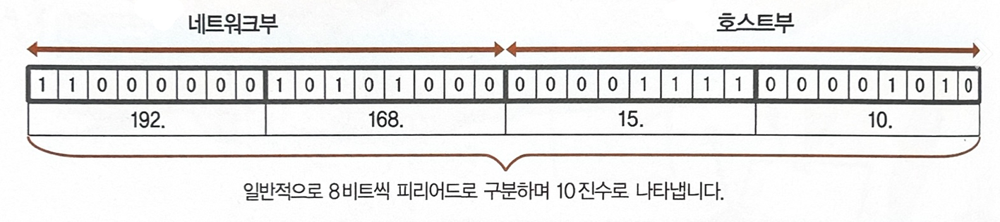
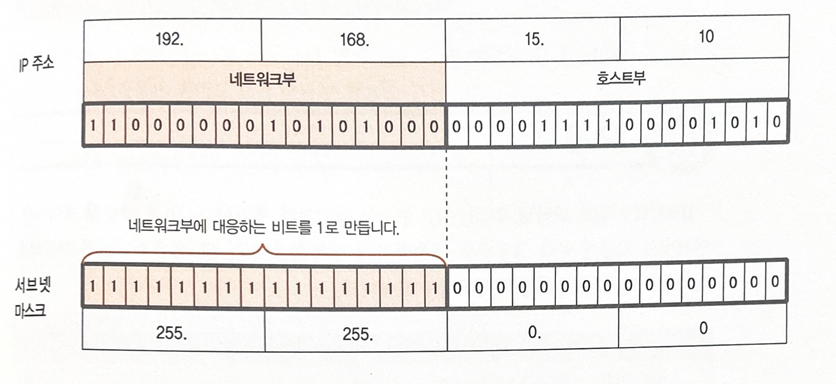
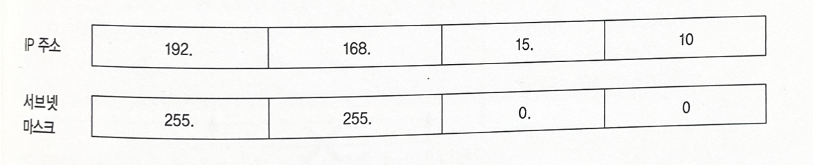

# 네트워크 계층

**목표**

- 네트워크에서 중심 역할을 하는 **IP**에 대해 알아보기

**배경 지식**

- 

## 1. 네트워크 계층의 역할

- **네트워크 계층의 위치** : 트랜스포트 계층과 데이터 링크 계층의 중개 역할
- 다른 계층과 달리 주된 프로토콜이 IP밖에 없음
- **통신 방법의 차이를 흡수** :통신 방식이 다른 네트워크 상에 있는 컴퓨터끼리도 주고받기가 가능
- **누가 누구에게 전달할지 그 정보를 다룸** : 통신 상대 지정을 위해 네트워크상 모든 기기에는 고유의 주소가 할당되어 있음
- **목적지까지 경로를 설정** : 경로가 여러 개 있는 경우 적절한 경로 사용하여 전달


## 2. IP 프로토콜

네트워크 계층의 중심이 되는 프로토콜인 IP의 주요 기능을 알아봅시다.

- **데이터 링크 계층에 전달** : 트랜스포트 계층으로부터 데이터를 받아 <u>목적지를 특정하는 번호(IP 주소)</u> 등을 기록한 IP 헤더를 붙여 데이터 링크 측에 전달. 

  > IP 데이터그램 : 데이터에 IP 헤더를 붙인 것

- **Best Effort 방식으로 데이터 전송** : 헤더가 깨지지 않았는지 확인하거나 목적지 주소가 존재하는지 아닌지 정도만 판단하고, 재전송 처리는 수행하지 않음. 

- **최적의 경로로 보내는 기능**

- **트랜스포트 계층에 전달**

### 2.1 IP 주소(IPv4)

> IP 주소
>
> 네트워크상의 기기를 구별하기 위한 번호.
> IPv4와 새로운 IPv6가 있음.

- IPv4는 32자리 비트열로 이루어지며, 다음과 같은 구조로 되어 있음

  

  - 네트워크부 : 네트워크 고유의 번호가 들어감
  - 호스트부 : 각각의 컴퓨터를 나타내는 번호가 들어감. 기본적으로 자유롭게 할당할 수 있음(모두 0 또는 모두 1은 제외)


- **서브넷 마스크**를 사용하여 네트워크와 호스트부의 경계를 나타냄. 

  

  - 일반적으로 IP주소와 서브넷 마스크는 다음과 같이 표기하고 쌍으로 사용합니다

    

  - 또  IP 주소와 서브넷 마스크를 다음과 같이 묶어서 쓸 수 있습니다. 

    - IP 주소 다음에 슬래시와 네트워크부의 비트수를 씀

    

## 2.2 IP 주소(IPv6)

> IPv4로 나타낼 수 있는 IP주소는 약 43억 개로, 인터넷의 보급에 따라 부족해지기 시작했습니다. 그래서 IPv6가 나오게 되었고, 128비트로 이루어져 있습니다.

- **표기 방법** 

  주솟값을 16비트마다 ':(콜론)' 으로 구분하고 16진수(0~f의 숫자)로 표기함

  예) `2001:0230:abcd:ffff:0000:0000:ffff:1111`

- 생략 규칙

  - 필드 선두부터 연속되는 0은 생략할 수 있음
  - 0인 필드가 연속되는 경우 0을 생략할 수 있다.

- 서브넷 마스크 표기 

  예) `2001:0230:abcd:ffff:0000:0000:ffff:1111/64`


## 3. 목적지까지 길 안내

### 3.1 라우터

> ***라우터(Router)***
>  네트워크 간을 연결해서 패킷이 목적지에 전달될 때까지 길 안내를 하는 기기
>
> 라우터의 역할 = 네트워크 계층의 역할 

대부분의 통신 서비스는 송신측에서 수신측 컴퓨터에 도달하기까지 여러 개의 네트워크를 경유합니다. 네트워크 계층에서는 목적지까지의 경로를 결정하거나 패킷의 크기를 조절합니다. 경로를 결정하므로 라우터라고 합니다. 

네트워크로 가는 출입구에는 각각의 IP주소가 있습니다.

통신 세계에서는 컴퓨터 사이의 거리를 <u>통과한 라우터의 개수</u>로 나타냅니다. 이때 사용하는 단위를 **홉**(hop) 이라고 합니다.


## 4. 수신측의 처리

### 4.1 트랜스포트 계층에 전달

- IP 헤더를 보고 데이터가 깨졌는지, 자기 앞으로 온 것인지 확인함. 그리고 트랜스포트 계층의 지정된 프로토콜로 전달.

## 5. 네트워크 계층의 신뢰성

- **IP는 비커넥션형**으로, 데이터가 상대에게 전달되었는지에 관여하지 않음

### 5.1 ICMP

- 신뢰성을 위해 IP를 도와 통신 상태 등을 송신측에 알려줌
- 단독으로 통신하는 것 아님

## 6. IP 주소의 설정

IP 주소를 설정할 때는 고정해서 할당하는 방법과 필요할 때만 자동으로 할당하는 방법이 있음

- 고정 할당 : 개별적으로 설정해야함. 큰 네트워크에서는 관리하기 힘듦
- 자동으로 할당 : DHCP(Dynamic Host Configuration Protocol)

### 6.1 DHCP

- DHCP 클라이언트는 DHCP 서버에 IP 주소를 요청하고 일시적으로 할당받음. DHCP 서버는 클라이언트의 요청에 대한 응답으로 IP주소를 빌려주거나 서브넷 마스크의 설정 정보를 제공
- 클라이언트는 요청할 때 수신 IP 주소를 '255.255.255.255'로 만듦. 이것을 **브로드캐스트 주소** 라고 하고, 동일한 LAN 안의 모든 기기에 송신하기 위한 특수한 IP 주소임. 이 요청에 대해서는 DHCP 서버만 응답함. 
- IP 주소를 부여받은 DHCP 클라이언트는 다시 '255.255.255.255'라는 IP 주소로 확인 메시지 보냄. 이에 대해 DHCP 서버가 응답하면 주고받기 완료되는 것임.

## 7. DNS

> ***DNS**(Domain Name System)*
> IP 주소와 도메인 명을 처리하는 서비스

숫자로 된 IP주소는 다루기 어려우므로 문자로 대신할 수 있는 매커니즘이 개발되었습니다. 

- 클라이언트가 도메인의 IP 주소를 요청 
  (ex. www.cyber.co.kr 의 IP 주소 알려줘) 

- **지역 네임 서버(지역 DNS 서버)**가 DNS 서비스 제공. IP주소와 도메인의 대응표를 관리함.
  (ex. 192.168.1x.xx 여기 있어요)

	1. **루트 서버**에 조회. 'kr' 담당하는 네임 서버 있는 곳 가르쳐줌
	1. co.kr 담당하는 네임 서버가 있는 곳을 가르쳐줌.
	1. ...계속


### 8. ipconfig와 ping 명령

### 8.1 ipconfig

- IP 주소나 서브넷 마스크 등을 알 수 있음

### 8.2 ping 명령

> 특정 컴퓨터가 네트워크상에 존재하고 있는지를 조사하고, 존재하고 있다면 그 통신 상태 등을 표시하는 명령

- 웹페이지 표시되지 않을 때 시험하기

```powershell
ping www.google.co.kr
```


## 9. 퀴즈

**Q1.  네트워크 계층의 가장 중요한 역할은?**

목적지까지의 경로를 결정하여 데이터를 전달


**Q2. IPv4 주소는 몇 비트로 이루어져 있습니까?**

32비트


**Q3. 네트워크 간을 연결해서 패킷이 목적지에 전달될 때까지 길을 안내하는 기기를 무엇이라고 합니까?**

라우터


**Q4. 통신 세계에서 컴퓨터 간 거리는 통과한 라우터의 개수로 나타내는데 이 때 사용하는 단위를 무엇이라고 합니까?**

홉


**Q5. 네트워크 계층에서 IP를 신뢰성 면에서 도와주는 프로토콜은?**

ICMP


**Q6. 서브넷 마스크를 사용한 서브넷을 만들면 어떤 장점이 있나요?**

규모가 큰 네트워크에서 관리가 편해진다.


**Q7. DNS?**

숫자로 된 IP주소와 문자로 된 도메인 명을 처리하는 서비스


**Q8. 통신하고 싶은 상대 컴퓨터의 접속 상태를 조사하는 명령어는?**

ping

