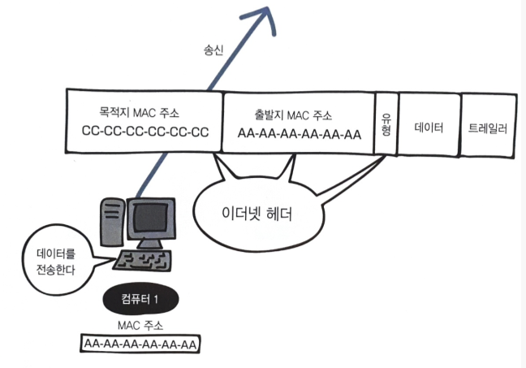
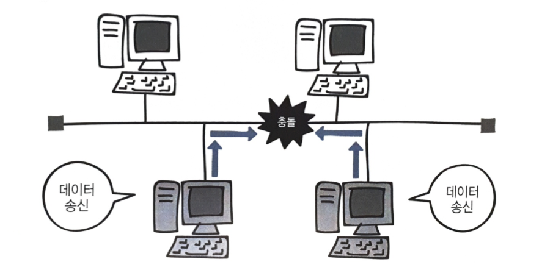
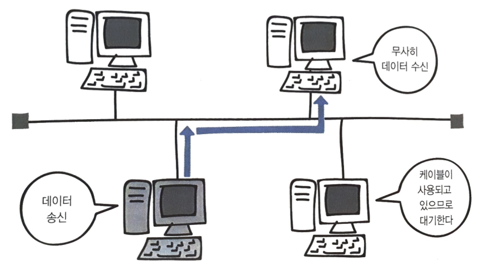

# 데이터 링크 계층과 물리 계층

**목표**

- 데이터 링크 계층의 역할을 알아보기
- MAC 주소를 사용하여 어떤 식으로 수신인에게 데이터를 전달하는지 살펴보기
- 물리 계층의 역할 알아보기-

**배경 지식**

- 통신 매체 : 통신을 하기 위해 사용되는 네트워크 장비(하드웨어)
- 데이터 링크 : 같은 규칙을 바탕으로 연결되어 있는 한 덩어리의 기기
- NIC(Network Interface Card) : 랜 카드라고 불리는 것으로 네트워크에 접속하기 위해 컴퓨터 내에 설치되는 확장 카드. 메인보드 형태에 따라 ISA용과 ESA용이 있다
- MAC 주소 : NIC에 제조시 제조 회사에 따른 고유 번호가 할당된 것

## 1. 데이터 링크 계층의 역할

> 데이터 링크?
>
> 기기끼리 연결하기 위한 방법으로, 동일한 방법으로 연결된 한 덩어리의 기기를 데이터 링크라고 함

- **네트워크 간의 차이를 흡수** : 데이터 링크 간의 차이를 흡수하고 네트워크 계층보다 위에 있는 계층이 그 차이를 의식하지 않고 작동할 수 있도록 하는 것

- **네트워크 계층과 물리 계층의 중개자** : 

  - 프레임 : 데이터에 헤더를 붙인 것 

  - 프레임을 보통의 비트열과 신호로 변환하여 물리 계층에 전달.

    물리 계층에서는 비트열을 프레임으로 인식하여 네트워크 계층에 전달

- **데이터 링크 계층의 프로토콜** : 데이터 링크 계층 내에서 어떻게 데이터 주고받을지 결정하는 프로토콜. 기기를 식별할 필요가 있을 때는 MAC 주소를 사용. 

## 2. 데이터 링크 계층과 물리 계층

> 물리 계층?
>
> 데이터 링크 안에서 신호가 있는 부분

- 비트열과 신호의 변환이 일어나고 그 방법은 기기의 성질에 의존하므로 정해진 프로토콜이 없음
- 다른 계층과 성질이 다르기 때문에 데이터 링크 계층의 일부로 생각하거나 TCP/IP 계층에 포함시키지 않는 경우도 있음.

- **구성 요소**

  - **노드** : 데이터 링크 상에 있는 기기. 컴퓨터나 라우터 등을 가리킴

  - **통신 매체** : 노드 간을 연결하는 케이블 등. 양 끝에 노드가 접속하기 위한 단자 有

    - 금속선 케이블 : 전압 변화로 신호 전달. 

    - 광섬유 케이블 : 빛의 점멸로 신호를 전달. 원거리 전송이 가능하며 주변 전파의 영향 받지 않음. 단, 비쌈.
    - 무선 : 케이블 사용X, 전파나 적외선으로 신호 전달. 통신 불가능한 경우도 있음.

  - **노드와 통신 매체를 연결하는 기기** : 비트열과 신호를 변환하는 것으로,네트워크 인터페이스 카드(NIC)나 모뎀 등이 있음.

  

## 3. NIC

> NIC?
>
> Network Interface Card

- 모든 데이터는 NIC라는 기기를 통해서 컴퓨터를 출입함. 
- 비트열을 신호로 반환

## 4. MAC 주소

랜 카드를 제조할 때 정해지는 물리적인 주소에 대해 알아보자

### 4.1 MAC(Media Access Control Address) 주소란?

랜 카드는 비트열(0과 1)을 전기로 변환하는데, 이런 랜카드에는

- **MAC(Media Access Control Address) 주소**라는 번호가 정해져 있다.

- 제조할 때 새겨지기 때문에 물리 주소라고도 부르며

- **전 세계에서 유일한 번호**로 할당되어 있다

  - 중복되지 않도록 규치깅 명확하게 정해져 있고 48비트 숫자로 구성되어 있다
  - 그 중 앞쪽 24비트는 랜카드를 만드는 제조사 번호
  - 뒤쪽 24비트는 제조사가 랜카드에 붙인 일련번호

  

### 4.2 MAC 주소를 사용한 통신

데이터링크 계층에서 **이더넷 헤더**와 **트레일러**를 붙인다
그리고 이렇게 이더넷 헤더와 트레일러가 추가된 데이터를 **프레임**이라고 한다

이더넷 헤더는 총 14바이트로 구성되어 있다

- 목적지의 MAC 주소(6바이트)
- 출발지 MAC 주소(6바이트)
- 유형(2바이트)

**이더넷 유형(Ethernet type)**은 이더넷으로 전송되는 상위 계층 프로토콜의 종류를 나타내는데, 식별하는 16진수 번호가 들어간다

| 유형 번호 | 프로토콜           |
| :-------- | ------------------ |
| 0800      | IPv4               |
| 0806      | ARP                |
| 8035      | RARP               |
| 814C      | SNMP over Ethernet |
| 86DD      | IPv6               |

**트레일러**는 **FCS(Frame Check Sequence)**라고도 하는데, 데이터 전송 도중에 오류가 발생하는지 확인하는 용도로 사용한다

네트워크를 통해 프레임(이더넷 헤더와 트레일러가 추가된 데이터)이 전송되는데

- 이더넷 헤더에 데이터의 목적지인 컴퓨터 주소(**목적지 MAC 주소**)와 자신의 주소(**출발지 MAC 주소**)를 넣고 데이터를 전송 → 이때 캡슐화가 일어난다

> 📌요악
>
> 💡데이터 링크 계층에서 데이터에 이더넷 헤더와 트레일러를 추가하여 **프레임**을 만듦 
>
> 💡물리 계층에서 이 프레임 비트열을 **전기 신호**로 변환하여 네트워크를 통해 전송

### 4.3 수신인의 IP 주소는 알지만 MAC주소 모르는 경우

- **브로드캐스트 MAC주소**  
  - 같은 데이터 링크 내에 있는 모든 기기에게 보낼 수 있는 MAC주소
  - 브로드캐스트 MAC주소로는 라우터를 넘어갈 수 없음.
  - ff:ff:ff:ff:ff:ff

- **수신인의 MAC주소를 조사** 

  - 데이터링크 내에서는 MAC주소를 사용하여 기기 특정하기 때문에, IP주소만으로 수신인에게 전달할 수 없음. 
  - **ARP**(Address Resolution Protocol) 프로토콜 사용하여 조사.

  1. MAC주소를 알고 싶은 컴퓨터의 IP 주소를 ARP 패킷에 적고, 브로드캐스트 MAC주소 앞으로 보냄
  2. -1 자신의 주소가 아닐 때는 파기

  2. -2 자신의 IP 주소이면 MAC주소를 적은 ARP 패킷을 보냄

## 5. 네트워크의 연결 방법

- 버스형 
- 링형
- 스타형(성형)
- 망형

## 6. 이더넷

### 6.1 이더넷(Ethernet)이란?

> **이더넷(Ethernet)**: 랜에서 적용되는 규칙. 허브와 같은 장비에 연결된 컴퓨터와 데이터를 주고받을 때 사용.
>
> > **허브**: 약해지거나 파형이 뭉그러진 전기 신호를 복원시키고, 해당 전기 신호를 전달받은 포트를 제외한 나머지 포트에 전달하는 역할을 한다.
> >
> > 더미 허브라고도 불리는 이유는, 들어온 데이터를 그대로 모든 포트에 보내기만 하기 때문.

특정 컴퓨터에만 데이터를 보내는데, 관계 없는 다른 컴퓨터들이 그 데이터를 받아 본다면? 😱
이런 경우를 대비해서 *다른 컴퓨터는 데이터를 못 보도록 하는 규칙*이 정해져 있다

- 그래서 보내려는 데이터에 **목적지** 정보를 추가해서 보내고,
- 목적지 이외의 컴퓨터는 데이터를 받아도 무시하게 된다

다만, 컴퓨터 여러 대가 동시에 데이터를 보내면 데이터들이 서로 부딪힐 수 있는데 즉 충돌(collision)이 일어날 수 있는데

이더넷은 여러 컴퓨터가 동시에 데이터를 전송해도 충돌이 일어나지 않는 구조로 되어있다

- 데이터가 동시에 케이블을 지나가면 충돌할 수 밖에 없어서 데이터를 보내는 시점을 늦추게 되는데, 이더넷에서 시점을 늦추는 방법을 **CSMA/CD**라고 한다

### 6.2 CSMA/CD이란?

> **CSMA/CD**: Carrier Sense Multiple Access with Collision Detection의 약어로 **반송파 감지 다중 접속 및 충돌 탐지**라는 뜻을 가진다

CSMA/CD에서
**CS**는 `데이터를 보내려고 하는 컴퓨터가 케이블에 신호가 흐르고 있는지 아닌지를 확인한다`는 규칙
**MA**는 `케이블에 데이터가 흐르고 있지 않다면 데이터를 보내도 좋다`라는 규칙
**CD**는 `충돌이 발생하고 있는지를 확인한다`는 규칙

이러한 규칙으로 데이터를 주고받으면 충돌이 일어나지 않는다

하지만 지금은 효율이 좋지 않다는 이유로 CSMA/CD는 거의 사용하지 않고
**스위치(switch)**라는 네트워크 장비를 사용하여 충돌을 막는다

