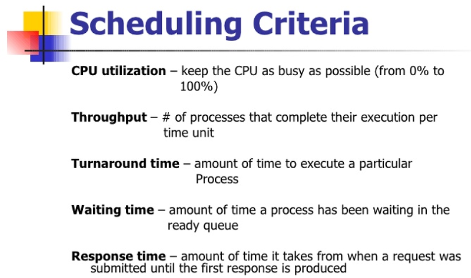
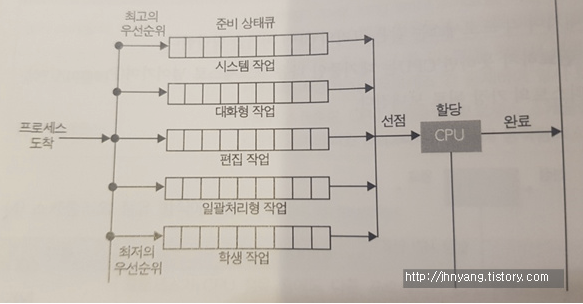
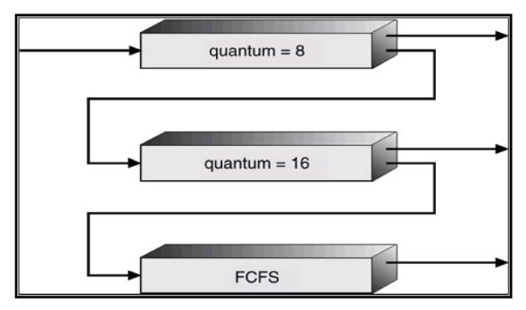
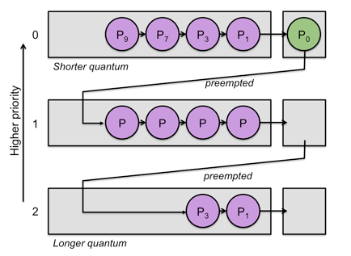

# CPU 스케줄링

[TOC]

## 0. CPU burst vs. I/O burst

> 프로세스는 CPU burst와 I/O burst가 서로 바뀌면서 프로그램을 실행함
>
> - CPU burst는 CPU 명령을 실행하는 것
> - I/O burst는 I/O을 요청한 다음 기다리는 시간을 말함

ex)

어떤 프로세스의 CPU burst time이 10초다 → 이 프로세스의 어떤 특정 작업이 완료되기 위해서는 CPU가 10초 동안 이 프로세스를 작업해주어야 한다는 뜻.

- CPU bound process

  사용자가 수행되는 것을 관여하지 않는 것!

  CPU bound process 예시로는 슈퍼컴퓨터가 엄청난 수학 처리 작업을 한다거나 기상청과 같이 과학 계산용 프로그램, 시뮬레이션 프로그램 같은, 일기예보 하는 경우, 몇 시간 동안 계속 계산을 하면서 향후의 미래를 예측하는 것 등이 있음

- I/O bound Process

## 1. 프로세스 스케줄링

> ***Process Scheduling?*** 
>
> Ready queue에 있는 프로세스들을 내가 스케줄링 할 순서대로 정렬하는 것
>
> ***Dispatching?*** 
>
> 고른 프로세스를 CPU에 올리는 것.
>
> Dispatcher와 Scheduling을 합쳐서 넓은 의미의 스케줄링이라고 함.
>
> ***Scheduling Criteria***
>
> 스케줄링 평가의 척도

### 1.1 스케줄링 척도

- CPU uitilization : CPU가 최대한 100%에 가깝게 사용되도록 유지하기
- Throughput : 처리량. 단위 시간당 처리하는 일의 양(네트워크 단위에서는 단위 시간당 전송한 양)
- Turnaround time : 특정 프로세스를 실행하고 끝내는데 드는 시간
- Waiting time : 프로세스가 ready queue에서 기다린 시간
- Response time : 대화형으로 동작할 때 응답을 주는 시간 (ex. 압축파일을 3초 이상 하고 있다면 사용자가 작업이 진행되고 있는지 궁금하기 때문에 2초 이전에 작업중임을 알려주는 것이 response time임)

### 1.2 스케줄링의 목표

📍 **Fairness**

> CPU 를 잘 사용하기 위해 프로세스를 잘 배정하기

- 조건 : 오버헤드 ↓ / 사용률 ↑ / 기아 현상 ↓
- 시스템별 스케줄링 목표
  1. **Batch System :** 한 번에 하나의 프로그램만 수행하는 것이 목표. 가능하면 많은 일을 수행. 시간(time) 보단 처리량(throughout)이 중요
  2. **Interactive System**: 사용자와 대화형으로 동작하기 때문에 빠른 응답 시간(response time). 적은 대기 시간(waiting time).
  3. **Real-time System**: 시간이라고 하는 제약조건이 추가된 시스템. 기한(deadline) 맞추기.

## 2. CPU 스케줄링 종류

>  💡 **상황:** 현재 시점에서 수행시간이 제일 짧은 애(3초)를 수행을 시킴. 일 초 후 수행하고 있던 job은 2초를 더 수행해야함. 하지만 1초가 지난 후 새로운 프로세스가 도착했고, 수행하는데 걸리는 시간이 1초인 경우. 즉 현재 2초가 남아있는데 1초짜리가 들어온 상황.
>
> **non-preemptive :** 중단시키지 않고 2초 짜리를 계속 진행시킴
>
> **preemptive :** 현재 수행되는 2초를 중단하고 1초짜리 실행

### 2.1 비선점 스케줄링

1. **FCFS (First Come First Served)**
   - 큐에 도착한 순서대로 CPU 할당
   - Burst가 큰 프로세스가 먼저 들어오게 되면 평균 대기 시간이 길어져서 안 좋음
2. **SJF (Shortest Job First)**
   - 수행시간이 가장 짧다고 판단되는 작업을 먼저 수행
   - FCFS 보다 평균 대기 시간 감소, 짧은 작업에 유리
   - CPU burst를 미리 측정할 수 없으므로 FCFS에 비해 대기시간 예측 어려움
3. **HRN (Hightest Response-ratio Next)**
   - 우선순위를 계산하여 점유 불평등을 보완한 방법(SJF의 단점 보완)
   - 우선순위 = (대기시간 + 실행시간) / (실행시간)

### 2.2 선점 스케줄링

1. **Priority Scheduling (우선순위 스케줄링)**

   - 정적/동적으로 우선순위를 부여하여 우선순위가 높은 순서대로 처리
   - 우선 순위가 낮은 프로세스가 무한정 기다리는 Starvation 이 생길 수 있음
   - Aging 방법으로 Starvation 문제 해결 가능

2. **Round Robin**

   > RR에서 time quantum이란 한마디로 한 새끼한테 주는 모이의 양
   >
   > 10마리의 새끼에게 콩 30개를 분배한다고 할 때, 콩 3개씩 준다고 하면 3바퀴를 도니까 round는 3이 되고 time quantum은 3

   - FCFS에 의해서 프로세스들이 내보내지며 각 프로세스는 같은 크기의 CPU시간(`Time Quantum`)을 할당한다.

     - `Time Quantum` or `Time Slice` : 실행의 최소 단위 시간
     
   - CPU시간이 만료될 때까지 처리를 완료하지 못하면 CPU는 대기중인 다음 프로세스로 넘어가며, 실행 중이던 프로세스는 준비 완료 리스트의 가장 뒤로 보내진다

   - 할당 시간이 크면 FCFS와 같게 되고, 작으면 문맥 교환 (Context Switching) 잦아져서 오버헤드 증가

3. **Multilevel-Queue (다단계 큐)**

   

   - 작업들을 여러 종류의 그룹으로 나누어 여러 개의 큐를 이용하는 기법
   - 우선순위가 낮은 큐들이 실행 못하는 걸 방지하고자 각 큐마다 다른 `Time Quantum`을 설정 해주는 방식 사용6ㅛㅅㅋ4ㄴㅁ<M
   - 우선순위가 높은 큐는 작은 `Time Quantum` 할당. 우선순위가 낮은 큐는 큰 `Time Quantum` 할당.

4. **Multilevel-Feedback-Queue (다단계 피드백 큐)**

   - 다단계큐 알고리즘에서 한 번 해당 큐에 들어가면 프로세스는 다른 큐로 이동되거나 변경되는 것이 거의 불가능하다는 단점이 있음. 즉 스케줄링 오버헤드가 낮은 대신에 inflexible함.

     

   

   - 다단계 큐에서 자신의 `Time Quantum`을 다 채운 프로세스는 밑으로 내려가고 자신의 `Time Quantum`을 다 채우지 못한 프로세스는 원래 큐 그대로 
     - Time Quantum을 다 채운 프로세스는 CPU burst 프로세스로 판단하기 때문
   - 짧은 작업에 유리, 입출력 위주(Interrupt가 잦은) 작업에 우선권을 줌
   - 처리 시간이 짧은 프로세스를 먼저 처리하기 때문에 Turnaround 평균 시간을 줄여줌