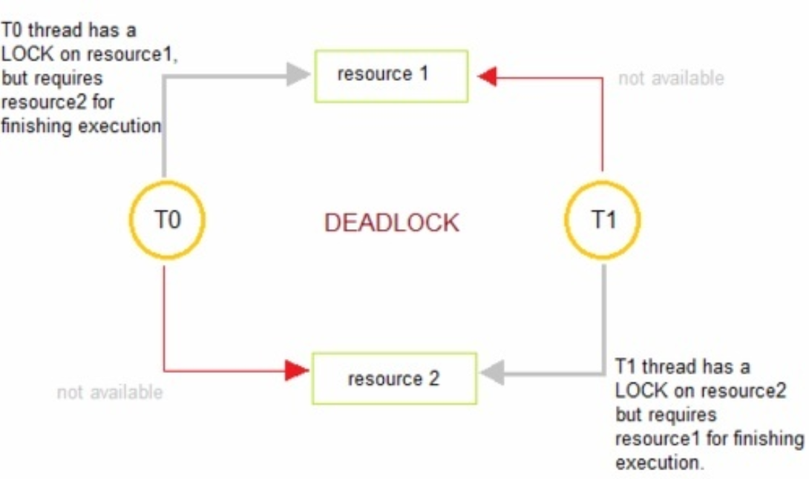
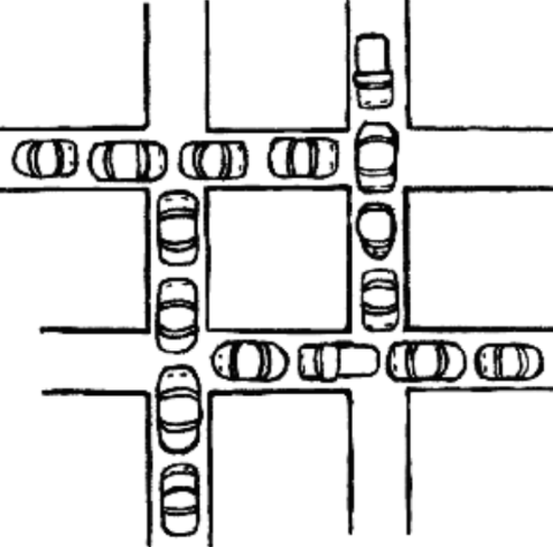
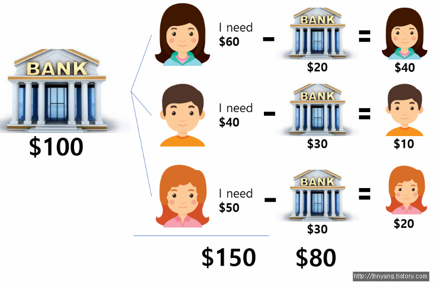
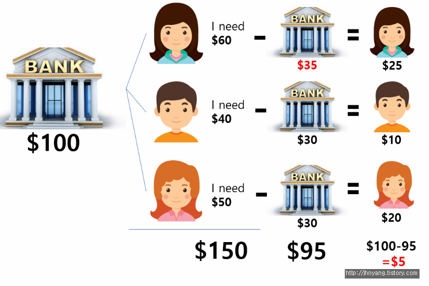

# 데드락(Dead Lock, 교착 상태)

[TOC]

## 1. **데드락 (DeadLock, 교착 상태)**

> 두 개 이상의 프로세스나 스레드가 서로 자원을 얻지 못해서 다음 처리를 하지 못하는 상태
>
> 서로가 상대방이 자원을 내놓기를 바라면서 무기한 연기 상황에 빠지는 것
>
> 시스템적으로 한정된 자원을 여러 곳에서 사용하려고 할 때 발생한다.

> 마치, 외나무 다리의 양 끝에서 서로가 비켜주기를 기다리고만 있는 것과 같다.

🍀 **데드락이 일어나는 경우**

thread 0과 1가 resource1, 2를 모두 얻어야 한다고 가정해보자

- t0이 resource1을 얻음 / t1가 resource2를 얻음
- t0은 resource2를 기다림 / t1는 resource1을 기다림

현재 서로 원하는 자원이 상대방에 할당되어 있어서 두 스레드는 무한정 wait 상태에 빠짐

→ 이것이 바로 **DeadLock**

### 1.1 데드락(DeadLock) 발생 조건

4가지 모두 성립해야 데드락 발생

필요조건이므로 4가지 조건 모두 성립한다고 반드시 교착상태 일어나는 것은 아님.

1. **상호 배제(Mutual exclusion)**

   자원은 한번에 한 프로세스만 사용할 수 있음

2. **점유 대기(Hold and wait)**

   최소한 하나의 자원을 점유하고 있으면서 다른 프로세스에 할당되어 사용하고 있는 자원을 추가로 점유하기 위해 대기하는 프로세스가 존재해야 함

3. **비선점(No preemption)**

   다른 프로세스에 할당된 자원은 사용이 끝날 때까지 강제로 빼앗을 수 없음(양보가 불가능함)

4. **순환 대기(Circular wait)**

   프로세스와 자원들이 원형을 이루며, 각 프로세스는 자신에게 할당된 자원을 가지면서, 상대방 프로세스의 자원을 상호 요청하는 경우 → 교착 상태는 서로에게 요구해서 서로가 기다려야하는데 일직선이면 서로가 아니기 때문에 발생할 일이 없음

   

**☘️ DeadLock 예시**

1. Mutual exclusion - 하나의 차량은 그 순간에 하나의 구간만 차지
2. Hold and wait - 각각의 차량들이 도로에서 하나의 구간을 차지하면서 나아가기를 기다리고만 있음
3. No preemption - 하나의 구간이 양보될 수 없는 상황(선점할 수 없는 상황), 차량을 뺄 수 없는 상황
4. circular wait - 서로 맞물리는 원형 형태를 띔

### 1.2 데드락(DeadLock) 처리

- **교착 상태를 예방 & 회피**

  1. **예방(prevention)**

     교착 상태 발생 조건 중 하나를 제거하면서 해결한다 (자원 낭비 엄청 심함)

     - 상호배제 부정 : 여러 프로세스가 공유 자원 사용
     - 점유대기 부정 : 프로세스 실행전 모든 자원을 할당
     - 비선점 부정 : 자원 점유 중인 프로세스가 다른 자원을 요구할 때 가진 자원 반납
     - 순환대기 부정 : 자원에 고유번호 할당 후 순서대로 자원 요구

  2. **회피(avoidance)**

     교착상태 가능성을 배제하지 않고 적절하게 피해나가는 방법

     **은행원 알고리즘(Banker's Algorithm)**

     - 은행에서 모든 고객의 요구가 충족되도록 현금을 할당하는데서 유래함
     - 프로세스가 자원을 요구할 때, 시스템은 자원을 할당한 후에도 안정 상태로 남아있게 되는지 사전에 검사하여 교착 상태 회피
     - 안정 상태면 자원 할당, 아니면 다른 프로세스들이 자원 해지까지 대기

- **교착 상태를 탐지 & 회복**

  교착 상태가 되도록 허용한 다음 회복시키는 방법

  1. **탐지(Detection)**

     자원 할당 그래프를 통해 교착 상태를 탐지함

     자원 요청 시, 탐지 알고리즘을 실행시켜 그에 대한 오버헤드 발생함

  2. **회복(Recovery)**

     교착 상태 일으킨 프로세스를 종료하거나, 할당된 자원을 해제시켜 회복시키는 방법

     **프로세스 종료 방법**

     - 교착 상태의 프로세스를 모두 중지
     - 교착 상태가 제거될 때까지 하나씩 프로세스 중지

     **자원 선점 방법**

     - 교착 상태의 프로세스가 점유하고 있는 자원을 선점해 다른 프로세스에게 할당 (해당 프로세스 일시정지 시킴)
     - 우선 순위가 낮은 프로세스나 수행 횟수 적은 프로세스 위주로 프로세스 자원 선점

### 1.3 은행원 알고리즘

교착상태에 빠질 가능성이 있는지 판단하기 위해 상태를 '안전상태(safe state)'와 '불안전상태(unsafe state)'로 나눔.

즉 **은행원 알고리즘에서 운영체제는 안전상태를 유지할 수 있는 요구만을 수락하고 불안전 상태를 초래할 사용자의 요구는 나중에 만족될 수 있을 때까지 계속 거절합니다.**

**🍀 예시**

- 은행이 고객에게 ＄20, ＄30, ＄30씩 빌려줌. 남은 돈은 ＄20.

  고객은 ＄40, ＄10, ＄20씩 부족한 상태

- 남은 ＄20 중 ＄10을 고객 2에게 빌려주고 돈을 갚을 때까지 기다리기

  → 고객 2가 ＄40을 갚으면 고객 1에게 ＄40을 빌려줄 수 있음.

- 이렇게 모든 고객들에게 돈을 빌려주고 은행이 다시 돈을 돌려받을 수 있는 상태를 **안전 상태**라고 함.

  고객2 - 고객1 - 고객3

  고객2 - 고객3 - 고객1

  고객3 - 고객1 - 고객2

  고객3 - 고객2 - 고객1

  이런 순서로 모든 고객의 상황을 해결해 줄 수 있고 이를 **안전 순서열**이 존재한다고 합니다.

근데 갑자기 고객1이 너무 상황이 긴박해서 최소 ＄35는 당장 필요하다 해서 ＄35를 빌려줬다고 해봅시다.

- 은행이 고객에게 ＄35, ＄30, ＄30씩 빌려줌. 남은 돈은 ＄5.

  고객은 ＄25, ＄10, ＄20씩 부족한 상태

- 이런 상황에서 은행은 아무도 해결해줄 수가 없음. 은행이 충분한 돈이 없기 때문에 파산하게 됨. 이런 상태를 **불안전상태 또는 데드락 상태**라고 함.

은행원 알고리즘은 **'최소한 고객 한명에게 대출해줄 금액은 항상 은행이 보유하고 있어야 한다'**는 개념에서 나옵니다.

**💡 은행원 알고리즘의 안전상태 정리와 이를 수행하기 위해 필요한 것들**

- **안전상태 (Safe State):**
  시스템이 교착상태를 일으키지 않으면서 각 프로세스가 요구한 최대 요구량만큼 필요한 자원을 할당해 줄 수 있는 상태로 안전순서열이 존재하는 상태를 말합니다.

- **불안전상태 (Unsafe State):** 
  안전순서열이 존재하지 않는 상태를 말합니다. 불안전상태는 교착상태이기 위한 필요조건입니다. 교착상태는 불안전상태에서만 발생합니다. Unsafe state라고 해서 무조건 교착상태가 발생하는 것은 아닙니다.

- 또 은행원 알고리즘이 제대로 수행되기 위해서는 3가지가 필요해요. 
  1. 각 고객들이 얼마나 맥시멈으로 돈을 요구할지 **[Max]**
     → 각 프로세스가 자원을 얼마나 요청할 수 있는지
  2. 각 고객들이 현재 빌린 돈이 얼마인지 **[Allocated].**
     → 프로세스가 현재 보유하고 있는 자원은 얼마인지
  3. 은행이 보유한 돈이 얼마인지, 빌려줄 수 있는 돈이 얼마인지 **[Available]**
     → 시스템이 얼마나 자원을 보유하고 있는지.

**💦 은행원 알고리즘의 단점**

- 할당할 수 있는 자원의 수가 일정해야 합니다.
- 사용자 수가 일정해야 합니다.
- 항상 불안전 상태를 방지해야 하므로 자원 이용도가 낮습니다.
- 최대 자원 요구량을 미리 알아야 합니다.
- 프로세스들은 유한한 시간 안에 자원을 반납해야 합니다.

즉 은행원 알고리즘은 알고리즘이 엄청나게 복잡합니다. 즉 OS가 이거 하다가 아무것도 못하는 상황이 발생하면 안되잖아요. 또 은행원 알고리즘은 해당 프로세스가 시작할 때 프로세스가 가지고 있어야 할 자원의 최대 개수를 미리 알아야 하기 때문에 실제 돌아가는 프로그램에 적용하기도 상당히 어렵습니다. 오버헤드가 너무 커요. 그래서 현재 채택하고 있는 방식은 아닙니다.

### 1.4 주요 질문

1. 데드락(교착 상태)가 뭔가요? 발생 조건에 대해 말해보세요.

2. 회피 기법인 은행원 알고리즘이 뭔지 설명해보세요.

3. 기아상태를 설명하는 식사하는 철학자 문제에 대해 설명해보세요.

   > 교착 상태 해결책
   >
   > 1. n명이 앉을 수 있는 테이블에서 철학자를 n-1명만 앉힘
   > 2. 한 철학자가 젓가락 두개를 모두 집을 수 있는 상황에서만 젓가락 집도록 허용
   > 3. 누군가는 왼쪽 젓가락을 먼저 집지 않고 오른쪽 젓가락을 먼저 집도록 허용

**참고**

https://jhnyang.tistory.com/2