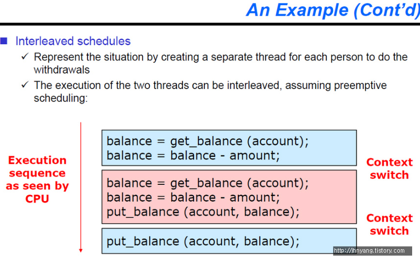
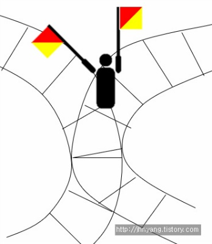

# 동기화, 뮤텍스와 세마포어


[TOC]


# 0. 운영체제에서 동기화란? 

> 프로세스 또는 스레드들이 수행되는 시점을 조절하는 것

**코드**

```jsx
int withdraw(account, amount) //해당 account에서 amount만큼 인출하는 함수 
{
     balance = get_balance(account); //계좌에서 현재 잔액을 가져옴
     balance = balance -amount; //남은 잔액은 기존 잔액에서 amount만큼 뺀 금액
     put_balance(account, balance); //account에 변경된 잔액을 갱신함
     return balance; 
}
```

💡 **A와 B가 계좌를 공유하는 경우**

- 현재 잔액 100만원
- A와 B가 동시에 10만원씩 인출하는 경우 각각의 프로세스 스레드가 생김
- withdraw 라는 함수를 수행하는 스레드가 동시에 두 개가 생성
- A가 먼저 withdraw 함수 수행했다고 하면
- 3번째 줄을 시행했을 때 balance는 100만원
- 4번째에서 실제 인출이 일어나므로 잔액은 90만원
- **여기서 4 line까지 수행이 되고 이 잔액을 업데이트 `put_balance()` 하기 전 interrupt가 걸린 경우**
- 인터럽트가 걸리면 인터럽트 핸들러가 수행이 되고 운영체제가 수행됨.
- 운영체제가 자기 할 일을 다 처리한 후에 CPU에 프로세스를 다시 올리려고 스케줄링을 함.
- 남아있는 프로세스는 A B 두 가지. A의 프로세스는 4 line까지 처리를 조금 완료했으므로 B의 것이 스케줄링이 됨.
- `get_balance`를 하면 90만원이 나와야 하는데 아까 A의 프로세스에서 `put_balance`를 이용해서 업데이트 하기 전에 인터럽트가 일어나버려서 100만원이 현재 잔액임
- 그래서 B가 인출하게 되면 실질적으로 인출된 돈은 20만원인데 잔액은 90만원이 되는 것
- 이러한 문제를 동기화 조취를 취하지 않았을 때 일어나는 **synchronization problem**이라고 함

> 즉, multi-threaded program이 되었던, multi-process program이 되었던간에 어떤 shared data를 접근하는 경우에 그들의 순서를 조절하는 것을 **synchronization**이라고 합니다.



A와 B가 동시에 인출을 할 때 이런 순서로 [Context Switching](https://jhnyang.tistory.com/33)이 되면서 수행이 되면 문제가 발생!


## 0. 1 경쟁 상태 Race Condition

> 두 개 이상의 concurrent한 스레드들이 공유된 자원에 접근하려고 할 때 동기화 메커니즘 없이 접근하려고 하는 이런 상황 → 두 개의 스레드가 하나의 자원을 놓고 서로 사용하려고 경쟁하는 상황

- race condition인 경우에는 스레드의 실행 순서를 잘 조절해주지 않으면 비정상적 상태가 발생
- 항상 문제가 발생하는 것이 아니라 특정한 순서대로(A와 B 동시 인출, 인터럽트 발생 등) 수행되었을 때 발생
- 디버깅 시에 문제점이 보이지 않기 때문에 큰 문제가 되므로 멀티 스레드 프로그래밍을 할 경우 동기화 문제를 꼭 고려해야 함


# 1. 임계 영역을 보호하기 위한 방법

> ***임계 영역 critical section?***
>
> - 공유되는 자원, 즉 동시 접근하려고 하는 그 포커싱 된 자원에서 문제가 발생하지 않게 독점을 보장해 주어야 하는 영역
> - critical section 동시접근을 해결하기 위한 방법으로 lock, semaphore, monitor 등이 있음
> - 임계영역이란 한순간 반드시 프로세스 하나만 진입해야 하는데, 프로그램에서 임계 자원을 이용하는 부분으로 공유 자원의 독점을 보장하는 코드 영역을 의미한다. 임계 구역은 지정된 시간이 지난 후 종료된다.
> - 병렬컴퓨팅에서 둘 이상의 스레드가 동시에 접근해서는 안 되는 공유자원에 접근하는 코드의 일부로도 쓰인다.
> - 스레드가 공유자원의 배타적인 사용을 보장받기 위해서 임계 구역에 들어가거나 나올 때에는 세마포어 같은 동기화 메카니즘이 필요하다. (세마포어는 락에서 발전된 동시접근 해결방법)


## 1.1 Lock

> ***Lock?*** 내가 자원을 사용하고 있는 동안에는 문을 걸어잠궈서 나 말고는 아무도 못들어오게 하는 방식

`get_balance`라는 함수, `put_balance`라고 하는 함수가 사용하는 그 데이터베이스가, `account`의 데이터베이스가 **shared data(공유자원)**이고 그 shared data를 스레드 A, 스레드B가 동시에 접근(access)하려는 상황이니까 **race condition** 임

이 race condition을 유발시키는 code segment를 critical section이라고 함


**lock unlock 함수가 추가된 withdraw함수**

```arduino
int withdraw(account, amount)//해당 account에서 amount만큼 인출하는 함수
{
     lock(lock);
     balance = get_balance(account);//계좌에서 현재 잔액을 가져옴
     balance = balance -amount;//남은 잔액은 기존 잔액에서 amount만큼 뺀 금액put_balance(account, balance);//account에 변경된 잔액을 갱신함unlock(lock);
     return balance;
}
```

- 스레드A가 먼저 수행이 되어서 먼저 Lock을 겁니다. 첫번째이므로 lock이 아예 안걸려있는 상태이므로 스레드 A가 `lock`을 걺
- 5번 라인을 수행 중 time interrupt가 걸림
- interrupt로 스레드 B가 수행됨
- 스레드 B가 3번 라인을 실행(`lock(lock)`)하려고 하는데 이미 스레드 A에 의해 `lock`이 걸려있는 상태임
- 스레드 B는 3번 라인에 멈춰서 스레드 A가 `lock`을 해제해주기를 기다림
- 운영체제 스케줄링에 의해 다시 스레드 A가 수행됨. 5번 라인 이후를 쭉 수행한 후 7번 라인에서 `unlock`으로 lock 해제
- 스레드 B가 수행됨


## 1.2 뮤텍스 Mutex

MUTual EXclusion으로 **상호 배제**라고도 합니다. 획득(Lock) 또는 해제(Unlock) 상태가 있으며 스핀락과 같이 접근 권한을 획득할 때까지 Busy Waiting 상태에 머무르지 않고 Sleep 상태로 들어가며 Wakeup 되면 권한을 획득을 시도합니다. 뮤텍스의 경우엔 Locking 메커니즘으로 오직 하나의 스레드만이 동일 시점에 뮤텍스를 얻어 임계 구역(Critical Section)에 접근할 수 있습니다. 그리고 획득(Lock) 또는 해제(Unlock)의 주체는 동일해야 합니다.

 <aside>💡 **요약**

- 임계 영역(자원)에 하나의 작업 스레드만 허용하는 것이다.
- 이를 조율하기 위해서 임계 영역에 들어갈 수 있는 작업 스레드는 "lock"을 소유해야 해!라는 조건을 적용한다.
- 자원을 원하는 작업 스레드는 지속적으로 lock을 요구한다. 자원을 소유하고 있는 작업 스레드는 lock을 쥐고 있으며 작업이 끝난 이후에 lock을 풀어낸다. 해당 자원을 쥐고 있는 스레드만이 lock을 반환할 수 있어서 "비선점"방식이 된다.
- 임계구역을 위한 lock 변수는 전역 변수로 관리된다.
- mutex의 특징은 lock을 소유했냐 유무로 임계 영역을 허용한다는 것이다.
- **그렇기에 임계영역을 원하는 다른 작업 스레드들은 임계 영역이 누군가에 의해서 사용되는 경우 끊임없이 lock이 열려있는지 체크해야 한다. 이를 busy watiting 방식이라고 한다.**
- spin lock이라고도 부르며 멀티 스레딩 환경에서 **프로세스를 깨우는 방식(sleep, wake-up) 시그널**을 통해 진행되는 문맥교환을 거치지 않기 때문에 임계 영역을 짧게 사용해야 하는 경우 효율성 측면에서 좋을 수 있다고 한다. 반대로 단일 코어 단일 스레드 환경에서는 상당히 치명적이다.
- 뮤텍스 구현 알고리즘으로는 데커, 피터슨 알고리즘이 존재한다. </aside>


## 1.3 세마포어 Semaphore

> 💡 Semaphore는 **깃발**이라는 뜻
>
> 옛날에는 기찻길에서 깃발 표식으로 파란색이 걸려있으면 지나가도 되고 빨간색이 걸려있으면 섰다가 다른 기차가 지나가면 지나가게끔 하는 용도로 깃발을 사용했어요 이 깃발을 semaphore라고 부름



- lock의 경우 0 또는 1 (초기값 0, 누가 사용하면 1)
- 세마포어는 shared data의 개수를 의미함.
- **binary semaphore** :  0 또는 1의 값만 갖는 세마포어
  - 위 그림에서는 공유자원이 한 개(겹쳐지는 깃차길) 이므로 semaphore의 값은 0 또는 1임
  - 초기값 1, 누가 사용하고 있으면 0
- **counting semaphore** :  0과 1뿐만 아니라,2 ,3, 4 등의 값들 또한 가질 수 있음. 즉 도메인이 제한 없는 세마포어
  - 서버에 프린터가 다섯 대가 물려있어요. 사용자가 프린트를 사용하려고 서버에 요청합니다. 그러면 공유자원 즉 프린터가 5개가 있으니까 5로 설정이 되는거예요. 그리고 프린터를 사용자가 사용할때마다 하나씩 감소하는겁니다. 그러다가 사용할 프린터가 없어지면 세마포어는 0이되고 누군가가 프린터를 다 쓰고 반환하면 세마포어가 다시 1이 증가하겠죠? 이런식으로 생각하면 됩니다. 다시 말하지만 여기서 **세마포어는 단순히 변수**예요. **공유자원의 개수를 나타내는 변수**!


### 1.3.1 semaphore 접근 함수- wait(), signal()

**그럼 자원을 어떻게 사용하고 반납하나요?**

- **`wait()`**하고 **`signal()`**

  사용하면 -1이 되고 반납할 때 +1 해주는 함수.

- 다만 세마포어 자체가 공유자원이 되면 안되니까 쪼개지지 않는 함수로 구성됨. shared data를 보호하려고 지금 세마포어를 사용하는데 세마포어 자체가 shared data가 되면 안 되기 때문. 두 줄로 구성되지 않고 무조건 끼어들 틈이 없게 atomic하게 한 번에 수행시켜줘야 한다는 것. 따라서 spin lock하고 interrupt disable/enable하는 방법 가지고 세마포어를 구현함.

- shared data를 사용하려고 봤는데 shared data가 없다면 기다려야하니까 이 함수의 이름을 `wait()`이라고 지었고, 지금 비어있는 shared data가 있다면 사용 (-1)

- 다 쓰고 나서는 세마포어 값을 +1시켜주면 됨. 내가 지금 다 쓴 이 shared data를 누군가 쓰려고 기다릴 수 있기 때문에 다 쓰면 신호를 보내 주어야 함. 이 함수가 `signal()`.


### 1.3.2 wait과 signal 함수의 구현

`wait()`과 `signal()`이 두 함수는 `p()`또는 `v()`라고 많이 얘기를 하기도 합니다. (p는 네덜란드어 "테스트하다"라는 단어의 *probern* 에서 유래됐고 signal은 "증가하다"라는 뜻의 *verhogen* 단어에서 유래)

```jsx
P(S);

// --- 임계 구역 ---

V(S);
procedure P(S)   --> 최초 S값은 1임
    while S=0 do wait  --> S가 0면 1이 될때까지 기다려야 함
    S := S-1   --> S를 0로 만들어 다른 프로세스가 들어 오지 못하도록 함
end P

--- 임계 구역 ---

procedure V(S) --> 현재상태는 S가 0임
    S := S+1   --> S를 1로 원위치시켜 해제하는 과정
end V
```

이를 통해, 한 프로세스가 P 혹은 V를 수행하고 있는 동안 프로세스가 인터럽트 당하지 않게 된다. P와 V를 사용하여 임계 구역에 대한 상호배제 구현이 가능하게 되었다.


***예시***

> 최초 S 값은 1이고, 현재 해당 구역을 수행할 프로세스 A, B가 있다고 가정하자

1. 먼저 도착한 A가 P(S)를 실행하여 S를 0으로 만들고 임계구역에 들어감
2. 그 뒤에 도착한 B가 P(S)를 실행하지만 S가 0이므로 대기 상태
3. A가 임계구역 수행을 마치고 V(S)를 실행하면 S는 다시 1이 됨
4. B는 이제 P(S)에서 while문을 빠져나올 수 있고, 임계구역으로 들어가 수행함