# 메모리 관리

[TOC]


## 0. 메모리 관리 개요

운영체제는 컴퓨터의 하드웨어 자원을 관리하는데, 대표적으로 CPU, Memory, I/O가 있습니다. 이제까지 CPU가 어떻게 배분이 되어 사용되는지 살펴보았고, 이제는 메모리 관리에 대해서 살펴보겠습니다.

> **운영체제의 목적**
>
> 1. 프로그래머가 하드웨어를 잘 몰라도 쉽게 하드웨어 자원을 활용할 수 있게끔 하는 것
> 2. 효율적으로 사용하게끔 하는 것


### 0.1 메모리 관리의 목표

1. 프로그래밍을 할 때 쉽게 메모리를 사용할 수 있도록 추상화를 해주는 것

2. 적은 오버헤드로 성능을 최대한 이끌어낼 수 있도록 프로세스들 사이에서 부족한 메모리 자원을 적절히 잘 할당하는 것

   (ex.램이 8기가인데 메모리 10기가가 필요한 프로그램을 돌릴 수 있도록 하는것)

3. 프로세스 간 메모리 영역을 침범하지 않도록 격리해주는 것 (메모리 보호)


### 0.2 메모리 관리의 역사

- Batch Programming
  - 프로세스를 하나 올려놓고 그 프로세스가 다 수행되고 나면 다른 프로세스 올림 → 메모리 관리라고 할 게 별로 없음
- Multiprogramming
  - 여러 개의 프로세스가 메모리에 올라가게 됨으로 메모리 관리가 중요
  - 요구 사항(Requirements)이 발생
    - Protection : 프로세스들이 사용할 수 있는 주소들을 제한한다.
    - Fast translation : 메모리를 내가 참조를 해줘야 하는데 메모리 주소의 변화를 아주 빨리 진행을 해야 한다
    - Fast context switching : overhead 최소화하게 메모리 관리를 해줘야 함

결국 Multiprogramming 시절부터 memory management에 대한 개념이 나왔고 쭈우욱 그거에 대한 방법들이 나왔음


## 1. 배경 지식 1 : Linking & Linker

### 1.1 프로그램 빌드 과정- 컴파일 과정

링킹은 프로그램을 빌드 하는 과정에서 (즉 컴파일 과정에서 거치는 단계) 이뤄지는 말그대로 링크하는 과정입니다. 이 전체를 크게 컴파일 과정이라고 하고, compiling 이라고 적혀 있는 구간을 작은 의미의 컴파일이라고 합니다.

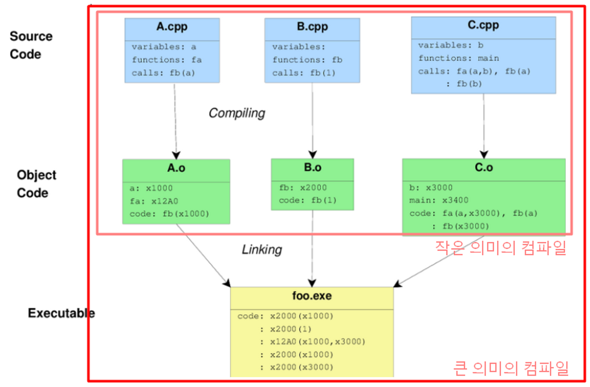[그림1]

C언어로 예를 들어볼게요

대략 이렇게 우리가 코드를 짰다고 합시다. 그럼 이게 소스파일입니다. Source.cpp (이름.cpp 이렇게 저장되는 파일)

소스파일은 C언어나 java 등 이렇게 우리 인간들, 프로그래머들이 이해하기 쉽게 고급언어로 작성된 파일을 말합니다.

그리고 빌드하면 실제로 컴파일링 후 링킹 과정을 내부에서 진행한 후 .exe파일을 내보내줍니다.

```c
// 소스 파일

int x = 10;
int y = 20;
int result;
int add (int x, int y)
{
return x+y;
}
void main()
{
int sum = x+y;
result = add(x,y);
}
```

test라는 프로젝트를 생성해서 이와 같이 작성 후 빌드를 시켰습니다.

폴더에 들어가서 확인해보면

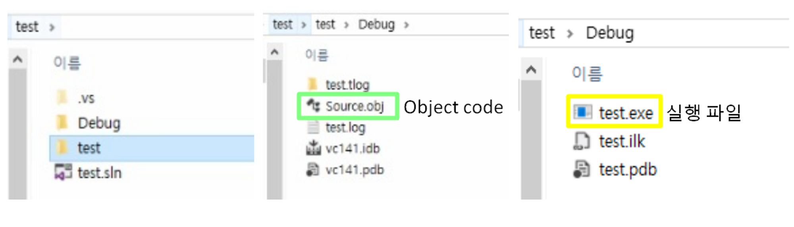그림2

- Source.obj : 작은 의미의 Compiling을 거친 후 생성된 Object code
- test.exe : 링킹 과정 후에 생기는 실행 파일
- 현재는 source파일이 하나밖에 없어서 컴파일 과정을 거친 .O(오브젝트 파일=목적파일)은 Source.obj하나밖에 없는 상태. 하지만 실제로 컴파일 과정을 거치면 [그림1]처럼 .O파일이 여러개 각 소스파일 당 한개씩 생깁니다.


### 1.2 목적 파일 (Object File)

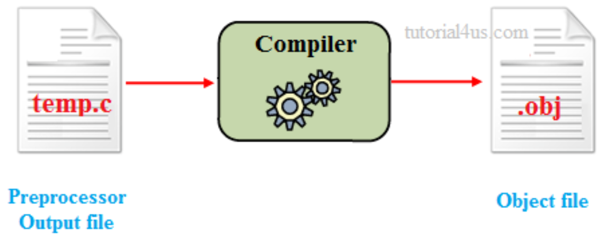

- 소스파일을 컴퓨터가 실제로 이해하고 실행하기 위해 Low level 언어, 이진수 파일로 변환해야 함. 이 변환 과정을 compiling이라고 함.(컴파일러를 통해 변환)
- 컴파일 뒤에 생긴 Low level 언어의 파일이 **목적 파일**
- 목적 파일은 기계어로 작성된 로직과 실행하는데 필요한 부가 정보들 (디버깅 정보나 Symbol 정보 등)들로 이루어져있습니다.
- 목적파일은 실행파일과 소스코드의 중간단계


**:four_leaf_clover: 목적 파일 구성**

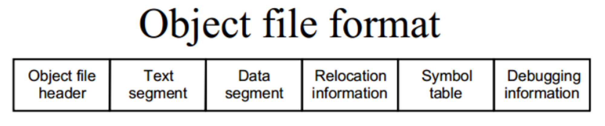

- Text segment, Data segment : [프로세스 메모리 구조]에서 배움.

  - Text segment : 작성한 코드들(명령어)의 이진정보가 담김

  - Data segment : 전역변수나 static 변수가 저장됨.

    자세히는 안에 Data section과 BSS Section을 나눠서 BSS에는 초기화되지 않은 전역변수와 static 변수들이 들어갑니다. 오브젝트 파일이 링킹 과정을 거쳐서 실행파일이 되는거니까  목적파일에도, 실행파일에도 이 데이터들이 포함됩니다.

- Symbolic table은 컴퓨터 구조시간에 배웠던 symbol. Symbol들의 주소와 정보들을 쉽게 찾을 수 있도록 한 곳에 모아둔 테이블이 Symbol 테이블

  - Relocation 정보 또한 symbol 심볼 정의와 심볼 참조를 연결하기 위한 테이블입니다. (symbol주소와 PC 상대 주소의 매칭 테이블임)

- 목적파일 열어보면 아래와 같이 컴퓨터만 알아볼 수 있음

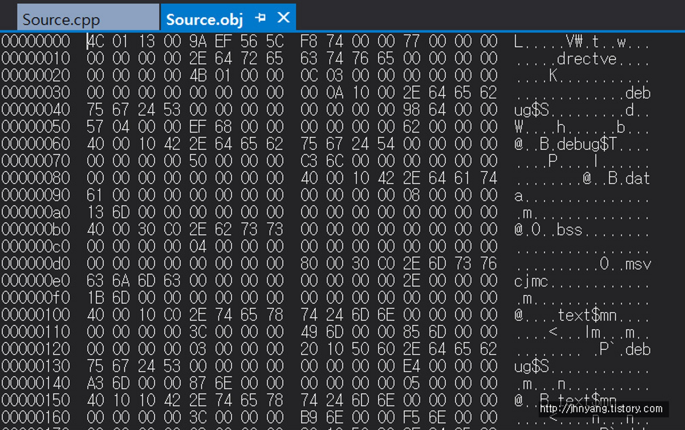


### 1.3 링커(Linker)의 링킹(Linking) 과정

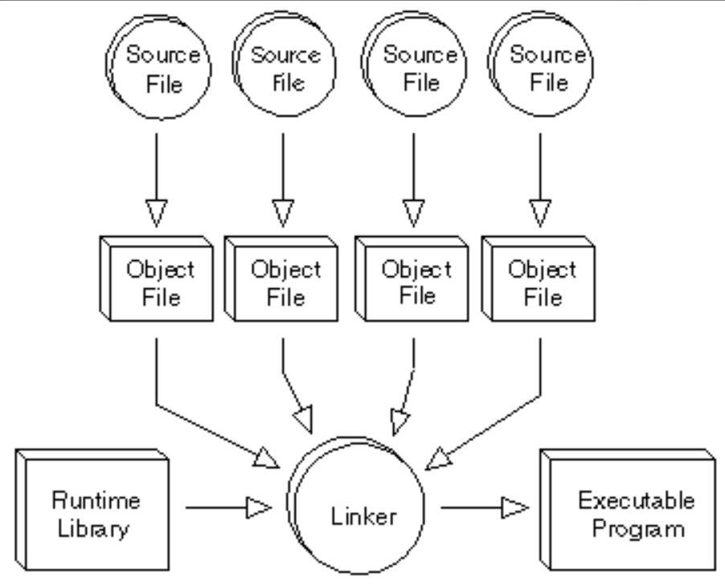

이렇게 만들어진 Object file들을 링커가 링킹해서 실행파일로 만듭니다.

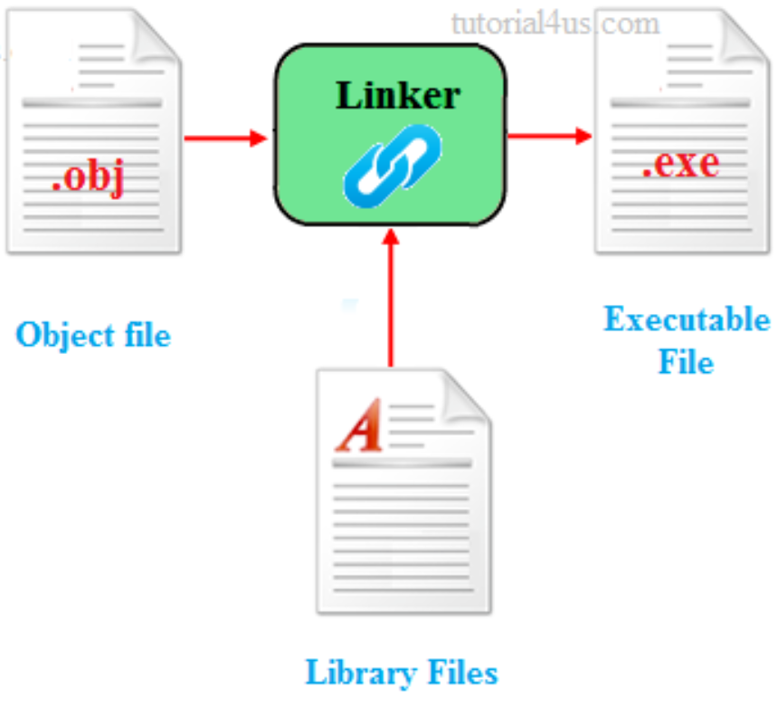

컴퓨터가 발전하고 소스코드의 양이 늘어나면서 한 파일로 관리할 수 없게 됨. 그래서 파일들을 분리해서 관리하게 됨.

링커라는 프로그램은

1. 이런 여러 소스코드 파일들을 하나로 합칩니다. 즉 **Object 파일들**을 하나로 합칩니다.
2. 여기에 **Library**를 합쳐요

라는 작업을 해서 **실행파일**을 만들어줘요

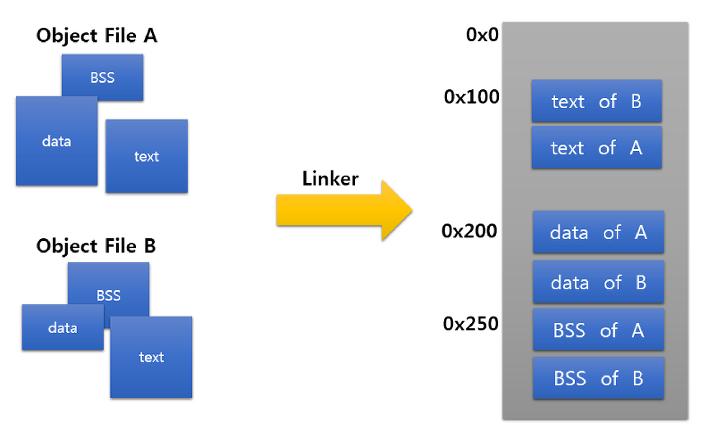

1. 여러 오브젝트 파일에 있는 동일한 섹션들을 하나의 덩어리로 합칩니다.
2. 링커가 라이브러리를 합침

오브젝트 파일들 하나로 다 링크하고 라이브러리를 집어넣어서 실행파일을 완성하는 작업이 linking입니다 정확히는 static linking


## 2. 배경 지식 2 : Static Linking VS. Dynamic Linking

링킹과정에서 오브젝트 파일을 라이브러리와 같이 Linking을 하는데 그 Linking을 하는 방법에 크게 두 가지가 있음

### 2.1 Static Linking

> *실행파일 만들 때 라이브러리를 같이 포함시켜서 만드는 것*

예를 들어 출력할 때 cout이라는 클래스 라이브러리를 사용함. 그 cout이라는 클래스 라이브러리를 실행하는 코드를 실행 파일에 집어넣어 만든 것이 Static Linking

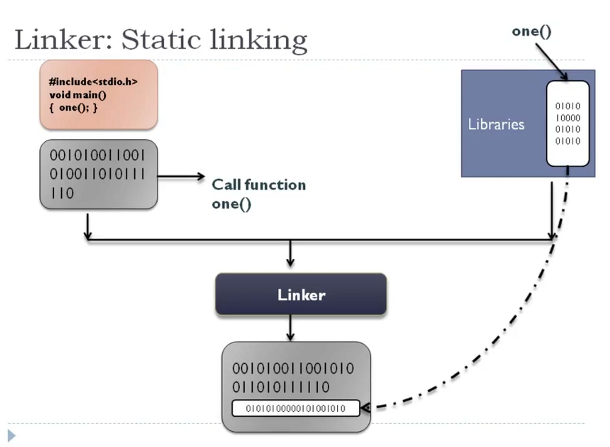

- **장점**

  - 컴파일 시간 단축 :

    링커가 프로그램이 필요로 하는 부분을 라이브러리에서 찾아 실행파일에다가 바로 복사하기 때문에 라이브러리가 필요 없음. 미리 컴파일 되어 있어서 **컴파일 시간도 단축**

  - 기술 유출 방지 : 또 직접 구현한 코드를 라이브러리화시켜서 **기술 유출 방지**로 사용할 수도 있음

- **단점**

  - 하지만 실행 파일 내에 라이브러리 코드가 저장되기 때문에 **메모리 차지가 심각함**

    예를 들어, 60명의 유저가 LINUX, UNIX서버에 접속해가지고 동시에 Hell world를 출력시키는 프로그램을 실행시킨다고 가정. 즉 여기서 출력하는데 사용된 cout이라는 클래스 라이브러리가 정적으로 링킹되어 있다는 것은 hello라는 실행파일에 cout클래스 라이브러리 코드가 다 들어가있다는 것. 즉 hello를 동시에 60명이 실행시키면 메모리에 cout 정보 코드만 60개가 존재하므로 메모리가 매우 비효율적

### 2.2 동적 링킹

> ***동적 라이브러리는 프로그램이 실행될 때 링크됨***

- 정적 링킹시 메모리에 중복된 라이브러리가 올라가므로, cout과 같이 많이 쓰이는 라이브러리는 메모리에 하나만 올림.
- 그리고 이 프로그램이 cout을 호출할 때 메모리에 있는 cout으로 점프해 그쪽으로 간 후 실행한 다음에 다시 돌아오도록 함.
- 현재 Linux, Unix에서는 프로그램을 개발할 때 별다른 옵션을 주지 않으면 Linking을 동적링킹으로 함. Windows에서도 별다른 옵션을 주지 않으면 동적링킹을 함.
- DLL (Dynamic-link Library) : 동적 링크 라이브러리. 윈도우에서 동적링킹할 때 사용되는 라이브러리 파일로 window 시스템 디렉토리에 있음.

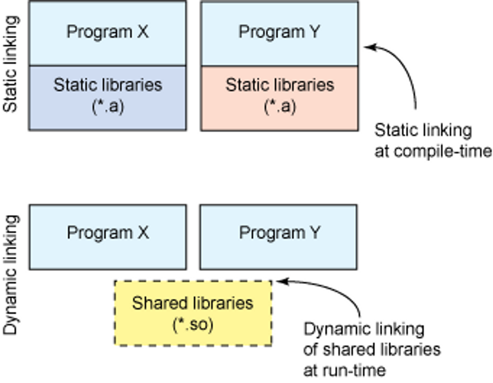

내가 hello world를 C++라이브러리랑 같이 링킹을 해서 실행을 했는데 메모리에 DLL파일이 없음. 그럼 실행을 못하니까 운영체제가 메모리에 DLL파일을 load시킴. 이렇게 메모리에 한 번 올라가면 그 다음부터는 이 올라가있는 DLL이 수행됨. (즉 메모리에 cout이 60개가 잡히는 게 아니라 그림처럼 shared libraries 한 개만 잡힘 )

- **장점**
  - 메모리 요구사항이 적음
  - 프로그램 업데이트시 library만 버전업이 되면 프로그램을 새로 받지 않아도 업데이트만 하면 됨.
- **단점**
  - 라이브러리가 저장되어있는 주소로 점프하기 때문에 약간의 overhead 듦.

→ 성능상 정적 링킹이 좋지만 메모리 관리 차원에서는 동적 링킹이 좋음


## 3. 동적적재 & 오버레이 (paging VMM과 차이점)

### 3.1 동적 적재(Dynamic Loading)

> *프로세스가 시작될 때 그 프로세스의 주소 공간 전체를 메모리에 올려놓는 것이   아니라 메모리를 좀 더 효율적으로 사용하기 위해 **필요한 루틴이 호출될 때** 해당 루틴을 **메모리에 적재**하는 방식 *
> *→* 필요할 때 로딩하는 것

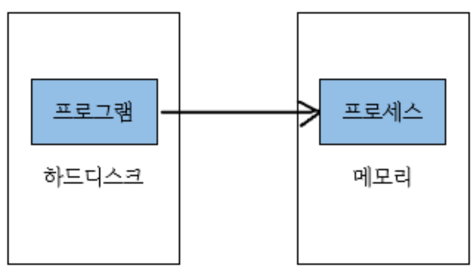

- **Loading** : 메모리로 데이터를 옮기는 것

  프로그램을 실행시키면 .exe에 있는 파일이 메모리에 올라가야 실행 됨. 그것을 로딩 즉 메모리에 적재한다고 합니다.

- 필요할 때만 적재되서 코드 양이 많을 때 자주 호출되지 않는 루틴(ex 에러처리 루틴 등)에 특히 더 효율적

- OS의 특별한 자원을 필요로 하지 않고 프로그램의 재량에 따라 구현이 가능


### 3.2 오버레이(Overlay)

> 프로그램의 메모리가 주기억장치보다 클 때의 문제를 해결하기 위한 기법

- 하나의 프로그램을 여러 개의 조각으로 분할한 후 필요한 조각을 순서대로 주기억장치에 적재하여 프로그램을 실행합니다.
- 실행 중에 주기억장치의 메모리가 부족하면 불필요한 조각이 있는 곳에 새로운 조각을 중첩하여 적재합니다.
- Overlay는 현재 VMM(Virtual memory management)가 나온 뒤로는 더 이상 필요가 없는 내용이긴 하지만 한 때 정말 유용했던 기법입니다.


### 3.3 Overlay vs Paging & VMM

뒤에 나오는 paging기법이나 VMM가 똑같은거 아닌가? 하는 오해를 할 수 있는데 둘은 다릅니다

Overlay는 운영체제가 아니라 **프로그래머가 적용하는 기법**이라 프로그램의 깊은 이해를 필요로 했기도 하고 오버레이 프로그래밍 하는게 엄청 난해하고 복잡했습니다.

Paging과 VMM은 오버레이와는 다르게 프로그래머가 직접 구현하는 게 아니고 운영체제가 관리해 줌.


## 4. 스와핑, 프로세스 교체, VMM과 차이

### 4.1 스와핑(Swapping)

> 주기억장치에 적재한 하나의 프로그램과 보조기억장치에 적재한 다른 프로그램의 메모리를 교체하는 기법

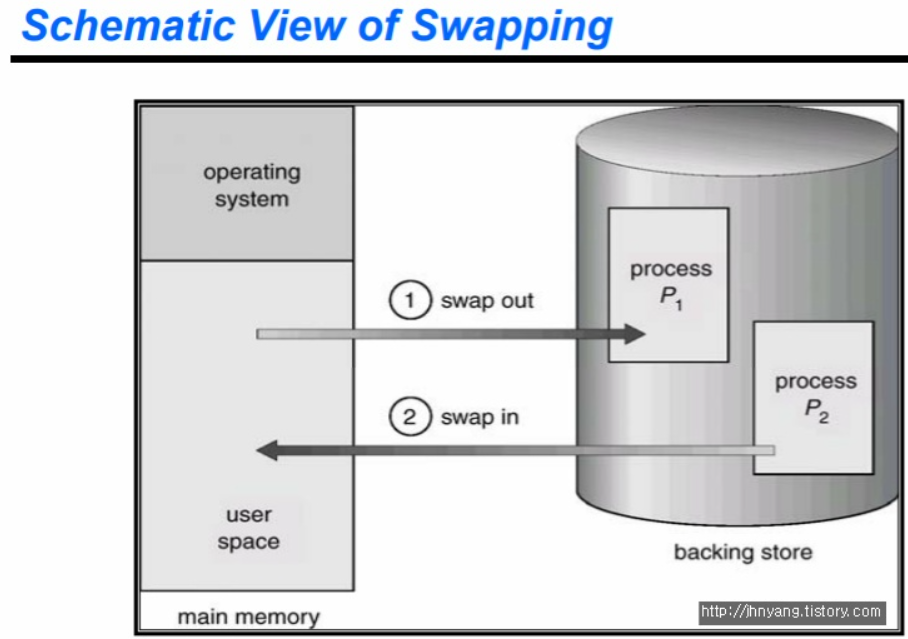

- 프로세스는 실행되려면 반드시 메모리에 올라가야합니다. 그런데 프로세스는 메모리에서 잠깐 뒤 저장공간(하드웨어나 SSD)로 빠졌다가 다시 메모리에 돌아왔다가 이런식으로 실행됨에 따라 교체될 수 있습니다. → **Swapping!**
- Swap Out: 주기억장치에 있는 프로그램이 보조기억장치로 이동
- Swap In: 보조기억장치에 있는 프로그램이 주기억장치로 이동

→ 가상기억장치의 페이징 기법으로 발전


### 4.2 Swapping과 VMM차이?

이 개념은 우리가 뒤에서 할 Virtual Memory Management와 유사해요. 애초에 **가상 메모리라는 개념이, 메인 메모리는 8기가인데 10 기가짜리 프로그램을 돌리게 해주는 방안**이니까요! 10기가 중에 8기가만 일단 메모리에 올려놓고 2기가는 하드디스크에 저장하고 있다가 필요하면 부분적으로 바꿔줘야 겠죠? 그걸 **프로세스 단위로 하면 Swapping**이지만 프로세스 단위로 하지 않고 어떤 다른 단위로 이 Swap in Swap out을 합니다. VMM은 프로세스 단위로 Swap in swap out을 하지 않아요. 이 차이입니다. **VMM은 프로세스보다 더 작은 단위인 paging단위로 스와핑을 실행**해요.


## 5. 주소의 할당(Address Binding)

```c
data = 10;
```

data라는 메모리 번지에다가 10을 쓰는(write) 프로그램을 코딩한 것을 실제로 CPU가 명령어를 수행을 한다면 아래와 같이 나올 것.

```nasm
store #198000, 10   
(#198000은 임의의 데이터가 저장될 주소!)
```


이 메모리 번지를 언제 어떻게 결정하느냐, 이것을 주소 할당이라고 하고, 다음과 같이 나뉨.

**1. compile time**

명령어로 컴파일해서 실행파일로 만들 때 주소를 결정

**2. load time**

프로그램 실행 전에 메모리에 올릴 때 이 주소 값(#198000)을 결정

**3. execution time.**

실행 시 결정되는 것으로, 실행 시 load까지 올라오고 이 명령어를 실행하는 순간에 주소값(#198000)을 결정한다.


>  💡 **absolute code**
>
> 저기 위에 어셈블리어 명령어에 보이듯이, 정확히 어셈블리어가 정한 위치에 물리적으로 고정되어 위치되는 코드를 말합니다. **relocatable code**의 반댓말로, relocatable이 움직있수 있는 위치시킬 수 있다는 의미라면 absolute는 절대적인 즉 fix되는 것을 말합니다.
>
> > It means code that loads at a known, fixed memory address. 코드가, 이미 정해진 메모리 주소에 로드되는 것을 말한다.


### 5.1 컴파일 타임 바인딩(Compile Time Binding)

> 프로그램 내부에서 사용하는 주소와 physical 주소하고 같음

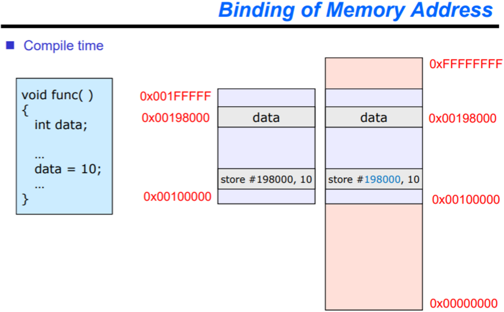

프로그램을 왼쪽 코드처럼 짜고 컴파일을 돌리면 가운데 그림처럼 **absolute code**가 생성이 됩니다. 그럼 이 때 결정된 주소가 결국 메모리에 올라가는 주소가 된다 해서 컴파일 타임에 결정되는 메모리 할당

**문제점**

현재 컴퓨터의 상황이 어떨지 모르기 때문에, 특정 메모리 주소에 올리려고 했는데, 이 메모리를 차지하고 있는 다른 프로세스가 있을 수 있음.

**이 방식이 가능한 상황**

아무 것도 없을 때 가능함. 예를 들면, 아두이노에는 내가 만든 프로그램 말고 다른 프로그램은 안 돌아가는 특성이 있음. 컴파일하면 프로그램은 0번지에서부터 돌아간다고 가정해도 됨. 한 프로그램밖에 안 돌아가므로 겹칠 일이 없음.(실제로 0번지에는 OS 커널이 위치하기 때문에 안 되겠지만)


### 5.2 물리적 주소(Physical Address) vs 논리 주소(Logical Address)

- **물리 주소(physical address)** : 메모리가 취급하게 되는 주소(**메모리 주소 레지스터(MAR)**에 주어지는 주소)

- **논리 주소(logical address)** : 일반적으로 CPU가 생성하는 주소

  컴파일 타임 바인딩과 같이 물리적 메모리 주소로 직접 매핑하는 방식 말고 또 다른 메모리 방식이 필요.


### 5.3 로드타임 바인딩(Load Time Binding)

> 프로그램이 메인 메모리로 적재(loading)시에 바인딩이 이루어지는 것. 프로그램 내부에서 사용하는 주소와 physical 주소하고 다름

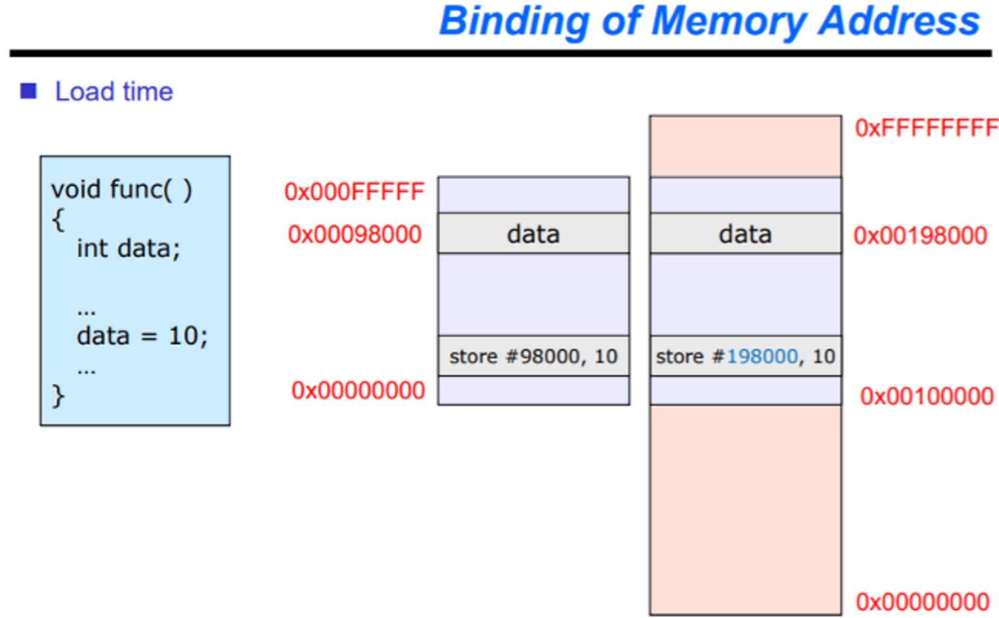

왼쪽이 logical address, 오른쪽 그림이 physical address

왼쪽 data는 0x00098000에, 오른쪽 data는 0x00198000에 있음.

만일 프로세스가 메모리 내에 어디로 올라오게 될지를 컴파일 시점에 알지 못하면 컴파일러는 일단 이진코드를 **재배치 가능 코드(relocatable code)**로 만들고 이후 실제 적재되는 시간 바인딩이 이루어지게 된다. 재배치 가능 코드는 시작 주소가 변경되면 아무 때나 사용자 코드를 다시 적재기만 하면 된다.

**문제점**

프로그램 안에서 사용하는 주소하고 physical memory에서 사용하는 주소를 분리 했으므로 프로그램은 physical memory 어디에서나 로딩되어 수행될 수 있음. 컴파일 타임 바인딩과 다르게 **multi-programming이 가능**하다.

하지만 multi-programming을 하면 메모리를 참조하는 명령어가 code segment에 매우 많기 때문에 이걸 다 physical memory로 변경해주려면 **메모리 로딩하는 시간이 오래 걸리는 문제**가 발생한다.


### 5.4 실행 타임 바인딩(Execution Time Binding)

> 실행할 때 바꾸는 방법

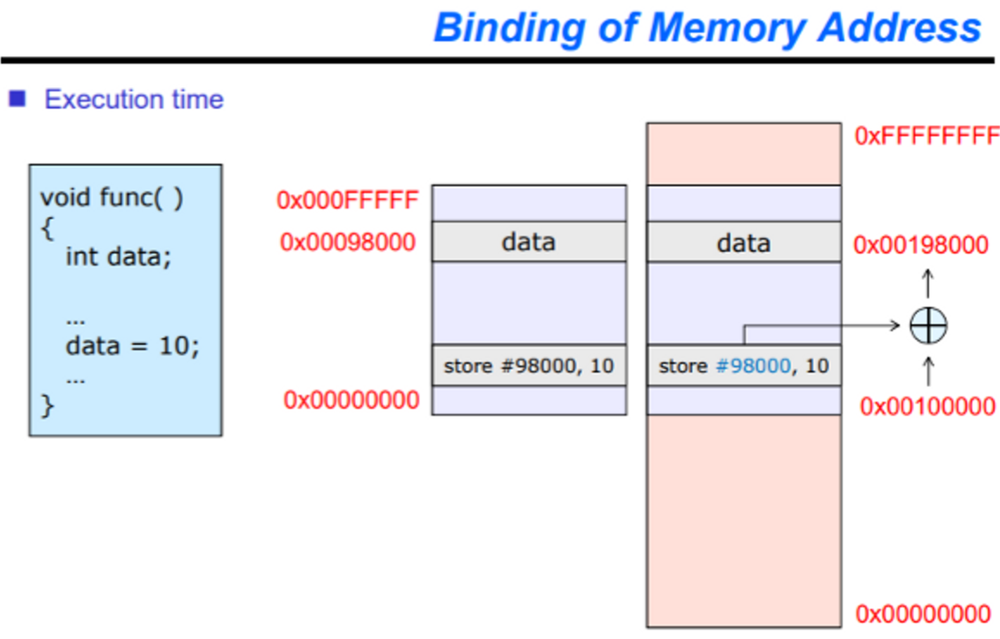

지금 프로그램이 위 그림안의 파란색 박스처럼 이렇게 코드가 짜여 있는데 이걸 컴파일을 해서 가운데에 있는 그림처럼 나왔습니다. 현재 0번지부터 상대적으로 98000번지에 data가 있는거고 98000번지에 있는 data를 실행하는 건데, 물리적 주소 10만번지에 로딩되어서 동작한다고 해봅시다.

이 명령어를 수행하는 순간 98000번지에다가 10을 저장해야하는대 지금 현재 98000은 실제로 198000에 있죠. **이 98000을 198000으로 명령어를 실행할 때 바꿔줘야 함**. 그렇다면 베이스 주소가 10만이면 0에서 10만으로 변경된거니까 98000에 10만을더해서 198000으로 만들면 됩니다.

문제는 이 명령어를 실행하기 위해서 **더하기를 실행**을 해야 하는데 이것은 특별한 하드웨어를 이용해야 합니다.  이 하드웨어가 바로 **MMU(memory management unit)**입니다.


### 5.5 로드 타임 바인딩과 실행 타임 바인딩의 차이점

**로드 타임 :** 메모리에 로딩할 때 이 작업을 미리 다 해놓는 것. 한번만 바꿔놓고 그 다음부터 계속 해당 주소로 access 하면 됨. 하지만 메모리 로딩시의 오버헤드가 너무 크기 때문에 사용하지 않음.

**실행 타임** : 프로그램을 실행해서 그 코드가 실행될 때마다 변환 반복 작업을 해줘야 함. 즉 그때그때 하는 것. 실행 타임은 loop를 매번돌아 변환 작업을 수행하지만 하드웨어 성능이 좋기 때문에 성능상 문제 없음.


## 6. 메모리 분할 방법의 필요성

메인 메모리느 다양한 프로그램은 물론 OS을 수용해야 한다. 따라서 가장 효율적인 방법으로 메인메모리를 할당해야 한다. 오래된 방법중 하나인 연속 메모리 할당에 대해 주로 살펴봅시다.

### 6.1 MMU

> CPU코어 안에 탑재되어 가상 주소를 실제 메모리 주소로 변환해주는 장치

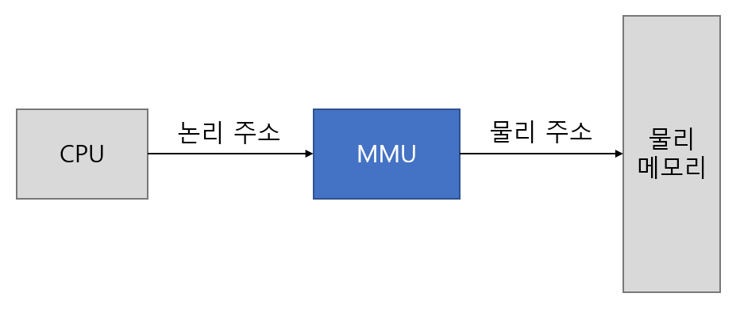

### 6.2 Contiguous allocation

> 논리 주소가 연속적이면 물리 주소도 연속적으로 배치된다

**장점**

- MMU가 매우 간단해 짐. 더하기만 하면 됨.
- memory protection fault 체크시 상한값만 체크해면 됨.

하지만 지금 시스템에는 쓰이지 않음.

### 6.3 memory protection

> 잘못된 메모리 번지를 참조하지 않도록 막아주는 것

ex)

실제 메모리 주소는 1000까지고 base memory가 400번지라고 가정. offset이 700라고 한다면, 우리가 갖고 있는 실제 메모리 주소 크기보다 벗어날 수가 있음.

**상한 레지스터(limit register)** 값보다 가상 주소 값이 크면 **memory protection fault**를 발생시킴


### 6.4 memory protection fault

CPU가 명령어를 수행하는 데 참조하려는 메모리 크기보다 큰 가상 주소를 참조하는 경우 이 명령어는 올바른 명령어가 아니기 때문에 운영체제에 도움을 요청한다.(interrupt)


## 7. 단편화

### 7.0 연속적 할당의 단점

여러가지 프로세스를 실행할 때, 프로세스를 연속적으로 할당하면 쪼개서 반은 아래에 놓고 반은 위에 놓고 할 수 없고 연속적으로 놔야 함.

**프로세스가 메모리가 아주 잘 사용되는 예**

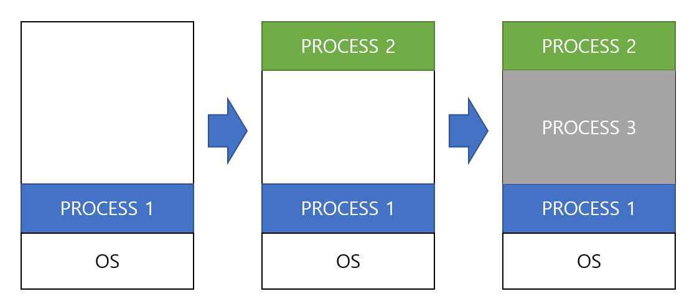

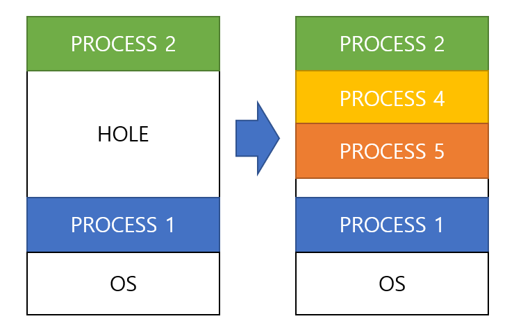

하지만 매번 이렇게 예쁘게 실행될 수 없음.


**나쁜 예**

이 상태에서 PROCESS1이 종료되었다고 해도 PROCESS6은 들어올 수 없음.

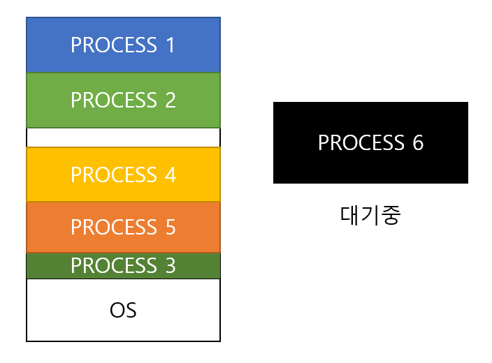

### 7.1 External Fragmentation

> ***Fragmentation?*** 
> 조각, 즉 메모리가 있지만 이런 조각 조각으로 나누어져 쓸 수 없는 상황.

메모리가 할당되고 해제되는 작업이 반복될 때 메모리 중간중간에 사용하지 않는 작은 메모리가 많이 존재해서 총 메모리 공간은 충분하지만 실제로 할당할 수 없는 문제를 external fragmentation, 외부 단편화라고 합니다.


### 7.2 Compaction

> ***Compaction?*** 
> 비어있는 공간을 연속적인 공간으로 만들고 움직이는 작업

3,4번을 밑으로 배치하고 2번을 위로 이동시켜 공간을 확보한 후 대기중인 프로세스를 넣어주면 됨.

하지만 2,3,4를 옮기기 위해서는 보조기억장치(하드디스크)에 복사해서 저장해야 하는데 하드디스크는 매우 느리기 때문에 실행 가능한 방법은 아님.

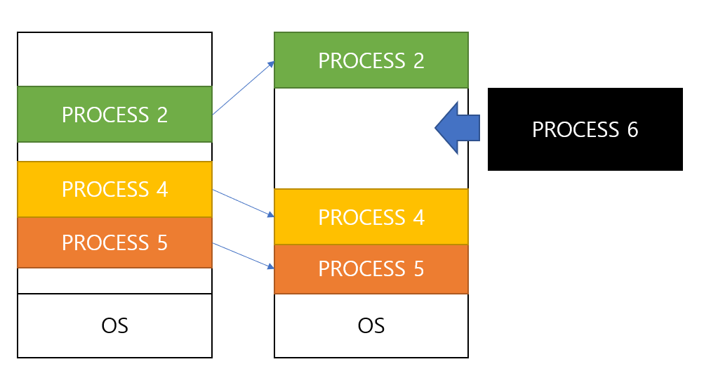


### 7.3 fit

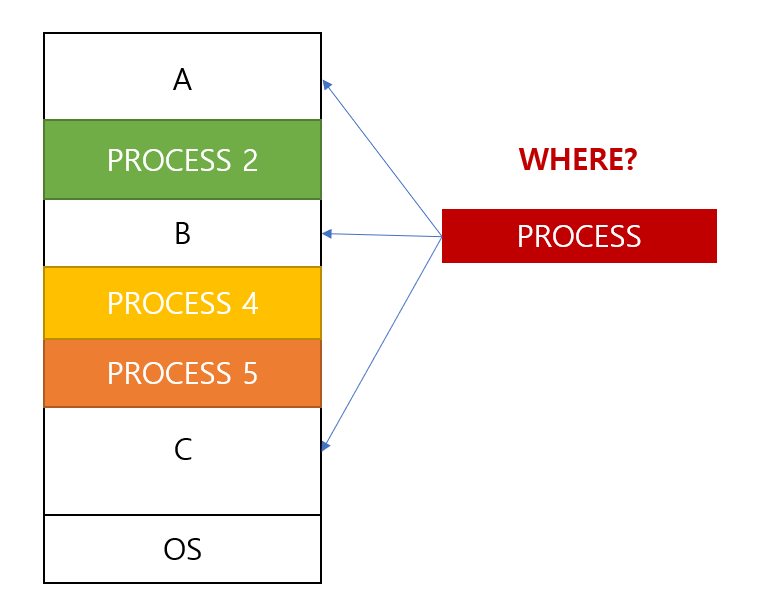

#### 7.3.1 first fit 최초적합

최초적합은 가장 최초로 발견되는 hole에다가 할당하는 것

남은 메모리를 순차적으로 앞에서부터 탐색하게 되는데, 이 프로세스가 들어갈 수 있는 hole들 중 최초에 발견된 hole에다가 배치하는게 최초적합입니다.

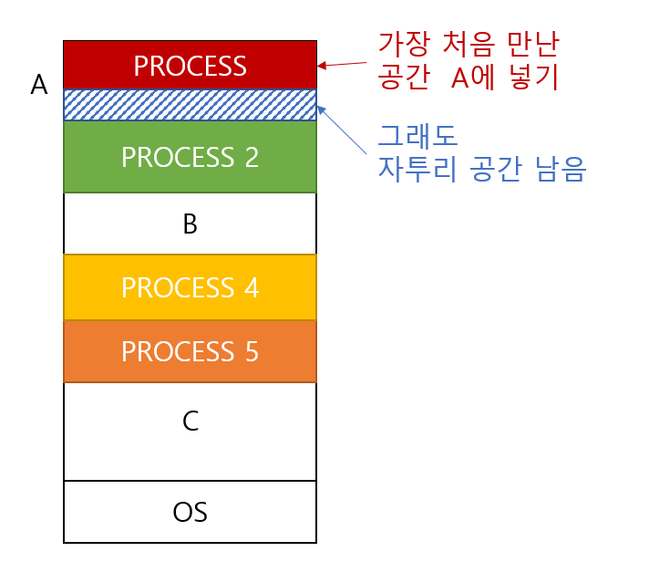

#### 7.3.2 best fit 최적적합

여기다 넣을지 여기다 넣을지를 다 대보는 겁니다. 가장 잘 맞는데에 넣는 것. 어차피 자투리가 생기는데 가급적이면 자투리를 조그맣게 만들겠다

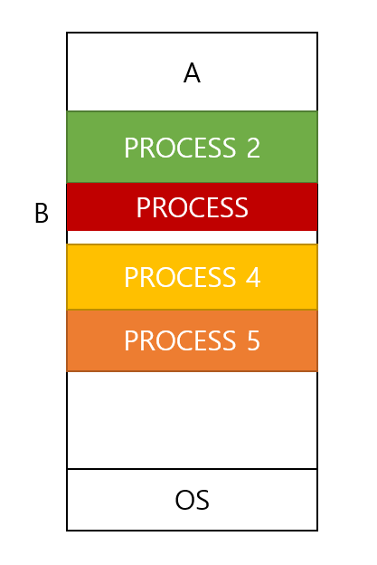

B에 넣는게 외부단편화가 가장 작게 생김. A랑 C는 빨간프로세스가 들어가기 쓸데없이 큼.

#### 7.3.3 worst fit 최악적합

가장 큰 공간, 즉 가장 남는 공간에다가 넣는게 worst fit입니다. 자투리를 크게 만들어야 공간이 충분히 남아서 동일한 빨간 프로세스가 더 들어갈 수 있겠다는 방식입니다.

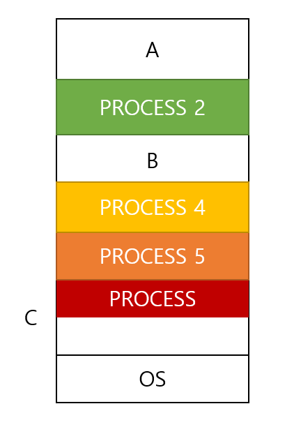

### 7.4 효율성 비교

first fit하고 best fit은 속도나 메모리사용률 측면에서 worst fit보다 좋은것으로 시뮬레이션에 나타났다.

first fit하고 best fit하고 비교를 해봤겠죠, 단순하게 생각하면 최적에 넣는게 제일 좋을 것 같지만 연구결과에 의하면 first fit이나 best fit이나 메모리 효율에 그렇게 차이가 없다고 나왔습니다.

그런데 알고리즘의 complexity를 생각해 볼 때 만약에 hole이 100개라고 가정하면 first-fit은 처음 만나는 hole에 넣으면 되지만 best-fit, worst-fit은 100번을 다 비교해봐야 합니다. 알고리즘적으로는 당연히 **first-fit의 성능이 우수**합니다.

### 7.5 50% rule

어떤 알고리즘을 쓰든지 결국 외부단편화는 발생합니다. 일단 값비싼 메모리를 낭비할 수 있다는 것 자체가 문제입니다. (물론 메모리 자투리가 남았을 경우 compaction으로 합치는 방법도 있지만 이 방법은, I/O problem을 야기한다고 했습니다)

first-fit 기준으로 한 통계에 의하면, N개의 블럭이 할당되었을 때 0.5개의 블록이 단편화때문에 손실될 수 있다고 합니다. 이건 기억장치의 3분의 1이 쓸 수 없게 된다는 거고(총 1.5중에 0.5가 손실), 이러한 현상을 **50퍼센트 규칙** 이라 불러요. (할당된게 N, 못쓰는게 0.5 비율은 50프로)

그 새로운 방법은 paging입니다.