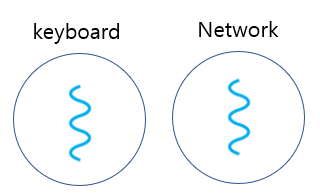
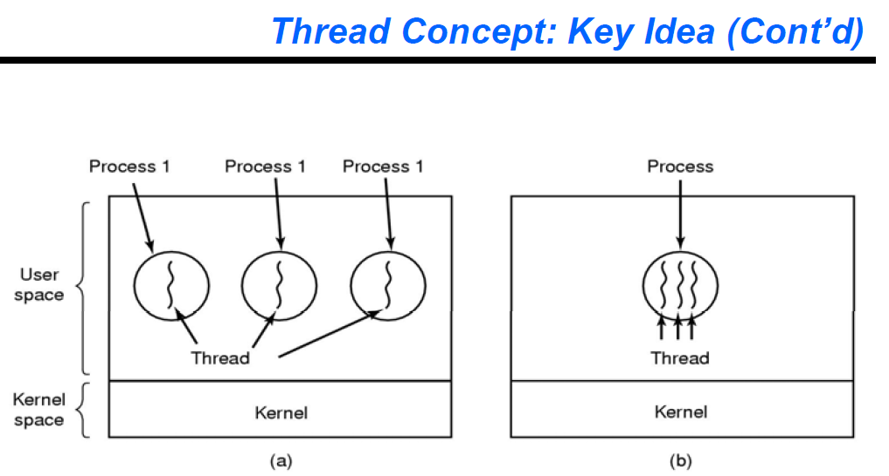
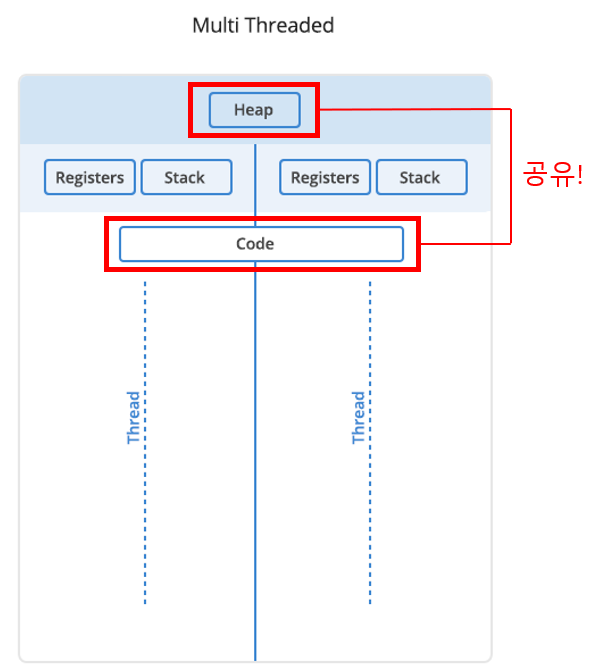

# 스레드

[TOC]

### 스레드가 필요한 배경

메신저 프로그램을 만든다고 가정

- 내가 키보드로 입력한 것을 화면에 출력
- 상대방이 입력한 것을 화면에 출력

내 키보드 cin해서 키보드 입력을 기다리는중, 사용자 A로부터 메세지 패킷이 네트워크로 도착했다고 가정. 이 패킷이 도착했음에도 불구하고 우리는 이를 받을 수 없는데, 왜냐하면 나로부터 입력을 받기 위해 cin이 기다리고 있기 때문.

프로그램은 위에서 아래로 흐르는 단 하나의 실행 path를 가지고 있기 때문임. 내가 cin을 완료해야 그 다음 코드로 넘어갈 수 있고 이것을 하나의 실행 path라고 함.

프로세스 하나당 path가 하나이기 때문에, path 하나로 소통이 안 되니 최소 두 개의 path가 필요하고, 스레드가 없었던 시절에는 이를 해결하기 위해서 프로세스를 추가로 생성함.

하지만 프로세스는 각각 독립된 자원 할당을 가지고 서로 공유하지 않음. 실행 path는 꼬불꼬불한 실로 표기하는데, 그림으로 표현하면 아래처럼 되어야 함. keyboard에서 내가 입력한 것, network로부터 입력받은 것 두 개 모두 화면에 출력할 수 있어야 함.

프로세스 사이에서 통신이 발생하기 때문에 shared memory로 구현을 하든 message passing으로 구현하든 IPC를 통할 수밖에 없게 됨. 프로그램이 커지고 시간이 지날수록 두 개의 프로세스를 만드는 것이 비효율적임을 깨달음.

프로세스를 하나 만든다는 것은 PCB도 하나 만들고, 실행하는 메모리 공간도 별도로 만들고, 프로세스간의 IPC 통신도 해야하고, context switching도 해야 하므로, 오버헤드가 많아진다는 것을 의미함.

그래서 같은 ‘채팅’이면, 비슷한 개념으로 프로세스 하나에 여러 흐름을 만들고 자원을 공유하는 방식을 사용하기로 함. 어차피 필요한 것은 여러 흐름일 뿐, 굳이 자원을 낭비하게 일을 크게 벌이지 말기로 함.

이렇게 하나의 프로세스에 흐름이 여러개인 형태이면(오른쪽 그림처럼) PCB도 하나이고, 메모리 공간도 하나이니 각 흐름끼리 데이터를 주고받을 때 커널이 중간에 껴서 IPC 통신을 안 해도 되고 여러가지 이점이 있었음. 이게 바로 스레드.

멀티 스레드에서는 스택과 레지스터는 독립적으로 가지고 있고, Code, Heap 데이터들은 공유하고 있음.

### 실제 스레드는 어떻게 사용되고 있는가?

워드프로세서 문서 작성을 하는 경우 가정

- 워드프로세스를 두개를 띄움 → 기본 프로세스가 두개가 띄워진 것.
- 키보드 입력 기다림
- 주기적으로 저장(자동저장)
- 타이핑한 것 에러 체크

이 전부를 하나의 프로세스로 실행하기 어려움. 프로세스를 하나하나 다 만들 수도 있지만 비효율적이기 때문에 thread를 생성하는 방식으로 처리함.

### 왜 스레드는 실이라는 이름이 붙었을까?

스레드를 만든 사람이 처음 책에다 스레드를 꼬불꼬불한 실 하나로 그림을 그리고 thread로 이름 붙였기 때문. 왜냐? 프로세스와 비교하기 위한 비유적 표현. 멀티 프로세스는 각각 독립적인데 실은 그림처럼 엉켜서 결과를 도출한다는 것. 프로세스와 스레드의 큰 차이는 자원을 공유하느냐 아니면 독립적이냐 차이로부터 도출됨.

### 스레드 정의

- 제어의 흐름을 의미하는 것으로 프로세스에서 실행의 개념만을 분리한 개념이다.
- 프로세스의 구성을 크게 제어의 흐름 부분(실행 단위)과 실행 환경 부분으로 나눌 때, 스레드는 프로세스의 실행 부분을 담당함으로써 실행의 기본 단위가 된다.

### 프로세스(PROCESS)와 쓰레드(THREAD) 차이/비교 정리

| 프로세스 (PROCESS)                                           | 쓰레드 (THREAD)                                              |
| ------------------------------------------------------------ | ------------------------------------------------------------ |
| 프로세스들은 헤비한 연산들이다.                              | 쓰레드는 가벼운 연산들이다                                   |
| 각 프로세스들은 각 고유의 메모리 공간을 가진다               | 쓰레드는 그들이 속한 프로세스의 자원을 공유한다.             |
| IPC(inter process communication) 통신은 각 프로세스들이 다른 메모리 주소를 가진만큼 느리다. | 쓰레드간 통신은 IPC보다 빠르다. 왜냐면 쓰레드는 프로세스에서 메모리를 공유하기 때문! |
| 컨텍스트 스위칭 (문맥교환)은 오버헤드가 크다. (비싸다)       | 프로세스 내의 쓰레드간 교체는 오버헤드가 덜하다.             |
| 프로세스들끼리는 메모리를 공유하지 않는다.                   | 쓰레드는 같은 프로세스에 있는 한 쓰레드끼리 메모리를 공유한다. |