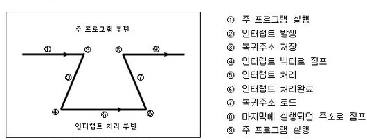

# 인터럽트

## 0. 인터럽트란?

프로그램을 실행하는 도중에 예기치 않은 상황이 발생할 경우 현재 실행 중인 작업을 즉시 중단하고, 발생된 상황에 대한 우선 처리가 필요함을 CPU에게 알리는 것

지금 수행 중인 일보다 더 중요한 일(ex. 입출력, 우선 순위 연산 등)이 발생하면 그 일을 먼저 처리하고 나서 하던 일을 계속해야한다.

외부/내부 인터럽트는 `CPU의 하드웨어 신호에 의해 발생`

소프트웨어 인터럽트는 `명령어의 수행에 의해 발생`

## 1. 인터럽트 종류

### 1.1 **외부 인터럽트**

입출력 장치, 타이밍 장치, 전원 등 외부적인 요인으로 발생

- 입출력 인터럽트 : 입출력 작업의 종료나 입출력의 오류에 의해 발생하는 인터럽트

- 전원이상 인터럽트 : 정전이나 전원공급의 이상으로 인해 발생하는 인터럽트

  파워 공급이 갑자기 떨어지면 이를 감지하고 CPU에 인터럽트를 걸어 갑자기 꺼져서 메모리가 날라가는 불상사를 막을 수 있음

- 기계 착오 인터럽트 : CPU의 기능적인 오류

- 외부 신호 인터럽트 : I/O 장치가 아닌 오퍼레이터나 타이머에 의해 의도적으로 프로그램이 중단된 경우. 예를 들어 무한루프를 도는 프로세스는 CPU가 명령어를 읽어서 실행하고 빠져나오지 못하고 계속 반복하고 있을 때. 10ms후에 timer interrupt가 걸리면 지금 현재 이 프로세스를 수행되고 있는 상태를 저장하고 timer interrupt 처리를 함. 그 다음 운영체제가 자기가 할 일 다 했으면 응용프로그램 실행시켜주는데 지금 현재 무한루프 도는 애가 있고 다른 프로그램이 있으면 이제 다른 애를 수행.

### 1.2 내부 인터럽트

Trap이라고 부르며, 잘못된 명령이나 데이터를 사용할 때 발생. **자기 자신한테 거는 interrupt를 exception이라고 함**

- 0으로 나누기가 발생, 오버플로우, 명령어를 잘못 사용한 경우 (Exception)

### 1.3 **소프트웨어 인터럽트**

프로그램 처리 중 명령의 요청에 의해 발생한 것 (SVC 인터럽트 : SuperVisor Call)

- 사용자가 프로그램을 실행시킬 때 발생
- 소프트웨어 이용 중에 다른 프로세스를 실행시키면 시분할 처리를 위해 자원 할당 동작이 수행된다.

application program에다가 누가 악의를 갖고 모든 디스크에 저장되어 있는 정보를 싹 다 지워버리라는 코드를 짰다고 가정. 즉 모든 코드가 내부에 접근하게 허락해주면 이거는 아주 큰 문제가 발생할 수 있음. supervisor를 두어 application이 직접 내부 접근 하는 것을 막을 수 있음. application에서 파일을 직접 읽고 쓰게 하는 것이 아닌 운영체제를 불러 수행하게 되는거죠. 그럼 application이 당연히 supervisor를 불러야 함. 이것이 바로 supervisor call 즉 SVC입니다. 이렇게 함으로써 I/O protection도 수행이 될 수 있음.

## 2. 인**터럽트 발생 처리 과정**

------

주 프로그램이 실행되다가 인터럽트가 발생했다.

현재 수행 중인 프로그램을 멈추고, 상태 레지스터와 PC 등을 스택에 잠시 저장한 뒤에 인터럽트 서비스 루틴으로 간다. (잠시 저장하는 이유는, 인터럽트 서비스 루틴이 끝난 뒤 다시 원래 작업으로 돌아와야 하기 때문)

만약 **인터럽트 기능이 없었다면**, 컨트롤러는 특정한 어떤 일을 할 시기를 알기 위해 계속 체크를 해야 한다. (이를 폴링(Polling)이라고 한다)

**폴링**을 하는 시간에는 원래 하던 일에 집중할 수가 없게 되어 많은 기능을 제대로 수행하지 못하는 단점이 있었다.

## 3. 폴링 VS 인터럽트

### 3.1 **폴링(Polling)**

> 하드웨어장치의 상태를 수시로 체크하여 명령을 받을 수 있는지를 확인하는 것을 말한다.

폴링을 하는동안에는 다른 프로세스에게 CPU를 양도하지 않고 하드웨어 장치가 동작을 완료하는 동안 계속 루프를 돌면서 하드웨어의 상태를 체크하게 된다. 하지만 하드웨어장치의 **속도는 매우 느리**게 때문에 CPU를 양도하지 않고 하드웨어장치의 상태를 계속 확인하는 것은 **CPU를 많이 낭비**하게 되는 것이다.

### 3.2 **인터럽트(Interrupt)**

> CPU가 프로그램을 실행하는 중에 I/O 하드웨어장치나 다른 예외 상황의 발생으로 인해 특별한 처리가 필요할 때 CPU에 이를 알려 처리하도록 하는 것을 말한다.

운영체제는 디바이스를 폴링하는 대신에 **I/O를 요청한 프로세스를 블록시키고 CPU를 다른 프로세스에게 양도**한다. 장치가 작업을 끝마치면 하드웨어 인터럽트를 발생시키고 CPU는 운영체제가 미리 정의해 놓은 인터럽트서비스루틴(ISR) 또는 인터럽트핸들러(Interrupt Handler)를 실행한다. 인터럽트핸들러는 입출력요청, I/O를 대기중인 프로세스 깨우기 등을 하여 프로세스가 작업을 계속할 수 있도록 한다.

인터럽트 방식은 하드웨어로 지원을 받아야 하는 제약이 있지만, 폴링에 비해 신속하게 대응하는 것이 가능하다. 따라서 **실시간 대응**이 필요할 때는 필수적인 기능이다.

즉, 인터럽트는 **발생시기를 예측하기 힘든 경우에 컨트롤러가 가장 빠르게 대응할 수 있는 방법**이다.