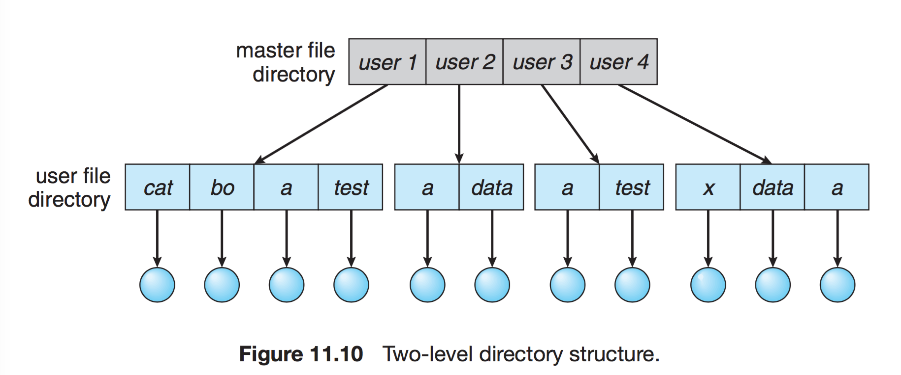
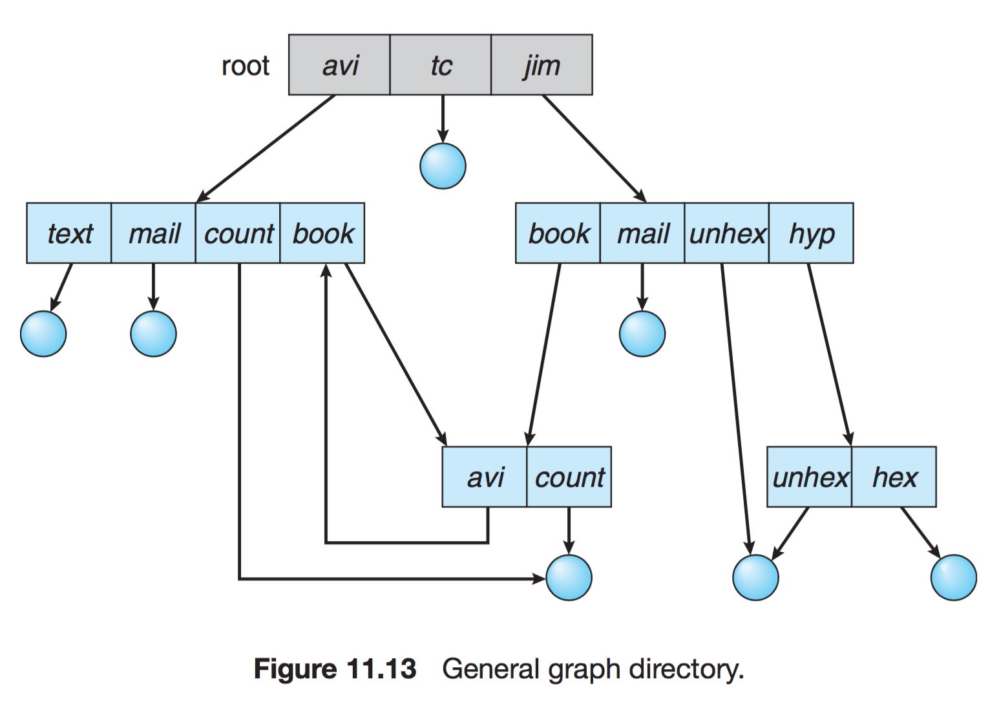

# 파일 시스템

[TOC]

## 1. 개요

> 컴퓨터에서 파일이나 자료를 쉽게 발견할 수 있도록, 유지 및 관리하는 방법이다.
>
> 저장매체에는 수많은 파일이 있기 때문에, 이런 파일들을 관리하는 방법을 말한다.

### 1.1 특징

- 커널 영역에서 동작
- 파일 CRUD 기능을 원활히 수행하기 위한 목적
- 계층적 디렉터리 구조를 가짐
- 디스크 파티션 별로 하나씩 둘 수 있음

### 1.2 역할

- 파일 관리
- 보조 저장소 관리
- 파일 무결성 메커니즘
- 접근 방법 제공

### 1.3 개발 목적

- 하드디스크와 메인 메모리 속도차를 줄이기 위함
- 파일 관리
- 하드디스크 용량 효율적 이용

### 1.4 구조

- 메타 영역 : 데이터 영역에 기록된 파일의 이름, 위치, 크기, 시간정보, 삭제유무 등의 파일 정보
- 데이터 영역 : 파일의 데이터

## 2. 접근 방법

파일에 접근하여 데이터를 읽는 방법

### 2.1 순차 접근(Sequential Access)

> 가장 간단한 접근 방법으로, 파일의 정보가 레코드 순서대로 차례차례 처리된다.
> 대부분 연산은 read와 write

현재 위치를 가리키는 포인터에서 읽기/쓰기 시스템 콜이 발생할 경우 포인터를 앞으로 보내면서 read와 write를 진행. 뒤로 돌아갈 땐 지정한 offset만큼 되감기를 해야 한다. (테이프 모델 기반)

### 2.2 직접 접근(Direct Access)

> 특별한 순서 없이, 빠르게 레코드를 read, write 가능

현재 위치를 가리키는 cp 변수만 유지하면 직접 접근 파일을 가지고 순차 파일 기능을 쉽게 구현이 가능하다. 

무작위 파일 블록에 대한 임의 접근을 허용한다. 따라서 순서의 제약이 없음.

대규모 정보를 접근할 때 유용하기 때문에 '데이터베이스'에 활용된다.

### 2.3 기타 접근

> 직접 접근 파일에 기반하여 색인을 구축. 크기가 큰 파일을 입출력 탐색할 수 있게 도와준다.

크기가 큰 파일을 입출력 탐색할 수 있게 도와주는 방법임

## 3. 디렉터리와 디스크 구조

### 3.1 저장장치의 구조

범용 컴퓨터 시스템은 다수의 저장장치를 가지고 그장치들은 파일 시스템을 저장할 수 있는 볼륨으로 분할된다. 파일 시스템이 없을 수도 있으며, 다양한 종류의 파일 시스템을 가질 수도 있다.

- **볼륨** : 파일 시스템을 포함하고 있는 임의의 개체, 각 볼륨을 논리적인 가상 디스크로 취급될 수 있다. 하나 이상의 운영체제를 저장하고 부팅, 실행시킬 수 있다. 섹터들의 집합으로 연속 공간이 아니어도 볼륨으로 볼 수 있다.
- **디바이스 디렉터리** : 그 볼륨에 있는 모든 파일에 대한 이름, 위치, 크기, 타입과 같은 정보를 기록한다.
- **파티션** : 연속된 저장 공간을 하나 이상의 연속되고 독립적인 영역으로 나누어서 사용할 수 있도록 정의한 규약

### 3.2 디렉터리 개관

> ***디렉터리?***
> 디렉터리(Directory)는 파일의 메타데이터 중 일부를 보관하고 있는 일종의 특별한 파일이다. 해당 디렉터리에 속한 파일 이름과 속성들을 포함하고 있고, 다음과 같은 기능들을 제공한다.

- 파일 찾기(Search)
- 파일 생성(Create)
- 파일 삭제(Delete)
- 디렉터리 나열(List)
- 파일 재명명(Rename)
- 파일 시스템 순회(Traverse)

### 3.3 1단계 디렉터리

> 가장 간단한 구조의 디렉터리

파일이 많아지거나 다수의 사용자가 사용할 경우 심각한 제약이 따른다.

파일들은 서로 유일한 이름을 가짐. 서로 다른 사용자라도 같은 이름 사용 불가

### 3.4 2단계 디렉터리

> 사용자에게 개별적인 디렉터리 만들어 줌

- UFD : 자신만의 사용자 파일 디렉터리. 비슷한 구조를 가지고 있지만 오직 한 사용자만의 파일을 저장.
- MFD : 사용자 이름과 계정번호로 색인되어 있는 디렉터리. 각 엔트리는 사용자의 UFD를 가리킨다.

특정한 파일을 참조할 시 사용자의 UFD에서만 탐색하므로 파일 이름이 충돌하는 문제가 사라진다.

다른 사용자의 파일에 접근해야 하는 경우는 단점이 된다.

### 3.5 트리 구조 디렉터리

> 2단계 구조 확장된 다단계 트리 구조

말 그대로 트리의 형태를 띄는 디렉터리 구조다.

하나의 루트 디렉터리와 여러 개의 서브 디렉터리로 구성되어있다.

각 디렉터리에는 파일과 서브 디렉터리가 존재한다. 우리가 흔히 사용하는 폴더 안에 폴더나 파일이 들어있는것을 생각하면 이해가 편하다.

트리 구조 디렉터리는 디렉터리의 생성과 제거가 비교적 용이하다.

디렉터리 탐색은 포인터를 이용하고, 경로명은 **절대 경로명**과 **상대 경로명**이 있다.

절대 경로명은 루트에서부터 가리킨 파일까지 모든 경로를 지정하는것이고, 상대 경로명은 현재 디렉터리의 위치를 기준으로 목적하는 파일까지의 경로를 지정하는것이다.

### 3.6 비순환 그래프

트리 구조 디렉터리를 확장한것이다.

트리 구조 디렉터리에서는 디렉터리간 파일이나 서브 디렉터리의 공유를 금지한 반면, 비순환 그래프 디렉터리에서는 디렉터리간에 파일이나 **서브 디렉터리의 공유가 가능**하다. 이는 한 폴더에 다른 폴더에 있는 파일이나 폴더의 **바로가기**를 생성한것을 생각하면 이해가 편하다.

여기서 일어나는 공유는 복사의 개념이 아니다. 한 디렉터리에서 공유한 파일이나 폴더에 수정이 일어나면 다른 디렉터리에서도 해당 파일이나 디렉터리의 변화를 볼 수 있다.

디렉터리 구조가 복잡하고, 공유된 하나의 파일에 대해 두번 이상 탐색될 수 있기 떄문에 시스템 성능이 저하될 수 있다.

그리고 한 디렉터리에서 공유된 파일을 삭제할 경우, 고아 포인터가 발생하는데, 이는 바로가기를 눌렀을 때 해당 파일이 없다는 문구가 뜨는것을 생각하면 이해가 쉽다. 

### 3.7 일반 그래프 디렉터리

> 트리 구조에 링크를 더해 순환을 허용하는 그래프 구조이다.

디렉터리와 파일 공유에 대해 융통성이 있고, 탐색 알고리즘이 간단해 파일과 디렉터리에 대한 엑세스가 쉽다.

디렉터리에서 순환이 허용되는 경우 무한 루프에 빠질수도 있다. 따라서 순환이 발생하지 않도록 하위 디렉터리가 아닌 파일에 대한 링크만 허용하거나 가비지 컬렉션을 이용하여 전체 파일 시스템을 순회하고, 접근 가능한 모든 것을 표시한다.

일반 그래프 디렉터리는 마지막 참조가 끝났음에도 메모리를 재할당 할 수 있는지 결정하는 **쓰레기 수집**(Garbage Collection)이 필요하다. 쓰레기 수집은 전 파일 시스템을 탐색해 엑세스할 수 있는 파일에 표시하고, 두번째 탐색에서는 표시하지 않은 메모리를 사용 가능 메모리 리스트에 추가하는 것이다.

