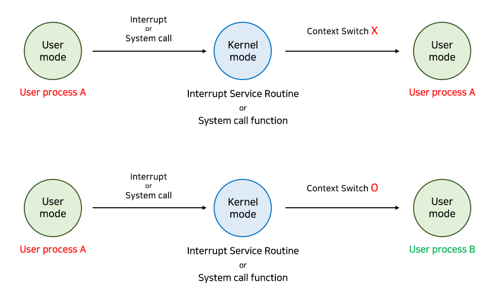

# 프로세스


[TOC]


# 0. 프로세스란?

*An instance of a program in execution*

| 💡 실행중인 프로그램의 하나의 인스턴스 하나의 프로그램이 여러 프로세스가 될 수 있다. |
| ------------------------------------------------------------ |


**Program :** 실행 파일로, 파일 시스템으로 존재하는 것 (ex. 크롬실행 파일)

**Process :** 실행을 해서 실행되고 있는 주체 (ex. 크롬 창 여러개 만들 수 있음. 각각이 하나의 프로세스)

- 실행 파일을 누르면 CPU에 올라가서 실행되는 하나의 인스턴스를 프로세스라고 함.
- 다양한 프로세스가 존재할 수 있음. 하나의 창도 프로세스이지만 프린트를 눌렀을 땐 프린트 작업이 CPU에 올라가서 수행됨. 하나의 인스턴스이므로 프로세스이다.
- **PID : Process ID**. alt + ctrl + delete 후 작업 관리자에서 실행 중인 프로세스와 PID 확인 할 수 있음.

# 1. 프로세스 주소 공간 (메모리 구조)

앞에서 프로세스를 다루면서, 우리는 프로세스에 대해 **운영체제가 자원을 할당하는 단위** 라고 언급했었다.

프로세스가 메모리를 할당 받으면, 자신만의 방법으로 메모리를 관리하기 위해 이 공간들을 어떤 구조로 관리하는데, 우리는 이를 **프로세스 주소 공간**이라고 부른다.

결국 메모리는 한정되어 있기 때문에, 프로세스는 다양한 방법으로 메모리를 절약하려고 시도한다.


프로세스 주소 공간에는 코드, 데이터, 스택으로 이루어져 있다.

- **Code** : 코드 자체를 구성하는 메모리 영역(프로그램 명령)

- **Data**

   : 전역변수, 정적변수, 배열 등

  - 초기화 된 데이터는 data 영역에 저장
  - 초기화 되지 않은 데이터는 bss 영역에 저장

- **Heap** : 동적 할당 시 사용 (new(), malloc() 등)

- **Stack** : 지역변수, 매개변수, 리턴 값 (임시 메모리 영역)

| 💡 Code 영역은 기계어 코드가 들어있으니 다른 구역과 너무 다르고, Heap 영역은 런타임에 크기가 결정되는 영역이다.<br/>그렇다면 Stack 영역과 Data 영역을 구분한 이유는 무엇일까? 가장 큰 이유는 역할의 분배이다.<br/>프로그램의 함수와 지역 변수는, LIFO(가장 나중에 들어간게 먼저 나옴)특성을 가진 스택에서 실행된다.<br/>따라서 이 함수들 안에서 공통으로 사용하는 '전역 변수'는 따로 지정해주면 메모리를 아낄 수 있다. |
| ------------------------------------------------------------ |


- Text (Code) 영역
  - 프로그램이 실행될 수 있도록 CPU가 해석 가능한 기계어 **코드가 저장되어 있는 공간**으로, 프로그램이 수정되면 안 되므로 ReadOnly 상태로 저장 되어있다.
- Data 영역
  - ***전역 변수나 Static 변수*** 등 프로그램이 사용할 수 있는 **데이터를 저장하는 영역**이다.
  - 어떤 프로그램에 전역/static 변수를 참조하는 코드가 존재한다면, 이 프로그램은 컴파일 된 후에 data 영역을 참조하게 된다.
  - 프로그램의 시작과 함께 할당되며, 프로그램이 종료되면 소멸한다.
  - 단, *초기화 되지 않은* 변수가 존재한다면, 이는 (그림에는 표현되지는 않았지만 BSS 영역에 저장된다.)
- Heap 영역
  - **런타임에 크기가 결정되는** 영역이다.
  - 사용자에 의해 공간이 **동적으로 할당 및 해제**된다.
  - 주로 참조형 데이터 (ex. 클래스) 등의 데이터가 할당된다.
  - 메모리의 낮은 주소에서 높은 주소의 방향으로 할당된다.
- Stack 영역
  - 함수의 호출과 관계되는 ***지역 변수와 매개변수***가 저장되는 영역이다.
  - Stack 영역의 값은 함수의 호출과 함께 할당되며, 함수의 호출이 완료되면 소멸한다.
  - 메모리의 높은 주소에서 낮은 주소의 방향으로 할당된다.
  - 재귀 함수가 너무 깊게 호출되거나 함수가 지역변수를 너무 많이 가지고 있어 stack 영역을 초과하면 stack overflow 에러가 발생한다.

### 참고

https://jhnyang.tistory.com/6

https://jhnyang.tistory.com/32


# 2. 프로세스 상태

프로세스의 상태는 프로세스가 실행됨에 따라 달라진다.

1. New : 프로세스가 처음 생성된 상태
2. Ready : 프로세스가 CPU에 할당되기를 기다리는 상태 (메모리 등 다른 조건을 모두 만족하고)
3. Running : 프로세스가 할당되어 CPU를 잡고 명령을 수행 중인 상태
4. Waiting : 프로세스가 어떠한 이벤트가 발생하기를 기다리는 상태. CPU를 할당해도 당장 명령을 수행할 수 없는 상태
5. Terminated : 프로세스가 실행을 마쳤을 때. 아직 완전히 프로세스가 제거되진 않은 상태

즉 new와 terminated 상태는 운영체제가 프로세스를 만들거나 종료시킬 때 임시적으로 있는 state이고, 이외의 3개의 상태(running, waiting, ready)가 돌아가면서 프로세스 수행이 되는 것.


### 참고

https://jhnyang.tistory.com/7


# 3. PCB(Process Control Block), Context Switching, Overhead

### 3. 1 Process Control Block

> 프로세스 단위로 정보를 저장해주는 Block

🍀 운영체제가 프로세스를 제어하기 위해 정보를 저장해 놓는 곳으로, 프로세스의 상태 정보를 저장하는 구조체이다.

🍀 프로세스 상태 관리와 문맥교환(Context Switching)을 위해 필요하다.

🍀 PCB는 프로세스 생성 시 만들어지며 주기억장치에 유지된다.


**컴퓨터는 어떻게 많은 일을 동시에 할 수 있을까?**

time sharing이라고 해서 동시에 처리하는 게 아니라 짧은 시간 동안 번갈아가면서 처리해주는 것인데 운영체제가 이를 가능하게 해줌.

프로세스들이 교체되면서 수행되고 나면 다른 프로세스를 불러와야 하는데, 이는 **이전 작업에 대한 내용을 기억하고 있다**는 것. 프로세스를 단위로 정보를 저장해주는 블록이 바로 PCB.

| 💡 운영체제는 하드웨어를 효율적으로 동작하게 하는 소프트웨어<br />프로세스가 만들어지면 그 프로세스에 저장되어야 할 데이터들을 하나의 structure로 만들어 놓은 것을 뜻함. 이러한 블럭들이 있어서 스위칭 되어도 기억하고 이어서 실행할 수 있음 |
| ------------------------------------------------------------ |


### 3.2 PCB 저장 정보


### 3.3 Context Switching

> **Context Switch(문맥 교환)**은 프로세스가 실행되다가 인터럽트가 발생해 CPU를 한 프로세스에서 다른 프로세스로 넘겨주는 과정

운영체제는 CPU를 내어주는 프로세스의 상태를 그 프로세스의 PCB에 저장하고, CPU를 새롭게 얻는 프로세스의 상태를 PCB에서 읽어온다.즉, CPU입장에서 Context는 PCB이기 때문에 PCB 정보가 바뀌는 것이 Context Switch이다.

다만, 시스템 콜이나 인터럽트가 발생한다고 반드시 Context Switch가 일어나는 건 아니다. 다른 프로세스에 프로세서가 넘어가야 Context Switch이다.



위의 경우에도 CPU 수행 정보 등 context의 일부를 PCB에 저장해야 하지만, context switch의 overhead가 훨씬 크기 때문에 아래의 경우가 overhead가 더 크다.


### 3.4 Context Switching의 OverHead란?

overhead는 과부하라는 뜻으로 보통 안좋은 말로 많이 쓰인다.

하지만 프로세스 작업 중에는 OverHead를 감수해야 하는 상황이 있다.

```
프로세스를 수행하다가 입출력 이벤트가 발생해서 대기 상태로 전환시킴 이때, CPU를 그냥 놀게 놔두는 것보다 다른 프로세스를 수행시키는 것이 효율적
```

즉, CPU에 계속 프로세스를 수행시키도록 하기 위해서 다른 프로세스를 실행시키고 Context Switching 하는 것

CPU가 놀지 않도록 만들고, 사용자에게 빠르게 일처리를 제공해주기 위한 것이다.


### 참고

https://rebro.kr/172?category=504670