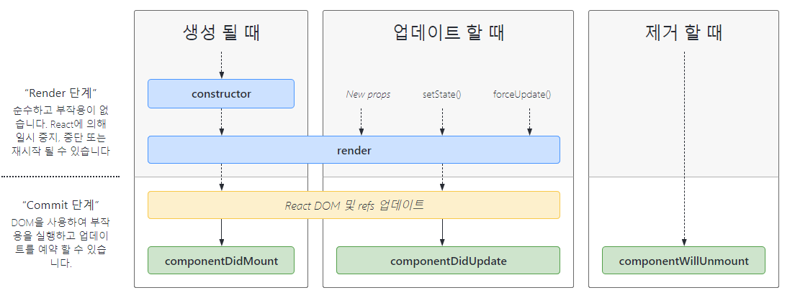
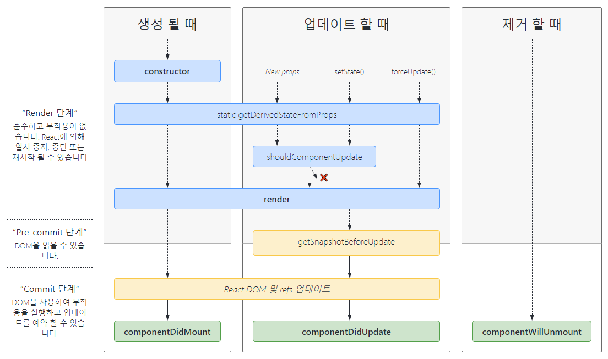

# React LifeCycle 

 💡 라이프사이클이란 컴포넌트의 생명주기이고 생성부터 실행, 업데이트, 종료 과정까지를 말합니다. 라이프사이클 메서드는 이때 호출되는 메서드를 말합니다.

리액트은 컴포넌트 기반의 View를 중심으로 한 라이브러리이며 각각의 컴포넌트에는 `라이프사이클`, 즉 `컴포넌트 생명 주기`가 존재한다.

이것은 프로그램이 실행되고 종료되는 과정을 말한다.

> Mount(탄생) > Update, Re-render(변화) > Unmount(죽음)

## Mount

DOM이 생성되고 웹 브라우저 상(화면)에 나타남.

다음의 메서드들이 차례로 호출됨.

- `constructor` : 컴포넌트를 새로 만들 때마다 호출되는 클래스 생성자 메서드
- `getDerivedStateFromProps` : props에 있는 값을 state에 넣을 때 사용하는 메서드
- `render` : 우리가 준비한 UI를 렌더링하는 메서드
- `componentDidMount` : 컴포넌트가 웹 브라우저 상에 나타난 후 호출하는 메서드

## Update, Re-render

사용자 화면에 View를 다시 새롭게 보여준느 것

Virtual DOM에서 변경된 혹은 업데이트된 내용을 이전 값과 비교해서 변경된 값을 다시 렌더링해주는 것을 의미(DOM 트리 업데이트)

> *이것을 “업데이트 과정을 거친다.” 또는 “조화 과정을 거친다”라고 표현*

### 컴포넌트 상태가 변하는 경우?

1. props가 바뀔 때
2. state가 바뀔 때
3. 부모 컴포넌트가 리렌더링 될 때
4. this.forceUpdate로 강제로 렌더링을 트리거할 때

### 1, 2, 3이 발생하면 다음과 같은 순서로 메서드가 호출됨

1. `props 변경, state 변경, 부모 컴포넌트 리렌더링`
2. `getDerivedStateFromProps` : 마운트에서도 호출되는 메서드. props의 변화에 따라 state에도 변화를 주고 싶을 때 사용
3. `shouldComponentUpdate` : 컴포넌트가 리렌더링을 해야 할 지 말아야 할 지 결정한다. true, false 값을 반환해야 하며, false를 반환하면 작업을 중지하고 컴포넌트가 리렌더링 되지 않는다.
4. `render` : 컴포넌트를 리렌더링한다. this.forceUpate 함수를 호출하면 앞의 과정을 생략하고 바로 render 함수를 호출한다.
5. `getSnapshotBeforeUpdate` : 컴포넌트 변화를 DOM에 반영하기 직전에 호출한다.
6. `componentDidUpdate`: 컴포넌트의 업데이트 작업이 끝난 후 호출한다.

## Unmount

DOM에서 제거되어 화면에서 사라짐

### Unmount 할 때 호출되는 메서드

- `componentWillUnmount`: 컴포넌트가 웹 브라우저 상에서 사라지기 전에 호출하는 메서드

> *컴포넌트의 수명은 보통 페이지에서 렌더링되기 전인 준비 과장에서 시작하여 페이지에서 사라질 때 끝이 난다.*

### 자세히

