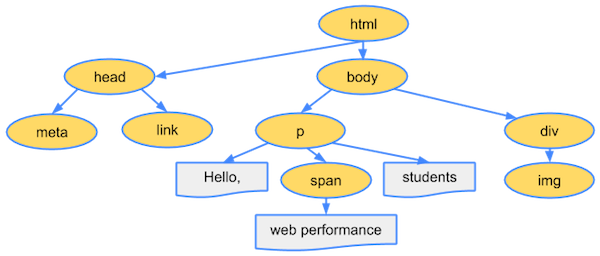
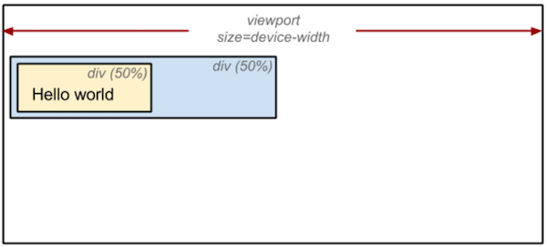

# 브라우저

브라우저는 웹 페이지에 필요한 리소스를 내려받고 해석한 다음 여러 계산 과정을 거쳐 콘텐츠를 화면에 보여준다. 크게 **다운로드, 파싱, 스타일, 레이아웃, 페인트, 합성**으로 나뉜다.

## **1. 파싱**

브라우저에서 웹 페이지를 로드하면 가장 먼저 HTML 파일을 다운로드한다. 파싱은 다운로드한 HTML을 해석하여 **DOM 트리**를 구성하는 단계이다. 파싱 중 `<script />`, `<link />`, ``를 발견하면 각 리소스를 요청하고 다운로드한다. HTML 또는 리소스에 CSS가 포함된 경우에는 **CSSOM 트리** 구성 작업도 함께 진행한다.

DOM 트리 및 CSSOM 트리가 구성되는 방법은 다음과 같다.

### **DOM 트리 구성**

```html
<html>
  <head>
    <meta name="viewport" content="width=device-width,initial-scale=1">
    <link href="style.css" rel="stylesheet">
    <title>Critical Path</title>
  </head>
  <body>
    <p>Hello <span>web performance</span> students!</p>
    <div></div>
  </body>
</html>
```



다음과 같은 HTML 파일이 있다고 가정한다. 파싱이 일어나면 HTML을 해석해 DOM을 생성한 후, 각 DOM 객체를 트리 데이터 구조로 연결해 부모-자식 관계를 갖도록 만든다. `<body>`, `<p>`, `<div>` 등 각 태그가 DOM 트리의 노드로 생성되고 자식 노드를 참조한다.

### CSSOM 트리 구성

```html
body { font-size: 16px }
p { font-weight: bold }
span { color: red }
p span { display: none }
img { float: right }
```


위 예제에서 `style.css`처럼 외부 스타일시트 파일이나 내부 스타일시트가 포함되어 있을 경우, CSS를 해석해 CSSOM 트리를 구성한다. `body`, `p`, `span` 등 선택자가 노드로 생성되고 각 노드는 스타일을 참조한다.

## 2. 스타일

스타일 단계에서는 파싱 단계에서 생성된 DOM, CSSOM 트리를 가지고 스타일을 매칭시켜주는 과정을 거쳐 렌더 트리를 구성한다. 아래 이미지는 파싱 단계에서 설명한 DOM 트리와 CSSOM 트리를 조합해 렌더 트리가 구성되는 과정을 보여준다.


## 3. 레이아웃

레이아웃 단계에서는 노드의 정확한 위치와 크기를 계산한다. 노드의 정확한 크기와 위치를 파악하기 위해 루트부터 노드를 순회하면서 계산하고, 레이아웃 결과로 각 노드의 정확한 위치와 크기를 픽셀값으로 렌더트리에 반영한다. 아래는 레이아웃 전/후 과정을 보여준다. 만약 CSS에서 크기 값을 %로 지정하였다면, 레이아웃 단계를 거친 후 % 값은 계산되고 측정 가능한 픽셀 단위로 변환된다.

### 레이아웃 전



### 레이아웃 후


## 4. 페인트

이전 레이아웃 단계에서 계산된 값을 이용해 렌더트리의 각 노드를 화면상의 실제 픽셀로 변환한다. 이때 위치와 관계없는 CSS 속성(색상, 투명도 등)을 적용한다. 그리고 픽셀로 변환된 결과는 포토샵의 레이어처럼 생성되어 개별 레이어로 관리된다. 단, 각각의 엘리먼트가 모두 레이어가 되는 것은 아니다. [transform](<https://developer.mozilla.org/ko/docs/Web/CSS/transform>) 속성 등을 사용하면 엘리먼트가 레이어화 되는데, 이 과정을 페인트라고 한다.

## 5. 합성 & 렌더

페인트 단계에서 생성된 레이어를 합성하여 스크린을 업데이트한다. 합성과 렌더 단계가 끝나면 화면에서 웹 페이지를 볼 수 있다.

### 출처

https://ui.toast.com/fe-guide/ko_PERFORMANCE#브라우저의-로딩-과정