[TOC]


# Model Relationship I : Article - Comment

## 1. Foreign Key

- Foreign Key 개념
  - 왜래 키(외부 키)
  - 관계형 데이터베이스에서 한 테이블의 필드(컬럼) 중 다른 테이블의 행을 식별할 수 있는 키
  - 참조하는 테이블에서 1개의 키(속성 또는 속성의 집합)에 해당하고, 이는 참조되는 측 테이블의 기본 키(pk) 를 가리킴
  - 참조하는 테이블의 행 여러개가, 참조되는 테이블의 동일한 행 참조할 수 있음.

  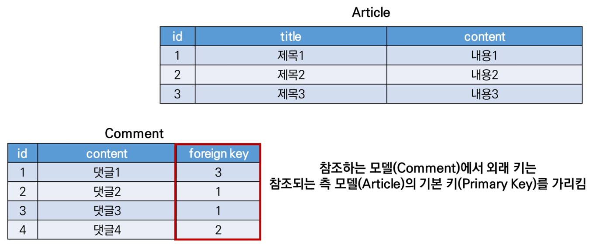

  ​	1번 게시글에는 댓글 2, 댓글 3이 작성됨

  ​	2번 게시글에는 댓글 4이 작성됨

  ​	3번 게시글에는 댓글 1이 작성됨

  

- Foreign Key 특징

  - 참조무결성 : 키 사용하여 부모 테이블의 유일한 값 참조
  - 외래 키의 값이 반드시 부모 테이블의 기본 키일 필요는  없지만 유일한 값이어야 함

  - 


- **Foreign Key** filed

  - 1 : N 

  - 2개의 위치인자 반드시 필요

    1. 참조하는 model class
    2. on_delete 옵션

  - migrate 작업 시 필드 이름에 _id 추가하여 데이터베이스 열 이름을 만듦

  -  [참고] 재귀 관계 (자신과 1: N) : 대댓글

    `models.ForeignKey('self', on_delete=models.CASCADE)`

  - comment 모델 정의하기

    ```python
    # articles/models.py
    class Comment(models.Model):
        article = models.ForeignKey(Article, on_delete=models.CASCADE)
        content = models.CharField(max_length=200)
        created_at = models.DateTimeField(auto_now_add=True)
        updated_at = models.DateTimeField(auto_now=True)
        
        def __str__(self):
            return self.content
    ```

    - `python manage.py makemigrations`
    - `python manage.py migrate`
    - db : articles_comment 테이블의 외래 키 컬럼 확인(필드에 _id 추가됨)
    - 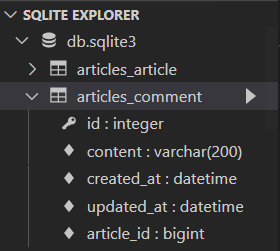
    - 명시적인 모델 관계 파악을 위해 참조하는 클래스 이름의 <u>소문자(단수형)로 작성</u>하는 것이 바람직함(1: N)


- **Foreign Key** arguments - `on_delete`

  - 원글 삭제되었을 때 댓글 처리

  - 외래  키가 참조하는 객체가 사라졌을 때 외래 키를 가진 객체를 어떻게 처리할 지를 정의

  - Database Integrity(데이터 무결성)을 위해서 매우 중요한 설정

  - 사용 가능한 값들 : 

    - CASCADE : 부모 객체(참조된 객체)가 삭제되었을 때 이를 참조하는 객체도 삭제

    - 나머지 참고만:
      - PROTECT : 게시글 있으면 USER 삭제 안 됨
      - SET_NULL : USER 삭제 되면 게시글 NULL로 바꿈
      - SET_DEFAULT : 탈퇴한 유저의 글입니다
      - SET() : 삭제 되었을 때 setting해서 특정
      - DO_NOTHING : 아무 것도 안 됨
      - RESTRICT (3.1부터 생김^^) : 제한적으로 삭제 막기


- 댓글 생성 연습하기 

  - `$ python manage.py shell_plus`

  - 댓글 생성 시도 

    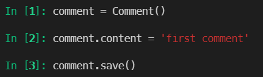

  - 에러 확인 : articles_comment 테이블의 ForeignKehyField, article_id 값 누락되었기 때문

    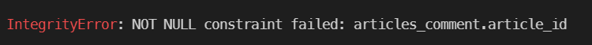

  - 게시글 생성 후 댓글 생성 재시도

    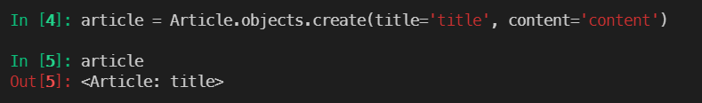

    ​	:exclamation:  pk 값 넣는 게 아니라 객체를 넣음

    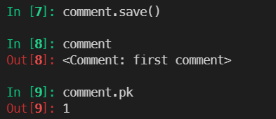

  - 댓글 속성 값 확인

    1. column 값 직접 사용 : article_pk 없으니 주의

       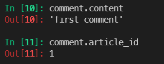

    2. comment 인스턴스를 통한 article 값 접근

       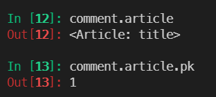


- 두 번째 댓글 작성하기

  - 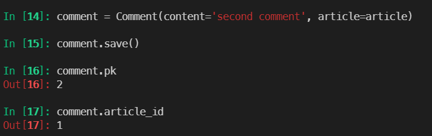

  - 2번 코멘트의 게시글의 title과 content도 알아볼 수 있음

    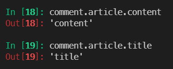


- admin site에서 작성된 댓글 확인

  ```python
  from django.contrib import admin
  from .models import Article, Comment
  
  # Register your models here.
  admin.site.register(Article)
  admin.site.register(Comment)
  ```

  `$ python manage.py createsuperuser`


- 1 : N 관계 related manager
  - 참조('article') 
    - Comment(N) -> Article(1)
    - 댓글의 경우 어떠한 댓글이든 반드시 자신이 참조하고 있는 게시글이 있으므로, `comment.article`과 같이 접근할 수 있음
    - 실제 ForeignKeyField 또한 Comment 클래스에서 작성됨
  - 역참조('comment_set')
    - Article(1) -> Comment(N)
    - `article.comment` 형태로는 사용할 수 없고, `article.comment_set` mamager가 생성됨
    - 게시글에 몇 개의 댓글이 작성되었는지 Django ORM이 보장할 수 없기 때문
      - article은 comment가 있을 수도 있고 없을 수도 있음
      - <u>실제로 Article 클래스에는 Comment 와의 어떠한 관계도 작성되어있지 않음</u>


- 1: N related manager 연습하기

  - article 입장에서 모든 댓글 조회하기

    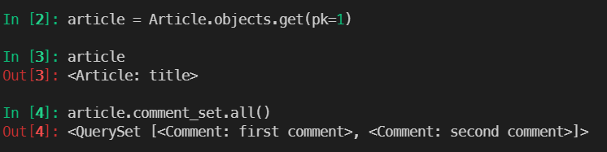

  - 조회한 모든 댓글 출력하기

    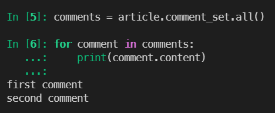

  - 그냥 참조

    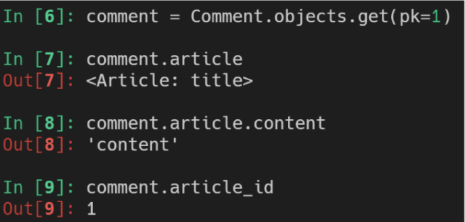


- ForeignKey arguments - `related_name`

  - 역참조 시 사용할 이름('model_set' manager)을 변경할 수 있는 옵션

  - `related_name='comments'` 로 변경시 article.comment_set은 더이상 사용할 수 없고 `article.comments`로 대체됨

  - 수정하면 migration 과정 필요

    ```python
    # articles/models.py
    class Comment(models.Model):
        article = models.ForeignKey(Article, on_delete=models.CASCADE, related_name='comments')
        content = models.CharField(max_length=200)
        created_at = models.DateTimeField(auto_now_add=True)
        updated_at = models.DateTimeField(auto_now=True)
        
        def __str__(self):
            return self.content
    ```


### 1. 1 comment CREATE

- CommentForm 작성

  ```python
  # articles/forms.py
  from django import forms
  from .models import Article, Comment
  
  class ArticleForm(forms.ModelForm):
      class Meta:
          model = Article
          fields = '__all__'
  
  class CommentForm(forms.ModelForm):
      class Meta:
          model = Comment
          fields = '__all__'
  ```

- detail 페이지에서 CommentForm 출력

  ```python
  # articles/views.py
  from .forms import ArticleForm, CommentForm
  
  @require_safe
  def detail(request, pk):
      article = get_object_or_404(Article, pk=pk)
      comment_form = CommentForm()
      context = {
          'article': article,
          'comment_form': comment_form,
      }
      return render(request, 'articles/detail.html', context)
  
  ```

  ```html
  <!-- articles/detail.html -->
  
  
  
    ...
    <a href="">[back]</a>
    <hr>
    <form action="" method ="POST">
      
      {{ comment_form }}
      <input type="submit">
    </form>
  
  
  ```

- ForeignKeyField를 작성자가 직접 입력하는 이상한 로직 됨

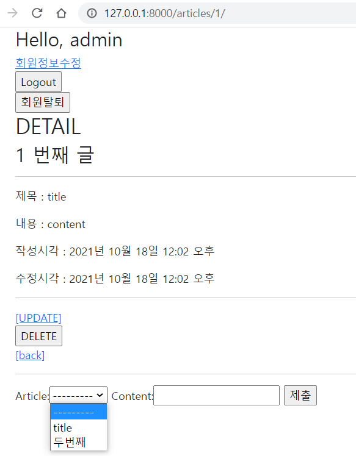


- CommentForm에서 외래 키 필드 출력 제외

  ```python
  class CommentForm(forms.ModelForm):
      
      class Meta:
          model = Comment
          # fields = '__all__'
          exclude = ('article', ) 
  ```

  

- 댓글 작성 로직

  ```python
  # articles/urls.py
  app_name = 'articles'
  urlpatterns = [
      path('<int:pk>/comments/', views.comments_create, name='comments_create'),
  ]
  ```

  ```html
  <!-- articles/detail.html -->
    <form action="" method ="POST">
      
      {{ comment_form }}
      <input type="submit">
    </form>
  ```

  ```python
  # articles/views.py
  
  @require_POST
  def comments_create(request, pk):
      article = get_object_or_404(Article, pk=pk)
      comment_form = CommentForm(request.POST)
      if comment_form.is_valid():
          comment = comment_form.save(commit=False)  # 인스턴스만 생성하고 db에 저장 안 함
          comment.article = article				   # 필요한 정보 추가
          comment.save()							   # save 가능
      return redirect('articles:detail', article.pk)
  ```


- The `save()` method
  - save(commit=False)
    - 아직 데이터베이스에 저장되지 않은 인스턴스를 반환
    - 저장하기 전에 객체에 대한 사용자 지정 처리를 수행할 때 유용하게 사용


### 1. 2 comment READ

- 댓글 출력

  - 특정 article에 있는 모든 댓글을 가져온 후(역참조) context에 추가

  ```python
  # articles/views.py
  @require_safe
  def detail(request, pk):
      article = get_object_or_404(Article, pk=pk)
      comment_form = CommentForm()
      comments = article.comment_set.all()
      context = {
          'article': article,
          'comment_form': comment_form,
          'comments': comments,
      }
      return render(request, 'articles/detail.html', context)
  ```

  ```html
  <!-- articles/details.html -->
  
  <a href="">[back]</a>
    <hr>
    <h4>댓글 목록</h4>
    <ul>
      
        <li>{{ comment.content }}</li>
      
    </ul>
  ```

  

### 1. 3 comment DELETE

```python
# articles/urls.py
app_name = 'articles'
urlpatterns = [
        path('<int:article_pk>/comments/<int:comment_pk>/delete/', views.comments_delete, name='comments_delete'),
]
```

```python
# articles/views.py

from .models import Article, Comment

@require_POST
def comments_delete(request, article_pk, comment_pk):
    comment = get_object_or_404(Comment, pk=comment_pk)
    comment.delete()
    return redirect('articles:detail', article_pk)
```

- 댓글 삭제 버튼

```html
<!-- articles/details.html -->
  <ul>
    
      <li>
      {{ comment.content }}
      <form action="" method="POST" class="d-inline">
        
        <input type="submit" value="delete">
      </form>
      </li>
    
</ul>
```


- 인증된 사용자의 경우만 댓글 작성 및 삭제 가능

```python
# articles/views.py
@require_POST
def comments_create(request, pk):
    if request.user.is_authenticated:
        article = get_object_or_404(Article, pk=pk)
        comment_form = CommentForm(request.POST)
        if comment_form.is_valid():
            comment = comment_form.save(commit=False)
            comment.article = article
            comment.save()
        return redirect('articles:detail', article.pk)
    return redirect('accounts:login')

@require_POST
def comments_delete(request, article_pk, comment_pk):
    if request.user.is_authenticated:
        comment = get_object_or_404(Comment, pk=comment_pk)
        comment.delete()
    return redirect('articles:detail', article_pk)

```


### 1. 4 Comment 추가사항

- 댓글 개수 출력하기

```html
<!-- articles/details.html -->
<h4>댓글 목록</h4>
  
    <p><b>{{ comments|length }}개의 댓글이 있습니다.</b></p>
  
```

- 댓글이 없는 경우 대체 컨텐츠 출력(DTL의 for-empty 태그 활용)

```html
    
      ...
    
      <p>댓글이 없어요..</p>
    
```


## 2. Customizing authentication in Django

### 2. 1 Substituting a custom User model

- User 모델 대체하기
  - 일부 프로젝트에서는 Django의 내장 User 모델이 제공하는 인증 요구사항이 적절하지 않을 수 있음
    - username 대신 email을 식별 토큰으로 사용하는 것이 더 적합한 사이트 有
  - Django는 User를 참조하는데 사용하는 AUTH_USER_MODEL 값을 제공하여, default user model을 재정의(override) 할 수 있도록 함
  - Django는 새 프로젝트을 시작하는 경우 기본 사용자 모델이 충분하더라도, 커스텀 유저모델을 설정하는 것을 강력하게 권장
    -  단 프로젝트의 모든 migrations 혹은 migrate를 실행하기 전에 이 작업을 마쳐야 함


- AUTH_USER_MODEL
  - User를 나타내는데 사용하는 모델
  - 프로젝트가 진행되는 동안 <u>변경할 수 없음</u>
  - 프로젝트 시작 시 설정하기 위한 것이며, 참조하는 모델은 첫 번째 마이그레이션에서 사용할 수 있어야 함.
  - 기본 값 : 'auth.User' (auth앱의 User모델)
  - [참고] 프로젝트 중간에 변경하기
    - 초기에 설정하는 것 권장^^;;


- Custom User 모델 정의하기

  - 초기화 :
    - db.sqlite3 파일 삭제
    - migartions 파일 0001, 0002 등 숫자 붙은 파일 삭제

  - 관리자 권한과 함께 완전한 기능을 갖춘 User 모델을 구현하는 기본 클래스인 AbstractUser를 상속받아 새로운 User 모델 작성

  ```python
  # accounts/models.py
  from django.contrib.auth.models import AbstractUser
  
  class User(AbstractUsser):
      pass
  ```

  - 기존에 django가 사용하는 User 모델이었던 auth 앱의 User 모델을 accounts 앱의 User 모델을 사용하도록 변경

  ```python
  # settings.py 맨 마지막
  AUTH_USER_MODEL = 'accounts.User'
  ```

  - admin site에 Custom User 모델 등록

  ```python
  # accounts/admin.py
  from django.contrib import admin
  from django.contrib.auth.admin import UserAdmin
  from .models import User
  
  # Register your models here.
  admin.site.register(User, UserAdmin)
  ```

  - migrate 하기

  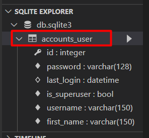


### 2. 2 Custom user & Built-in auth forms

- 에러 발생
  - UserCreationForm과 UserChangeForm은 기존 내장 User 모델 사용한 ModelForm이기 때문에 커스텀 User 모델로 대체해야 함


- Custom Built-in Auth Forms

  - 기존 User 모델을 사용하기 때문에 커스텀 User 모델로 다시 작성하거나 확장해야 하는 forms
    - UserCreationForm
    - UserChangeForm

  ```python
  #accounts/forms.py
  
  class CustomUserCreationForm(UserCreationForm):
  
          class Meta(UserCreationForm):
              model = get_user_model()
              fields = UserCreationForm.Meta.fields + ('email', )
  ```

  ```python
  # accounts/views.py
  
  from .forms import CustomUserChangeForm, CustomUserCreationForm
  @require_http_methods(['GET', 'POST'])
  def signup(request):
      if request.user.is_authenticated:
          return redirect('articles:index')
  
      if request.method == 'POST':
          form = CustomUserCreationForm(request.POST)
          if form.is_valid():
              user = form.save()
              auth_login(request, user)
              return redirect('articles:index')
      else:
          form = CustomUserCreationForm()
      context = {
          'form': form,
      }
      return render(request, 'accounts/signup.html', context)
  ```

  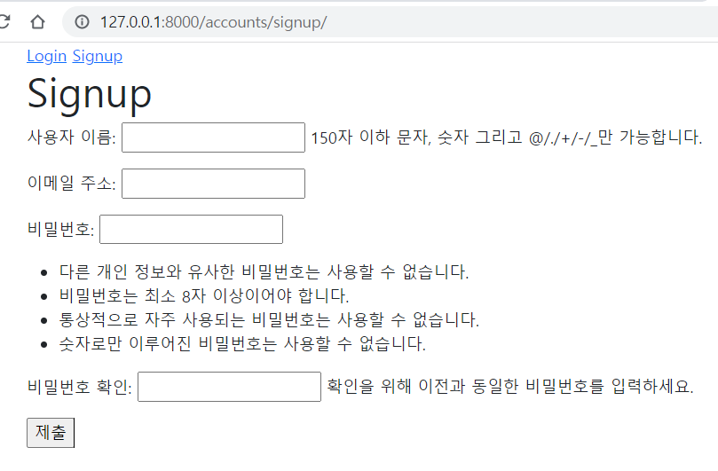

- get_user_model()
  - django는 User 클래스를 직접 참조하는 대신 django.contrib.auth.get_user_model() 사용하여 참조해야 한다고 강조


# Model Relationship II

## 1. User - Article (1:N)

### User 모델 참조하기

- 

- ```python
  from django.db import models
  from django.conf import settings
  
  # User(1) -> Article(N)
  # Create your models here.
  class Article(models.Model):
      user = models.ForeignKey(settings.AUTH_USER_MODEL, on_delete=models.CASCADE)
  ```

- `migrations`

  ```PYTHON
  Please select a fix:
   1) Provide a one-off default now (will be set on all existing rows with a null value for this column)
   2) Quit, and let me add a default in models.py
  Select an option: 1                                    
  Please enter the default value now, as valid Python
  The datetime and django.utils.timezone modules are available, so you can do e.g. timezone.now
  Type 'exit' to exit this prompt
  >>> 1
  ```

- migrate

- 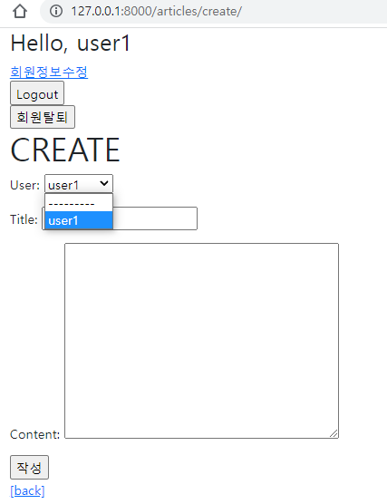

- 불필요한 정보 삭제

  ```python
  # forms.py
  from django import forms
  from .models import Article, Comment
  
  class ArticleForm(forms.ModelForm):
  
      class Meta:
          model = Article
          # fields = '__all__'
          fields = ('title', 'content', )
  ```

  게시글 작성하면 오류 남 : 참조 무결성 (게시글과 user의 관계 넣어줘야 함: 누가 썼는지)

  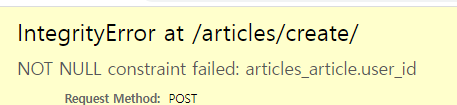


- ```python
  @login_required
  @require_http_methods(['GET', 'POST'])
  def create(request):
      if request.method == 'POST':
          form = ArticleForm(request.POST)
          if form.is_valid():
              # 사용자는 form에서 user_id를 알려준 적이 없음
              # 하지만 Article은 Foreign key 에서 user_id 넣어줘야 함.
              article = form.save(commit=False)
              article.user = request.user  # 로그인 한 사람이 글쓰기를 썼을 것이다.
              article.save()
              return redirect('articles:detail', article.pk)
      else:
          form = ArticleForm()
      context = {
          'form': form,
           }
      return render(request, 'articles/create.html', context)
  ```

- ```python
  <!-- articles/ -->
  
      <p><b>작성자: {{ article.user }}</b></p>
      <p>글 번호 : {{ article.pk }}</p>
  ```

- Update 도 똑같음


## 2. User - Comment(1 : N)


