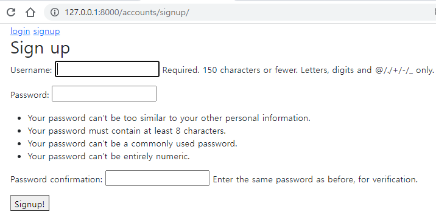
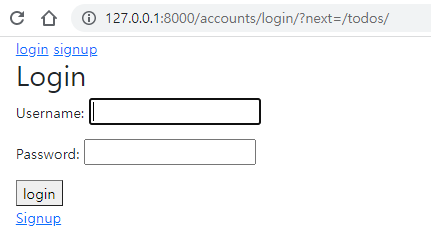
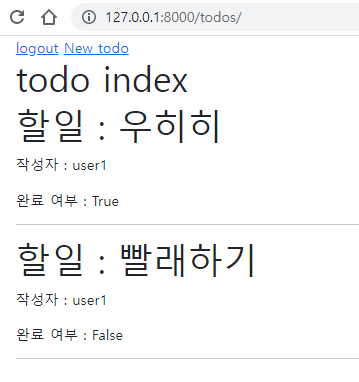
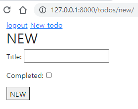

# 1019_workshop


### 1. 회원가입



```python
# accounts/urls.py
from . import views

app_name = 'accounts'
urlpatterns = [
    path('signup/', views.signup, name='signup'),
]

```

```python
# accounts/views.py
from .forms import CustomUserCreationForm

def signup(request):
    if request.method == "POST": 
        form = CustomUserCreationForm(request.POST) 
        if form.is_valid():
            form.save()                              
            return redirect('accounts:login')
    else: 
        form = CustomUserCreationForm() 
    context = {
        'form': form,
    }
    return render(request, 'accounts/signup.html', context)
```

```html
<!-- signup.html -->


  <h2>Sign up</h2>
  
  <form action="" method="POST"> 
    
    {{ form.as_p }}
    <button>Signup!</button>
  </form>

```


### 2. 로그인



```python
# accounts/urls.py
from . import views

app_name = 'accounts'
urlpatterns = [
    path('login/', views.login, name='login'),
]
```

```python
# accounts/views.py
from django.contrib.auth.forms import AuthenticationForm
from django.contrib.auth import login as auth_login

def login(request):
    if request.method == 'POST':
        form = AuthenticationForm(request, request.POST)
        if form.is_valid():
            user = form.get_user()
            auth_login(request, user)
            return redirect('todos:index')
    else:
        form = AuthenticationForm() 

    context = {
        'form': form,
    }
    return render(request, 'accounts/login.html', context)
```

```python
<!-- login.html -->


  <h2>Login</h2>
  <form action="" method="POST">
    
      {{ form.as_p }}
      <button>login</button>
  </form>

  <a href="">Signup</a>

```


### 3. Todo 목록(index)



```python
# todos/urls.py
from . import views

app_name = 'todos'
urlpatterns = [
    path('', views.index, name='index'),

]
```

```python
from .models import Todo
from django.contrib.auth.decorators import login_required

# Create your views here.

@login_required
def index(request):
    # 이 코드의 문제 : 서로의 toto를 볼 수 있음
    # todos = Todo.objects.all()   
    todos = request.user.todo_set.all()
    context = {
        'todos': todos,
    }
    return render(request, 'todos/index.html', context )
```

```html
<!-- todos/index.html -->


 <h1>todo index</h1>
  
    <div>
      <h1>할일 : {{ todo.title }}</h1>
      <p>작성자 : {{ todo.author }}</p>
      <p>완료 여부 : {{ todo.completed }}</p>
      <hr>
    </div>
  

```


### 4. Todo 생성(new)



```python
# todos/urls.py
from . import views

app_name = 'todos'
urlpatterns = [
    path('new/', views.new, name='new'),
]

```

```python
# todos/views.py

@login_required
def new(request):
    if request.method == 'POST':
        form = TodoForm(request.POST)
        if form.is_valid():
            todo = form.save(commit=False)
            todo.author = request.user
            todo.save()
            return redirect('todos:index')
    else:
        form = TodoForm()
    context = {
        'form': form,
    }
    return render(request, 'todos/new.html', context)
```

```html
<!-- new.html -->


  <h2>NEW</h2>
  <form action="" method="POST">
    
    {{ form.as_p }}
    <button>NEW</button>
  </form>


```

