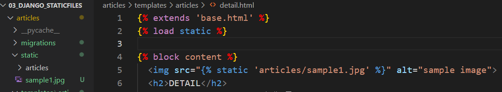
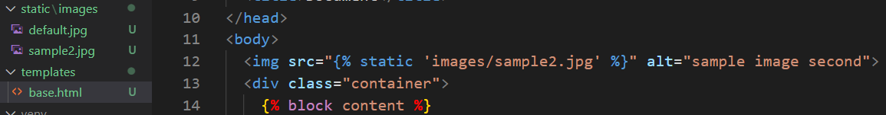
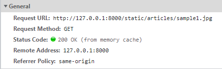
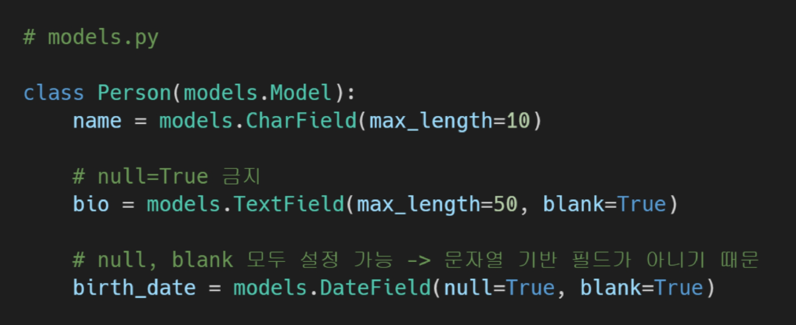
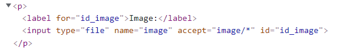
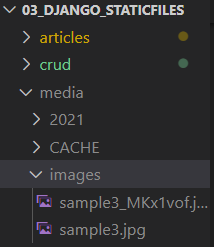

[TOC]

# Managing Static Files

- static files : 개발자 (변경 거의 x)

- media files : user (변경 o)

두개 다 정적 파일!!  변경 x (좋아요 누른다고 원본이 변하진 않음)


동적 html - > 변경 가능


## 1. Static files

### 1.0 Static files(정적 파일)

- 응답할 때 별도의 처리 없이 파일 내용 그대로 보여주면 되는 파일
- 이미지, 자바스크립트 또는 CSS 같은 미리 준비된 추가 파일 제공해야함


### 1.1 Static file 구성

1. django.contrib.staticfiles가 INSTALLED_APPS에 포함되어 있는지 확인 (기본으로 되어있음)

2. settings.py에서 STATIC_URL을 정의

3. 템플릿에서 static 탬플릿 태그를 사용하여 지정된 상대경로에 대한 url을 빌드

   ```python
   
   
   
   ```

4. 앱의 static 폴더에 정적 파일을 저장

   예시) <u>my_app/static/</u>**my_app/exampl.jpg**

:exclamation: django에서는 기본 앱의 static 폴더 까지 기본 경로로 인지하고 있음(like templates 폴더)


### 1.2 Django template tag

- load 
  -  ``
  - 사용자 정의 템플릿 태그 세트를 로드
  - 로드하는 라이브러리, 패키지에 등록된 모든 필터를 로드

- static
  - STATIC_ROOT에 저장된 정적 파일에 연결


### 1.3 The staticfiles app

```python
# settings.py
# 기본 경로 
STATIC_URL = '/static/'

# 배포할 때만 사용
# STATIC_ROOT = BASE_DIR / 'staticfiles'

# 추가 경로 
# 프로젝트 폴더 내부 앱과 동일한 LEVEL에 STATIC/IMAGE/폴더 생성 후 image파일 삽입
STATICFILES_DIRS = [
    BASE_DIR / 'static',
]
```

- STATIC_ROOT (배포)

  - collectstatic이 배포를 위해 정적 파일을 수집하는 디렉토리의 절대 경로
  - django 프로젝트에서 사용하는 모든 정적 파일을 한 곳에 모아 넣는 경로
  - 개발 과정에서 settings.py의 DEBUG 값이 True인 경우 해당 값은 적용되지 않음
    -  직접 작성하지 않으면 django 프로젝트에서는 settings.py에 작성되어 있지 않음
  - 실 서비스 환경(배포 환경)에서 django의 모든 정적 파일을 다른 웹 서버가 직접 제공하기 위함

  :exclamation: 참고 : collectstatic

  - STATIC_ROOT에 정적 파일을 수집 (django가 쓰는 static 파일을 한곳에 모아줌)
  - `$ python mange.py collectstatic`

  

- STATIC_URL (기본경로) :star:
  - STATIC_ROOT에 있는 정적 파일을 참조할 때 사용할 URL
    - 개발 단계에서는 실제 정적 파일들이 저장되어 있는 app/static/경로 (기본경로) 및 <u>STATICFILES_DIRS에 정의된 추가 경로</u>들을 탐색함
  - 실제 파일이나 디렉토리가 아니며, URL로만 존재
  - 비어있지 않은 값으로 설정한다면 반드시 slash(/) 로 끝나야 함


- STATICFILES_DIRS (추가경로):star:
  - `app/static/` 디렉토리 경로를 사용하는 것(기본 경로) 외에 추가적인 정적 파일 경로 목록을 정의하는 리스트
  - 추가 파일 디렉토리에 대한 전체 경로를 포함하는 문자열 목록으로 작성되어야 함


### 1.4 정적 파일 사용하기

- 기본 경로

  ```python
  # 이미지 파일 경로 : articles/static/articles/sample_img.png 
  
  # articles/templates/articles/detail.html
  
  
  
  
  
    
  ```

  

  

- 추가경로

  ```python
  # 이미지 파일 경로 : django_staticfiles/static/images/sample2.png
  
  # django_staticfiles/templates/base.html
  <body>
    
    <div class="container">
  
  # settings.html
  STATICFILES_DIRS = [
      BASE_DIR / 'static',
  ]
  ```

  

  

- STATIC_URL 확인

  


## 2. Image upload

### 2.1 이미지 업로드(기본 설정)

#### 2.1.0 Media files

- 미디어 파일
- 사용자가 웹에서 업로드하는 정적 파일(user-uploaded)
- **유저**가 업로드한 모든 정적 파일


#### 2.1.1 Model field

- ImageField

  - 이미지 업로드에 사용하는 모델 필드

  - FileField를 상속받는 서브클래스이기 때문에 FileField의 모든 속성 및 메서드를 사용 가능하며, 더해서 사용자에 의해 업로드 된 객체가 유효한 이미지인지 검사함

  - ImageField 인스턴스는 최대 길이가 100자인 문자열로 DB에 생성되며, max_length 인자를 사용하여 최대 길이를 변경할 수 있음

  - :exclamation: 사용하려면 반드시 **Pillow 라이브러리**가 필요

    `$ pip install Pillow`


- FileField
  - 파일 업로드에 사용하는 모델 필드
  - 2개의 선택 인자를 가지고 있음
    1. upload_to
    2. storage


- upload_to argument

  - 업로드 디렉토리와 파일 이름을 설정하는 2가지 방법을 제공

    1. 문자열 값이나 경로 지정

       ```python
       #models.py
       class MyModel(models.Model):
           # MEDIA_ROOT/images/ 경로로 파일 업로드
           upload = models.FileField(upload_to='images/')
           # or
           # MEDIA_ROOT/images/2021/01/01 경로로 파일 업로드
           upload = models.FileField(upload_to='images/%Y/%m/%d/')
       ```

       

    2. 함수 호출

       ```python
       # models.py
       
       def articles_image_path(instance, filename):  # 두 개의 인자
           # MEDIA_ROOT/user_<pk>/ 경로로 <filename> 이름으로 업로드
           return f'user_{instance.instance.pk}/{filename}' # pk는 None값 나올 수 있음
       
       class Article(models.Model):
           image = models.ImageField(upload_to=articles_image_path, blank)
       ```

    - 반드시 2개의 인자를 사용함

      1. instance
      2. filename

      

#### 2.1.2 ImageField(or File Field)를 사용하기 위한 몇 가지 단계 :star:

1. settings.py에 MEDIA_ROOT, MEDIA_URL 설정

2. upload_to 속성을 정의하여 업로드 된 파일에 사용 할 MEDIA_ROOT의 하위 경로를 지정

3. 업로드 된 파일의 경로는 django가 제공하는 'url'속성을 통해 얻을 수 있음

   ```python
   문자열 기반 필드에는 사용하는 것을 피해야 함</u>

    문자열 기반 필드에 True로 설정 시 '데이터 없음(no data)'에 '빈 문자열'과 'NULL'의 2가지 가능한 값이 있음을 의미하게 됨

    Django는 NULL이 아닌 빈 문자열 사용하는 것이 규칙


- blank & null 비교

  - 문자열 기반 및 비문자열 기반 필드 모두에 대해 null option은 db에만 영향을 미치므로, form에서 빈 값을 허용하려면 blank=True를 설정해야 함

  

  - `$ pip install Pillow`


#### 2.2.2 FORM 요소 - enctype(인코딩) 속성

- 게시글 작성 form enctype 속성 지정

  ```html
  <!-- create.html -->
  <form action="" method="POST" enctype="multipart/form-data">
  ```

1. `multipart/form-data`
   - 파일/이미지 업로드시 반드시 사용(전송되는 데이터 형식 지정)
   - < input type="file" >을 사용할 경우 사용


- input요소 - accept 속성 지정



 	:exclamation: 고유 파일 유형 지정자 : accept="image/*,.pdf"

​		


- Views.py 수정

  - 업로드한 파일은 request.FILES 객체로 전달됨

  - 키워드 인자로 쓰려면`files=request.FILES`

  ```python
  # views.py
  
  def create(request):
      if request.method == 'POST':
          form = ArticleForm(request.POST, request.FILES)
          ...
  ```

  - DB에 저장되는 것 : 파일 경로!  MEDIA_ROOT 는 'media' 까지였으므로, images/ 부터 올라감

    실제 파일 위치 : MEDIA_ROOT(==media/images)/sample3.jpg


### 2.3 이미지 업로드(READ)

- 이미지 경로 불러오기

  - 데이터베이스에서 image의 주소를 가지고 오는 것 뿐임
  - `article.image.url` == 업로드 파일의 경로
  - `article.image` == 업로드 파일의 파일 이름

  ```html
  <!-- detail.html -->
  	...
  	<h2 class ='text-center'>DETAIL</h2>
  	<h3>{{ article.pk }}번 글</h3>
  	
  	...
  ```

  

- MEDIA_URL 확인하기


### 3.4 이미지 업로드(UPDATE)

```html
<!--update.html-->
	...
    <form action="" method="POST" enctype="multipart/form-data">
```

```python
# views.py
	if request.method == 'POST':
        form = ArticleForm(request.POST, instance=article, files=request.FILES) 
        # files 안 쓰려면 두 번째에
```

- detail 페이지를 출력하지 못하는 문제 해결 (image가 없는 게시글의 경우 출력할 이미지 없기 때문)

  -> if문으로 작성해주기

```html
<!--detail.html-->


    
  
	<!--경로는 바깥 static임 -->
    
   
```


## 4. Image Resizing

- django-imagekit 라이브러리 활용
  1. `$ pip install django-imagekit`
  2. `$ pip freeze > requirements.txt`
  3. settings.py 의 INSTALLED_APP에 `imagekit` 추가


- 원본 이미지를 재가공하여 저장(원본x 썸네일o) : Processed 안에 있는 것은 migrate다시 해줄 필요 없이 즉각 반영됨.

```python
# models.py
from imagekit.models import ProcessedImageField
from imagekit.models import Thumbnail

class Article(models.Model):
	...
    image_thum = ProcessedImageField(
        blank=True,
        upload_to='thumbnails/',
        processors=[ResizeToFill(100, 50)],
        format='JPEG',
        options={'quality':60},
        ) 
```


- 원본(o) 썸네일(o)

```python
    
    image = models.ImageField(upload_to='origins/', blank=True)
    image_thumbnail = ImageSpecField(
        source = 'image',  # 원본 이미지 필드 명
        processors=[ResizeToFill(100,50)],
        options={'quality': 90},
    )  
    created_at = models.DateTimeField(auto_now_add=True)
    updated_at = models.DateTimeField(auto_now=True)
```


