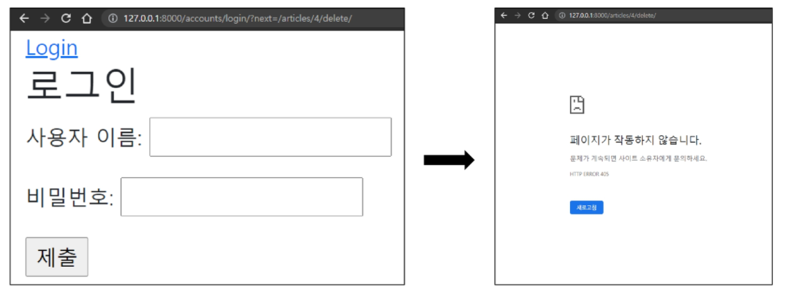
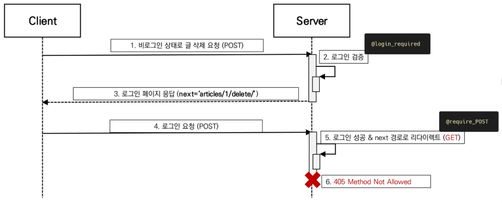
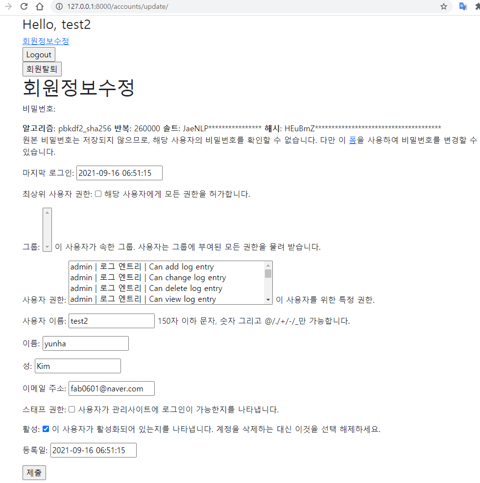
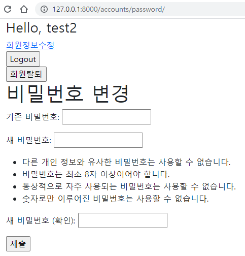

[TOC]


# Authentication System I

## 1. Django Authentication System

인증과 권한 = > 로그인 

- 인증 : 누구냐 넌 / 웅인데요(요청) :arrow_right: 웅맞구나(응답) :arrow_left:
- 권한 : 등급에 맞게 정보나 행위 제한 / 관리자냐 알바냐 손님이냐

OAuth : 카카오톡 로그인 등 

[참고]: https://d2.naver.com/helloworld/24942	"참고"


## 2. 쿠키와 세션 

인증을 위해 필요한 것

- HTTP 
  - HTML 문서와 같은 리소스들을 가져올 수 있도록 해주는 프로토콜(**규칙. 규약**)
  - 웹에서 이루어지는 모든 데이터 교환의 기초
  - 클라이언트 - 서버 프로토콜이기도 함


- HTTP 특징 (문자O 통화X)
  - 비연결지향(connectionless) :star:
    - 서버는 요청에 대한 응답을 보낸 후 연결 끊음
  - 무상태(stateless)
    - 연결을 끊는 순간 클라이언트와 서버 간의 통신이 끝나며 상태 정보가 유지되지 않음
    - 클라이언트와 서버가 주고 받는 메세지들은 서로 완전히 독립적임
  -  <u>클라이언트와 서버의 지속적인 관계 유지를 위해 쿠키와 세션이 존재</u>


- 쿠키 개념

  - 서버가 사용자의 웹 브라우저에 전송하는 작은 데이터 조각

  - 사용자가 웹사이트에 방문할 경우 해당 웹사이트의 서버를 통해 사용자의 컴퓨터에 설치되는 작은 정보 기록 파일

    - 브라우저(클라이언트)는 쿠키를 로컬에 KEY-VALUE의 데이터 형식으로 저장
    - 이렇게 쿠키를 저장해 놓았다가, 동일한 서버에 재요청시 저장된 쿠키를 함께 전송

  - 참고: 소프트웨어가 아니기 때문에 프로그램처럼 실행될 수 없으며, 악성 코드를 설치할 수 없지만, 사용자의 행동을 추적하거나 쿠키를 훔쳐서 해당 사용자의 계정 접근 권한을 획득할 수 도 있음.

  - HTTP 쿠키는 상태가 있는 세션을 만들어 줌

  - 쿠키는 두 요청이 동일한 브라우저에서 들어왔는지 아닌지를 판단할 때 주로 사용

    -  이를 이용해 사용자의 로그인 상태를 유지할 수 있음
    - 상태가 없는 HTTP 프로토콜에서 상태 정보를 기억시켜주기 때문

  - <u>웹 페이지에 접속하면 요청한 웹 페이지를 받으며 쿠키를 저장하고, 클라이언트가 같은 서버에 재요청시 요청과 함께 쿠키도 전송</u>

    문자열(바코드) 넣어둠 

 

- 쿠키의 사용 목적
  1. 세션 관리
     - 로그인, 아이디 자동완성, 공지 하루 안 보기, 팝업 체크, 장바구니 등 정보 관리
  2. 개인화
     - 사용자 선호, 테마 등의 설정
  3. 트래킹
     - 사용자 행동을 기록 및 분석


- 쿠키를 이용한 장바구니 예시


- 세션(Session)
  - 사이트와 특정 브라우저 사이의 상태를 유지시키는 것
  - 클라이언트가 서버에 접속하면 서버가 특정 session id를 발급하고, 클라이언트는 발급 받은 session id 를 쿠키에 저장
    - 클라이언트가 다시 서버에 접속하면 요청과 함께 쿠키를 서버에 전달
    - 쿠키는 요청 때마다 서버에 함께 전송되므로 서버에 session id를 확인해 알맞은 로직을 처리
  - ID는 세션을 구별하기 위해 필요하며, 쿠키는 id만 저장함


- 쿠키 lifetime (수명)
  1. Session cookies 
     - 현재 세션이 종려되면 삭제됨
     - 브라우저가 현재 세션이 종료되는 시기를 정의
  2. Persistent cookies
     - expires 속성에 지정된 날짜 혹은 max-age 속성에 지정된 기간이 지나면 삭제


- Session in Django
  - django 세션은 미들웨어를 통해 구현됨
  - django는 database-backed sessions 저장 방식을 기본 값으로 사용
  - django는 특정 session id를 포함하는 쿠키를 사용하여 각각의 브라우저와 사이트가 연결된 세션을 알아냄
    - 세션 정보는 django db의 django_session 테이블에 저장됨
  - 모든 것을 세션으로 사용하려고 하면 사용자가 많을 때 서버에 부하가 걸릴 수 있음


- [참고] 미들웨어 
  - 전처리 과정
  - http 요청과 응답 처리 중간에서 작동하는 시스템(hooks)
  - django는 http 요청이 들어오면 미들웨어를 거쳐 해당 url에 등록되어 있는  


## 3. 로그인

Session을 create하는 로직과 같음


- AuthenticationForm

  - 사용자 로그인을 위한 form
  - request를 첫 번째 인자로 취함

- login 함수

  `login(request, user, backend=None)`

  - 현재 세션에 연결하려는 인증된 사용자가 있는 경우
  - 사용자를 로그인하며 view함수에서 사용됨
  - httpRequest 객체와 User 객체가 필요
  - django의 session framework를 사용하여 세션에 user의 ID를 저장(==로그인)

  ```python
  # views.py
  from django.contrib.auth import login as auth_login
  from django.contrib.auth.forms import AuthenticationForm
  
  def login(request):
      if request.method == 'POST':
          form = AuthenticationForm(request, request.POST)
          if form.is_valid():
              # 로그인
              auth_login(request, form.get_user())
              return redirect('articles:index')
      else:
         	...
  ```

  - <u>view함수와 내장함수 이름이 login으로 똑같아서, 내장함수 이름 auth_login으로 변경</u>


- get_user()
  - AuthenticationForm의 인스턴스 메서드
  - user_cache는 인스턴스 생성 시에 None으로 할당되며, 유효성 검사를 통과했을 경우 로그인 한 사용자 객체로 할당 됨
  - 인스턴스의 유효성을 먼저 확인하고, 인스턴스가 유효할 때만 user를 제공하려는 구조

- 로그인 링크 작성

  ```html
  <!-- base.html -->
  ...
      <a href="">Login</a>
  ...
  ```


## 4. Authentication data in templates

- 현재 로그인 되어 있는 유저 정보 출력

  ```html
  <!-- base.html -->
  ...
  	<h3>Hello, {{ user }}</h3>
      <a href="">Login</a>
  ...
  ```

  

- context processors

  - :star: context 안 보내줬는데도 작동함 -> 기본 설정 되어 있음
  - 탬플릿이 렌더링 될 때 자동으로 호출 가능한 컨텍스트 데이터 목록
  - 작성된 프로세서는 RequestContext에서 사용 가능한 변수로 포함됨
  - `'django.contrib.auth.context_processors.auth',`

  ```python
  # settings.py
  TEMPLATES = [
      {
          ...
          'OPTIONS': {
              'context_processors': [
                  ...
                  'django.contrib.auth.context_processors.auth',
                  ...
              ],
          },
      },
  ]
  ```


## 5. 로그아웃

user를 delete하는 것 아님. session을 delete하는 것


- logout 함수

  - `logout(request)`
  - HttpRequest 객체를 인자로 받고 반환 값이 없음
  - 사용자가 로그인하지 않은 경우 오류를 발생시키지 않음
  - 현재 요청에 대한 session data를 db에서 완전히 삭제하고, 클라이언트의 쿠키에서도 sessionid가 삭제됨
  - 이는 다른 사람이 동일한 웹 브라우저를 사용하여 로그인하고, <u>이전 사용자의 세션 데이터에 엑세스 하는 것을 방지하기 위함</u>

  - 브라우저에서 강제로 쿠키 지우면 db에 남아있음.


## 6. 로그인 사용자에 대한 접근 제한

- Limiting access to logged-in users

  - 로그인 사용자에 대한 엑세스 제한 2가지 방법

    1. The raw way

       `is_authenticated`  attribute

    2. The `login_required` decorator


- `is_authenticated` 속성
  - User model의 속성 중 하나
  - 모든 User 인스턴스에 대해 항상 True (AnonymousUser에 대해서는 항상 False)
  - 사용자가 인증되었는지 여부를 알 수 있는 방법
  - 일반적으로 request.user에서 이 속성을 사용하여, 미들웨어를 통과했는지 확인
  - 단, 권한(permission)과는 관련이 없으며, 사용자가 활성화 상태(activate)이거나 유효한 세션(valid session)을 가지고 있는지도 확인하지 않음


- `is_authenticated` 적용

  1. 로그인과 비로그인 상태에서 출력되는 링크를 다르게 설정

  ```html
  <!-- base.html -->
  
  	
        <h3>Hello, {{ user }}</h3>
        <form action="" method="POST">
          
          <input type="submit" value="Logout">
        </form>
      
        <a href="">Login</a>
      
  ```

  

  

  2. 인증된 사용자(로그인 상태)라면 로그인 다시 할 수 없도록 처리

  ```python
  # views.py
  def login(request):
      if request.user.is_authenticated:
          return redirect('articles:index')
      ...	
  ```

    

  

  2. 1 articles/index.html 도 같이 수정해주기

  ```html
  <!-- artcles/index.html -->
    ...
    <h1>Articles</h1>
    
      <a href="">[CREATE]</a>
    
      <a href="">[새 글을 작성하려면 로그인하세요]</a>
    
    ...
  ```

  

  

  

  

  

  

  3. 인증된 사용자만 로그아웃할 수 있도록 처리

  ```python
  # accounts/views.py
  
  def logout(request):
      if request.user.is_authenticated:
          auth_logout(request)
      return redirect('articles:index')
  ```

  

  4. 인증된 사용자만 게시글 작성 링크를 볼 수 있도록 처리

  ```html
  <!-- artcles/index.html -->
    ...
    
      <a href="">[CREATE]</a>
    
      <a href="">[새 글을 작성하려면 로그인하세요]</a>
    
    ...
  ```

  

- `@login_required` decorator

  - 사용자가 로그인되어 있지 않으면 settings.LOGIN_URL 에 설정된 문자열 기반 절대 경로로 redirect함
    - LOGIN_URL의 기본값은 '/accounts/login/'
    - 두번째 app 이름을 accounts로 했던 이유 중 하나
  - 사용자가 로그인되어 있으면 정상적으로 view 함수를 실행
  - 인증 성공식 사용자가 redirect 되어야 하는 경로는 'next'라는 쿼리 문자열 매개변수에 저장됨
    - 예시) /accounts/login/?next=/articles/create
  - `@login_required` 먼저 작성!! 로그인했는지 여부 확인이 먼저임

  ```python
  # articles/views.py
  
  from django.contrib.auth.decorators import login_required
  
  @login_required
  @require_http_methods(['GET', 'POST'])
  def create(request):
      pass
  
  @login_required
  @require_POST
  def delete(request, pk):
      pass
  
  @login_required
  @require_http_methods(['GET', 'POST'])
  def update(request, pk):
      pass
  ```


- 'next' query string parameter

  - 로그인이 정상적으로 진행되면 기존에 요청했던 주소로 redirect 하기 위해 마치 주소를 keep해주는 것
  - 단, 별도로 처리해주지 않으면 우리가 view에 설정한 redirect 경로로 이동하기 됨
  - <u>로그인 안 상태로 articles/create/ 접속하면 `@login_required` 때문에 막혀서 login 화면이 띄워지고, 거기서 login을 하면 create 창으로 넘어가게 해주는 방법</u>

  

  1.  `return redirect(request.GET.get('next') or 'articles:index')`

  ```python
  # accounts/views.py
  
  @require_http_methods(['GET', 'POST'])
  def login(request):
      if : ...
      if : ...
          if form.is_valid():
              # 로그인
              auth_login(request, form.get_user())
              return redirect(request.GET.get('next') or 'articles:index')
      else: ...
  ```

  2. `<form action="" method="POST">` 에서 url 삭제

  ```html
  <!-- accounts/login.html -->
  ...
    <form action="" method="POST">
      ...
    </form>
  ...
  ```

  


- 두 데코레이터로 인해 발생하는 구조적 문제와 해결

  1. 비로그인 상태에서 게시글 삭제 시도

  ```python
  # articles/views.py
  
  # @login_required
  @require_POST
  def delete(request, pk):
      if request.user.is_authenticated:
          article = get_object_or_404(Article, pk=pk)
          article.delete()
      return redirect('articles:index')
  ```

  2. redirect로 이동한 로그인 페이지에서 로그인 시도 > 405 status code 확인

  

  - `required_POST` 작성된 함수에 `login_required`를 함께 사용하는 경우 에러 발생
  - 로그인 이후 'next' 매개변수를 따라 해당 함수로 다시 redirect 되는데, 이때 @require_POST 때문에 405 에러가 발생하게 됨
  - 두 가지 문제 발생
    1. redirect 과정에서 POST 데이터 손실
    2. redircet 요청은 POST 방식이 불가능하기 때문에 GET 방식으로 요청됨

  

  - if문으로 변경하고 login_required 안 씀

  ```python
  # @login_required
  @require_POST
  def delete(request):
      if request.user.is_authenticated:
          request.user.delete()
          auth_logout(request)
      return redirect('articles:index') 
  ```

  


# Authentication System II

## 1. 회원 가입

- UserCreationFrom

  - 주어진 username과 passwoard로 권한이 없는 새 user를 생성하는 ModelForm
  - 3개의 필드를 가짐
    1. username(from the user mode)
    2. password1
    3. password2

  1. 회원 가입 후 admin 페이지에서 새로운 계정이 생겼는지 확인

  ```python
  # accounts/urls.py
  ...
  	path('signup/', views.signup, name='signup'),
  ...
  ```

  ```python
  # accounts/views.py
  from django.contrib.auth.forms import AuthenticationForm, UserCreationForm
  
  @require_http_methods(['GET', 'POST'])
  def signup(request):
      if request.method == 'POST':
          form = UserCreationForm(request.POST)
          if form.is_valid():
              form.save()
              return redirect('articles:index')
      else:
          form = UserCreationForm()
      context = {
          'form': form,
      }
      return render(request, 'accounts/signup.html', context)
  ```

  ```html
  <!-- accounts/signup.html -->
  ...
    <h1>Signup</h1>
    <form action="" method="POST">
      
      {{ form.as_p }}
      <input type="submit">
    </form>
  ...
  ```

  

  
  
  
  
  
  
  2. 회원가입 후 자동으로 로그인 진행하기
  
  ```python
          if form.is_valid():
              user = form.save()
              auth_login(request, user)
              return redirect('articles:index')
  ```
  
  
  
  3. 회원가입 링크 작성
  
  ```html
  <!-- base.html-->
  
  	
        <a href="">Login</a>
        <a href="">Signup</a>
      
  ```
  


## 2. 회원 탈퇴

- 회원 탈퇴 진행 후 sqlite 프로그램이나 admin 페이지에서 유저가 삭제되었는지 확인

```python
# accounts/urls.py
...
    path('delete/', views.delete, name='delete'),
...
```

```python
# accounts/views.py

@require_POST
def delete(request):
    if request.user.is_authenticated:
        request.user.delete()
        # 탈퇴하면서 session에서도 지우고 싶다면 logout 해주기. 순서 바뀌면 안 됨
        auth_logout(request)
    return redirect('articles:index') 
```

```html
<!-- base.html-->
    
      ...
      <form action="" method="POST">
        
        <input type="submit" value="회원탈퇴">
      </form>
	
```


## 3. 회원정보 수정

- `UserChangeFrom`
  - 사용자 정보 및 권한을 변경하기 위해 admin 인터페이스에서 사용되는 ModelForm

  ```python
  # accounts/urls.py
      path('update/', views.update, name='update'),
  ```

  ```python
  # accounts/views.py
  
  from django.contrib.auth.forms import UserChangeForm
  
  @login_required
  @require_http_methods(['GET', 'POST'])
  def update(request):
      if request.method == 'POST':
          form = CustomUserChangeForm(request.POST, instance=request.user)
          if form.is_valid():
              form.save()
              return redirect('articles:index')
      else:
          form = CustomUserChangeForm(instance=request.user)
      context = {
          'form': form,
      }
      return render(request, 'accounts/update.html', context)
  ```

  ```html
  <!-- update.html-->
  
  
  
    <h1>회원정보수정</h1>
    <form action="" method="POST">
      
      {{ form.as_p }}
      <input type="submit">
    </form>
  
  
  ```


- UserChangeForm 사용시 문제점

  - 일반 사용자가 접근해서는 안될 정보들까지 모두 수정 가능해짐.

  

  - UserChangeForm을 상속받아 CustomUserChangeFrom이라는 서브클래스를 작성해 접근 가능한 필드를 조정해야함


- CustomUserChangeForm 작성

  1. get_user_model()
     - 현재 프로젝트에서 활성화된 사용자 모델(active user model)을 반환
     - django는 User 클래스를 직접 참조하는 대신 `from django.contrib.auth.get_user_model()` 을 사용하여 참조해야 한다고 강조
  2. User 모델의 fields : django 공식 문서 참조

  ```python
  # accounts/forms.py
  
  from django.contrib.auth.forms import UserChangeForm
  from django.contrib.auth import get_user_model
  from django.contrib.auth.decorators import login_required
  
  class CustomUserChangeForm(UserChangeForm):
  
      class Meta:
          model = get_user_model()
          fields = ('email', 'first_name', 'last_name',)
  ```

  - UserChangeForm에서 CustomUserChangeForm 으로 변경해줌 : import도 지워줘도 됨

  ```python
  # accounts/views.py
  
  @login_required
  @require_http_methods(['GET', 'POST'])
  def update(request):
      if request.method == 'POST':
          form = CustomUserChangeForm(request.POST, instance=request.user)
          if form.is_valid():
              form.save()
              return redirect('articles:index')
      else:
          form = CustomUserChangeForm(instance=request.user)
      context = {
          'form': form,
      }
      return render(request, 'accounts/update.html', context)
  ```

  


## 4. 비밀번호 변경

- `PasswordChangeForm`

  - 이전 비밀번호 입력하여 비밀건호를 변경할 수 있도록 함
  - 이전 비밀번호를 입력하지 않고 비밀번호를 설정할 수 있는 SetPasswordForm을 상송받는 서브클래스

  ```python
      path('update/', views.update, name='update'),
  ```

  ```python
  # accounts/views.py
  from django.contrib.auth.forms import (
      AuthenticationForm,
      UserCreationForm, 
      PasswordChangeForm
  )
  from django.contrib.auth.decorators import login_required
  
  @login_required
  @require_http_methods(['GET', 'POST'])
  def change_password(request):
      if request.method == 'POST':
          form = PasswordChangeForm(request.user, request.POST) # user먼저, 그 다음 data
          if form.is_valid():
              form.save()
              return redirect('articles:index')
      else:
          form = PasswordChangeForm(request.user)
      context = {
          'form': form,
      }
      return render(request, 'accounts/change_password.html', context)
  ```

  

  
  - 암호 변경시 세션 무효화(로그아웃) 되는 문제 방지
    - `update_session_auth_hash(request, user)`
      - 현재 요청과 새 세션의 hash가 파생될 업데이트 된 사용자 객체를 가져오고 세션 hash를 적절하게 업데이트
      - 비밀번호가 변경되면 기존 세션과의 회원 인증 정보가 일치하지 않게 되어 로그인 상태를 유지할 수가 없기 때문
      - 암호가 변경되어도 로그아웃 되지 않도록 새로운 password hash로 session업데이트 함
      - `from django.contrib.auth import update_session_auth_hash` import 후 `update_session_auth_hash(request, form.user)`

  ```python
  # accounts/views.py
  from django.contrib.auth import update_session_auth_hash
  ...
  
  @login_required
  @require_http_methods(['GET', 'POST'])
  def change_password(request):
      if request.method == 'POST':
          form = PasswordChangeForm(request.user, request.POST)
          if form.is_valid():
              form.save()
              update_session_auth_hash(request, form.user)
              return redirect('articles:index')
      else:
          form = PasswordChangeForm(request.user)
      context = {
          'form': form,
      }
      return render(request, 'accounts/change_password.html', context)
  
  ```

  

## 5. 마무리

```python
# accounts/views.py

from django.shortcuts import redirect, render
from django.contrib.auth import login as auth_login
from django.contrib.auth import logout as auth_logout
from django.contrib.auth.forms import (
    AuthenticationForm,
    PasswordResetForm,
    UserCreationForm, 
    PasswordChangeForm
)
from django.views.decorators.http import require_http_methods, require_POST
from django.contrib.auth import update_session_auth_hash
from django.contrib.auth.decorators import login_required
from .forms import CustomUserChangeForm

# Create your views here.
@require_http_methods(['GET', 'POST'])
def login(request):
    if request.user.is_authenticated:
        return redirect('articles:index')

    if request.method == 'POST':
        form = AuthenticationForm(request, request.POST)
        if form.is_valid():
            # 로그인 !
            auth_login(request, form.get_user())
            return redirect(request.GET.get('next') or 'articles:index')
    else:
        form = AuthenticationForm()
    context = {
        'form': form,
    }
    return render(request, 'accounts/login.html', context)


@require_POST
def logout(request):
    if request.user.is_authenticated:
        auth_logout(request)
    return redirect('articles:index')


@require_http_methods(['GET', 'POST'])
def signup(request):
    if request.method == 'POST':
        form = UserCreationForm(request.POST)
        if form.is_valid():
            user = form.save()
            auth_login(request, user)
            return redirect('articles:index')
    else:
        form = UserCreationForm()
    context = {
        'form':form,
    }
    return render(request, 'accounts/signup.html', context)


@require_POST
def delete(request):
    if request.user.is_authenticated:
        request.user.delete()
        auth_logout(request)
    return redirect('articles:index') 


@login_required
@require_http_methods(['GET', 'POST'])
def update(request):
    if request.method == 'POST':
        form = CustomUserChangeForm(request.POST, instance=request.user)
        if form.is_valid():
            form.save()
            return redirect('articles:index')
    else:
        form = CustomUserChangeForm(instance=request.user)
    context = {
        'form': form,
    }
    return render(request, 'accounts/update.html', context)

@login_required
@require_http_methods(['GET', 'POST'])
def change_password(request):
    if request.method == 'POST':
        form = PasswordChangeForm(request.user, request.POST)
        if form.is_valid():
            form.save()
            update_session_auth_hash(request, form.user)
            return redirect('articles:index')
    else:
        form = PasswordChangeForm(request.user)
    context = {
        'form': form,
    }
    return render(request, 'accounts/change_password.html', context)

```

