# [APS] 배열 2

210811 

[TOC]

## 2차원 배열

### 2차원 배열의 선언

- 1차원 list를 묶어 놓은 list
- 2차원 list의 선언 : 세로 길이(행의 개수), 가로 길이(열의 개수) 


```python
N, M = map(int, input().split())
arr = [list(map(int, input().split())) for _ in range(N)]  # _는 아무 의미 없이 반복할 때 
```


```python
#0으로 채워진 배열

arr2 = [[0] * M for _ in range(N)]

#arr2 = [[0]*M ]*N : 사용 불가. 다른 의미의 2차원 배열. 얕은 복사가 됨.
```

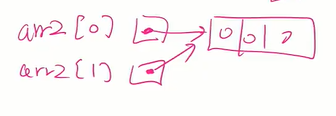

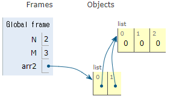


### 배열 순회

- n X m 배열의 n * m 개의 모든 원소를 빠짐없이 조사하는 방법

  for i : 0 -> n-1

  ​	A[i]


#### 행 우선 순회☆

```python
for i in range(len(Array)):  # i행의 좌표
    for j in range(len(Array[i])):  # j행의 좌표
        Array[i][j]  # 필요한 연산 수행
```

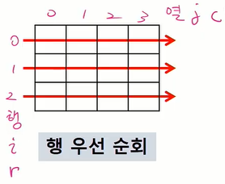

#### 열 우선 순회

j 가 정해지면 모든 행에 대해서 접근해야함.

```python
# i : 행의 좌표
# j : 열의 좌표

for j in range(len(Array[0])):
    for i in range(len(Array)):
        Array[i][j]  # 필요한 연산 수행
```

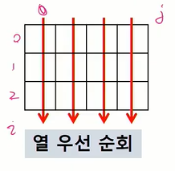

#### 지그재그 순회 

```python
for i in range(len(Array)):
    for j in range(len(Array[0])):
        Array[i][j + (m-1-2*j) * (i % 2)
                 #필요한 연산 수행
        
# 쉽게
for i in range(N):
    if i % 2 == 0:
        for j in range(M):
            print(arr[i][j])
    else:
        for j in range(M-1, -1, -1):
            print(arr[i][j])
```

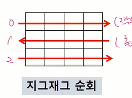


#### 델타를 이용한 2차 배열 탐색

- 2차 배열의 한 좌표에서 4방향의 인접 배열 요소를 탐색하는 방법

- i, j에 접근하고자 한다면
  - 오른쪽은 i + 0, j +1
  - 아래쪽은 i +1, j + 0
  - 왼쪽은 i + 0, j - 1
  - 위쪽은 i - 1, j + 0


```python
# 배열 N *M
# i가 행
# j가 열

# 첫 번째 방식
di[] [0, 1, 0, -1] #오른쪽에서 시계방향으로
dj[] [1, 0, -1, 0]

N, M = map(int, input().split())
arr = [list(map(int, input().split())) for _ in range(N)]

for i in range(N):
    for j in range(M):
        for k in range(4):  #상하좌우 토탈 4개 블록 볼 것임
            ni = i + di[k]
            nj = j + dj[k]
            # arr[ni][nj]  # 접근할 범위 벗어날 수 있음.
            if 0 <= ni < N and 0 <= nj < M:  # 사용할 범위 벗어나는지 체크
                arr[ni][nj]
    
    
# 다른 방식
for i in range(N):
    for j in range(M):
        for dr, dc in [[0, 1], [1, 0], [0, -1], [-1, 0]]:
            ni = i + dr
            nj = i + dc
            if 0 <= ni < N and 0 <= nj < M:
                arr[ni][nj] 
```


아래와 같은 방향일 경우

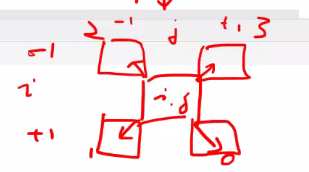

```python
di = [1, 1, -1, -1]
dj = [1, -1, -1, 1]
```


#### 전치 행렬

```python
내용 넣기
```


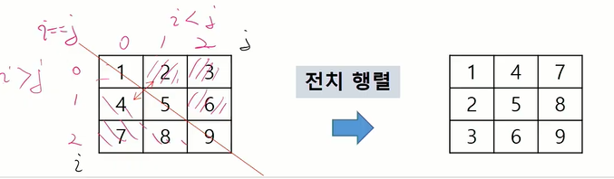


## 2. 분집합 합 문제

부분집합의 합이 0인 부분집합이 있는지

### 완전검색으로 푸는 경우

모든 부분집합을 생성한 후 합을 구함

#### 부분집합의 수

집합의 원소가 n개일 때, 공집합을 포함한 부분 집합의 수는 2^n 개이다.

포함된 경우(1) / 포함되지 않는 경우(0)  2개이므로 모든 원소에 대해 2 X 2 X .... 

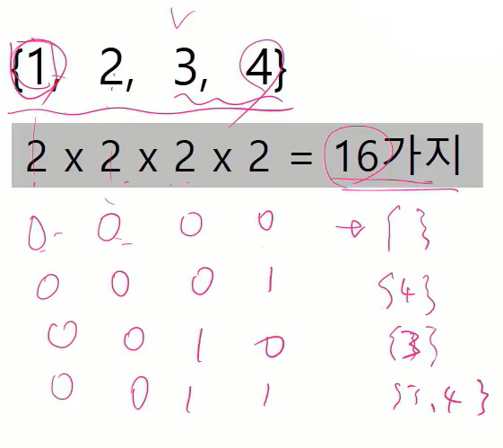

```python
#부분집합 생성하기

bit = [0, 0, 0, 0]
for i in range(2):
    bit[0] = i
    for j in range(2):
        bit[1] = j
        for k in range(2):
            bit[2] = k
            for l in range(2):
                bit[3] =l
                print(bit, end=' ') # 여기서 부분집합 원소의 유무 출력됨
                
                for p in range(4): # 생성된 부분 집합 출력
                    if bit[p]:  # 1이면 (포함되어있으면)
                        print(arr[p], end=' ')
                print()
```


#### 보다 간결하게 부분집합을 생성하는 방법


## 3. 비트 연산자

메모리에 숫자 10을 저장한다고 하면 실제로 저장되는 형태는 2진수가 되기 때문에 2진수 형태로 써놓는다.

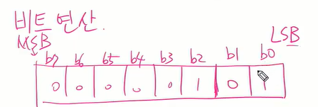


비트 연산 : 같은 범위 끼리만 연산을 하고 넘어가지 않음

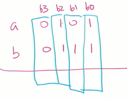

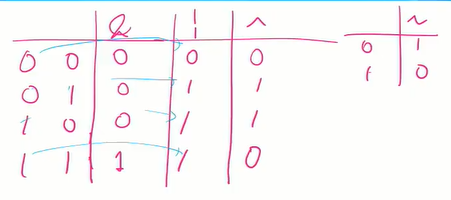


`&` : 비트 단위로 and 연산(특정 비트를 0으로 만들 때 활용)

`|` : 비트 단위로 or 연산 (특정 비트를 1로 만들 때 활용)

`^` : 두 개가 다르면 1이 됨

`~` : invert : not 이랑 비슷

`<<`  : 1<<n == 2^n

`>>`


### 비트 검사 

i의 j번 비트를 검사 

i & (1 << j )

​		ㄴ j 번 비트가 1인 값

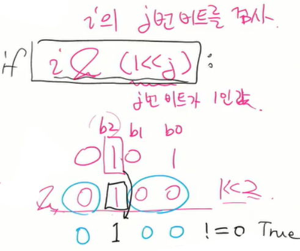


## 4. 검색

- 저장되어있는 자료 중에서 원하는 항목을 찾는 작업

- 목적하는 탐색 키를 가진 항목을 찾는 것

- 검색의 종류
  - 순차검색
  - **이진검색**
  - 해쉬


### 4. 1 순차 검색(sequencial)

- 일렬로 되어 있는 자료를 순서대로 검색하는 방법.
- 가장 간단하고 직관적인 검색 방법
- 배열이나 연결 리스트 등 순차구조로 구현된 자료에서 원하는 항목을 찾을 때 유용함
- 알고리즘이 단순하여 구현이 쉽지만, 검색 대상의 수가 많은 경우에는 수행 시간이 급격하게 늘어남

#### 검색 과정

- 첫 번째 원소부터 순서대로 검색. 대상과 키 값이 같은 원소가 있는지 비교하며 찾는다.
- 키 값이 동일한 원소를 찾으면 인덱스를 반환
- 자료 구조의 마지막에 이를 때까지 찾지 못하면 검색 실패

```python
def search(A, N, key):
    for i: 0 -> N-1 
        if A[i] == key:
            return i 혹은 return True
    return -1 #return False
```


#### 정렬되어 있지 않은 경우

- 찾고자 하는 원소의 순서에 따라 비교 회수가 결정됨
  - 첫 번째 원소를 찾을 때는 1번 비교, 두 번째 원소를 찾을 때는 2번 비교
  - 정렬되지 않은 자료에서의 순차 

```python
while문으로
```


#### 정렬되어 있는 경우

##### 검색 과정

- 자료 오름차순

- 순차적으로 검색하면서 키 값을 비교하여 원소의 키 값을....


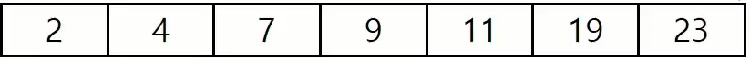

예) 11을 검색하는 경우

검색 성공

예) 10을 검색하는 경우

종료 조건이 내 값보다 큰 값이 나왔을 때


##### 찾고자 하는 원소의 순서에 따라 비교 횟수가 결정됨

- 정렬이 되어있으므로, 검색 실패를 반환하는 경우 평균 비교 횟수가 반으로 줄어든다.
- 시간 복잡도 O(n)

```python
def sequentialSearch2(a, n, key)
	i <- 0
    while i < n and a[i]< key:  # while로 탐색이 지속되는 조건:1)배열 안에서 2)key보다 작은 상황 
        i <- i+1				#(종료 조건1: key를 찾는 경우, 조건2: key보다 큰 값인 경우)
        	    			    #배열을 벗어나지 않은 경우 & 내가 찾는 값이 key 값보다 작으면 다음으로 넘어감
    if i<n and a[i] = key:
        return i
    else:
        return -1
    
    
# for문이면
for i : 0 -> n-1
    if a[i] == key:
        return i
    elif a[i] > key:
    	return -1
return -1    # for 문 벗어나는 경우 10까지 있는데 20이 있는 경우 찾아봐
```


### 4.2 이진 검색(Binary Search)

- 자료의 가운데 있는 항목의 키 값과 비교하여 다음 검색의 위치를 결정하고 검색을 계속 진행하는 방법
  - 목적 키를 찾을 때까지 이진 검색을 순환적으로 반복 수행함으로써 검색 범위를 반으로 줄여가면서 보다 빠르게 겁색 수행함
- 이진 검색을 하기 위해서는 자료가 **정렬된 상태**여야 한다.

#### 검색 과정

1. 자료의 중앙에 있는 원소를 고른다
2. 중앙 원소 값과 목표 값을 비교
3. 목표 값이 중앙 원소 값보다 작으면 자료의 왼쪽 반에 대해서 새로 검색을 수행하고, 크다면 오른쪽 반에 대해 새로 검색 수행
4. 찾고자 하는 값을 찾을 때까지 1~3 반복

 ```python
 def binarySearch(a, key):
     start <-0 
     end <- length(a)-1
     while start <= end :
         middle = (start + end)//2
         if a[middle] == key:  # 검색 성공
         	return middle
         elif a[middle] > key:  # 중앙 원소 값이 목표 값보다 크면
             end = middle - 1   # 목표 값이 더 아래이니 왼쪽에서만 검색
         else:
             start = middle + 1
     return False  # 검색 실패
 ```


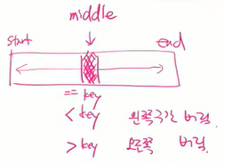

#### 재귀함수 이용

재귀함수를 이용하여 이진 검색을 구현할 수도 있다.


## 5. 인덱스

원본 데이터에 데이터가 삽입될 경우 상대적으로 크기가 작은 인덱스 배열을 정렬하기 때문에 속도가 빠르다.

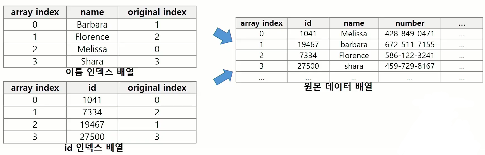


## 6. 선택 정렬

- 주어진 자료들 중 가장 작은 값의 원소부터 차례대로 선택하여 위치를 교환하는 방식
  - 앞서 본 셀렉션 알고리즘을 전체 자료에 적용한 것
- 정렬 과정
  - 주어진 리스트 중에서 최소값을 찾는다
  - 그 값을 리스트의 맨 앞에 위치한 값과 교환한다.
  - 맨 처음 위치를 제외한 나머지 리스트를 대상으로 위의 과정을 반복한다
  - 맨 마지막에 두 개가 남을 때까지
- 시간 복잡도 O(n2)


```python
def selectionSort(a) :
    for i in range(0, len(a)-1):
        minIdx = i
        for j in range(i+1, len(a)):
            if a[min] < a[j]:
                minIdx = j
        a[i], a[minIdx] = a[minIdx], a[i]
```


##### 참고) 버블 정렬 다시 보기

```python
for i : N-1 -> 1 #구간의 끝
    for j : 0 -> i-1
        if A[j] > A[j+1]:
            A[j] ,-> A[j+1]
        
```


## 7. 셀렉션 알고리즘

- 저장되어 있는 자료로부터 k번째로 큰 혹은 작은 원소를 찾는 방법을 셀렉션 알고리즘이라고 한다.
- 선택 과정
  1. 정렬 알고리즘을 이용하여 자료 정렬하기
  2. 원하는 순서에 있는 원소 가져오기


**일반적인 셀렉션 알고리즘:**

- k번째로 작은 원소를 찾는 알고리즘:

- 1부터 k번째까지 작은 원소들을 찾아 배열의 앞쪽으로 이동시키고, 배열의 k번째를 반환한다.

- k가 비교적 작을 때 유용하며 O(kn)의 수행 시간을 필요로 한다.

```python
def select(list, k) :
    for i in range(0, k):
        minIdx = i
        for j in range(i+1, len(list)):
            if list[minIdx] < list[j]:
                minIdx = j
        list[i], list[minIdx] = list[minIdx], list[i]
    return list[k-1]
```


#### 연습문제 3

배열을 초기화한 후 달팽이 모양으로 정렬...

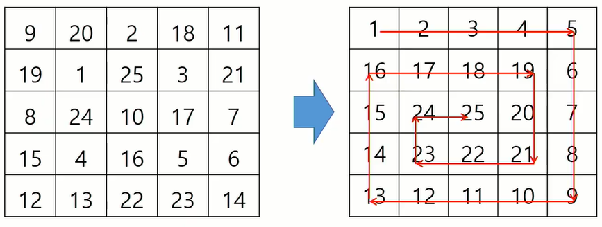

방법 3) 열이 증가 +5 -> 행 증가 +4 -> 열 감소 -4 -> 행 감소 -3 

​			열 증가 +3 -> 행 증가 +3 -> 열 감소 -2> 행 감소-2

​			열 증가 +1 -> 행 증가 +1

열에서 행으로 갈 때 길이 -1씩 감소


방법?)  dir += 1   0123 0123

cnt = 1  


접근할 칸의 좌표  ni, nj = i + di[k], j +dj[k]

​							 ni nj가 영역 내부 and  arr[ni] [nj] == 0 일 경우

​						

​						조건 만족 안 하면 k = (k+1)% 4

```python
di =[0, 1, 0, -1]
dj = [1, 0, -1, 0]

N = 5
cnt = 1 # 기록
# ni nj 에 cnt를 쓰려고 함
# 1) 유효한 범위인가?
i, j = 0, -1
k=0
while cnt < N*N:
    ni, nj = i+di[k], j+dj[k]
    if ni, nj가 유효하고 and A[ni][nj] == 0:
        A[ni][nj] = cnt
        cnt += 1
        i, j = ni, nj
    else:
        k = (k+1)%4 
    
```


​							


# 보충

공간을 잡아 놓아야 됨.

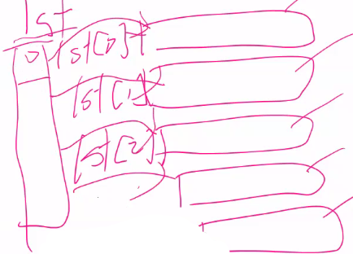


### 행 / 열 순회

```python
행 우선

나의 모든 행이 다 끝나야 다음 행으로 갈 수 있음


lst = [[2, 3, 4], [1, 1, 1], [2, 2, 2], [3, 3, 3], [4, 4, 4]]

for i in range(5):
    
ith 행을 먼저
lst[i][0], lst[i][1], lst[i][2]

    for j in range(3):
        print(lst[i][j])
        


열 우선
i 번째 열은 
lst[0][i], lst[1][i], lst[2][i]

for i in range(3):
    print(lst[j][i])
    for j in range(5):
        print(lst[j][i])
```


### 지그재그 순회


```python
# 지그재그
rows =len(lst)
cols = len(lst[0]) # 아무거나  넣어도 됨.. 어차피 모든 열 길이 똑같음


i : 0, 2, 4, 6

m: 20 이라고 가정

for j in range(m):
    print(lst[i][j])
    
    
    
홀수일 때 

for j in range(m-1, -1, 1):  #뒤에서부터~~~


프로그램 짜면:

for i in range(rows):
    if i % 2 == 0:
        for j in range(cols):
            print(lst[i][j])
    else: 
        for j in range(cols):
            print(lst[i][cols-1-j])
            
        # for j in range(cols):
        #     print(list[i][j])

# 교재는 i % 2 가 짝수이면 0 이므로 뒤에 사라지고
# i % 2  가 홀수이면 1 이므로 조건 살려져서 
```

  

### 2차원 배열

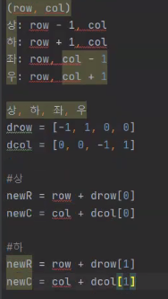


```python
for row in range(len(lst)):
	for col in range(len(lst[0]))
		for mode in range(4):
			newR = row +drow[mode]
			newC=col + dcol[mode]
			print(lst[newR] [newC])


```

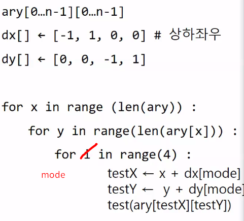


### 부분집합

```python
N = 5
for i in range(0, 0b100000): # 0b11111 + 1 = 0b100000
        #(1<<N 번 왼쪽으로 옮기는 것과 똑같음!! )

    sumV = 0  #부분집합의 합
    for j in range(N):
        if i & (i <<N) == 0:
            sumV += lst[j]
            print(i)
        #else:
            #print('0')
```


### 달팽이 문제

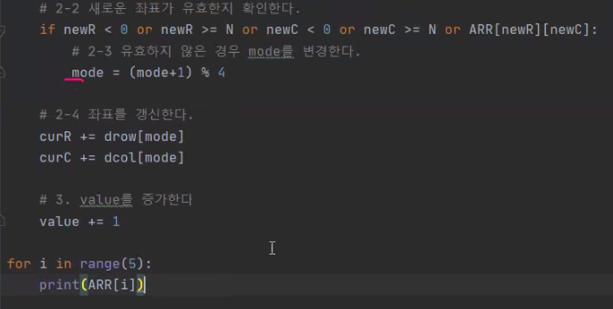

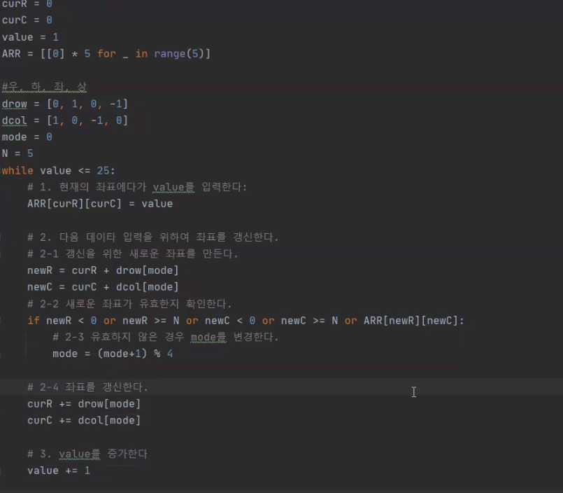

