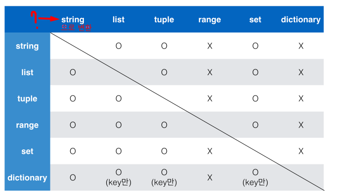
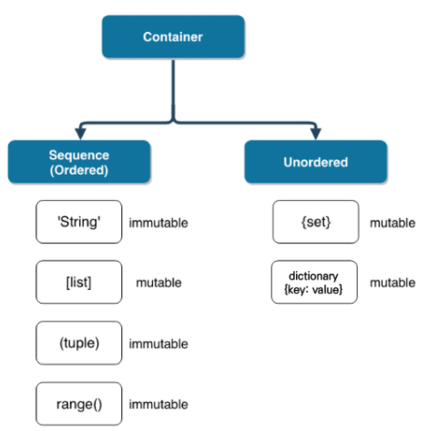

210719_ Python_컨테이너

1. 컨테이너
   1. 시퀀스 형
   2. 비시퀀스형


# 컨테이너(Container)

- 여러 개의 값을 저장할 수 있는 것(객체)

- 시퀀스형 : ordered data => 인덱스 값으로  접근할 수 있다
  - **<u>순서가 있다 != 정렬되어 있다</u>** ex) [2, 4, 1, 0] : 순서는 있지만 정렬은 x
  - list, tuple, range, string, binary
- 비시퀀스형 : unoredred data => key로 접근
  - set, dictionary 

### 리스트

- 순서가 있는 시퀀스로 인덱스를 통해 접근
  - 대괄호[] 혹은 list() 통해 생성
  - 값에 대한 접근은 list[i]
  
  ```python
  # 값 접근
  a = [1, 2, 3]
  print(a[0]) # 1
  ```
  
  ```python
  # 값 변경
  a[0] = '1'
  print(a) #['1', 2, 3] -> 서로 다른 타입의 데이터를 저장할 수 있음
  ```
  
  ```python
  a =[[1,2],[3,5]]
  a[0][1]  # 2
  ```
  
  


### 튜플

- **수정이 불가능한(immutable) 시퀀스**로 인덱스로 접근
  - 소괄호() 혹은 tuple()을 통해 생성
  - 값에 대한 접근은 tuple[i]
  
  ```python
  #값 접근
  a = (1, 2, 3, 1)
  a[1]	# 2
  ```
  
  ```python
  # 값 변경 => 불가능
  a[1] = '3' 
  ```

- 튜플은 일반적으로 파이썬 내부에서 활용됨 

  - multiple assignment

  - 추후 험수에서 복수의 값을 반환하는 경우에도 활용

  - 값을 할당할 때 : 

    x, y = (1, 2)      # list 로 하면 값이 변할 수 있는 가능성이 있어서 tuple 사용함

  - divmode(5, 2)     # class(tuple)

  > [Q] 예를들어 x, y = 1, 2 ; x = 3 이라 하면 x값이 바뀌게 되는데 이건 tuple의 특징과 무관한건가요? 
  >
  > [A] 네 :) 기존의 tuple은 immutable이라 수정이 불가능하기 때문에 새로운 tuple을 만들면서 그것을 sorting하는 방식으로 sorting이 진행됩니다.

- <u>**하나의 항목으로 구성된 튜플 생성하려면 쉼표 붙여야 함.**</u>
  
  - (1) : 이건 tuple 아니고 int
  - <u>(1,)</u>

### 레인지

- range 는 숫자의 시퀀스를 나타내기 위해 사용
  - 기본형 : range(n) : **0 부터 n-1까지** 숫자의 시퀀스(순서가 있는)
  - 범위 지정 : range(n, m) : n부터 m-1까지
  - 범위 및 스텝 지정 : range(n, m, s) : n부터 m-1까지 s만큼 증가시키며 숫자의 시퀀스

```python
# 역순
list(range(6, 1, -1))
```


### 시퀀스에서 사용하는 !

### Concatenation (+)

|      operation |                    설명 |
| -------------: | ----------------------: |
|       x `in` s |        containment test |
|   x `not in` s |        containment test |
|      s1 `+` s2 |           concatenation |
|        s `*` n | n번만큼 반복하여 더하기 |
|         `s[i]` |                indexing |
|       `s[i:j]` |                 slicing |
| **`s[i:j:k`]** |   **k간격으로 slicing** |
|         len(s) |                    길이 |
|         min(s) |                  최솟값 |
|         max(s) |                  최댓값 |
|     s.count(x) |                x의 개수 |

- 시퀀스 간의 concatenation
  - [1, 2] + [a]  -> [1, 2, 'a']
  - (1, 2) * 3 -> (1, 2, 1, 2, 1, 2,)
  - 'hi' * 3 -> 'hihihi'
  - range 는 TypeError 발생시킴

### 인덱싱(indexing)

- [1 ,2, 3] [2]   -> 3

### 슬라이싱(Slicing)

- [|a,|b,|c,|d,|e]	#인덱스 기준 아니라 사이사이라고 생각하기

   0   1   2   3   4  

  ```python
  # 리스트
  [1, 2, 3, 5][1:4] 
  #[2, 3, 5]
  
  # 튜플
  (1, 2, 3)[:2]
  (1, 2) 
  
  # range
  range(10)[5:8]
  range(5, 8)  #(5,6,7)?
  
  # 문자열
  'abcd'[2:4]
  #'cd'
  
  ```
  
  ```python
  # 리스트
  [1,2,3,5][0:4:2]
  #[1,3]
  
  #튜플
  (1, 2, 3, 5)[0:4:2]
  #(1,3)
  
  # range
  ranage(10)[1:5:3]
  range(1,5,3) # 1, 4
  
  #문자열
  'abcdefg'[1:3:2]
  # 'b'
  ```

### 길이

- 시퀀스의 길이

  ``` python
  #리스트
  len(list())
  ```

### 최소/ 최대 : min()/max()

- 시퀀스에서의 최소/최대값

- 문자열은 ascii 코드로 확인

  ```python
  #리스트
  min([1, 100, 59])
  ```

### count : .count()

- 시퀀스에서의 특정 원소의 개수

  등장하지 않은 경우 0 반환

  ``` python
  #리스트
  [1,2,1,2,4].count(1)   #답 : 2
  
  #튜플
  (1, 2, 3, 1, 1,).count(1)
  ```

  ```python
  ([1, 2]*2 + ['apple', 'banana'])[4].count('a') in range(2, 5)
  # ([1, 2, 1, 2, 'apple', 'banana'])[4]
  # 'apple'.count('a') -> 1
  # 1 in range(2, 5) -> False
  ```

  

### 세트(set)

- 순서가 없는 자료 구조

  - **{} 혹은 set()을 통해 생성**

    **그냥 {} 로 만들면 빈 딕셔너리 됨...** 

  - 순서가 없어서 별도의 값에 접근할 수 없음

- 집합과 동일한 구조

  - 집합 연산이 가능
  - 중복된 값 존재하지 않음

  ``` python
  {1, 2, 3, 1, 2} 
  #{1, 2, 3} <---- 중복 값 제거
  
  print(type{1, 2, 3})
  #<class 'set'>
  
  blank = {}
  print(blank)
  #<class 'dict'>
  ```

- 집합 연산자

  ```python
  set_a = {1, 2, 3}
  set_b = {3, 6, 9}
  
  #차집합
  print(set_a - set_b)
  #{1, 2}
  ```

- 세트의 활용

  - 중복 값 제거 : 단 이후 순서가 중요한 경우 사용할 수 없음

### 딕셔너리

- key와 value가 쌍

  - {} 혹은 dict()으로 만듦

- **key 는 변경 불가능한 데이터(immutable)만 사용 가능** : string, integer, float, boolean, tuple, range

- value 는 모든 값으로 설정 가능 : 리스트, 딕셔너리 등

  ``` python
  dict_d = {'a': 'apple', 3: '삼', '지역':'서울'}
  ```

- 실습 문제

  - 풀기


# 컨테이너의 특징

### 컨테이너 형 변환

- 반드시 직접 해보기 !! 

  

### 컨테이너 분류

- 변경 가능한 데이터(mutable)

  - list
  - set
  - dictionary

  ``` python
  num1 = [1, 2, 3, 4]
  num2 = num1		#이 경우 동일한 리스트(객체)의 주소를 참조하고 있음
  num2[0] = 100
  
  print(num1)		#[100, 2, 3, 4] 원본도 바뀜
  print(num2)		#[100, 2, 3, 4]
  ```

- 변경 불가능한 데이터(immutable)

  - 리터럴 - 숫자 , 문자열, 참거짓
  - range
  - tuple

  ```python
  a = 20
  b = a
  b = 10
  
  print(a)	#20
  print(b)	#10
  ```

### 컨테이너 분류




