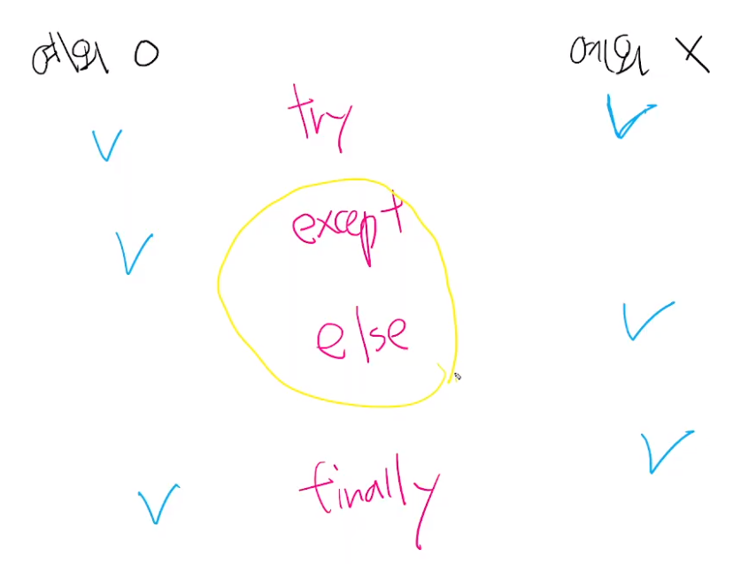

에러/ 예외 처리


### 디버깅

### 에러(Error)

### 문법 에러(Syntax Error)

- Invalid syntax :
- assign to literal :
- EOL
- EOF 


### 예외(Exception)

**<u>문법적으로 틀린 것은 아님</u>**

실행 중 감지되는 에러들을 예외(Exception)라고 부름

NameError, TypeError 등은 발생한 예외 타입의 종류(이름)


- ZeroDivisionError : 0으로 나누고자 할 때 발생

- NameError : namespace상에 이름이 없는 경우

- TypeError : 타입 불일치

- TypeError : argument 누락

  ex) divmod() 인자 2 개 받아야 하는데 누락된 경우

- TypeError : argument 개수 초과

- TypeError : argument type 불일치

  ex) random.sample() #반드시 

- ValueError - 타입은 올바르나 값이 적절하지 않거나 없는 경우

  int('3.5')

  range(3).index(6)

- IndexError - 인덱스가 존재하지 않거나 범위를 벗어나는 경우

- KeyError - 해당 키가 존재하지 않는 경우

- ModuleNotFoundError - 존재하지 않는 모듈

- ImportError - Module은 있으나 존재하지 않는 클래스/함수를 가져오는 경우

  from random import sam

- KeyboardInterrupt - 임의로 프로그램을 종료하였을 때

- IndentationError - Indentation이 적절하지 않은 경우


# 예외 처리(handling exception)

- try문(statement) / except절(clause)을 이용하여 예외 처리를 할 수 있음
- try 아래의 코드 블록이 실행됨

```python
try:
    num = input('숫자입력 : ')
    print(int(num))
except ValueError:   		#에러의 종류 적어줌
    print('숫자가 아닙니다.')
    
    
try:
    num = input('숫자입력 : ')
    print(int(num))
except:   						#에러 전부 포함함 
    print('숫자가 아닙니다..')
```


- 복수의 예외 처리 실습:

  100을 사용자가 입력한 값으로 나누고 출력하는 코드를 작성하시오.

  발생할 에러

  1. 문자 : 문자열을 int 로 형변환 : TypeError
  2. 0 : 0으로 숫자를 나눔 : ZeroDivisionError 

```python
try:
    num = input('100으로 나눌 값을 입력하시오: ')
    100/int(num)
except Exception:   						#Exception은 가장 큰 범주 
    print('에러가 뭔지 모르겠지만 발생했습니다.') #위에서 다 걸려서 아래의 except절은 실행 안 됨.. 
except ValueError: 			#이게 위로 가야함!! 
    print('숫자를 넣어')
```

100으로 나눌 값을 입력하시오: 안녕

에러가 뭔지 모르겠지만 발생했습니다.


### 예외 처리 종합

- try : 코드를 실행함

- except : try문에서 예외가 발생시 실행함

- else : try문에서 예외가 발생하지 않으면 실행함(except랑 반대)

- finally : 예외 발생 여부와 관계 없이 실행

  ex) 파일을 열고 읽는 코드를 작성하는 경우

  - 파일 열기 시도(try)

    - 파일 없는 경우 -> '파일 없습니다'
    - 파일 있는 경우 -> 파일 내용을 출력

  - 해당 파일 읽기 작업 종료 메시지 출력(finally)

  -  예외 발생 여부에 따라서 반드시 출력되었으면 하는걸 else문 except문 각각 중복해서 쓰는거보다는 finally에만 쓰는게 효율적이라..

  - Q: finally를 안써도 그냥 아래에 쓰면 실행 되는데 굳이 finally를 써야하는지를 물어보시는 거 같아요

  - 그 부분은 반드시 해당 try 문 안에서 반드시 실행되어야 할 구현부를 try문 밖에서 쓰는거보다 try문 안에서 쓰는게 유지보수 측면에서 유리해서에요!

    

```python
def my_func(a):
    try:
        result = int(a)
        return result
    except:
        return False
    finally:                #finally 무조건 실행되기 때문에 3.5 나온 다음에 False 출력됨... ㅎ..
        print(a)

print(my_func('3.5'))

"""
위에서부터 순차적으로 실행된다고 했는데, finally 부분이 먼저 출력되는 게 어떻게 되는 건지 다시 한 번 설명해 주실 수 있나요?
"""

def my_func2(a):
    try:
        result = int(a)
        return result
    except:
        return False
    print(a)

print(my_func2('3.5'))
```


- as 키워드를 활용하여 원본 에러 메세지를 사용할 수 있음.

  하하하하하하하


# 예외 발생시키기

### raise statement

- 예외를 강제로 발생

  ```python
  raise <표현식>('메세지')
  ```

### assert

- 무조건 AssertionError가 발생 (TDD: test driven developer 할 때 씀)
- $DDD: Deadline driven developer$
- 디버깅 용도로 사용
- 파이썬에서 실행 : -O 옵션으로 실행하는 경우, assert문과 `__deburg__` 


