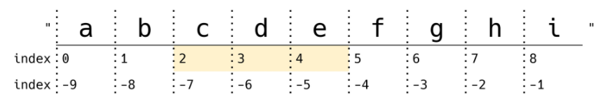
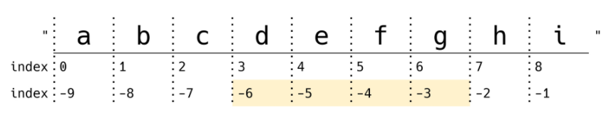
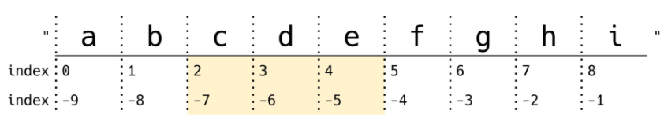
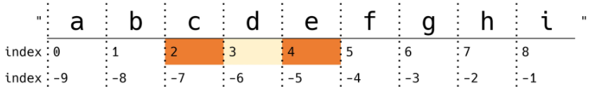
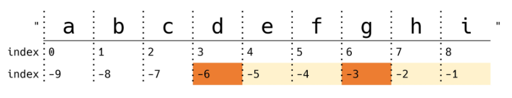
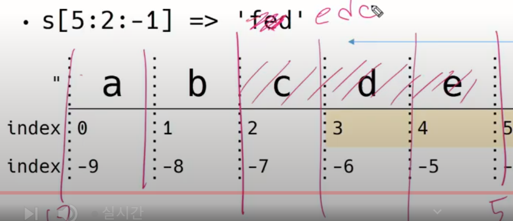
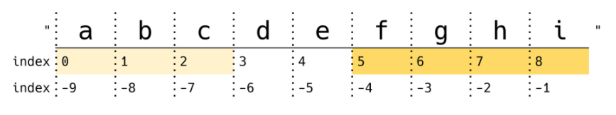
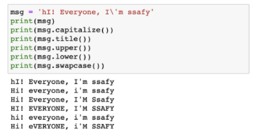
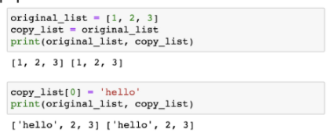
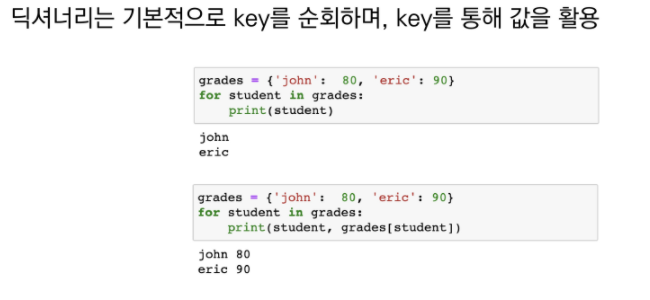

# 210726_Data_Structures


# 0. 데이터 구조

- Niklaus Wirth : 프로그래밍 언어 파스칼 설계

  Algoritms과 Datastructures 가 Programs의 기본 단위다

- 데이터에 편리하게 접근하고 변경하기 위해 데이터를 저장하거나 조작하는 법
  1. 순서가 있는 데이터 구조(시퀀스) : 문자열, list
  2. 순서가 없는 데이터 구조(비시퀀스) : set, dictionary


# 1. 문자열

- 문자열의 특징:

  - **변경할 수 없고(immutable)**
  - **순서가 있고(ordered) : 정렬 x**
  - **순회 가능한(iterable)** 

- immutable

  ```python
  a = 'mystring?'
  a[-1] ='!' #-1번째 인덱스를 !로 바꿀 수 있는가?
  
  # Type error
  ```

- iterable : 반복문 사용 가능~~~!

  ```python
  a = '123'
  for char in a:
      print(char)
      
  #1
  #2
  #3
  ```

### 1. 1 문자열 인덱스

​		 " a   b   c"

index  0   1   2

index -3  -2  -1


### 1. 2 문자열 자르기(slicing)

- **s[start : stop : step]**

- s[2 : 5]



- s[-6 : -2]   => 'defg'



- s[2 : -4]



- s[2 : 5 : 2]

  

- s[-6 : -1 : 3]



- s[2 : 5 : -1] => ' '   #2부터 5까지 거꾸로 셀 수가 없음. 2와 5 사이를 거꾸로 세고 싶으면 아래처럼 
- s[5 : 2 : -1] => 'edc'



- s[ : 3] 비어있으면 처음부터

- s[5: ] 비어있으면 끝까지

  

- s[ : : ] =>'abcdefghi'           전체 출력

- s[ : : -1] => 'ihgfedcba'       **뒤집기**

  - s[-1: -(len(s)+1) : -1]


### 1.3 문자열 조회 / 탐색

**문자열.find(x)**

- x의 **첫 번째 위치를** 반환. 
- **없으면 -1 반환**

```python
'apple'.find('p')

#1
```


**문자열.index(x)**

- x의 첫 번째 위치를 반환.
- 없으면 ValueError

```python
'apple'.index('p')
```


### 1.4 문자열 변경

**문자열.replace(old, new[,count])**

- 바꿀 대상 글자를 새로운 글자로 바꿔서 반환(복사본 반환)

- count를 지정하면 해당 개수만큼만 시행

  ```python
  'coone'.replace('o', 'a')
  ```

  'canne'

  ```python
  'wooooowoo'.replace('o', 'a', 2)
  ```

  'waaooowoo'

  - 배커스 - 나우르 표기법(BNf) [ ] : 선택적 인자(옵셔널)로 넣어도 되고 안 넣어도 되는 것의 문서상 표기법임... 즉 , 2 는 없어도 실행된다


**문자열.strip([chars])**

- **특정한 문자들을 지정**하면 지정한 문자열 없을 때 까지 제거함.

- 양쪽을 제거하거나(strip), 왼쪽을 제거하거나(lstrip), 오른쪽 제거(rstrip)

- .strip() : 생략되거나 none이라면 공백을 제거함

  ```python
  '   와우!\n'.strip()
  ```

  '와우!'   => 개행도 제거됨

  ```python
  '  와우!\n'.lstrip()
  ```

  '와우!\n'   =>왼쪽 공백만 제거됨

  ```python
  '   와우!\n'.rstrip()
  ```

  '        와우!' =>오른쪽 개행만 제거됨

  ```python
  '안녕하세요????'.strip('?')
  ```

  '안녕하세요'   => 지정한 문자열 전부 제거됨. 


**문자열.split(sep=None)**

- 문자열을 특정한 단위로 나눠 **리스트로 반환**

  ```python
  'a,b,c'.split('_') #언더바 쓰면 문자열 그대로 통으로 리스트로 변환됨.. 따로 따로 아님.
  ```

  ['a, b, c'] => 아래처럼 하고 싶으면 split(',') 쓰면 됨.

  ```python
  'a b c'.split()
  ```

  ['a', 'b', 'c']


**'separator'.join([iterable])**

- **반복가능한 컨테이너 요소들**을 separator(구분자)로 합쳐 **문자열 반환**

  ```python
  #문자열을
  '!'.join('ssafy')  #문자열 '!'로 합쳐 문자열 반환
  ```
  
  's!s!a!f!y!'
  
  ```python
  #리스트를
  ' '.join(['3', '5'])  #문자열 ' '로 합쳐 문자열 반환
  ```
  
  '3 5'


###### <etc.>

**.capitalize()** : 앞글자만 대문자, 나머지는 소문자로

**.title()** : '나 공백 이후를 대문자로

**.upper()** : 모두 대문자로

**.lower()** : 모두 소문자로

**.swapcase()** : 대<->소문자로 변경하여

​	


### 문자열 관련 검증 메서드

- is 로 된 함수는 True or False 로 return

**.isalpha()** : 알파벳 문자 여부 (유니코드상 letter : 한국어도 포함)

**.isupper()** : 대문자 여부

**.islower()** : 소문자 여부

**.istitle()**: 타이틀 형식 여부


# 2.리스트

- 순서가 있는 시퀀스, 인덱스로 접근
- 리스트의 특징
  - **변경 가능하고(mutable)** != 문자열
  - **순서가 있고(ordered)**
  - **순회 가능한(iterable)**


### 2.1 값 추가 및 삭제

### 2. 1. 1 리스트 추가

**.append(x)**

- 리스트의 끝에 값을 추가함

  ```python
  cafe = ['starbucks','tomntoms', 'hollys']
  cafe.append('banapresso')
  
  #['starbucks','tomntoms', 'hollys','banapresso']
  ```


**.extend(iterable)**

- 리스트에 **iterable의 <u>항목</u>**을 추가함

  ```python
  cafe.extend['coffee']  #'coffee'라는 문자열을 가진 list 하나를 추가했더니
  # ['starbucks','tomntoms', 'hollys','coffee']  #리스트의 항목을 추가함.
  
  # cafe += ['coffee'] 와 동일.
  ```

  ```python
  cafe.extend('coffee')  # 'coffee' 라는 문자열을 넣으면
  
  #[ 'starbucks','tomntoms', 'hollys', 'c', 'o', 'f', 'f', 'e', 'e']  
  #문자열의 항목을 리스트에 각각... 추가...
  ```


**.insert(i, x)**

- 정해진 위치 i 에 x 값 추가:

- 리스트 길이보다 큰 경우 **맨 뒤에 추가됨** : error 안 일어남.

  ```python
  cafe = ['starbucks','tomntoms', 'hollys']
  cafe.insert(0, 'start')
  
  #['start', 'starbucks','tomntoms', 'hollys']
  
  cafe.insert(100000, 'start')
  ['starbucks','tomntoms', 'hollys', 'start']
  ```

  

### 2.1.2 리스트 삭제

**.remove(x)**

- 리스트에서 값이 x 인 **첫번째 항목** 삭제
- 없는 것 지우려면 ValueError

**.pop(i)**

- 정해진 위치 i에 있는 값을 삭제하고, **그 항목을 반환함** (변수에 할당할 수 있다는 의미)

- i가 지정되지 않으면 마지막 항목을 삭제하고 반환함

  ```python
  numbers = ['hi', 1, 2, 3]
  print(numbers)
  numbers.pop()  # x = numbers.pop()처럼 변수에 할당해서 쓸 수 있음 # x = 3, type(X) = int
  print(numbers) 
  ```

**.clear()**

- 모든 항목을 삭제함 : [ ]


### 2. 3 탐색 및 정렬

**.index(x)**

- 리스트 중에 첫 번째로 만나는 x 를 찾아 index 값 반환

- 없는 경우 ValueError

  ```python
  numbers = [1, 2, 3, 4]
  print(numbers.index(3)) # 2
  print(numbers.index(100)) #리스트 안에 없는 element이므로 error
  ```

**.count(x)**

- 원하는 값 x의 개수를 반환함

  ```python
  numbers = [1, 2, 3, 1, 1]
  numbers.count(1)  # 3
  numbers.count(100) # 0 #개수니까 error 안 나고 0 반환
  ```

  

**.sort()**

- **원본 리스트**를 정렬함. **None 반환**

- **Sorted 함수**(내장함수)와 비교할 것 = 정렬된 복사본 반환함.

  - .sort()

    ```python
    numbers =[3, 2, 5, 1]
    result = numbers.sort()
    print(numbers, result)
    
    #[1, 2, 3, 5] 로 원본 변경됨
    ```
  
  - sorted()
  
    ```python
    number = [3, 2, 5, 1]
    result = sorted(numbers)
    print(numbers, result)
    #[3, 2, 5, 1] [1, 2, 3, 5]
    ```

**.reverse()**

- 순서를 반대로 뒤집음 (정렬x) 

- 원본을 변경.  복사본 None

  


### 리스트 복사


- 리스트 복사 : **원본까지 변경됨**. 같은 주소를 참고한다. (가변 특징)

  

- 얕은 복사(shallow copy):

  slice 연산자를 활용하여 같은 원소를 가진 리스트지만 연산된 결과를 복사(다른 주소)

  ```python
  a = [1, 2, 3]
  b = a[:]
  print(a, b)
  b[0] = 5
  print(a, b)
  ```

  [1, 2, 3] [1, 2, 3]

  [1, 2, 3] [5, 2, 3]

- 얕은 복사2(shallow copy):

  list() 활용하여 같은 원소를 가진 리스트지만 연산된 결과를 복사(다른 주소)

  ```

깊은 복사 필기


### List comprehension

- 표현식과 제어문을 통해 특정한 값을 가진 리스트를 생성하는 법

  [<expression> for <변수> in <iterable>]

  [<expression> for <변수> in <iterable> if <조건식>]

- 1~3의 세제곱 결과가 담긴 리스트를 만드시오

  - for문

    ```python
    ```

    [1, 8, 27]

  - list comprehension

    ```python
    [number**3 for number in range(1, 4)]
    ```

    [1, 8, 27]

- 1~3까지 숫자 중 짝수만 담긴 리스트를 만드시오.

  - for문

    ```python
    ```

    [2]

  - list comprehension

    ```python
    [x for x in range(1, 4) if x % 2 == 0 ]
    ```

    [2]

- 반복문 

  - for 문

    ```python
    
    ```

    [ 필기]

  - list comprehension

    ```python
    [(boy, girl) for boy in boys for girl in girls]
    ```


### Built-in Function - map

**map(function, iterable)**

- 순회 가능한 구조(iterable)의 모든 요소에 함수(fuction)적용하고, 그 결과를 map object로 반환

  ```python
  numbers = [1, 2, 3]
  result = map(str, numbers)
  print(result, type(result))
  
  
  출력
  `< object at 03jhsdxxg > <class 'map'>
  ```

  ```python
  list(result)
  ```

  [1, 3]

- 알고리즘 문제 풀이시  input 값들을 숫자로 바로 활용하고 싶을 때

  ```python
  n, m
  ```

  

**filter(function, iterable)**

- 순회 가능한 구조(iterable)의 모든 요소에 함수(fuction)적용하고, 그 결과가 True인 것들을 filter object로 반환.

  ```python
  def odd(n):
      return n % 2
  numbers = [1, 2, 3]
  result = filter(odd, numbers)
  print(result, type(result))
  ```

  ```python
  list(result)
  ```

  [1, 3]


**zip(*iterables)**

- 복수의 iterable을 모아 튜플을 원소로 하는 zip object를 반환

  ```python
  예시 필기하기
  
  
  ```

  


# 3. 세트


### 세트

- 중복 없이 순서가 없는 데이터 구조
- 문자열의 특징
  - 변경 가능하고
  - 순서가 없고
  - 순회 가능한

**.add(elem)**

- 세트에 값 추가

  ```python
  a = 
  ```

  

**.update(*others)**

- 여러 값을 추가


**.remove(elem)**

- 세트에서 삭제하고, 없으면 KeyError


**.discard(elem)**

- 세트에서 삭제하고 없어도 에러가 발생하지 않음.


**.pop()**

- 임의의 원소를 제거해 반환.


# 4. 딕셔너리


### 조회

**.get(key[,default])**


**.pop(key[,default])**

- key가 딕셔너리에 있으면 제거하고 해당 값을 반환

- 그렇지 않으면 default 를 반환
- default 값이 없고 key 가 딕셔너리에 없으면 KeyError


**.update()**

- 값을 제공하는 key, value로 갱신(기존 key는 덮어씀)

  ```python
  
  my_dict.update(apple = '사과')
  ```


### 딕셔너리 순회

- 기본적으로 key를 순회하며, key를 통해 값을 활용

  ```python
  grades ={ 'john' :80}
  ```

  


- 추가 메서드를 활용하여 순회할 수 있음.

  - keys() 

    dict_keys(['john', 'eric'])

  - values()

    dict_values([80, 90])

  - items()

    dict_items([('john', 80) , ('eric', 90)])

    ```python
    grades = { 입력 }
    for name, score in grades.itmes()
    	print(name, score)
    ```

    john 80

    eric 90

### Dictionary Comprehension

- 딕셔너리에서 값이 70 이상으로 구성된 딕셔너리를 작성하시오.

  ```python
  result = {}
  for key, value in dusts.items()
  	if value >70 :
          result[key] = value
          
  print(result)
  ```

  {'서울' : 72, '대전' : 82 }

  ```python
  {key:value for key, value in dusts.items() if value> 70}
  ```

  {'서울' : 72, '대전' : 82 }

- 