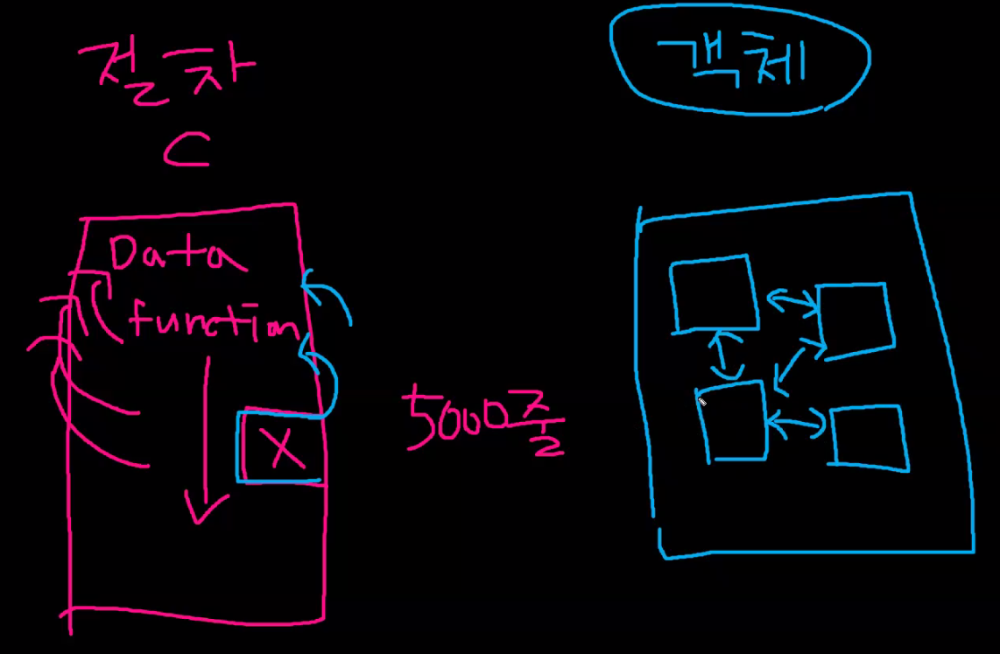
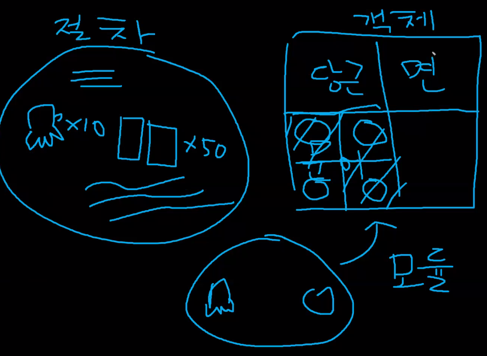
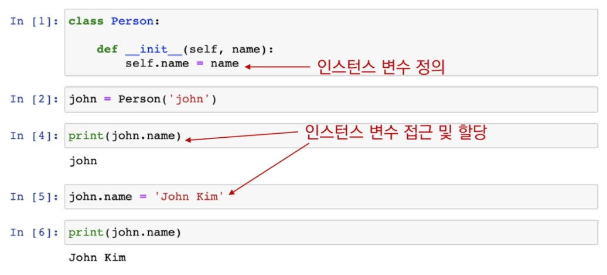
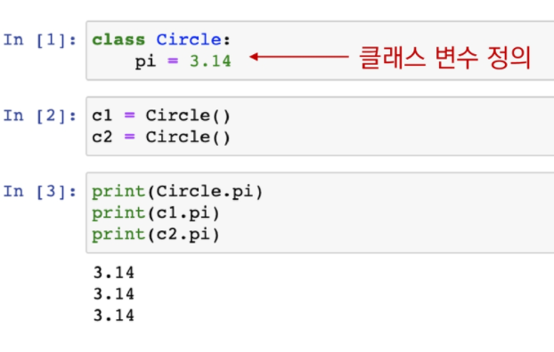
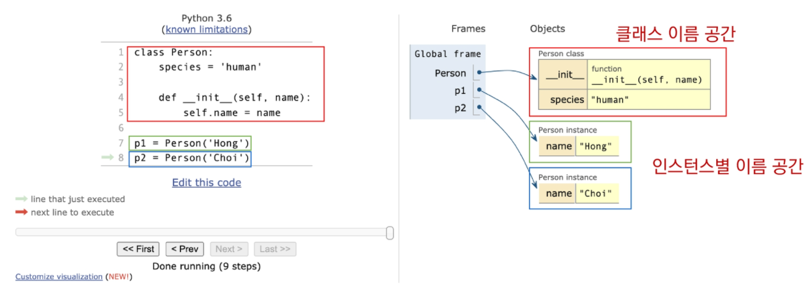
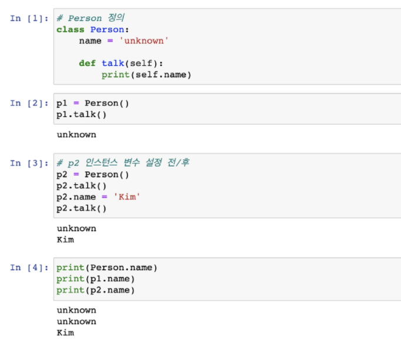
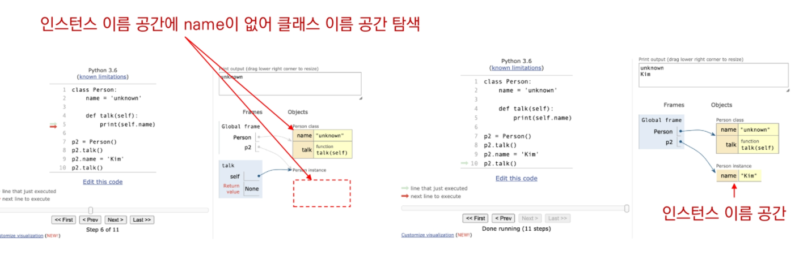

# OOP

목차

- 객체
- OOP
- 클래스와 인스턴스
- 상속


### ?절차지향

C 

5000 줄의 code 중에 한 부분을 바꾸면 인과관계 파악이 어려웠음

객체지향은 의미있는 코드 덩어리로 만들어 상호작용하도록 만든 것.




# 객체

정보(상태, 데이터) + 행동  으로 표현 가능한 것은 모두 객체이다.

이름이 있는 것은 다 객체라고 보면 됨. ex) 웅교수님, 강아지


변수(정보)

함수 (메소드)

로 설계도(클래스) 만들어 ======> 디지털로 (인스턴스) 실제로 일을 하는 존재

일정하게 정해진 행동을 하는데, 그것 중 일부 바꾸려면 설계도(클래스) 만 바꾸면 됨\(교수님 스크린샷... ㅜㅜ)

ex) 

문어가 재료인디 문어가 난리치면 문어만 바꾸면 됨...!

오른쪽처럼 분리해서 가져가는 것임




##### my_lower('Hi')  vs 'Hi'.lower()

**my_lower('Hi')** : 함수 : 데이터가 인자로 들어가고 있음. 함수가 객체를 처리

**'Hi'.lower()** : 데이터(객체)가 매서드를 호출 함. 


##### sorted([3, 2, 1])  vs [3, 2, 1].sort()

**sorted([3, 2, 1])** : 리스트를 정렬하겠다

**[3, 2, 1].sort()** : 내가 정렬할 거야


### 객체

: 객체(object)는 특정 타입(자료형)의 인스턴스(instance) 이다.

- 123, 900, 5는 모두 int 의 인스턴스
- 'hello', 'bye'는 모두 string의 인스턴스
- [232, 89, 1], []은 모두 list의 인스턴스

클래스 : 종류별로 나눈 것 . 


##### 객체의 특징

- 타입(type) : 어떤 연산자(oprator)와 조작(method)이 가능한가?
- 속성(attribute): 어떤 상태(데이터)를 가지는가?
- 조작법(method): 어떤 행위(함수)를 할 수 있는가?

```python
pirnt(type'1')
```

<class 'str'> 

```python
help(Str)
```

...

우리가 생각하는 문자열 1은

```python
'1'
```

내부적으로는 str(1) 로 처리됨

```python
print(Str(1))
```

1   <= 요1 은 string의 instance


### is 연산자(equal)

객체의 아이덴티티를 검사하는 연산자

```python 
type(10)
```

int

```python
type(10) is int
```

True

```python
type(0) is bool
```

False


### instance 함수

##### isinstance(object, class)

- classinfo의 instance거나 subclass* 인 경우 True (*상속에서 추가 설명)

- classinfo가 tuple 인 경우(type으로 구성된) 하나라도 일치하면 True

  ```python
  isinstance(10, object) #객체의 인스턴스인가?
  ```

  True

  ```python
  isinstance(0, (bool, int, complex)) #이중 하나와 일치?
  ```

  True


### 객체 - 속성(attribute)

- `<object>.<attribute>`

- 속성은 객체의 상태 / 데이터

  ```python
  (3 + 4).real #속성에는 () 괄호 없음
  ```

  3


### 객체 - 메서드(method)

- `<object>.<method>`
- class 안에 함수 있는데 이를 method 라고 함.

```python
- class random :

  	def sample:

  		pass

   	def  choice:

   		pass
```


```python
[1,2,3].pop
```

3

```python
'hello!'.capitalize()
```

'Hello!'

```python
{'a' : 'apple'}.items()
```

dict_items([{('a', 'apple')])


# 객체 지향 프로그래밍 (OOP)

### 프로그래밍 패러다임 

- 기능에 따라 프로그래밍 언어를 분류하는 방법
  1. 명령형 프로그래밍
     1. 절차지향
     2. 객체지향
  2. 선언형 프로그래밍


### 객체지향 프로그래밍

- 프로그램을 명령어의 목록으로 보는 시각에서 벗어나 여러 개의 독립된 단위, 즉 '객체'들의 모임으로 파악하고자 하는 것이다.
- 데이터와 기능(메서드) 분리, 추상화된 구조(인터페이스)


##### ※절차 지향 프로그래밍

데이터와 함수에 의한 변화


### why 객체 지향 프로그래밍?

-> 현실 세계를 프로그램 설계에 반영 (추상화)


오후 시간


```python
a = 1 
b = 2
# a, b는 객체다.
# a, b는 int class의 인스턴스다.
```


### 사각형의 넓이를 구하는 프로그래밍


### 객체 지향 프로그래밍

클래스(class) - 사각형

사각형의 정보 - 속성(attribute)

​	: 가로 길이, 세로 길이

사각형의 행동 - 매서드(method)

​	: 넓이, 둘레


### 클래스와 인스턴스

- 클래스를 정의하고, 인스턴스들을 만들어 활용함
  - 클래스 : 객체들의 분류(class)
  - 인스턴스 : 하나하나의 실체 / 예(instance)

```python
class Person:
    pass
type(Person)
```

type

```python
person1 = Person()
isinstance(person1, Person)
```

True

```python
type(person1)
```

__main.Per1son


### 속성 

- 특정 데이터 타입/ 클래스의 객체들이 가지게 될 상태/ 데이터를 의미


### 매서드

- 특정  데이터 타입/클래스의 객체에 공통적으로 적용 가능한 함수


### self

- 인스턴스 자기 자신
- 파이썬에서 인스턴스 메서드는 호출 시 첫 번째 인자로 인스턴스 자신이 전달되게 설계


```python
# 축약형(객체 지향형)
'apple'.capitalize()
```

'Apple'

- capitalize(self, ) : 호출시 첫 번째 인자로 인스턴스 자신이 전달되게 설계 
  -  매개변수로 self 와야 한다. !!반드시!!

-  **구조상** : `str.capitalize('apple')` => 여기에 자기 자신이 들어가서 동작이 되기 때문.


### 생성자(constructor)

- 인스턴스 객체가 생성될 때 호출되는 메서드

  ```python
  class Person: 
      def __init__(self):
          priht('인스턴스가 생성되었습니다.')
  ```

  ```python
  person1 = Person()
  ```

  인스턴스가 생성되었습니다.

- 이름 가지는 경우 있음

  ```python
  class Person:
      def __init__(self, name):
          print(f'인스턴스가 생성되었습니다 : {name}')
  ```


### 소멸자

- 인스턴스 객체가 소멸되기 전에 호출되는 메서드

  ```python
  class Person:
      def __del__(self):
          print('사라졋습니다')
      
      
  person1 = Person()
  del person
  ```

  


### 매직 메서드

- Double underscore(__) (던더메서드) 가 있는 메서드는 특수한 동작을 위해 만들어진 메서드로, 스페셜 메서드 혹은 매직 메서드라고 불림.


### 매직 메서드 예시

- 객체의 특수 조작 행위를 지정(함수, 연산자 등)
  - `__str__` : 해당 객체의 출력 형태를 지정 
  - `__gt__`: 부등호 연산자 (>)


### 클래스와 인스턴스


### 인스턴스 변수

- 인스턴스의 속성(attribute)

- 각 인스턴스들의 고유한 변수
  - 메서드에서 `self.<name>` 으로 정의
  - 인스턴스가 생성된 이후 `<instance>.<name>`




### 클래스 변수

- 클래스 속성(attribute)

- 모든 인스턴스가 공유
- 클래스 선언 내부에서 정의
- `<classname>.<name>` 으로 접근 및 할당



- 처음에 인스턴스 자기 자신에서 변수 찾음 : 없으면 클래스로 올라가서 찾음.

   또 없으면 전역으로 감.

  ​        

### 인스턴스와 클래스 간의 이름 공간(namespace)

- 클래서를  정의하면, 클래스와 해당하는 이름 공간 생성
- 인스턴스 생성하면 인스턴스 객체가 생성되고 이름 공간 생성
- 인스턴스에서 특정 속성에 접근하면 , 인스턴스 - 클래스 순으로 탐색
  - 클래스에서 인스턴스 변수 탐색불가능



 -> 가상환경 만든 거랑 비슷하다고 생각하면 쉽다

[예시]






### 매서드의 종류

- 인스턴스 메서드
- 클래스 메서드
- 스태틱 메서드


### 인스턴스 메서드

- 인스턴스가 사용할 메서드
- 클래스 내부에 정의되는 메서드의 기본
- 호출 시  첫 번째 인자로 인스턴스 자기 자신(self)이 전달 됨


```python
class MyClass:
    def instance_method(self, args1 ... )
```

