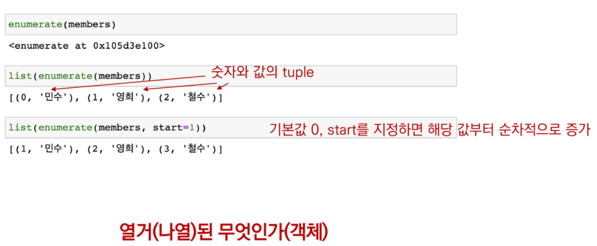

# 제어문


{설명 필기}


### 조건문

- if문은 참/거짓 판단할 수 있는 <u>조건식</u>과 함께 사용

  - **문법**

  ```python
  if <expression>:	#expression에는 일반적으로 참/거짓에 대한 조건식이 들어갑니다.
      <코드 블럭>		  #조건이 참인 경우 : 이후의 문장을 수행합니다.
  else:				#조건이 거짓인 경우 else: 이후의 문장을 수행합니다.
      <코드 블럭>
      
  # 여러 개의 elif 부가 있을 수 있고(없거나), else는 선택적으로 사용합니다.
  ```

### [실습] 홀/짝 판독기

> 조건문을 통해 변수 num의 값과 홀수/짝수 여부를 출력하세요.

------

**[입력 예시]**

3

**[출력 예시]**

홀수입니다.

```
num = int(input('숫자를 입력하세요 : '))
```

```python
num = int(input('숫자입력: '))
if num % 2 :
    print('홀수입니다')
else : 
    print('짝수입니다')
```

### 중첩 조건문(Nested Conditional Statement)

```python
if <expression>:
    # code block
    if <expression>:
        # code block
else:
    # code block       
```


### 조건 표현식(Condition Expression)

- 조건 표현식은 일반적으로 조건에 따라 값을 정할 때 활용됩니다.
- **삼항 연산자(Ternary Operator)**라고 부르기도 합니다.

**활용법**

```python
true_value if <조건식> else false_value
```

``` python
# 아래의 코드는 무엇을 위한 코드일까요?
num = int(input('숫자를 입력하세요 : '))
value = num if num >= 0 else -num
print(value) 
# 절대값을 저장하기 위한 코드
```


# 반복문

Loop Statement

- while 문
- for 문
- 반복 제어


## While

종료 조건에 해당하는 코드를 통해 반복문을 종료시켜야함

- 조건식이 참인 경우 실행

  - 조건이 False가 될 때까지 반복
  - **반드시 종료조건을 설정해야 합니다.**

  - **문법**

  ```python
  while <조건식>:
      <코드 블럭>
  ```

  ``` python
  a = 0
  while a <5 :
      print(a)
      a += 1
  print('끝')
  ```

  [출력]

  0

  1

  2

  3

  4

  '끝'

  

## For 문

반복 가능한(iterable)한 객체를 모두 순회하면 종료(별도의 종료 조건이 필요 없음)

- **문법**

```python
for <임시변수> in <순회가능한데이터(iterable)>:
    <코드 블럭>
```

- **예시** 

```python
for menu in ['김밥', '햄버거', '피자', '라면']:
    print(menu)
```

#사용자가 입력한 문자는 무조건 문자열임~

 

​           

### for 문 실습문제

```python
chars = input() #happy #sequence자료는 복수형으로 쓰는 것 권장

for char in chars:
    print(char)
```

### [실습] for 문과 if 문 작성하기

> 반복문과 조건문만 활용하여 1~30까지 숫자 중에 홀수만 출력해보세요.

```python
for i in range(1,31):
    if i % 2:
        print(i)
```

### 리스트(list) 순회하기 - range

#### 

### 리스트 순회하기 - enumerate

인덱스(index)와 값(value)을 함께 활용 가능합니다.

> `enumerate()`를 활용하면, 추가적인 변수를 활용할 수 있습니다.

- `enumerate()`는 [내장 함수](https://docs.python.org/ko/3.6/library/functions.html) 중 하나이며, 다음과 같이 구성되어 있습니다.



​	start=0 

​	start 값 을 바꾸면 그 숫자부터 시작하겠구나


### 반복문 제어

- break : 반복문 종료

- continue : continue 이후 코드 블록은 수행하지 않고, 다음 반복을 수행

- for-else 

  - 끝까지 반복문 실행한 뒤 else실행

    : break를 통해 중간에 종료되는 경우 else 문은 실행되지 않음

### 반복문 제어 - break

{필기}

### 반복문 제어 - continue

- continue 이후의 블록은 수행하지 않고, 다음 번 반복을 수행

  ```python
  for i in range(6):
      if i % 2 == 0:
          continue	# print(i)로 가지 않고 반복문 시작 시점으로 돌아감
          print(i)
  ```

  1

  3

  5

### 반복문 제어 - else

- 끝까지 반복문을 실행한 이후에 else문 실행

  ```python
  for char in 'apple':
      if char == 'b':
          print('b!')
          break
  else:
      print('b가 없습니다')
  ```

  b가 없습니다.

  ```python
  for char in 'banana':
      if char = 'b':
          print('b!')
          break
  else:
      print('b가 없습니다.')
  ```

  b!

  **else 문은 break로 중단되었는지 여부에 따라 실행**

### pass 문

- 아무 것도 하지 않음

  - 특별히 할 일 없을 때 자리를 채우는 용도
  - 반복문이 아니어도 사용 가능

  ```python
  for i in range(5):
      if i == 3 :
          pass
      print(i)
  ```

  0

  1

  2

  **3**

  4

  ```python
  for i in range(5):
      if i == 3 :
          continue
      print(i)
  ```

  0

  1

  2

  4