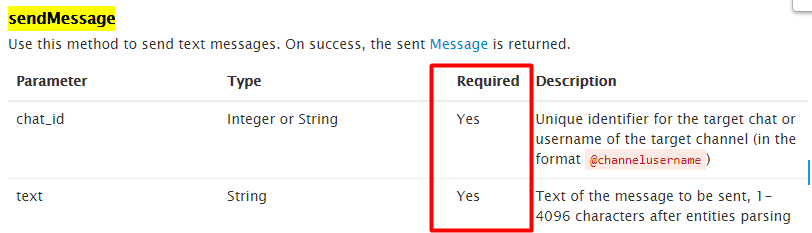
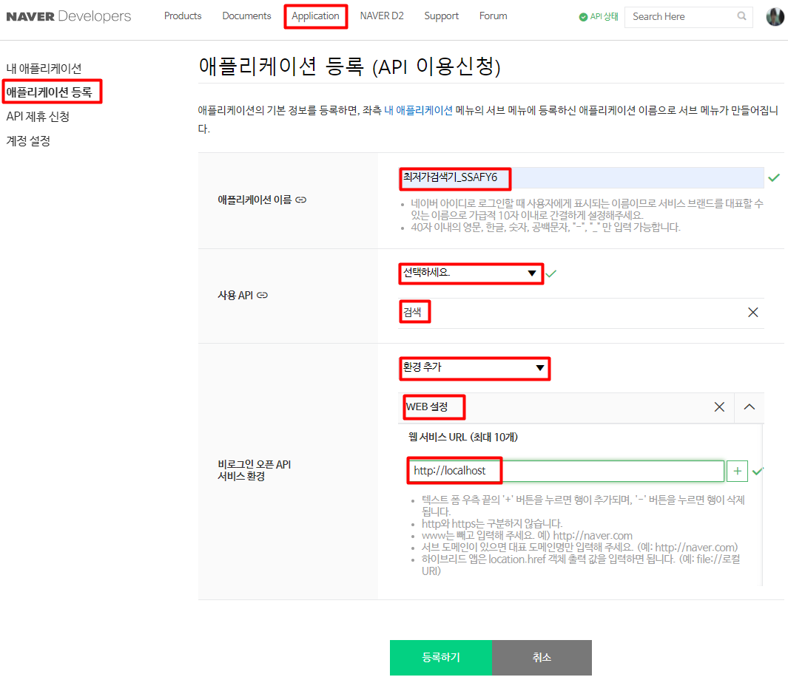
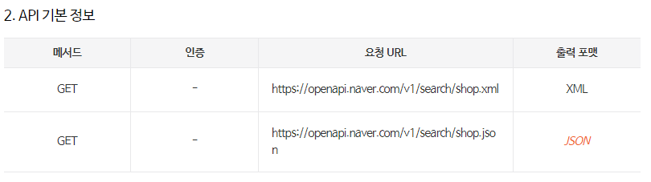
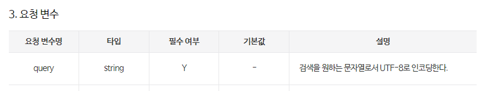

# TIL

*day2_2021.07.16_Friday*


**<u>목차</u>**

1. 텔레그램 챗봇 만들기


# 1. 텔레그램 챗봇 만들기

1. 텔레그램에서 봇 father 검색
2. /start
3. /newbot
4. 봇 이름 입력 : ssafy_s4_yunha
5. 봇 아이디 설정 : ssafy_s4_yunha_ bot
6. Use this token to access the HTTP API:
   [여기에 토큰이 뜸!! 이거 복사해서 메모장에 메모해두기]
   Keep your token secure and store it safely, it can be used by anyone to control your bot.

7. For a description of the Bot API, see this page: https://core.telegram.org/bots/api

   여기 주소에서 원하는 기능 뒤에 붙여서 사용 가능!


### 1.1 텔레그램에서 sendMessage

- requirements 살펴보기

  

  

- 파이썬으로 작성하기.

```python
import requests

# 기본 설정 
TOKEN = '(앞부분에 id가 있는 토큰 넘버(개인 정보이니 텍스트로 대체))' # 문자열로 토큰 넣어 감싸주기
APP_URL = f'https://api.telegram.org/bot{TOKEN}'


# chat_id 가져오기
# https://api.telegram.org/bot<요기에토큰>/getUpdates
UPDATES_URL = f'{APP_URL}/getUpdates'
response = requests.get(UPDATES_URL).json() #jason은 가져오기 쉽게 정된됨.
# print(response) # 문법 print(response["ok"])

#chat id가 어디 있는지 print(response)에서 찾아서 get 함수로 가져오기
# {'ok': True, 'result': [{'update_id': 이건 다른거같은데 일단 blind처리 , 'message': {'message_id': 1, 'from': {'id': 요기에 아이디 뜸, 'is_bot': False, 'first_name': '윤하', 'last_name': '김'}, 'chat': {'id': 요기에 아이디 뜸, 
chat_id = response.get('result')[0].get('message').get('chat').get('id')
print(chat_id)

text = '파이썬으로 보낸 메세지입니다.'
# https://api.telegram.org/bot<토큰>/sendMessage?chat_id={요기에 아이디}&text=%EB%B3%B4%EB%82%B4%EC%A7%80%EB%82%98%EC%9A%94?

message_url = f'{APP_URL}/sendMessage?chat_id={chat_id}&text={text}' # 누구에게? chat_id={} 무엇을& text={}


requests.get(message_url)  # run 시 챗본으로 메시지가 온다! : 파이썬으로 보낸 메세지입니다. 
```


### 1.2 네이버 최저가 검색기 만들기

- [네이버 개발자 센터](<https://developers.naver.com/main/>)에서 API이용 신청 하기.

  

- 받은 client id 와 secret을 코딩하는 python 파일에 저장해야 하니 메모장에 옮기기

- Documents > 서비스 API > 검색 > [쇼핑](<https://developers.naver.com/docs/serviceapi/search/shopping/shopping.md#%EC%87%BC%ED%95%91)





```python
import requests

# naver 요청 보낼 때 필요한 것들

naver_client_id = '요기도 비밀'
naver_client_secret = '비밀'
URL = 'https://openapi.naver.com/v1/search/shop.json?query={}'


# x토큰 같은 개념. 출입증 만든 것 
headers = {
'X-Naver-Client-Id':  naver_client_id,
'X-Naver-Client-Secret': naver_client_secret
}

query ='ps5' # 검색하고 싶은 정보

product = requests.get(URL+query, headers=headers).json()['items'][0]  #url 뒤에 ps5가 따라가서 붙음. 출입증도 같이 보내기~

# print(product)
product_name = product['title']
# print(product_name)
product_price = product['lprice']
# print(product_price)
product_link = product['link']
# print(product_link)  # 이런 식으로 필요한 정보만 하나하나 경로를 찾아서 지정해 주면 됨.


message = f'{product_name}\n{product_price}\n{product_link}'
print(message)
```


### 1.3 네이버 검색 결과를 텔레그램으로 보내기

```python
import requests


#네이버에서 필요한 것 찾아서 보낼 메시지 만들기
# naver 요청 보낼 때 필요한 것들
naver_client_id = '93pVFcaR1qV7P5qdcK43'
naver_client_secret = 'pljZFY2fTt'
URL = 'https://openapi.naver.com/v1/search/shop.json?query={}'


#x토큰 같은 개념. 출입증 만든 것 
headers = {
'X-Naver-Client-Id':  naver_client_id,
'X-Naver-Client-Secret': naver_client_secret
}

query ='ps5'


product = requests.get(URL+query, headers=headers).json()['items'][0]  #url 뒤에 ps5가 따라가서 붙음. 출입증도 같이 보내기~
# print(product)
product_name = product['title']
# print(product_name)
product_price = product['lprice']
# print(product_price)
product_link = product['link']
# print(product_link) 

message = f'이름 : {product_name}\n 가격 : {product_price}\n 링크 :{product_link}' # 요 메시지를 텔레그램으로 보내고 싶음! 
# print(message)


# 텔레그램에서 메세지 보내기
# 텔레그램 기본 사항

TOKEN = '토큰 요기에 복붙' # 문자열로 토큰 넣어 감싸주기
APP_URL = f'https://api.telegram.org/bot{TOKEN}'

# chat_id 가져오기
# https://api.telegram.org/bot<토큰요기에>/getUpdates
UPDATES_URL = f'{APP_URL}/getUpdates'
response = requests.get(UPDATES_URL).json() #jason은 가져오기 쉽게 정된됨.
# print(response["ok"]) # 문법 print(response["ok"])

chat_id = response.get('result')[0].get('message').get('chat').get('id')
# print(chat_id)

# text = '파이썬으로 보낸 메세지입니다.' << 이거 대신 m

# https://api.telegram.org/bot<토큰>/sendMessage?chat_id={비밀}&text=%EB%B3%B4%EB%82%B4%EC%A7%80%EB%82%98%EC%9A%94?
message_url = f'{APP_URL}/sendMessage?chat_id={chat_id}&text={message}'  # naver편에서 만든 message 를 보내기~!

requests.get(message_url)
```

