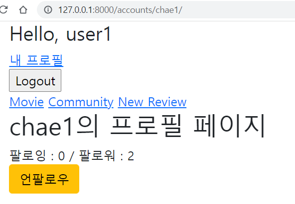
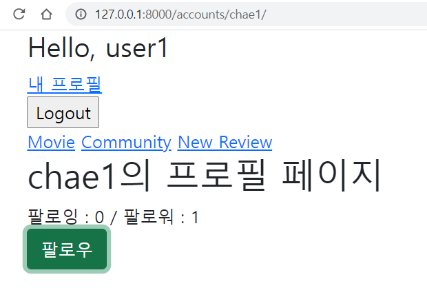
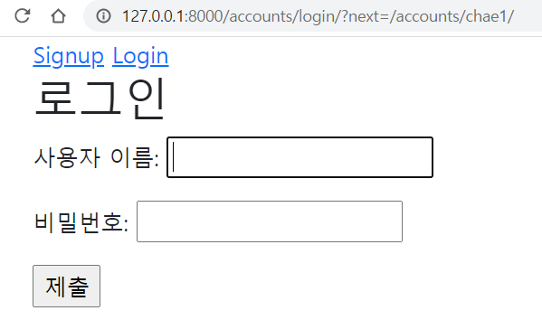
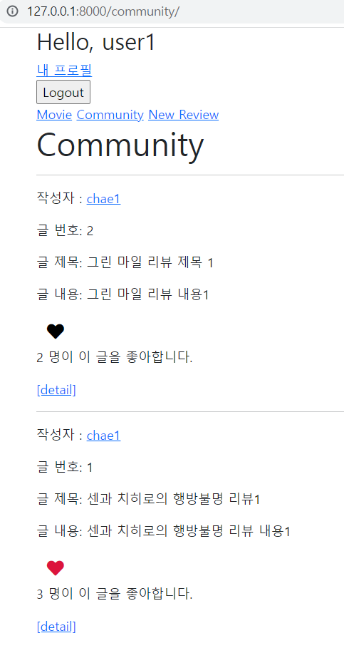
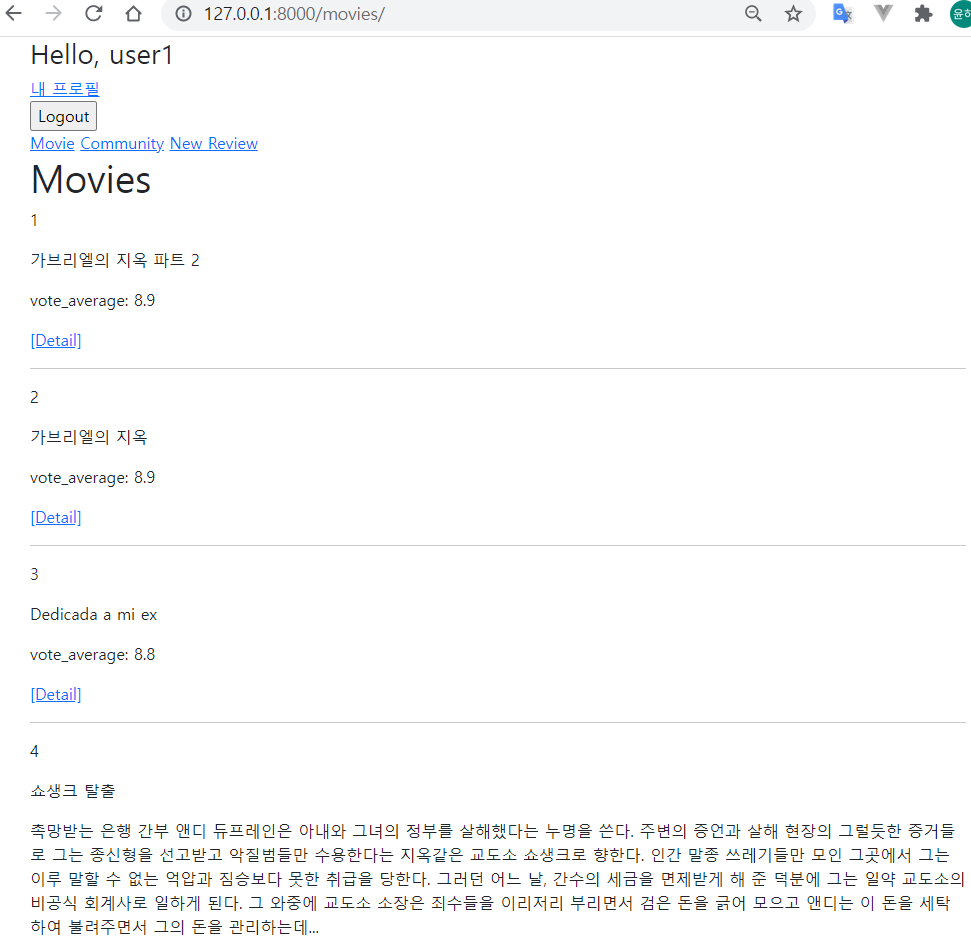
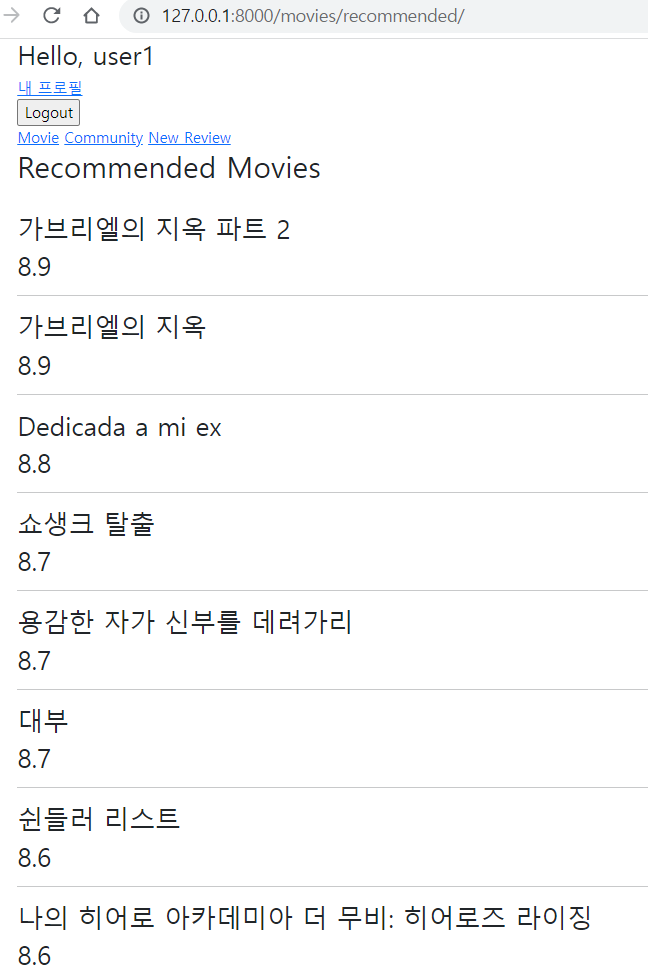

# PJT09 

알고리즘을 적용한 서버 구성


## 기능 구현

### ii. 유저 팔로우 기능





​	 - 인증된 사용자만 팔로우 가능 (로그아웃 상태에서 팔로우 버튼 누르면 로그인 창으로)




```python
# accounts/views.py

@require_POST
def follow(request, user_pk):
    if request.user.is_authenticated:
        person = get_object_or_404(get_user_model(), pk=user_pk)
        user = request.user
        if person != user:
            if person.followers.filter(pk=user.pk).exists():
                # 언팔
                person.followers.remove(user)
                curr_follow = False
            else:
                # 팔로우
                person.followers.add(user)
                curr_follow = True
        follow_status = {
            'curr_follow': curr_follow,
            'fans_count':person.followers.count(),
            'stars_count':person.followings.count(),
        }

        return JsonResponse(follow_status)
    return HttpResponse(status=401)
```

```html



  <h1>{{ person.username }}의 프로필 페이지</h1>
  
    <div>
      <div>
        팔로잉 : 
        <span id="stars-cnt">
          {{ followings|length }}
        </span> 
        / 팔로워 : 
        <span id="fans-cnt">
          {{ followers|length }}
        </span>
      </div>
      
        <div>
           <form action="" method="POST"> 
          <form class='follow-form' data-id="{{person.pk}}">
            
            
              <button class='btn btn-warning' id="followBtn">언팔로우</button>
            
              <button class='btn btn-success' id="followBtn">팔로우</button>
            
          </form>
        </div>
      
    </div>
  


   axios CDN받아오기 
  <script src="https://cdn.jsdelivr.net/npm/axios/dist/axios.min.js"></script>
  <script>
    const form = document.querySelector('.follow-form')
    form.addEventListener('submit', function(event){
      console.log(event)
      event.preventDefault()
      const csrftoken = document.querySelector('[name=csrfmiddlewaretoken]').value
      const starId = event.target.dataset.id
      axios.post(`http://127.0.0.1:8000/accounts/${starId}/follow/`, {}, {headers: {'X-CSRFToken': csrftoken}})
      //.then
      .then(function(response){
        const fans_cnt = response.data.fans_count
        const starts_cnt = response.data.stars_count
        const curr_follow_status = response.data.curr_follow

        const followButton = document.querySelector(`#followBtn`) //백틱임주의

        if (curr_follow_status){
          followButton.setAttribute('class', 'btn btn-warning')
          followButton.innerText = '언팔로우'
        } else {
          followButton.setAttribute('class', 'btn btn-success')
          followButton.innerText = '팔로우'
        }
        
        const starsCount = document.querySelector(`#stars-cnt`)
        starsCount.innerText = starts_cnt  
        const fansCount = document.querySelector(`#fans-cnt`)
        fansCount.innerText = fans_cnt
      })
      .catch((err)=>{
        if (err.response.status === 401){
          window.location.href = '/accounts/login/'
        }
      })
    })
  </script>




```


### iii. 리뷰 좋아요 기능





```python
# community/views.py

@require_POST
def like(request, review_pk):
    if request.user.is_authenticated:
        review = get_object_or_404(Review, pk=review_pk)
        user = request.user

        if review.like_users.filter(pk=user.pk).exists():
            review.like_users.remove(user)
            liked = False
        else:
            review.like_users.add(user)
            liked = True
		# 좋아요 상태
        like_status = {
            'liked':liked,
            'count':review.like_users.count(),
        }
        return JsonResponse(like_status)
    return HttpResponse(status=401)
```

```html
<!-- community/index.html -->



  <h1>Community</h1>
  <hr>
  
    <p>작성자 : <a href="">{{ review.user }}</a></p>
    ...

    <form class="d-inline like-form" data-id="{{review.pk}}">
      
      
        <button class="btn btn-link" id="like-{{review.pk}}"><i class="fas fa-heart fa-lg" style="color:crimson;"></i></button>
      
        <button class="btn btn-link" id="like-{{review.pk}}"><i class="fas fa-heart fa-lg" style="color:black;"></i></button>
      
    </form>
    <p>
      <span id="like-count-{{review.pk}}">
        {{ review.like_users.all|length }}
      </span>
     명이 이 글을 좋아합니다.</p>
	...
  

  <script src="https://cdn.jsdelivr.net/npm/axios/dist/axios.min.js"></script>
  <script>
    const forms = document.querySelectorAll('.like-form')
    forms.forEach(function (form){
      form.addEventListener('submit', function(event){
        event.preventDefault()
        const csrftoken = document.querySelector('[name=csrfmiddlewaretoken]').value
        const reviewId = event.target.dataset.id
        //하트도 가져오기!
        const redheartIcon = document.createElement('i')
        redheartIcon.innerHTML = '<i class="fas fa-heart fa-lg" style="color:crimson;"></i>'
        const blackheartIcon = document.createElement('i')
        blackheartIcon.innerHTML = '<i class="fas fa-heart fa-lg" style="color:black;"></i>'


        axios.post(`http://127.0.0.1:8000/community/${reviewId}/like/`, {}, {headers: {'X-CSRFToken': csrftoken}})
        //.then
        .then(function(response){
          console.log(response.data)
          const count = response.data.count
          const liked = response.data.liked
          const likeButton = document.querySelector(`#like-${reviewId}`)

          if (liked){
            likeButton.innerText = ''
            likeButton.appendChild(redheartIcon)
          } else {
            likeButton.innerText = ''
            likeButton.appendChild(blackheartIcon)
          }

          const likeCount = document.querySelector(`#like-count-${reviewId}`)
          likeCount.innerText = count
        })
        //.catch
        .catch((err)=>{
          if (err.response.status === 401){
            window.location.href = '/accounts/login/'
          }
        })
      })
    })
  </script>


```


### iv. movies app 




```python
# movies/views.py

from django.shortcuts import get_object_or_404, render
from django.views.decorators.http import require_safe
from .models import Movie, Genre


# Create your views here.
@require_safe
def index(request):
    movies = Movie.objects.all()

    context = {
        'movies': movies

    }
    return render(request, 'movies/index.html', context)

@require_safe
def detail(request, movie_pk):
    movie = get_object_or_404(Movie, pk=movie_pk)
    genres = movie.genres.all()  
    context = {
        'movie':movie,
        'genres':genres,
    }
    return render(request, 'movies/detail.html', context)

```

```html
<!-- movies/index.html -->




  <h1>Movies</h1>
  
      <p>{{movie.pk}}</p>
      <p>{{movie.title}}</p>
      <p>{{movie.overview}}</p>
      <p>vote_average: {{movie.vote_average}}</p>
      <a href="">[Detail]</a>
      <hr>
  


```


### v. 영화추천기능




```python
# movies/views.py
@require_safe
def recommended(request):
    rec_movies = Movie.objects.order_by('-vote_average')[:10]
    context = {
        'rec_movies':rec_movies,
    }
    return render(request, 'movies/recommended.html', context)
```

```html
<!-- recommended.html -->




<h2>Recommended Movies</h2>
<br>

    <h3>{{rec_movie.title}}</h3>
    <h3>{{rec_movie.vote_average}}</h3>
    <hr>



```


### 리뷰

1. detail에서 genre에 접근하기 : 

   html에서 {{ genre }} 가 아닌 {{ movie.genre }} 로 적어서 엄청 헤맸다... 

   ```python
   class Movie(models.Model):
       ...
       genres = models.ManyToManyField(Genre, related_name="movie_genre")
   ```

   ```python
   @require_safe
   def detail(request, movie_pk):
       movie = get_object_or_404(Movie, pk=movie_pk)
       genres = movie.genres.all() 
       context = {
           'movie':movie,
           'genres':genres,
       }
       return render(request, 'movies/detail.html', context)
   ```

   ```hml
       
           <p>{{genre}}</p>
       
   ```

   

