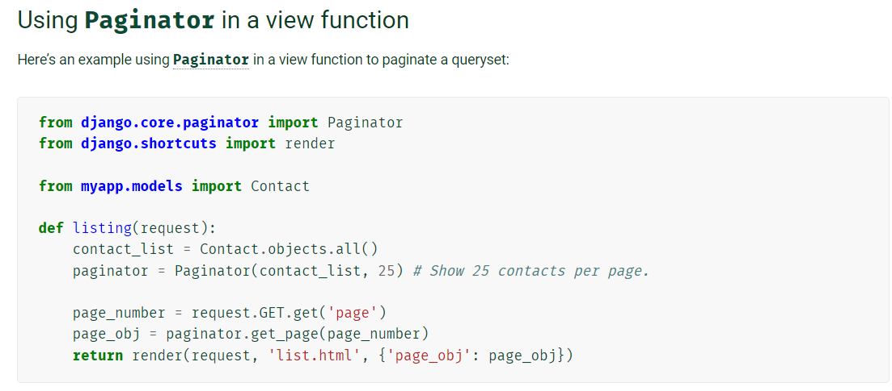

# infinite scroll

알고리즘을 적용한 서버 구성

## fixture 사용하기

### fixture

고정된 정보.

movies라는 앱 안에 movie라는 모델에 아래와 같은 field를 가진 데이터를 넣을 수 있도록 기본 뼈대 넣어놓았다. 

협업할 때 db 안의 샘플 데이터로 사용. 

```json
  {
    "model": "movies.movie",
    "fields": {
      "title": "쇼생크 탈출",
      "release_date": "1994-09-23",
      "popularity": 40.468,
      "vote_count": 17292,
      "vote_average": 8.7,
      "overview": "촉망받는 은행 간부 앤디 듀프레인은 아내와 그녀의 정부를 살해했다는...",
      "poster_path": "https://image.tmdb.org/t/p/w500/3hO6DIGRBaJQj2NLEYBMwpcz88D.jpg",
      "genres": [
        80,
        18
      ]
    }
  },
```


### loaddata 

데이터 불러오기

`$ python manage.py loaddata <filename>`

혹은

`$ python manage.py loaddata movies/fixtures/movies.json` 


### dumpdata

`$ python manage.py dumpdata <app_name>[.ModelName]` :


`$ python manage.py dumpdata movies > tests.json`

##### 이쁘게 

`$ python manage.py dumpdata --indent 4 movies > tests.json`

##### 한글 인코딩하기 

메모장으로 열고 utf-8로 변경해서 저장


## Django Paginator

https://docs.djangoproject.com/en/4.0/topics/pagination/




```python
from django.core.paginator import Paginator

# Create your views here.
@require_safe
def index(request):
    movies = Movie.objects.all()
    paginator = Paginator(movies, 10)  # 전체 쿼리셋 10개씩 잘라서 
    
    # 몇 페이지 보여줄 것인지
    page_number = request.GET.get('page') # 정보는 request안에 GET 이라는 url parameter 안에 들어있는 값 가져올것
    page_obj = paginator.get_page(page_number) # 몇 번 page인지 정보

    context = {
        # 'movies': movies,  # 전체
        'movies': page_obj,
    }
    return render(request, 'movies/index.html', context)

```

#### 다음 페이지 조회

주소 + ?page=<페이지넘버>

http://127.0.0.1:8000/movies/?page=2


#### 화면 크기

document.documentElement.scrollHeight: 전체 화면 크기 4246

document.documentElement.clientHeight : 내가 보고 있는 화면 크기 722

document.documentElement.scrollTop : 내려간 길이 3524

#### 요소를 끝까지 스크롤했는지 판별하기

element.scrollHeight - element.scrollTop === element.clientHeight 

4246 - 722 = 3524


## axios 요청


```html
<!-- index.html -->


<script>
  let pageNum = 2

  document.addEventListener('scroll', (event) => {
    // console.log(event)
    const {scrollHeight, scrollTop, clientHeight} = document.documentElement
    // console.log(scrollHeight, scrollTop, clientHeight)
    if (scrollHeight - Math.round(scrollTop) === clientHeight) {
      // console.log('bottom!!')
      // 다음 요청 가져다조
      axios({
        method: 'get',
        url: `/movies/?page=${pageNum}`,
        headers: {'x-requested-with': 'XMLHttpRequest'}
      })
        .then((res) => {
          const movies = res.data

          movies.forEach((movie) => {
            const movieList = document.querySelector('.movie-list')
            const movieDiv = document.createElement('div')

            const movieHTML = `
              <h3>${movie.fields.title}</h3>
              <p>${movie.fields.overview}</p>
              <a href="movies/${ movie.pk }">[Detail]</a>
              <hr>
            `
            movieDiv.innerHTML = movieHTML
            movieList.appendChild(movieDiv)
          })
          pageNum += 1
        })
    }
  })
</script>


```


```python
# views.py
from django.shortcuts import get_object_or_404, render
from django.views.decorators.http import require_safe
from .models import Movie
from django.core.paginator import Paginator
from django.core import serializers
from django.http import HttpResponse

# Create your views here.
@require_safe
def index(request):
    movies = Movie.objects.all()
    paginator = Paginator(movies, 10)  # 전체 쿼리셋 10개씩 잘라서 
    
    # 몇 페이지 보여줄 것인지
    page_number = request.GET.get('page') # 정보는 request안에 GET 이라는 url parameter 안에 들어있는 값 가져올것
    page_obj = paginator.get_page(page_number) # 몇 번 page인지 정보

    # /movies/?page=2 ajax 요청 => json데이터로 받기
    if request.headers.get('x-requested-with') == 'XMLHttpRequest':  # 지금 이 요청은 ajax요청입니다
        data = serializers.serialize('json', page_obj)  #page_obj를 json으로 바꿔줘
        return HttpResponse(data, content_type='application/json')
        
    # /movies/ 첫번째 페이지 요청 
    else:
        
        context = {
            # 'movies': movies,  # 전체
            'movies': page_obj,
        }
        return render(request, 'movies/index.html', context)
```

