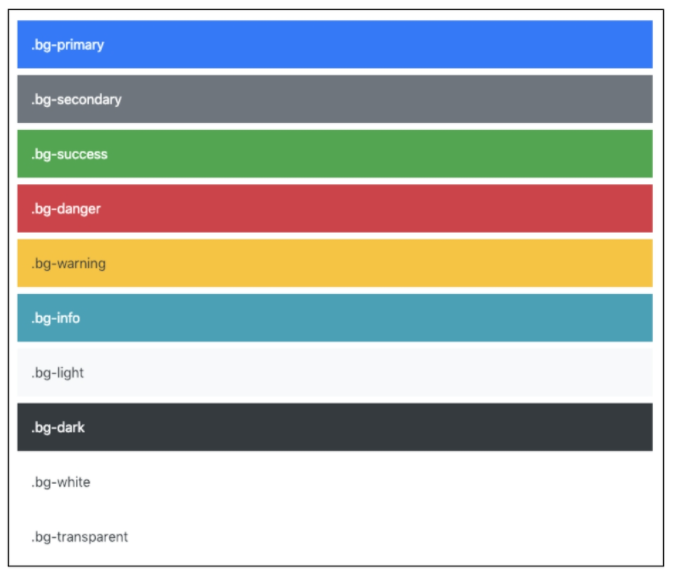

[TOC]


# Bootstrap

the most popular HTML, CSS, and JS library in the world

 

- 크로스 브라우징

  동일 x 동등 o


### CDN 

Content Delivery(Distribution) Network

컨텐츠를 효율적으로 전달하기 위해 여러 노드에 가진 네트워크에 데이터를 제공하는 시스템.

콘텐츠 전송 네트워크 시스템

특정 코드 넣으면 library 쓸 수 있게 해줌


### Spacing

클래스 가져다 쓰는 것 .

.mt -1

```html
.mt-1 {
여기에 이미 작성이 되어 있음
}
```

.mx - 0

```html
.mx - 0{
	margin-right: 0 !important;
	margin-left: 0 !important;
}
```

.mx-auto

수평 중앙 정렬


.py-0


### color

미리 설정됨




### Responsive Web Design

다양한 화면 크기의 디바이스들이 등장함에 따라 반응형 디자인 개념이 등장

웹 디자인에 대한 접근 방식.


### Grid system

- 반응형 바뀌는 지점이 6개

- Bootstrap Grid system은 flexbox로 제작됨
- **container**, **rows**, **column**으로 컨텐츠 배치하고 정렬
- **<u>12개의 column</u>** : 12가 약수가 많아서 !
- **<u>6개의 grid breakpoints</u>**


### Grid system class

##### row

##### col

##### off set


##### grid breakpoints

- 특정 픽셀 조건에 대한 지점을 정해뒀는데 breakpoints라고함

- em 또는 rem 사용하지만 px 은 

- docs > grid options 에서 container size 확인하기

  class prefix 보고 맞는 사이즈 사용하면 됨


##### 

##### nesting (중첩)

