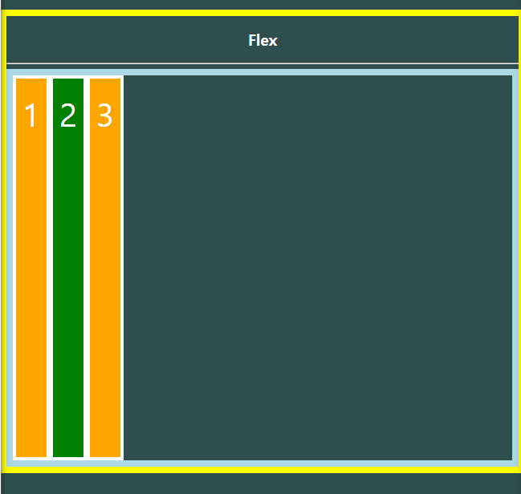

[TOC]


# CSS Layout

- CSS layout
- flexbox
- bootstrap
  - bootstrap grid system
- responsive web


#### CSS page layout technique

- Display
- Position
- Float
- Flexbox
- Grid system


## 1. Float

- 한 요소가 정상 흐름으로부터 빠져 텍스트 및 인라인 요소가 그 주위를 감싸 요소의 좌 우측을 따라 배치되어야 함을 지정

- 본래는 이미지를 한쪽으로 띄우고 텍스트를 둘러싸는 레이아웃을 위해 도입.

- 지금은 다양한 레이아웃을 만드는 데까지 발전


#### 1. 1 Float 속성

- none : 기본값
- left : 요소를 왼쪽으로 띄움
- right : 요소를 오른쪽으로 띄움
- z-index : 위아래 바꿔주는 것 . 참고하기


#### 1. 2 Float clear

float 된 요소에 부모를 만들어 부모 태그에 clearfix 클래스 작성하고, style태그 안에 clearfix 써주기.

clear both : float 가 된 사실을 무시하고 위로 안 올라가겠다 하는 것. 

```html
<style>
	.clearfix::after {
      content: "";
      display: block;
      clear: both;
    }
</style>

<div class="clearfix">
    <div class="box1 left">div</div>
  </div>
  <!-- 가상의 요소 생성됨 -->
  <div class="box2">div</div>
```


##### ::after

style 상으로 가상 요소(의사 요소) 만드는 것. 기본값이 인라인이어서 block 설정 해야 아래 요소가 안 올라옴.

[빔캠프](https://www.youtube.com/watch?v=8xKDSdHQ35U)


## 2. Flexible Box layout

| 요소 & 축 |
| --------- |

- 요소
  - Flex Container (부모 요소)
  - Flex Item (자식 요소)
- 축
  - main axis (메인축) - x 축
  - cross axis (교차축)


#### 2. 1 구성 요소

- Flex Container
  - Flexbox 레이아웃을 형성하는 가장 기본적인 모델
  - Flex Item들이 놓여있는 영역
  - 생성하려면 display 속성을 flex 혹은 inline-flex 로 지정
- Flex Item (자식 요소)
  - 컨테이너의 컨텐츠


#### 2. 2 Flex 에 적용하는 속성

- 배치 방향 설정
  - flex-direction
- 메인축 방향 정렬
  - justify-content,
- 교차축 방향 정렬
  - align-items, align-self, align-content
- 기타
  - flex-wrap, flex-flow, flex-grow, order,

##### 2. 2. 1 flex-direction


##### 2. 2. 2 justify & align


##### 2. 2. 3 content & items & self

- content : 여러줄
- items : 한줄
- self : flex item 개별 요소
- 


#### 2. 3 실습

1) 컨테이너 만들기.


2. flex - container 적용함


*inline flex 쓰면 이렇게 됨


메인 축 방향 설정 reverse:


flex-direction: column;


flex-direction: column-reverse;


- flex-wrap : wrap 

  바깥으로 튀어나가지 않게 감싼다.

  nowrap 은 강제로 한줄에 배치되게 할 것인가 여부 결정


- flex-wrap: wrap-reverse;


-  /* fles-direction + flex-wrap 의 shorthand */

     flex-flow : column wrap;

​    


5. 메인축 정렬

   justify-content: flex-start; 

   
   
   
   
   justify-content: space-between;


justify-content: flex-end;


justify-content: space-between;

똑같은 거리만큼 떨어지는 것


justify-content: space-around;

균등좌우정렬 :  아이템 주변의 비율이 같음 

결론적으로 3개면 1: 2:  2: 1 로 같음


justify-content: space-evenly;

외부 내부 똑같음. 여백이 모두 같다는 뜻


/* 6. 교차축 정렬 */

   align-items: stretch;




align-items: flex-start;


align-items: center;


align-items: flex-end;


align-items: baseline;

컨텐츠 크기 다를 때 글자 아래 base line 에 맞춰 정렬


7. 교차축 개별 정렬


order 

값 작을 수록 앞으로 정렬. 기본값 0


flex grow : 남은 공간에 대한 배분. 1: 2: 3 아님

```html
.item1 {
      /* align-self: flex-start; */
      /* order 값 작을수록 앞으로 정렬(기본값 0) */
      /* order: 0; */
      
      /* flex-grow는 메인축에서 남은 공간을 각 항목에 분배 */
      flex-grow: 1;
    }
.item2 {
      /* align-self: center; */
      /* order: -1; */
      flex-grow: 2;
    }
    .item3 {
      /* align-self: flex-end; */
      /* order: 1; */
      flex-grow: 3;
    }

```


# 11:00~


flex : 왼쪽부터 정렬

```css
.card {
  display: flex;
}
```


flex-direction: column


justify-content: space-between; 

양쪽으로 찢기

```html
/* 아래부터 작성 */
.card {
  display: flex;
  flex-direction: column;
  justify-content: space-between;
  width: 700px;
  border: 2px dashed black;
  margin: 0 auto;
}
```


.card nav 가 또 부모가 될 수 있음

```html
.card-nav {
  display: flex;
  justify-content: center;
}
```


수직 수평 가운데 정렬

```html
.card-header-description {
  display: flex;
  flex-direction: column;
  justify-content: center;
  align-items: center;
}
```


Framework : 탈것 

조정은 내가 하지만.. 일은 탈것이 함.

커스터마이징 힘들다


library : 도구


### 정리

- display : flex 
  - 정렬하려는 부모 요소에 작성
  - inline-flex : flex 영역을 블록으로 쓰지않고 인라인블록으로 사용
- flex 선언시 아래 사항들이 기본 값으로 지정됨.
  - item은 행으로 나열
  - item은 메인 축의 시작부터 정렬
  - item은 교차축의 크기를 채우기 위해 늘어남
  - flex-wrap 속성을 nowrap으로 지정
- flex-direction
  - item이 쌓이는 방향 설정
  - main-axis를 변경
  - row(기본값 ) :왼쪽에서 오른쪽
  - row-reverse : 메인축의 방향이 오른쪽에서 왼쪽
  - column : 메인축의 방향이 위에서 아래
  - column-reverse : 메인축의 방향이 아래에서 위
- flex-wrap 
  - 요소들이 강제로 한 줄에 배치되게 할 것인지 여부 설정
  - nowrap(기본값) 모든 아이템들 한 줄에 나타내려고 함 -> 자리가 없어도 튀어나옴
  - wrap 넘치면 그 다음줄로
  - wrap-reverse : 넘치면 그 윗줄로(역순)
- flex - flow
  - flex-direction과 flex-wrap의 shorthand
  - flex-direction과 flex-wrap에 대한 설정값을 차례로 작성
  - Ex) flex-flow:  row nowrap;
- justifly-content :


- align-item


- align-self


- order
  - 작은 숫자일수록 앞
  - 기본값 0
- flex-grow
  - 메인축에서.. ㅏㄴㅁ은..


