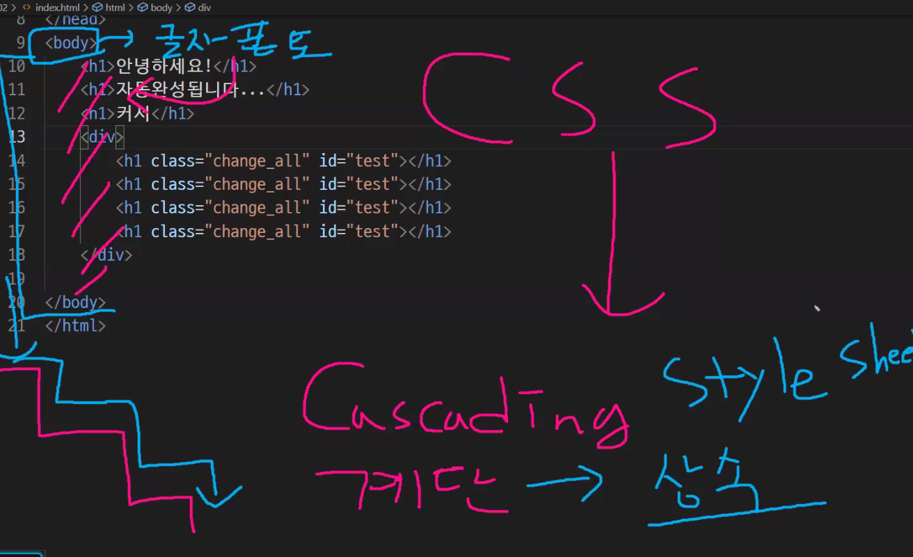
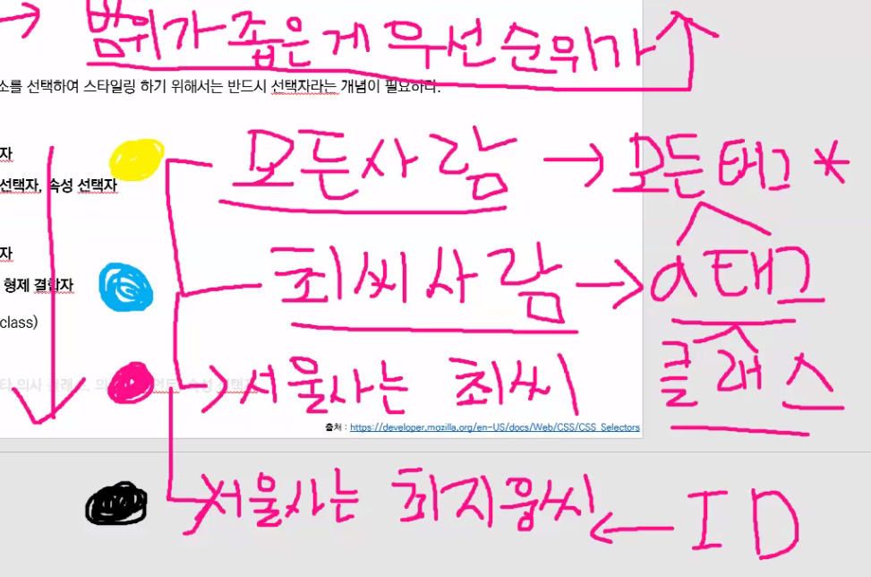
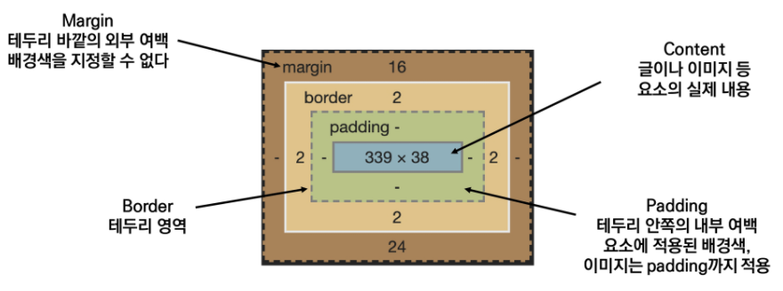

# HTML


### HTML 기본 구조

```html
<!DOCTYPE  html>
<html lang="ko">
<head>
    <meta charset="UTF-8">
    <title>Document</title>
</head>
<body>

</body>
</html>
```


### DOM(Document Object Model) 트리

각각의 객체로 접근할 수 있는 구조를 가지고 있음

web page 의 객체 지향적 구조


### 요소

- `<h1> contents</h1>`

  여는 태그와 닫는 태그, 내용으로 이루어져 있음. 

- 내용이 없는 태그들
- 요소는 중첩될 수 있음


### 속성(attribute)

```html
<a href="https://google.com"></a>
  속성명       속성값
    공백No!   "쌍따옴표 사용"
```

- 요소의 시작 태그에 작성하여 보통 이름과 값이 하나의 쌍으로 존재


### HTML Global Attribute

모든 html 요소가 공통으로 사용할 수 있는 속성(몇몇 요소에는 아무 효과 없을 수 있음)

- id, class
- hidden
- lang
- style
- tabindex
- title


### MDN(Mozila Developer Network) 

여기서 웹 표준 작성하기로 합의 봄


### 시맨틱 태그

- html5에서 의미론적 요소를 담은 태그의 등장. ~~div~~

- 기능은 div 와 똑같지만 의미만 다름.
  - header
  - nav
  - aside
  - section
  - article
  - footer
- Non semantic 요소는 div, span 등이 있으며 h1, table 태그들도 시맨틱 태그로 볼 수 있음
- 요소의 의미가 명확해지기 때문에 코드의 가독성을 높이고 유지보수를 쉽게 함
- 검색엔진 최적화


### 시멘틱 웹

- 웹 상에 존재하는 수많은 웹 페이지들에 메타데이터를 부여하여
- 기존의 단순한 데이터의 집합이었던 웹 페이지를 '의미'와 '관련성'을 가지는 거대한 데이터베이스로 구축하고자 하는 발상


### HTML 문서 구조화

- 인라인/ 블록 요소

  인라인 : 자기 데이터 크기만큼 

  블록 : 전체 

- 그룹 컨텐츠 :

  - `<P>`
  - `<hr>`
  - `<ol>`, `<ul>`
  - `<pre>`, `<blockquote>`
  - `<div>`

- 텍스트 관련 요소

  - `<a>`
  - `<b>` and `<strong>`
  - `<i>` vs `<em>
  - `<span>`, `<br>`, ``

- table 태그

  - `<tr>`, `<td>`, `<th>`
  - etc

- form 

  - 서버에서 처리될 데이터를 제공하는 역할
  - `<form>`의 기본 속성
    - action : 어디로 보낼지
    - methd : http method 중 어떤 것 선택할 지

- input

  - form 안에 들어감
  - 사용자 입력값 받음
  - 

- input 유형(type)

  - https://developer.mozilla.org/ko/docs/Web/HTML/Element/Input


### 마크업 실습


# CSS

Cascading Style Sheets (계단형으로 상속..)

스타일, 레이아웃 등을 통해 문서(HTML)를 표시하는 방법을 지정하는 언어




### CSS 구문

```css
h1 {
    color: blue;
    font-size: 15px;
}
----------------------------------------------------
<선택자Selector>{
    <속성Property>: <값Value>;  =>선언(Declaration)
}
```


### CSS 정의 방법

1. 인라인 : html 태그 안에서 style 속성 사용 

2. 내부 참조:

   head 태그 내에 style 안에 작성

3. 외부 참조:

   외부 CSS 파일을 head 내 link 를 통해 불러오기


### CSS 선택자 

- 기본 선택자
  - 전체 선택자, 요소 선택자
  - 클래스 선택자, 아이디 선택자, 속성 선택자
- 결합자(Combinators)
  - 자손 결합자, 자식 결합자
  - 일반 형제 결합자, 인접 형제 결합자
- 의사 클래스/ 요소(pseudo class)
  - 링크, 동적 의사 클래스
  - 구조적 의사 클래스


### CSS 적용 순서

범위 좁은 게 우선순위 높음

1. 중요도 !important 

2. 우선순위

   인라인 > id 선택자 > class 선택자 > 요소 선택자

3. 소스 순서





### 크기 단위

- em 
  - 바로 위 부모요소에 대한 상속의 영향을 받음
  - 배수 단위, 요소에 지정된 사이즈에 상대적인 사이즈를 가짐
- rem
  - 바로 위 부모 요소에 대한 상속의 영향을 받지 않음
  - 최상위 요소(html)사이즈를 기준으로
- viewport 
  - 화면 크기


### 색상 단위 

- 색상 키워드

- RGB 색상

- HSL 색상

  *a 는 투명도가 추가된 것


### 결합자

- 자손결합자
- 자식결합자(직속)


# CSS Box model

**중요

다 네모네모... 



border는 테두리인데, 두꺼울 수 있음. 


### box-sizing

border-box 로 설정해야 전체 박스 사이즈를 width 로 설정할 수 있음


### 마진 상쇄 피하기

주의하기.. 


# CSS Display

- block : 주로 이미지

  div / ul, ol, li / p/ hr / form 등

  - 줄바꿈이 일어나는 요소 
  - 화면 전체 가로 폭을 차지한다.
  - 블록 레벨 요소 안에 인라인 레벨 요소가 들어갈 수 있음

- inline

  span / a / img / input, label / b, em, i, strong 등

  - 줄 바꿈이 일어나지 않는 행의 일부 요소
  - content 너비만큼 가로 폭을 차지한다.
  - width, height, margin-top, margin-bottom 을 지정할 수 없다.
  - 상하 여백은 line-height로 지정한다
  - << word의 글자처럼 취급으로 생각하기>>

- inline-block

  - inline 처럼 한 줄에 표시 가능하며,
  - block 처럼 width, height, margin 속성을 모두 지정할 수 있다.

- display : none 

  - 화면에 표시하지 않고 공간 사라짐
  - hidden 은 해당 요소가 공간은 차지하나 화면에 표시만 하지 않음


### CSS position

- 문서 상에 요소를 배치하는 방법을 지정한다.
- static : 모든 태그의 기본 값(기준 위치)
  - 일반적인 요소의 배치 순서에 따름(좌측 상단)


#### relative : 자기 자신의 위치 기준으로 

#### absolute : 부모기준으로

#### fixed : 고정


# HTML 문서 구조화

[자주 쓰이는 html tag](https://www.advancedwebranking.com/html/)

### form(중요)


### input


------

# HTML Boilerplate

HTML 태그들 중 몇몇은 태그 자체로 어떤 의미인지 이해할 수 있지만, 그 자체로는 어떤 역할인지 알 수 없는 태그들이 있다

여기서 소개해주는 태그들은 앞으로는 HTML 파일 안에 이유도 모른 채 맹목적으로 추가하지 말고 확실히 알고 사용하도록 하자.

- HTML Boilerplate를 한 줄 한 줄 읽으면서 이해해보자. VSCode에서 `!` + `tab` 을 눌러서 Emmet을 이용해 생성되는 내용을 확인하자.

## `DOCTYPE`

```html
<!DOCTYPE html>
```

- HTML 문서를 생성한 뒤 가장 먼저 할 일 → **문서 형식(유형)을 정의**하는 것

- 브라우저와 마크업 검사기가 이 내용을 확인하고 문서를 어떻게 렌더링할 것인지 결정한다.

  - Browser : 웹페이지를 각종 CSS 상세를 따르는 **표준 모드(standard mode)**로 렌더링 할 것인지, 비교적 예전에 사용하던 관행과 브라우저 형식을 따르는 **호환 모드(quirks mode)**로 렌더링 할 것인지 결정한다.
  - Markup Validator : HTML 문법을 체크할 때 어떤 HTML 규칙을 사용할 것인지 결정한다.

- DOCTYPE 앞에 있는 **느낌표(exclamation mark)**

  - 브라우저에게 **"이 문장은 코드 구문(statement)이야!"**라고 알려주는 역할을 한다.

  - **Statement vs Expression**

    - `Statement` : 진술 혹은 서술의 의미로, 프로그래밍에서는 **실행할 수 있는 최소의 독립적인 코드 조각**을 일컫는다. 프로그래밍을 하면서 컴파일러가 이해하고 실행할 수 있는 모든 구문은 statement다.
    - `Expression` : 수식이라는 뜻으로, 하나 이상의 값으로 표현될 수 있는 코드를 말한다.

    [코드 단위인 Expression과 Statement의 차이를 알아보자](https://shoark7.github.io/programming/knowledge/expression-vs-statement)

- 이 선언을 생략하는 경우 브라우저는 웹페이지를 호환 모드로 렌더링할 것이고, 작성해둔 코드가 최신 CSS 상세와 맞지 않는 경우가 발생할 수 있다.

[호환 모드와 표준 모드](https://developer.mozilla.org/ko/docs/Web/HTML/Quirks_Mode_and_Standards_Mode)

## `html`

```html
<html lang="en">
...
</html>
```

### `<html>` 태그

- HTML 문서의 루트를 나타내는 엘리먼트
- HTML 문서는 `<html> ... </html>` 안에 작성한다.

### `lang` 속성

- 웹페이지 안의 모든 텍스트들에 대한 문서 언어를 지정한다.

- 만약 문서의 일부분을 다른 언어로 변경하고 싶으면 해당 요소를 둘러싸고 있는 태그에 `lang` 속성을 부여하면 된다.

  ```html
  <p>
  	중국어로는 "안녕하세요"라고 인사할 때 
  	<span lang="zh">你好</span>라고 말합니다.
  </p>
  ```

  1. 음성 합성기, 점자 번역기가 어떤 언어를 사용할지에 선택할 때 도움을 준다.
     - 위 예시에서 화면 낭독 프로그램에 **중국어 음성엔진이 탑재 되어있을 경우, lang 속성을 지정하면 위의 你好를 "니하오"와 같은 중국어 발음으로 읽어주겠지만, lang 속성을 지정하지 않았다면 그냥 한국식 발음으로 "이호"라고 읽어주게 됩니다.**
  2. 언어 설정을 기반으로 검색 결과의 품질을 높여준다.
  3. 언어별로 콘텐츠 스타일을 적절하게 변경해준다.
     - 언어별로 폰트 혹은 줄간격, 인용 부호 스타일, 강조의 방법이 다를 수 있다.
  4. 언어에 적합한 글꼴과 glyph variants를 선택해준다.

[HTML/CSS lang 프로퍼티 및 어트리뷰트 방법 및 예제](https://webisfree.com/2019-02-27/html-css-lang-프로퍼티-및-어트리뷰트-방법-및-예제)

lang 프로퍼티를 사용해서 다국어 사용하는 페이지 설정하기

## `head`

- 직접적으로 사용자 눈에는 보이지 않지만, 

  해당 문서를 나타내는 각종 메타데이터를 정의

  한다.

  - 검색 결과에 노출 될 키워드, 문서에 대한 설명, CSS 스타일 등 페이지의 모든 내용이 담긴다.

- 실수로 추가하지 않더라도, 브라우저는 자동으로 이 요소를 추가해준다.

  - 파일에서 head 부분을 삭제하고 실행시켜도 <head></head> 태그가 자동으로 삽입되어 있다.

    

### `charset`

```html
<meta charset=“UTF-8”>
```

- 브라우저가 HTML 페이지를 정확하게 보여주기 위해 **페이지에 사용된 문자셋(Character Set)이 무엇인지 정의**한다.

- HTML 인코딩 방식을 정의한다. 다른 말로 Character Set라고 한다.

- W3C는 UTF-8(Unicode) 문자 인코딩 방식을 사용하라고 권장

  한다.

  - **UTF-8은 세계의 거의 모든 문자와 기호를 표현할 수 있다.**
  - HTML5의 character set 기본 값은 UTF-8이다.

[HTML Charset](https://www.w3schools.com/html/html_charset.asp)

HTML Encoding (Character Sets)

### `name`, `content`, `initial-scale`

```html
<meta name="viewport" content="width=device-width, initial-scale=1.0">
```

- 웹 페이지가 다양한 디바이스들에서 잘 표현될 수 있도록 한다.

- 내부적으로 아래와 같은 CSS 코드로 해석된다.

  ```css
  @viewport {
      width: extend-to-zoom 100%;
      height: auto;
      zoom: 1.0;
  }
  ```

  - `width`와 `height` 속성은 `viewport`의 사이즈를 제어한다.
  - `initial-scale` 속성은 페이지가 처음 로드되었을 때의 확대 및 축소 정도를 제어한다.

- 설정하지 않으면 디바이스에 따라 이런 상황이 발생할 수 있다.

  

[Responsive Web Design Viewport](https://www.w3schools.com/css/css_rwd_viewport.asp)

### `http-equiv`

**2020.12.27 emmet 재등록 사항**

"Internet Explorer 11은 Internet Explorer의 마지막 버전이지만 Windows에 대한 보안 업데이트 및 기술 지원을 계속 받게 됨"

"IE 11 is still not EOL(end of life) and is still used as default browser by many users and supported by some organization."

```html
<meta http-equiv="X-UA-Compatible" content="IE=edge">
```

- 웹 브라우저가 서버에 전달하는 속성
- HTML 문서가 응답 HEADER와 함께 웹 서버로부터 웹 브라우저에 전송되었을 때에만 의미를 갖음

```
"X-UA-Compatible"
```

- 브라우저 호환성 설정

```
content="IE=Edge"
```

- DOCTYPE에 상환 없이 IE8 이상에서 항상 가장 최신 표준모드를 선택하는 문서 모드 ([MS 권장](https://docs.microsoft.com/en-us/openspecs/ie_standards/ms-iedoco/380e2488-f5eb-4457-a07a-0cb1b6e4b4b5))

- 즉, 모든 IE브라우저에서 호환성 보기를 무시하고 브라우저에게 가장 최신표준 모드로 렌더링 하라는 의미

- IE간 버전차이로 인해 같은 문서라 하더라도 다르게 보여지는 경우가 있는데 MS에서는 이를 해경하기 위해 IE8부터 `호환성 보기`라는 기능을 제공했었음

  - 호환성 보기

    https://s3-us-west-2.amazonaws.com/secure.notion-static.com/3b3a168b-2852-4ab8-9d46-2b5b89ffc39b/2178504E53CAF0B70D.jfif

    - IE8이 웹페이지에 접근했을 때, 어떤 렌더링 엔진을 사용할 것인지를 선택하게 하는 용도
    - 호환성 보기를 클릭함으로써, 웹표준을 지키지 않던 브라우저의 렌더링 방식(관용모드)으로 작동하게 됨
    - 하지만 시간이 지나 웹페이지들이 웹 표준을 지키면서 제작되면서, 해당 브라우저의 최신 렌더링 모드로 작동하게끔 meta 태그를 통해 어떤 엔진을 사용할 것인지 전달할 수 있게 됨

- 참고문서

  [emmet 업데이트 이력](https://github.com/emmetio/emmet/commit/546b8ef5c8a877915c194e867a9ef13ac2ae76ab)

  [emmet issue](https://github.com/emmetio/emmet/issues/619)

  [vscode issue](https://github.com/microsoft/vscode/issues/108119)

  [IE 수명주기](https://docs.microsoft.com/ko-kr/lifecycle/faq/internet-explorer-microsoft-edge#is-internet-explorer-11-the-last-version-of-internet-explorer)

  [HTML](https://html.spec.whatwg.org/#pragma-directives)

  [: 문서 레벨 메타데이터 요소](https://developer.mozilla.org/ko/docs/Web/HTML/Element/meta#attr-http-equiv)

### `title`

```html
<title>Document</title>
```

- 페이지의 제목을 정의

  하며, 아래 항목에 제공된다.

  - 브라우저의 타이틀 바
  - 북마크, 즐겨찾기
  - 검색 서비스의 검색 결과 목록

- 없어도 웹페이지는 작동하지만, W3C는 웬만하면 표기 하라고 권장하고 있다.

  - 단, 아래와 같이 제외해도 괜찮은 합리적인 이유가 있으면 예외!
    - if the document is an `iframe` `srcdoc` document
    - if title information is available from a higher-level protocol.

## `body`

```html
<body>

</body>
```

- 웹 페이지를 방문하는 사용자에게 보여주고 싶은 모든 내용을 정의한다.
- 없어도 작동한다. 하지만 텅 빈 웹페이지를 만들 이유가 있을까?

------

## `link`, `script`

자주 사용하지만 boilerplate에는 포함되어 있지 않은 요소인 `link`와 `script`에 대해 알아보자.

### link

- HTML 문서와 관련된 외부 정보를 추가할 때 사용하는 요소

- CSS 문서, 탐색(navigation), RSS 정보, 연락처 정보 등

  [: 외부 리소스 연결 요소](https://developer.mozilla.org/ko/docs/Web/HTML/Element/link)

  [Use s in your document - Quality Web Tips](https://www.w3.org/QA/Tips/use-links)

### script

[: 스크립트 요소](https://developer.mozilla.org/ko/docs/Web/HTML/Element/script#브라우저_호환성)

- HTML 문서에 동적 스크립트를 추가한다.

- 어떤 위치에 놓는 것이 좋을까?

  - **일반적으로 자바스크립트를 불러오는 스크립트 태그는 HTML의 최하단에 위치시키는 게 바람직하다.**

  - **HTML 컨텐츠의 렌더링이 완료되기 전에 script 태그를 만나면 HTML의 렌더링이 중단되기 때문에 사용자 경험(UX)에 부정적인 영향을 끼친다.**

    

    <async 속성을 적용한 script 태그의 동작 방식. 렌더링 엔진은 JS를 만나면 HTML의 렌더링을 중단하게 된다.>

  - *(강사용) 외부 third-party 라이브러리의 경우 script 태그의 async 또는 defer 속성을 이용해서 비동기적으로 (HTML의 렌더링이 일어나는 동시에 ) JS 파일을 다운받게끔 하는 것이 효율적이나, 특정 브라우저에서는 지원하지 않을 수 있으니 주의.*

  - 참고

    [script의 async와 defer 속성](https://blog.asamaru.net/2017/05/04/script-async-defer/)

    [HTML Service: Best Practices | Apps Script | Google Developers](https://developers.google.com/apps-script/guides/html/best-practices)

    [Efficiently load third-party JavaScript](https://web.dev/efficiently-load-third-party-javascript/)

------

## References

https://medium.com/better-programming/understanding-the-tags-in-html-boilerplate-38d1ae2805f7

